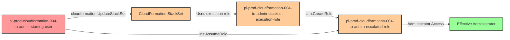

# Privilege Escalation via cloudformation:UpdateStackSet

* **Category:** Privilege Escalation
* **Sub-Category:** existing-passrole
* **Path Type:** one-hop
* **Target:** to-admin
* **Environments:** prod
* **Cost Estimate:** $0/mo
* **Pathfinding.cloud ID:** cloudformation-004
* **Technique:** Modifying existing CloudFormation StackSet to create admin role using StackSet's elevated execution role
* **Terraform Variable:** `enable_single_account_privesc_one_hop_to_admin_cloudformation_004_iam_passrole_cloudformation_updatestackset`
* **Schema Version:** 1.0.0
* **Attack Path:** starting_user → (iam:PassRole + cloudformation:UpdateStackSet) → StackSet (with admin execution role) → creates escalated admin role → (sts:AssumeRole) → admin access
* **Attack Principals:** `arn:aws:iam::{account_id}:user/pl-prod-cloudformation-004-to-admin-starting-user`; `arn:aws:iam::{account_id}:role/pl-prod-cloudformation-004-to-admin-stackset-execution-role`; `arn:aws:iam::{account_id}:role/pl-prod-cloudformation-004-to-admin-escalated-role`
* **Required Permissions:** `iam:PassRole` on `arn:aws:iam::*:role/pl-prod-cloudformation-004-to-admin-stackset-admin-role`; `cloudformation:UpdateStackSet` on `arn:aws:cloudformation:*:*:stackset/pl-prod-cloudformation-004-to-admin-stackset:*`
* **Helpful Permissions:** `cloudformation:DescribeStackSet` (View StackSet details and verify configuration); `cloudformation:DescribeStackSetOperation` (Monitor StackSet update operation progress); `cloudformation:GetTemplate` (Retrieve current StackSet template for modification); `cloudformation:CreateStackInstances` (Create new stack instances if needed); `cloudformation:DeleteStackInstances` (Remove stack instances if needed); `iam:GetRole` (Verify the escalated role was created by the StackSet update); `sts:AssumeRole` (Assume the escalated role created by StackSet update)
* **MITRE Tactics:** TA0004 - Privilege Escalation, TA0003 - Persistence
* **MITRE Techniques:** T1098 - Account Manipulation, T1098.001 - Account Manipulation: Additional Cloud Credentials

## Attack Overview

This scenario demonstrates a sophisticated privilege escalation vulnerability where a user with `cloudformation:UpdateStackSet` permission can modify an existing CloudFormation StackSet that has an administrative execution role. CloudFormation StackSets are designed for deploying resources across multiple AWS accounts and regions, and they rely on execution roles in target accounts to create and manage resources. When these execution roles have excessive permissions, an attacker can leverage them to escalate privileges.

The attack works by updating the StackSet's CloudFormation template to include new IAM resources, specifically an IAM role with administrative permissions that the attacker can assume. Because the StackSet's execution role performs the actual resource creation, the attacker effectively bypasses their own permission boundaries and leverages the StackSet's elevated privileges. The execution role creates the new admin role on behalf of the attacker, who can then assume it to gain full administrative access.

This vulnerability is particularly dangerous because StackSet execution roles often have broad permissions by design - they need to create various resources across multiple accounts and regions. Organizations frequently overlook this privilege escalation path because the `cloudformation:UpdateStackSet` permission appears innocuous, and the connection between StackSet updates and IAM privilege escalation is not immediately obvious. The attack leaves minimal forensic evidence beyond standard CloudFormation API calls, making it an attractive vector for persistent access.

### MITRE ATT&CK Mapping

- **Tactic**: TA0004 - Privilege Escalation, TA0003 - Persistence
- **Technique**: T1098 - Account Manipulation
- **Sub-technique**: T1098.001 - Account Manipulation: Additional Cloud Credentials

### Principals in the attack path

- `arn:aws:iam::PROD_ACCOUNT:user/pl-prod-cloudformation-004-to-admin-starting-user` (Scenario-specific starting user with UpdateStackSet permission)
- `arn:aws:iam::PROD_ACCOUNT:role/pl-prod-cloudformation-004-to-admin-stackset-execution-role` (StackSet execution role with administrative permissions)
- `arn:aws:iam::PROD_ACCOUNT:role/pl-prod-cloudformation-004-to-admin-escalated-role` (New admin role created via StackSet update)

### Attack Path Diagram



### Attack Steps

1. **Initial Access**: Start as `pl-prod-cloudformation-004-to-admin-starting-user` (credentials provided via Terraform outputs)
2. **Retrieve Current Template**: Use `cloudformation:GetTemplate` to download the existing StackSet template
3. **Modify Template**: Add a new IAM role with AdministratorAccess policy and a trust policy allowing the starting user to assume it
4. **Update StackSet**: Use `cloudformation:UpdateStackSet` to deploy the modified template
5. **Monitor Operation**: Wait for the StackSet update operation to complete
6. **Assume Escalated Role**: Use `sts:AssumeRole` to assume the newly created admin role
7. **Verification**: Verify administrator access by listing IAM users or performing other admin-level actions

### Scenario specific resources created

| ARN | Purpose |
| -- | -- |
| `arn:aws:iam::PROD_ACCOUNT:user/pl-prod-cloudformation-004-to-admin-starting-user` | Scenario-specific starting user with access keys and cloudformation:UpdateStackSet permission |
| `arn:aws:cloudformation:*:PROD_ACCOUNT:stackset/pl-prod-cloudformation-004-to-admin-stackset:*` | CloudFormation StackSet with administrative execution role |
| `arn:aws:iam::PROD_ACCOUNT:role/pl-prod-cloudformation-004-to-admin-stackset-execution-role` | StackSet execution role with AdministratorAccess policy |
| `arn:aws:iam::PROD_ACCOUNT:role/pl-prod-cloudformation-004-to-admin-escalated-role` | Admin role created during StackSet update (created by demo script) |

## Attack Lab

### Prerequisites

1. Install the `plabs` CLI:
   ```bash
   brew install pathfinding-labs/tap/plabs
   ```
2. Configure your AWS profiles in `~/.plabs/plabs.yaml` (or run `plabs init` if you haven't already)

### Deploy with plabs non-interactive

```bash
plabs enable enable_single_account_privesc_one_hop_to_admin_cloudformation_004_iam_passrole_cloudformation_updatestackset
plabs apply
```

### Deploy with plabs tui

1. Launch the TUI: `plabs`
2. Navigate to this scenario in the scenarios list
3. Press `space` to enable it
4. Press `d` to deploy

### Executing the automated demo_attack script

The script will:
1. Display a step-by-step walkthrough with color-coded output
2. Show the commands being executed and their results
3. Verify successful privilege escalation
4. Output standardized test results for automation

#### Resources created by attack script

- New IAM role (`pl-prod-cloudformation-004-to-admin-escalated-role`) with AdministratorAccess policy, created via the StackSet update

#### With plabs non-interactive

```bash
plabs demo --list
plabs demo cloudformation-004-iam-passrole+cloudformation-updatestackset
```

#### With plabs tui

1. Launch the TUI: `plabs`
2. Navigate to this scenario in the scenarios list
3. Press `r` to run the demo script

### Cleanup

#### With plabs non-interactive

```bash
plabs cleanup --list
plabs cleanup cloudformation-004-iam-passrole+cloudformation-updatestackset
```

#### With plabs tui

1. Launch the TUI: `plabs`
2. Navigate to this scenario in the scenarios list
3. Press `c` to run the cleanup script

### Teardown with plabs non-interactive

```bash
plabs disable enable_single_account_privesc_one_hop_to_admin_cloudformation_004_iam_passrole_cloudformation_updatestackset
plabs apply
```

### Teardown with plabs tui

1. Launch the TUI: `plabs`
2. Navigate to this scenario in the scenarios list
3. Press `space` to disable it
4. Press `D` to destroy

## Detecting Misconfiguration (CSPM)

### What CSPM tools should detect

- IAM user (`pl-prod-cloudformation-004-to-admin-starting-user`) has `cloudformation:UpdateStackSet` permission on a StackSet whose execution role holds AdministratorAccess
- StackSet execution role (`pl-prod-cloudformation-004-to-admin-stackset-execution-role`) is granted AdministratorAccess, enabling privilege escalation via template modification
- Privilege escalation path exists: starting user → UpdateStackSet → execution role → IAM role creation → admin access

### Prevention recommendations

- Implement least privilege for StackSet execution roles - avoid granting AdministratorAccess unless absolutely necessary for the StackSet's intended purpose
- Restrict `cloudformation:UpdateStackSet` permissions to specific trusted users or roles using IAM conditions
- Use resource-based conditions to limit which StackSets can be updated: `"Condition": {"StringEquals": {"aws:RequestedRegion": ["us-east-1"]}}`
- Implement Service Control Policies (SCPs) to prevent StackSet execution roles from creating IAM roles or modifying IAM policies
- Enable CloudFormation drift detection to identify unauthorized changes to StackSet configurations
- Use StackSet permission models appropriately - prefer service-managed StackSets over self-managed when possible
- Implement IAM permission boundaries on StackSet execution roles to limit the maximum permissions they can grant
- Enable MFA requirements for sensitive CloudFormation operations using condition keys like `aws:MultiFactorAuthPresent`
- Use IAM Access Analyzer to identify and remediate privilege escalation paths involving CloudFormation StackSets
- Regularly audit StackSet execution roles and their permissions to ensure they follow least privilege principles

## Detection Abuse (CloudSIEM)

### CloudTrail events to monitor

- `IAM: PassRole` — Starting user passes the StackSet admin role; indicates the privilege escalation attempt is underway
- `CloudFormation: UpdateStackSet` — StackSet template modified; high severity when the new template contains IAM resource definitions
- `CloudFormation: DescribeStackSetOperation` — Attacker polling for operation completion after submitting the update
- `IAM: CreateRole` — New IAM role created by the StackSet execution role; critical when the new role has AdministratorAccess
- `STS: AssumeRole` — Starting user assumes the newly created escalated role

### Detonation logs

_Detonation log integration (Stratus Red Team / Grimoire) is planned for a future release._
