# Privilege Escalation via cloudformation:CreateChangeSet + ExecuteChangeSet

**Category:** Privilege Escalation
**Sub-Category:** new-passrole
**Path Type:** one-hop
**Target:** to-admin
**Environments:** prod
**Technique:** Inheriting elevated permissions from existing CloudFormation stack service roles through change set execution

## Overview

This scenario demonstrates a sophisticated privilege escalation technique where an attacker with `cloudformation:CreateChangeSet` and `cloudformation:ExecuteChangeSet` permissions can inherit administrative privileges from an existing CloudFormation stack's service role. Unlike direct stack updates which require explicit permissions on the resources being modified, change set execution bypasses traditional IAM permission checks by delegating all operations to the stack's attached service role.

The vulnerability arises from a fundamental aspect of CloudFormation's change set architecture. When a change set is executed, CloudFormation uses the stack's service role to perform all resource modifications - regardless of the caller's own permissions. If that service role has administrative privileges (a common practice to allow stacks to manage any AWS resources), an attacker can inject malicious infrastructure changes through the change set mechanism without needing those elevated permissions directly.

This attack is particularly insidious because it exploits the AWS managed policy `SecretsManagerReadWrite`, which many organizations grant broadly for secrets management operations. This policy includes `cloudformation:CreateChangeSet` and `cloudformation:ExecuteChangeSet` permissions, inadvertently creating privilege escalation paths wherever CloudFormation stacks with privileged service roles exist. The technique was documented in the AWS security community blog post: https://dev.to/aws-builders/cloudformation-change-set-privilege-escalation-18i6

## Understanding the attack scenario

### Principals in the attack path

- `arn:aws:iam::PROD_ACCOUNT:user/pl-prod-cloudformation-005-to-admin-starting-user` (Scenario-specific starting user with CloudFormation ChangeSet permissions)
- `arn:aws:iam::PROD_ACCOUNT:role/pl-prod-cloudformation-005-to-admin-stack-role` (Existing CloudFormation stack service role with AdministratorAccess)
- `arn:aws:iam::PROD_ACCOUNT:role/pl-prod-cloudformation-005-to-admin-escalated-role` (New admin role created via change set execution)

### Attack Path Diagram

```mermaid
graph LR
    A[pl-prod-cloudformation-005-to-admin-starting-user] -->|cloudformation:CreateChangeSet| B[Target Stack with Admin Service Role]
    B -->|cloudformation:ExecuteChangeSet| C[ChangeSet creates new IAM role]
    C -->|Stack's admin service role creates| D[pl-prod-cloudformation-005-to-admin-escalated-role]
    D -->|sts:AssumeRole| E[Effective Administrator]

    style A fill:#ff9999,stroke:#333,stroke-width:2px
    style B fill:#ffcc99,stroke:#333,stroke-width:2px
    style C fill:#ffcc99,stroke:#333,stroke-width:2px
    style D fill:#ffcc99,stroke:#333,stroke-width:2px
    style E fill:#99ff99,stroke:#333,stroke-width:2px
```



### Attack Steps

1. **Initial Access**: Start as `pl-prod-cloudformation-005-to-admin-starting-user` (credentials provided via Terraform outputs)
2. **Discover Target Stack**: Identify an existing CloudFormation stack with a privileged service role (e.g., `pl-prod-cloudformation-005-to-admin-target-stack`)
3. **Create Malicious Change Set**: Use `cloudformation:CreateChangeSet` to create a change set that adds a new IAM role with administrative permissions to the existing stack
4. **Execute Change Set**: Use `cloudformation:ExecuteChangeSet` to apply the change set - CloudFormation uses the stack's admin service role to create the new admin role
5. **Assume Escalated Role**: Assume the newly created `pl-prod-cloudformation-005-to-admin-escalated-role`
6. **Verification**: Verify administrator access by listing IAM users or performing other admin-level actions

### Scenario specific resources created

| ARN | Purpose |
| -- | -- |
| `arn:aws:iam::PROD_ACCOUNT:user/pl-prod-cloudformation-005-to-admin-starting-user` | Scenario-specific starting user with access keys and CloudFormation ChangeSet permissions |
| `arn:aws:cloudformation:REGION:PROD_ACCOUNT:stack/pl-prod-cloudformation-005-to-admin-target-stack/*` | Existing CloudFormation stack with privileged service role (target for exploitation) |
| `arn:aws:iam::PROD_ACCOUNT:role/pl-prod-cloudformation-005-to-admin-stack-role` | CloudFormation service role with AdministratorAccess attached to target stack |
| `arn:aws:iam::PROD_ACCOUNT:role/pl-prod-cloudformation-005-to-admin-escalated-role` | Admin role created by demo attack script via change set execution |

## Executing the attack

### Using the automated demo_attack.sh

To demonstrate the privilege escalation path, run the provided demo script:

```bash
cd modules/scenarios/single-account/privesc-one-hop/to-admin/cloudformation-005-cloudformation-createchangeset+executechangeset
./demo_attack.sh
```

The script will:
1. Display a step-by-step walkthrough with color-coded output
2. Show the commands being executed and their results
3. Demonstrate creating a change set that adds a new admin IAM role
4. Execute the change set using the stack's privileged service role
5. Verify successful privilege escalation by assuming the new role
6. Output standardized test results for automation

### Cleaning up the attack artifacts

After demonstrating the attack, clean up the change set and escalated role created during the demo:

```bash
cd modules/scenarios/single-account/privesc-one-hop/to-admin/cloudformation-005-cloudformation-createchangeset+executechangeset
./cleanup_attack.sh
```

The cleanup script will remove the escalated IAM role created during the demonstration, restoring the CloudFormation stack to its original state while preserving the deployed infrastructure.

## Detection and prevention


### MITRE ATT&CK Mapping

- **Tactic**: TA0004 - Privilege Escalation
- **Technique**: T1098.003 - Account Manipulation: Additional Cloud Roles


## Prevention recommendations

- Implement least privilege for CloudFormation permissions - avoid granting `cloudformation:CreateChangeSet` and `cloudformation:ExecuteChangeSet` together unless absolutely necessary
- Use resource-based conditions to restrict change set operations to specific stacks: `"Condition": {"StringEquals": {"aws:ResourceTag/Environment": "dev"}}`
- Review CloudFormation stack service roles and minimize permissions - avoid using AdministratorAccess for stack service roles
- Implement Service Control Policies (SCPs) to prevent change set execution on stacks with privileged service roles from non-admin principals
- Monitor CloudTrail for `CreateChangeSet` and `ExecuteChangeSet` API calls, especially on stacks with elevated permissions
- Enable MFA requirements for sensitive CloudFormation operations using condition keys like `aws:MultiFactorAuthPresent`
- Use IAM Access Analyzer to identify CloudFormation stacks with overly permissive service roles
- Consider using stack policies to prevent modifications to critical infrastructure resources
- Review and audit the AWS managed policy `SecretsManagerReadWrite` - consider creating a custom policy without CloudFormation permissions if change set operations aren't required
- Implement CloudWatch alarms on CloudFormation change set creation and execution events for automated detection
- Use CloudFormation drift detection to identify unexpected stack modifications
- Establish approval workflows for change set execution on production stacks using AWS Service Catalog or custom automation
