# Privilege Escalation via cloudformation:CreateChangeSet + ExecuteChangeSet

* **Category:** Privilege Escalation
* **Sub-Category:** new-passrole
* **Path Type:** one-hop
* **Target:** to-admin
* **Environments:** prod
* **Cost Estimate:** $0/mo
* **Technique:** Principal with cloudformation:CreateChangeSet and ExecuteChangeSet can inherit admin permissions from existing CloudFormation stack's service role
* **Terraform Variable:** `enable_single_account_privesc_one_hop_to_admin_cloudformation_005_cloudformation_createchangeset_executechangeset`
* **Schema Version:** 1.0.0
* **Pathfinding.cloud ID:** cloudformation-005
* **Attack Path:** starting_user → (cloudformation:CreateChangeSet + ExecuteChangeSet on target_stack) → stack updates with admin service role → creates escalated_role with admin access → admin privileges
* **Attack Principals:** `arn:aws:iam::{account_id}:user/pl-prod-cloudformation-005-to-admin-starting-user`; `arn:aws:iam::{account_id}:role/pl-prod-cloudformation-005-to-admin-stack-role`; `arn:aws:iam::{account_id}:role/pl-prod-cloudformation-005-to-admin-escalated-role`
* **Required Permissions:** `cloudformation:CreateChangeSet` on `*`; `cloudformation:ExecuteChangeSet` on `*`
* **Helpful Permissions:** `cloudformation:DescribeChangeSet` (View change set details and verify creation); `cloudformation:DescribeStacks` (Discover existing CloudFormation stacks to target); `cloudformation:DescribeStackResource` (View stack resources and service role information)
* **MITRE Tactics:** TA0004 - Privilege Escalation
* **MITRE Techniques:** T1098.003 - Account Manipulation: Additional Cloud Roles

## Attack Overview

This scenario demonstrates a sophisticated privilege escalation technique where an attacker with `cloudformation:CreateChangeSet` and `cloudformation:ExecuteChangeSet` permissions can inherit administrative privileges from an existing CloudFormation stack's service role. Unlike direct stack updates which require explicit permissions on the resources being modified, change set execution bypasses traditional IAM permission checks by delegating all operations to the stack's attached service role.

The vulnerability arises from a fundamental aspect of CloudFormation's change set architecture. When a change set is executed, CloudFormation uses the stack's service role to perform all resource modifications - regardless of the caller's own permissions. If that service role has administrative privileges (a common practice to allow stacks to manage any AWS resources), an attacker can inject malicious infrastructure changes through the change set mechanism without needing those elevated permissions directly.

This attack is particularly insidious because it exploits the AWS managed policy `SecretsManagerReadWrite`, which many organizations grant broadly for secrets management operations. This policy includes `cloudformation:CreateChangeSet` and `cloudformation:ExecuteChangeSet` permissions, inadvertently creating privilege escalation paths wherever CloudFormation stacks with privileged service roles exist. The technique was documented in the AWS security community blog post: https://dev.to/aws-builders/cloudformation-change-set-privilege-escalation-18i6

### MITRE ATT&CK Mapping

- **Tactic**: TA0004 - Privilege Escalation
- **Technique**: T1098.003 - Account Manipulation: Additional Cloud Roles

### Principals in the attack path

- `arn:aws:iam::PROD_ACCOUNT:user/pl-prod-cloudformation-005-to-admin-starting-user` (Scenario-specific starting user with CloudFormation ChangeSet permissions)
- `arn:aws:iam::PROD_ACCOUNT:role/pl-prod-cloudformation-005-to-admin-stack-role` (Existing CloudFormation stack service role with AdministratorAccess)
- `arn:aws:iam::PROD_ACCOUNT:role/pl-prod-cloudformation-005-to-admin-escalated-role` (New admin role created via change set execution)

### Attack Path Diagram

```mermaid
graph LR
    A[pl-prod-cloudformation-005-to-admin-starting-user] -->|cloudformation:CreateChangeSet| B[Target Stack with Admin Service Role]
    B -->|cloudformation:ExecuteChangeSet| C[ChangeSet creates new IAM role]
    C -->|Stack's admin service role creates| D[pl-prod-cloudformation-005-to-admin-escalated-role]
    D -->|sts:AssumeRole| E[Effective Administrator]

    style A fill:#ff9999,stroke:#333,stroke-width:2px
    style B fill:#ffcc99,stroke:#333,stroke-width:2px
    style C fill:#ffcc99,stroke:#333,stroke-width:2px
    style D fill:#ffcc99,stroke:#333,stroke-width:2px
    style E fill:#99ff99,stroke:#333,stroke-width:2px
```



### Attack Steps

1. **Initial Access**: Start as `pl-prod-cloudformation-005-to-admin-starting-user` (credentials provided via Terraform outputs)
2. **Discover Target Stack**: Identify an existing CloudFormation stack with a privileged service role (e.g., `pl-prod-cloudformation-005-to-admin-target-stack`)
3. **Create Malicious Change Set**: Use `cloudformation:CreateChangeSet` to create a change set that adds a new IAM role with administrative permissions to the existing stack
4. **Execute Change Set**: Use `cloudformation:ExecuteChangeSet` to apply the change set - CloudFormation uses the stack's admin service role to create the new admin role
5. **Assume Escalated Role**: Assume the newly created `pl-prod-cloudformation-005-to-admin-escalated-role`
6. **Verification**: Verify administrator access by listing IAM users or performing other admin-level actions

### Scenario specific resources created

| ARN | Purpose |
| -- | -- |
| `arn:aws:iam::PROD_ACCOUNT:user/pl-prod-cloudformation-005-to-admin-starting-user` | Scenario-specific starting user with access keys and CloudFormation ChangeSet permissions |
| `arn:aws:cloudformation:REGION:PROD_ACCOUNT:stack/pl-prod-cloudformation-005-to-admin-target-stack/*` | Existing CloudFormation stack with privileged service role (target for exploitation) |
| `arn:aws:iam::PROD_ACCOUNT:role/pl-prod-cloudformation-005-to-admin-stack-role` | CloudFormation service role with AdministratorAccess attached to target stack |
| `arn:aws:iam::PROD_ACCOUNT:role/pl-prod-cloudformation-005-to-admin-escalated-role` | Admin role created by demo attack script via change set execution |

## Attack Lab

### Prerequisites

1. Install the `plabs` CLI:
   ```bash
   brew install pathfinding-labs/tap/plabs
   ```
2. Configure your AWS profiles in `~/.plabs/plabs.yaml` (or run `plabs init` if you haven't already)

### Deploy with plabs non-interactive

```bash
plabs enable enable_single_account_privesc_one_hop_to_admin_cloudformation_005_cloudformation_createchangeset_executechangeset
plabs apply
```

### Deploy with plabs tui

1. Launch the TUI: `plabs`
2. Navigate to this scenario in the scenarios list
3. Press `space` to enable it
4. Press `d` to deploy

### Executing the automated demo_attack script

The script will:
1. Display a step-by-step walkthrough with color-coded output
2. Show the commands being executed and their results
3. Demonstrate creating a change set that adds a new admin IAM role
4. Execute the change set using the stack's privileged service role
5. Verify successful privilege escalation by assuming the new role
6. Output standardized test results for automation

#### Resources created by attack script

- New IAM role (`pl-prod-cloudformation-005-to-admin-escalated-role`) with AdministratorAccess, created via change set execution using the stack's privileged service role
- CloudFormation change set on the target stack

#### With plabs non-interactive

```bash
plabs demo --list
plabs demo cloudformation-005-cloudformation-createchangeset+executechangeset
```

#### With plabs tui

1. Launch the TUI: `plabs`
2. Navigate to this scenario in the scenarios list
3. Press `r` to run the demo script

### Cleanup

#### With plabs non-interactive

```bash
plabs cleanup --list
plabs cleanup cloudformation-005-cloudformation-createchangeset+executechangeset
```

#### With plabs tui

1. Launch the TUI: `plabs`
2. Navigate to this scenario in the scenarios list
3. Press `c` to run the cleanup script

### Teardown with plabs non-interactive

```bash
plabs disable enable_single_account_privesc_one_hop_to_admin_cloudformation_005_cloudformation_createchangeset_executechangeset
plabs apply
```

### Teardown with plabs tui

1. Launch the TUI: `plabs`
2. Navigate to this scenario in the scenarios list
3. Press `space` to disable it
4. Press `D` to destroy

## Detecting Misconfiguration (CSPM)

### What CSPM tools should detect

- IAM principal has both `cloudformation:CreateChangeSet` and `cloudformation:ExecuteChangeSet` permissions, enabling privilege escalation via stacks with privileged service roles
- CloudFormation stack service role has `AdministratorAccess` or other broad administrative permissions attached
- CloudFormation stack service role permissions are not scoped to the minimum required for the stack's resources
- IAM principal with change set permissions has no resource-level restriction (wildcard `*` on both actions)

### Prevention recommendations

- Implement least privilege for CloudFormation permissions - avoid granting `cloudformation:CreateChangeSet` and `cloudformation:ExecuteChangeSet` together unless absolutely necessary
- Use resource-based conditions to restrict change set operations to specific stacks: `"Condition": {"StringEquals": {"aws:ResourceTag/Environment": "dev"}}`
- Review CloudFormation stack service roles and minimize permissions - avoid using AdministratorAccess for stack service roles
- Implement Service Control Policies (SCPs) to prevent change set execution on stacks with privileged service roles from non-admin principals
- Enable MFA requirements for sensitive CloudFormation operations using condition keys like `aws:MultiFactorAuthPresent`
- Use IAM Access Analyzer to identify CloudFormation stacks with overly permissive service roles
- Consider using stack policies to prevent modifications to critical infrastructure resources
- Review and audit the AWS managed policy `SecretsManagerReadWrite` - consider creating a custom policy without CloudFormation permissions if change set operations aren't required
- Establish approval workflows for change set execution on production stacks using AWS Service Catalog or custom automation

## Detection Abuse (CloudSIEM)

### CloudTrail events to monitor

- `CloudFormation: CreateChangeSet` — Change set created against an existing stack; high severity when the stack has a privileged service role attached
- `CloudFormation: ExecuteChangeSet` — Change set executed; critical when the stack's service role has administrative permissions, as all resource changes are performed under that role
- `IAM: CreateRole` — New IAM role created; investigate when the caller is CloudFormation and the assumed role has administrative permissions
- `STS: AssumeRole` — Role assumption following change set execution; watch for the newly created escalated role being assumed shortly after stack update completes

### Detonation logs

_Detonation log integration (Stratus Red Team / Grimoire) is planned for a future release._
