# Privilege Escalation via codebuild:StartBuild on Existing Project

* **Category:** Privilege Escalation
* **Sub-Category:** existing-passrole
* **Path Type:** one-hop
* **Target:** to-admin
* **Environments:** prod
* **Technique:** Exploit existing CodeBuild project with privileged role using buildspec-override

## Overview

This scenario demonstrates a privilege escalation vulnerability where a user with only `codebuild:StartBuild` permission can exploit an existing CodeBuild project that has a privileged service role attached. Unlike the PassRole+CreateProject attack, this scenario does NOT require `iam:PassRole` or `codebuild:CreateProject` permissions, making it a more subtle and often overlooked escalation path.

The key to this attack is the `--buildspec-override` parameter in the `codebuild:StartBuild` API. This parameter allows an attacker to replace the project's default buildspec with arbitrary commands, even if they don't have permission to modify the project itself. When the existing project has an administrative or highly privileged role, the attacker can execute AWS CLI commands with those elevated permissions.

This vulnerability commonly occurs in environments where developers are granted broad `codebuild:StartBuild` permissions for CI/CD workflows, but the organization hasn't considered that existing projects might have privileged roles that could be exploited through buildspec overrides.

## Understanding the attack scenario

### Principals in the attack path

- `arn:aws:iam::PROD_ACCOUNT:user/pl-prod-codebuild-002-to-admin-starting-user` (Scenario-specific starting user)
- `arn:aws:codebuild:{region}:PROD_ACCOUNT:project/pl-prod-codebuild-002-to-admin-existing-project` (Pre-existing CodeBuild project)
- `arn:aws:iam::PROD_ACCOUNT:role/pl-prod-codebuild-002-to-admin-project-role` (Privileged role attached to CodeBuild project)

### Attack Path Diagram

```mermaid
graph LR
    A[pl-prod-codebuild-002-to-admin-starting-user] -->|codebuild:StartBuild with buildspec-override| B[pl-prod-codebuild-002-to-admin-existing-project]
    B -->|Executes with| C[pl-prod-codebuild-002-to-admin-project-role]
    C -->|iam:AttachUserPolicy in buildspec| D[AdministratorAccess attached to starting user]
    D -->|Administrator Access| E[Effective Administrator]

    style A fill:#ff9999,stroke:#333,stroke-width:2px
    style B fill:#ffcc99,stroke:#333,stroke-width:2px
    style C fill:#ffcc99,stroke:#333,stroke-width:2px
    style D fill:#ffcc99,stroke:#333,stroke-width:2px
    style E fill:#99ff99,stroke:#333,stroke-width:2px
```



### Attack Steps

1. **Initial Access**: Start as `pl-prod-codebuild-002-to-admin-starting-user` (credentials provided via Terraform outputs)
2. **Discover Projects**: Use `codebuild:ListProjects` to discover existing CodeBuild projects (optional but helpful)
3. **Inspect Project**: Use `codebuild:BatchGetProjects` to identify projects with privileged roles (optional but helpful)
4. **Create Malicious Buildspec**: Create a buildspec.yml that attaches AdministratorAccess policy to the starting user
5. **Execute Build**: Use `codebuild:StartBuild` with `--buildspec-override` to execute the malicious buildspec with the project's privileged role
6. **Wait for Propagation**: Wait for the build to complete and IAM changes to propagate (15 seconds)
7. **Verification**: Verify administrator access with the original user credentials

### Scenario specific resources created

| ARN | Purpose |
| -- | -- |
| `arn:aws:iam::PROD_ACCOUNT:user/pl-prod-codebuild-002-to-admin-starting-user` | Scenario-specific starting user with access keys |
| `arn:aws:codebuild:{region}:PROD_ACCOUNT:project/pl-prod-codebuild-002-to-admin-existing-project` | Pre-existing CodeBuild project with privileged role |
| `arn:aws:iam::PROD_ACCOUNT:role/pl-prod-codebuild-002-to-admin-project-role` | Privileged role with AdministratorAccess attached to CodeBuild project |
| `arn:aws:iam::PROD_ACCOUNT:policy/pl-prod-codebuild-002-to-admin-user-policy` | Policy granting codebuild:StartBuild, codebuild:ListProjects, codebuild:BatchGetProjects, and codebuild:BatchGetBuilds |

## Executing the attack

### Using the automated demo_attack.sh

To demonstrate the privilege escalation path, run the provided demo script:

```bash
cd modules/scenarios/single-account/privesc-one-hop/to-admin/codebuild-002-codebuild-startbuild
./demo_attack.sh
```

The script will:
1. Display a step-by-step walkthrough with color-coded output
2. Show the commands being executed and their results
3. Verify successful privilege escalation
4. Output standardized test results for automation

### Cleaning up the attack artifacts

After demonstrating the attack, clean up the AdministratorAccess policy attachment:

```bash
cd modules/scenarios/single-account/privesc-one-hop/to-admin/codebuild-002-codebuild-startbuild
./cleanup_attack.sh
```

## Detection and prevention

### What should CSPM tools detect?

A properly configured Cloud Security Posture Management (CSPM) tool should identify:

1. **Overly Permissive CodeBuild Access**: Users/roles with broad `codebuild:StartBuild` permissions on projects with privileged roles
2. **Privileged CodeBuild Service Roles**: CodeBuild projects with administrative or sensitive IAM permissions
3. **Buildspec Override Risk**: Projects that allow buildspec overrides combined with privileged service roles
4. **Privilege Escalation Path**: Automated detection of the complete attack chain from user to admin via CodeBuild
5. **Missing Project Constraints**: `codebuild:StartBuild` permissions without resource-based restrictions to specific projects
6. **Dangerous Service Role Combinations**: CodeBuild roles with IAM modification permissions (AttachUserPolicy, PutUserPolicy, etc.)

### MITRE ATT&CK Mapping

- **Tactic**: TA0004 - Privilege Escalation, TA0002 - Execution
- **Technique**: T1078.004 - Valid Accounts: Cloud Accounts
- **Technique**: T1651 - Cloud Administration Command

## Prevention recommendations

- **Restrict codebuild:StartBuild**: Limit `codebuild:StartBuild` to specific projects using resource-based conditions: `"Resource": "arn:aws:codebuild:*:*:project/specific-safe-project"`
- **Least Privilege Service Roles**: Ensure CodeBuild service roles follow least privilege and cannot modify IAM permissions
- **Disable Buildspec Override**: Set project configuration to disallow buildspec overrides for projects with privileged roles
- **CloudTrail Monitoring**: Alert on `StartBuild` API calls with buildspec overrides on privileged projects, and monitor `AttachUserPolicy`/`PutUserPolicy` calls from CodeBuild service principals
- **Service Control Policies**: Implement SCPs to prevent CodeBuild service roles from modifying IAM policies: `Deny iam:AttachUserPolicy, iam:PutUserPolicy, iam:AttachRolePolicy, iam:PutRolePolicy when aws:PrincipalServiceName = codebuild.amazonaws.com`
- **IAM Access Analyzer**: Use AWS IAM Access Analyzer to identify privilege escalation paths involving CodeBuild projects
- **Project Review Process**: Regularly audit CodeBuild projects to identify those with privileged service roles and restrict access accordingly
- **Separation of Concerns**: Avoid attaching administrative roles to CodeBuild projects; use least-privilege roles specific to build requirements
