# One-Hop Privilege Escalation: codebuild:StartBuildBatch

* **Category:** Privilege Escalation
* **Sub-Category:** existing-passrole
* **Path Type:** one-hop
* **Target:** to-admin
* **Environments:** prod
* **Cost Estimate:** $0/mo
* **Pathfinding.cloud ID:** codebuild-003
* **Technique:** Exploit existing CodeBuild project with buildspec-override to execute privileged commands
* **Terraform Variable:** `enable_single_account_privesc_one_hop_to_admin_codebuild_003_codebuild_startbuildbatch`
* **Schema Version:** 1.0.0
* **Attack Path:** starting_user → (codebuild:StartBuildBatch with buildspec-override) → existing CodeBuild project → buildspec executes with admin role → grants admin to starting_user → admin access
* **Attack Principals:** `arn:aws:iam::{account_id}:user/pl-prod-codebuild-003-to-admin-starting-user`; `arn:aws:codebuild:{region}:{account_id}:project/pl-prod-codebuild-003-to-admin-target-project`; `arn:aws:iam::{account_id}:role/pl-prod-codebuild-003-to-admin-target-role`
* **Required Permissions:** `codebuild:StartBuildBatch` on `*`
* **Helpful Permissions:** `codebuild:ListProjects` (Discover existing CodeBuild projects to exploit); `codebuild:BatchGetProjects` (View project details including attached service role); `codebuild:BatchGetBuildBatches` (Monitor build batch execution status); `iam:ListUsers` (Verify admin access after escalation)
* **MITRE Tactics:** TA0004 - Privilege Escalation, TA0002 - Execution
* **MITRE Techniques:** T1078.004 - Valid Accounts: Cloud Accounts, T1651 - Cloud Administration Command

## Attack Overview

This scenario demonstrates a privilege escalation vulnerability where a user has permission to start CodeBuild batch builds using `codebuild:StartBuildBatch`. Unlike PassRole scenarios that require creating new resources, this attack exploits an existing CodeBuild project that already has an attached service role with administrative permissions.

The key vulnerability is that `codebuild:StartBuildBatch` allows the attacker to use the `--buildspec-override` parameter to inject a malicious buildspec. This means they can execute arbitrary commands within the context of the existing project's privileged service role without needing `iam:PassRole` or `codebuild:CreateProject` permissions. The attacker can use this to grant themselves administrative access by having the build attach an AdministratorAccess policy to their own user account.

This is particularly dangerous in environments where CodeBuild projects are created with overly permissive service roles (such as IAM modification permissions) and users are given access to start builds without proper oversight of buildspec overrides.

### MITRE ATT&CK Mapping

- **Tactic**: TA0004 - Privilege Escalation, TA0002 - Execution
- **Technique**: T1078.004 - Valid Accounts: Cloud Accounts
- **Technique**: T1651 - Cloud Administration Command

### Principals in the attack path

- `arn:aws:iam::PROD_ACCOUNT:user/pl-prod-codebuild-003-to-admin-starting-user` (Scenario-specific starting user with StartBuildBatch permission)
- `arn:aws:codebuild:REGION:PROD_ACCOUNT:project/pl-prod-codebuild-003-to-admin-target-project` (Existing CodeBuild project with admin service role)
- `arn:aws:iam::PROD_ACCOUNT:role/pl-prod-codebuild-003-to-admin-target-role` (Service role with iam:AttachUserPolicy permission, trusted by CodeBuild)

### Attack Path Diagram

```mermaid
graph LR
    A[pl-prod-codebuild-003-to-admin-starting-user] -->|codebuild:ListProjects| B[Discovery]
    B -->|codebuild:BatchGetProjects| C[pl-prod-codebuild-003-to-admin-target-project]
    C -->|codebuild:StartBuildBatch<br/>with --buildspec-override| D[Malicious Buildspec Execution]
    D -->|Executes with| E[pl-prod-codebuild-003-to-admin-target-role]
    E -->|iam:AttachUserPolicy| F[AdministratorAccess attached to starting-user]
    F -->|New permissions| G[Effective Administrator]

    style A fill:#ff9999,stroke:#333,stroke-width:2px
    style C fill:#ffcc99,stroke:#333,stroke-width:2px
    style E fill:#ffcc99,stroke:#333,stroke-width:2px
    style G fill:#99ff99,stroke:#333,stroke-width:2px
```



### Attack Steps

1. **Initial Access**: Start as `pl-prod-codebuild-003-to-admin-starting-user` (credentials provided via Terraform outputs)
2. **Discovery**: Use `codebuild:ListProjects` to enumerate existing CodeBuild projects
3. **Reconnaissance**: Use `codebuild:BatchGetProjects` to identify projects with privileged service roles
4. **Inject Malicious Buildspec**: Use `codebuild:StartBuildBatch` with `--buildspec-override` to inject a buildspec that attaches AdministratorAccess to the starting user
5. **Monitor Execution**: Use `codebuild:BatchGetBuildBatches` to monitor build batch completion
6. **Verification**: Verify administrative access with `iam:ListUsers`

### Scenario specific resources created

| ARN | Purpose |
| -- | -- |
| `arn:aws:iam::PROD_ACCOUNT:user/pl-prod-codebuild-003-to-admin-starting-user` | Scenario-specific starting user with access keys and codebuild:StartBuildBatch permission |
| `arn:aws:codebuild:REGION:PROD_ACCOUNT:project/pl-prod-codebuild-003-to-admin-target-project` | Existing CodeBuild project configured for batch builds |
| `arn:aws:iam::PROD_ACCOUNT:role/pl-prod-codebuild-003-to-admin-target-role` | Service role with iam:AttachUserPolicy permission, attached to CodeBuild project |
| `arn:aws:iam::PROD_ACCOUNT:policy/pl-prod-codebuild-003-to-admin-starting-user-policy` | Grants codebuild:StartBuildBatch, ListProjects, BatchGetProjects, and BatchGetBuildBatches permissions |
| `arn:aws:iam::PROD_ACCOUNT:policy/pl-prod-codebuild-003-to-admin-target-role-policy` | Grants iam:AttachUserPolicy permission to the service role |

## Attack Lab

### Prerequisites

1. Install the `plabs` CLI:
   ```bash
   brew install pathfinding-labs/tap/plabs
   ```
2. Configure your AWS profiles in `~/.plabs/plabs.yaml` (or run `plabs init` if you haven't already)

### Deploy with plabs non-interactive

```bash
plabs enable enable_single_account_privesc_one_hop_to_admin_codebuild_003_codebuild_startbuildbatch
plabs apply
```

### Deploy with plabs tui

1. Launch the TUI: `plabs`
2. Navigate to this scenario in the scenarios list
3. Press `space` to enable it
4. Press `d` to deploy

### Executing the automated demo_attack script

The script will:
1. Display a step-by-step walkthrough with color-coded output
2. Show the commands being executed and their results
3. Demonstrate buildspec-override injection
4. Verify successful privilege escalation to administrator
5. Output standardized test results for automation

#### Resources created by attack script

- `AdministratorAccess` managed policy attached to `pl-prod-codebuild-003-to-admin-starting-user`

#### With plabs non-interactive

```bash
plabs demo --list
plabs demo codebuild-003-codebuild-startbuildbatch
```

#### With plabs tui

1. Launch the TUI: `plabs`
2. Navigate to this scenario in the scenarios list
3. Press `r` to run the demo script

### Cleanup

After demonstrating the attack, clean up the AdministratorAccess policy attached during the demo.

#### With plabs non-interactive

```bash
plabs cleanup --list
plabs cleanup codebuild-003-codebuild-startbuildbatch
```

#### With plabs tui

1. Launch the TUI: `plabs`
2. Navigate to this scenario in the scenarios list
3. Press `c` to run the cleanup script

### Teardown with plabs non-interactive

```bash
plabs disable enable_single_account_privesc_one_hop_to_admin_codebuild_003_codebuild_startbuildbatch
plabs apply
```

### Teardown with plabs tui

1. Launch the TUI: `plabs`
2. Navigate to this scenario in the scenarios list
3. Press `space` to disable it
4. Press `D` to destroy

## Detecting Misconfiguration (CSPM)

### What CSPM tools should detect

A properly configured Cloud Security Posture Management (CSPM) tool should detect:

1. **Overly Permissive Service Roles**: CodeBuild service roles with IAM modification permissions (iam:AttachUserPolicy, iam:PutUserPolicy, iam:AttachRolePolicy)
2. **Buildspec Override Risk**: Users or roles with codebuild:StartBuildBatch permission on projects with privileged service roles
3. **Privilege Escalation Path**: Detection of the complete attack path from StartBuildBatch → privileged service role → IAM modification
4. **IAM Policy Attachments from CodeBuild**: Unusual IAM policy modifications originating from CodeBuild service role sessions

### Prevention recommendations

- **Restrict StartBuildBatch Permissions**: Limit `codebuild:StartBuildBatch` to trusted administrators only, or use resource-based conditions to restrict which projects can be accessed
- **Enforce Buildspec Source**: Configure CodeBuild projects to require buildspecs from source control (GitHub, CodeCommit) and disable buildspec overrides
- **Apply Least Privilege to Service Roles**: CodeBuild service roles should never have IAM modification permissions unless absolutely required for legitimate CI/CD operations
- **Use SCPs**: Implement Service Control Policies to prevent CodeBuild service roles from modifying IAM policies or attaching policies to principals
- **IAM Access Analyzer**: Use IAM Access Analyzer to identify privilege escalation paths involving CodeBuild and service roles
- **Resource Tagging**: Tag CodeBuild projects with privilege levels and enforce tag-based conditional access policies
- **Implement Approval Workflows**: Require manual approval for buildspec overrides on sensitive CodeBuild projects with privileged service roles

## Detection Abuse (CloudSIEM)

### CloudTrail events to monitor

- `CodeBuild: StartBuildBatch` — Batch build started; critical when `buildspec-override` parameter is present on projects with privileged service roles
- `IAM: AttachUserPolicy` — Managed policy attached to an IAM user; high severity when originating from a CodeBuild service role session

### Detonation logs

_Detonation log integration (Stratus Red Team / Grimoire) is planned for a future release._
