# One-Hop Privilege Escalation: codebuild:StartBuildBatch

* **Category:** Privilege Escalation
* **Sub-Category:** existing-passrole
* **Path Type:** one-hop
* **Target:** to-admin
* **Environments:** prod
* **Technique:** Exploit existing CodeBuild project with buildspec-override to execute privileged commands

## Overview

This scenario demonstrates a privilege escalation vulnerability where a user has permission to start CodeBuild batch builds using `codebuild:StartBuildBatch`. Unlike PassRole scenarios that require creating new resources, this attack exploits an existing CodeBuild project that already has an attached service role with administrative permissions.

The key vulnerability is that `codebuild:StartBuildBatch` allows the attacker to use the `--buildspec-override` parameter to inject a malicious buildspec. This means they can execute arbitrary commands within the context of the existing project's privileged service role without needing `iam:PassRole` or `codebuild:CreateProject` permissions. The attacker can use this to grant themselves administrative access by having the build attach an AdministratorAccess policy to their own user account.

This is particularly dangerous in environments where CodeBuild projects are created with overly permissive service roles (such as IAM modification permissions) and users are given access to start builds without proper oversight of buildspec overrides.

## Understanding the attack scenario

### Principals in the attack path

- `arn:aws:iam::PROD_ACCOUNT:user/pl-prod-codebuild-003-to-admin-starting-user` (Scenario-specific starting user with StartBuildBatch permission)
- `arn:aws:codebuild:REGION:PROD_ACCOUNT:project/pl-prod-codebuild-003-to-admin-target-project` (Existing CodeBuild project with admin service role)
- `arn:aws:iam::PROD_ACCOUNT:role/pl-prod-codebuild-003-to-admin-target-role` (Service role with iam:AttachUserPolicy permission, trusted by CodeBuild)

### Attack Path Diagram

```mermaid
graph LR
    A[pl-prod-codebuild-003-to-admin-starting-user] -->|codebuild:ListProjects| B[Discovery]
    B -->|codebuild:BatchGetProjects| C[pl-prod-codebuild-003-to-admin-target-project]
    C -->|codebuild:StartBuildBatch<br/>with --buildspec-override| D[Malicious Buildspec Execution]
    D -->|Executes with| E[pl-prod-codebuild-003-to-admin-target-role]
    E -->|iam:AttachUserPolicy| F[AdministratorAccess attached to starting-user]
    F -->|New permissions| G[Effective Administrator]

    style A fill:#ff9999,stroke:#333,stroke-width:2px
    style C fill:#ffcc99,stroke:#333,stroke-width:2px
    style E fill:#ffcc99,stroke:#333,stroke-width:2px
    style G fill:#99ff99,stroke:#333,stroke-width:2px
```



### Attack Steps

1. **Initial Access**: Start as `pl-prod-codebuild-003-to-admin-starting-user` (credentials provided via Terraform outputs)
2. **Discovery**: Use `codebuild:ListProjects` to enumerate existing CodeBuild projects
3. **Reconnaissance**: Use `codebuild:BatchGetProjects` to identify projects with privileged service roles
4. **Inject Malicious Buildspec**: Use `codebuild:StartBuildBatch` with `--buildspec-override` to inject a buildspec that attaches AdministratorAccess to the starting user
5. **Monitor Execution**: Use `codebuild:BatchGetBuildBatches` to monitor build batch completion
6. **Verification**: Verify administrative access with `iam:ListUsers`

### Scenario specific resources created

| ARN | Purpose |
| -- | -- |
| `arn:aws:iam::PROD_ACCOUNT:user/pl-prod-codebuild-003-to-admin-starting-user` | Scenario-specific starting user with access keys and codebuild:StartBuildBatch permission |
| `arn:aws:codebuild:REGION:PROD_ACCOUNT:project/pl-prod-codebuild-003-to-admin-target-project` | Existing CodeBuild project configured for batch builds |
| `arn:aws:iam::PROD_ACCOUNT:role/pl-prod-codebuild-003-to-admin-target-role` | Service role with iam:AttachUserPolicy permission, attached to CodeBuild project |
| `arn:aws:iam::PROD_ACCOUNT:policy/pl-prod-codebuild-003-to-admin-starting-user-policy` | Grants codebuild:StartBuildBatch, ListProjects, BatchGetProjects, and BatchGetBuildBatches permissions |
| `arn:aws:iam::PROD_ACCOUNT:policy/pl-prod-codebuild-003-to-admin-target-role-policy` | Grants iam:AttachUserPolicy permission to the service role |

## Executing the attack

### Using the automated demo_attack.sh

To demonstrate the privilege escalation path, run the provided demo script:

```bash
cd modules/scenarios/single-account/privesc-one-hop/to-admin/codebuild-003-codebuild-startbuildbatch
./demo_attack.sh
```

The script will:
1. Display a step-by-step walkthrough with color-coded output
2. Show the commands being executed and their results
3. Demonstrate buildspec-override injection
4. Verify successful privilege escalation to administrator
5. Output standardized test results for automation

### Cleaning up the attack artifacts

After demonstrating the attack, clean up the AdministratorAccess policy attached during the demo:

```bash
cd modules/scenarios/single-account/privesc-one-hop/to-admin/codebuild-003-codebuild-startbuildbatch
./cleanup_attack.sh
```

This will detach the AdministratorAccess managed policy from the starting user, reverting them to their original limited permissions.

## Detection and prevention

### MITRE ATT&CK Mapping

- **Tactic**: TA0004 - Privilege Escalation, TA0002 - Execution
- **Technique**: T1078.004 - Valid Accounts: Cloud Accounts
- **Technique**: T1651 - Cloud Administration Command

### What should CSPM tools detect?

A properly configured Cloud Security Posture Management (CSPM) tool should detect:

1. **Overly Permissive Service Roles**: CodeBuild service roles with IAM modification permissions (iam:AttachUserPolicy, iam:PutUserPolicy, iam:AttachRolePolicy)
2. **Buildspec Override Risk**: Users or roles with codebuild:StartBuildBatch permission on projects with privileged service roles
3. **Privilege Escalation Path**: Detection of the complete attack path from StartBuildBatch → privileged service role → IAM modification
4. **CloudTrail Anomalies**: StartBuildBatch API calls with buildspec-override parameter
5. **IAM Policy Attachments from CodeBuild**: Unusual IAM policy modifications originating from CodeBuild service role sessions

## Prevention recommendations

- **Restrict StartBuildBatch Permissions**: Limit `codebuild:StartBuildBatch` to trusted administrators only, or use resource-based conditions to restrict which projects can be accessed
- **Enforce Buildspec Source**: Configure CodeBuild projects to require buildspecs from source control (GitHub, CodeCommit) and disable buildspec overrides
- **Apply Least Privilege to Service Roles**: CodeBuild service roles should never have IAM modification permissions unless absolutely required for legitimate CI/CD operations
- **Use SCPs**: Implement Service Control Policies to prevent CodeBuild service roles from modifying IAM policies or attaching policies to principals
- **Monitor CloudTrail**: Alert on `StartBuildBatch` API calls, especially those with `buildspec-override` or `buildspec-override-override` parameters
- **IAM Access Analyzer**: Use IAM Access Analyzer to identify privilege escalation paths involving CodeBuild and service roles
- **Resource Tagging**: Tag CodeBuild projects with privilege levels and enforce tag-based conditional access policies
- **Implement Approval Workflows**: Require manual approval for buildspec overrides on sensitive CodeBuild projects with privileged service roles
