# Privilege Escalation via CodeBuild Service Abuse

* **Category:** Privilege Escalation
* **Sub-Category:** new-passrole
* **Path Type:** one-hop
* **Target:** to-admin
* **Environments:** prod
* **Cost Estimate:** $0/mo
* **Pathfinding.cloud ID:** codebuild-004
* **Technique:** Pass a privileged role to CodeBuild and execute buildspec to grant self admin access
* **Terraform Variable:** `enable_single_account_privesc_one_hop_to_admin_codebuild_004_iam_passrole_codebuild_createproject_codebuild_startbuildbatch`
* **Schema Version:** 1.0.0
* **Attack Path:** starting_user → (codebuild:CreateProject + iam:PassRole) → CodeBuild project with target_role → (codebuild:StartBuildBatch) → buildspec grants admin to starting_user → admin access
* **Attack Principals:** `arn:aws:iam::{account_id}:user/pl-prod-codebuild-004-to-admin-starting-user`; `arn:aws:iam::{account_id}:role/pl-prod-codebuild-004-to-admin-target-role`
* **Required Permissions:** `codebuild:CreateProject` on `*`; `codebuild:StartBuildBatch` on `*`; `iam:PassRole` on `arn:aws:iam::*:role/pl-prod-codebuild-004-to-admin-target-role`
* **Helpful Permissions:** `iam:ListRoles` (Discover available privileged roles to pass to CodeBuild); `codebuild:ListProjects` (List existing CodeBuild projects); `codebuild:BatchGetBuildBatches` (Monitor build batch execution status); `iam:ListUsers` (Verify admin access after escalation)
* **MITRE Tactics:** TA0004 - Privilege Escalation, TA0002 - Execution
* **MITRE Techniques:** T1078.004 - Valid Accounts: Cloud Accounts, T1651 - Cloud Administration Command

## Attack Overview

This scenario demonstrates a privilege escalation vulnerability where a user has permissions to create and execute AWS CodeBuild projects combined with the ability to pass IAM roles. The attacker can create a CodeBuild project with a privileged service role, then execute a malicious buildspec that uses that role's permissions to grant themselves administrator access.

AWS CodeBuild is a fully managed continuous integration service that compiles source code and runs builds in isolated compute environments. Each CodeBuild project executes with a service role that grants it permissions to perform operations. When a user has both `codebuild:CreateProject` and `iam:PassRole` permissions, they can create a project that assumes a privileged role. By starting a build batch with a custom buildspec, they can execute arbitrary AWS CLI commands with the role's elevated permissions.

This is a classic example of the "pass role to service" privilege escalation pattern, where the combination of service creation permissions and role passing creates an indirect path to elevated privileges that might not be obvious when reviewing IAM policies individually.

### MITRE ATT&CK Mapping

- **Tactic**: TA0004 - Privilege Escalation, TA0002 - Execution
- **Technique**: T1078.004 - Valid Accounts: Cloud Accounts
- **Technique**: T1651 - Cloud Administration Command

### Principals in the attack path

- `arn:aws:iam::PROD_ACCOUNT:user/pl-prod-codebuild-004-to-admin-starting-user` (Scenario-specific starting user)
- `arn:aws:iam::PROD_ACCOUNT:role/pl-prod-codebuild-004-to-admin-target-role` (Privileged role passed to CodeBuild)

### Attack Path Diagram

```mermaid
graph LR
    A[pl-prod-codebuild-004-to-admin-starting-user] -->|codebuild:CreateProject + iam:PassRole| B[CodeBuild Project]
    B -->|Service assumes role| C[pl-prod-codebuild-004-to-admin-target-role]
    C -->|codebuild:StartBuildBatch executes buildspec| D[iam:AttachUserPolicy on starting user]
    D -->|AdministratorAccess attached| E[Effective Administrator]

    style A fill:#ff9999,stroke:#333,stroke-width:2px
    style B fill:#ffcc99,stroke:#333,stroke-width:2px
    style C fill:#ffcc99,stroke:#333,stroke-width:2px
    style D fill:#ffcc99,stroke:#333,stroke-width:2px
    style E fill:#99ff99,stroke:#333,stroke-width:2px
```



### Attack Steps

1. **Initial Access**: Start as `pl-prod-codebuild-004-to-admin-starting-user` (credentials provided via Terraform outputs)
2. **Create CodeBuild Project**: Use `codebuild:CreateProject` to create a new project, passing the privileged `pl-prod-codebuild-004-to-admin-target-role` via `iam:PassRole`
3. **Execute Malicious Build**: Use `codebuild:StartBuildBatch` with a custom buildspec that uses the target role's permissions to attach AdministratorAccess policy to the starting user
4. **Verification**: Verify administrator access with the original user credentials

### Scenario specific resources created

| ARN | Purpose |
| -- | -- |
| `arn:aws:iam::PROD_ACCOUNT:user/pl-prod-codebuild-004-to-admin-starting-user` | Scenario-specific starting user with access keys |
| `arn:aws:iam::PROD_ACCOUNT:role/pl-prod-codebuild-004-to-admin-target-role` | Privileged role with iam:AttachUserPolicy permission, trusted by CodeBuild service |
| `arn:aws:iam::PROD_ACCOUNT:policy/pl-prod-codebuild-004-to-admin-user-policy` | Policy granting codebuild:CreateProject, codebuild:StartBuildBatch, and iam:PassRole to starting user |

## Attack Lab

### Prerequisites

1. Install the `plabs` CLI:
   ```bash
   brew install pathfinding-labs/tap/plabs
   ```
2. Configure your AWS profiles in `~/.plabs/plabs.yaml` (or run `plabs init` if you haven't already)

### Deploy with plabs non-interactive

```bash
plabs enable enable_single_account_privesc_one_hop_to_admin_codebuild_004_iam_passrole_codebuild_createproject_codebuild_startbuildbatch
plabs apply
```

### Deploy with plabs tui

1. Launch the TUI: `plabs`
2. Navigate to this scenario in the scenarios list
3. Press `space` to enable it
4. Press `d` to deploy

### Executing the automated demo_attack script

The script will:
1. Display a step-by-step walkthrough with color-coded output
2. Show the commands being executed and their results
3. Verify successful privilege escalation
4. Output standardized test results for automation

#### Resources created by attack script

- A CodeBuild project configured with the privileged target role
- An attached `AdministratorAccess` policy on the starting user (after successful escalation)

#### With plabs non-interactive

```bash
plabs demo --list
plabs demo codebuild-004-iam-passrole+codebuild-createproject+codebuild-startbuildbatch
```

#### With plabs tui

1. Launch the TUI: `plabs`
2. Navigate to this scenario in the scenarios list
3. Press `r` to run the demo script

### Cleanup

#### With plabs non-interactive

```bash
plabs cleanup --list
plabs cleanup codebuild-004-iam-passrole+codebuild-createproject+codebuild-startbuildbatch
```

#### With plabs tui

1. Launch the TUI: `plabs`
2. Navigate to this scenario in the scenarios list
3. Press `c` to run the cleanup script

### Teardown with plabs non-interactive

```bash
plabs disable enable_single_account_privesc_one_hop_to_admin_codebuild_004_iam_passrole_codebuild_createproject_codebuild_startbuildbatch
plabs apply
```

### Teardown with plabs tui

1. Launch the TUI: `plabs`
2. Navigate to this scenario in the scenarios list
3. Press `space` to disable it
4. Press `D` to destroy

## Detecting Misconfiguration (CSPM)

### What CSPM tools should detect

- **Dangerous Permission Combination**: User/role with both `codebuild:CreateProject` and `iam:PassRole` permissions
- **Overly Permissive Service Roles**: CodeBuild service roles with powerful IAM permissions (`iam:AttachUserPolicy`, `iam:PutUserPolicy`, etc.)
- **Privilege Escalation Path**: Automated detection of the complete attack chain from user to admin via CodeBuild
- **Missing Constraints**: `iam:PassRole` permission without resource-based restrictions
- **Service Trust Relationships**: Roles that can be assumed by CodeBuild without additional conditions

### Prevention recommendations

- **Restrict iam:PassRole**: Limit `iam:PassRole` to specific, least-privilege roles using resource-based conditions: `"Resource": "arn:aws:iam::*:role/specific-safe-role"`
- **Separate Permissions**: Avoid granting `codebuild:CreateProject` and `iam:PassRole` to the same principal
- **Service Role Controls**: Ensure CodeBuild service roles follow least privilege and cannot modify IAM permissions
- **Service Control Policies**: Implement SCPs to prevent CodeBuild service roles from modifying IAM policies: `Deny iam:AttachUserPolicy, iam:PutUserPolicy, iam:AttachRolePolicy, iam:PutRolePolicy when aws:PrincipalServiceName = codebuild.amazonaws.com`
- **IAM Access Analyzer**: Use AWS IAM Access Analyzer to identify privilege escalation paths involving CodeBuild
- **Require Approval for Service Roles**: Implement approval workflows for creating service roles that can be passed to compute services
- **Condition Keys**: Use IAM condition keys to restrict CodeBuild project creation to specific source repositories or environments

## Detection Abuse (CloudSIEM)

### CloudTrail events to monitor

- `IAM: PassRole` — Role passed to a CodeBuild project; high severity when the target role has elevated IAM permissions
- `CodeBuild: CreateProject` — New CodeBuild project created; alert when combined with a privileged service role
- `CodeBuild: StartBuildBatch` — Build batch execution triggered; monitor for custom buildspec overrides
- `IAM: AttachUserPolicy` — Managed policy attached to a user; critical when `AdministratorAccess` is the policy and the caller is a CodeBuild service principal

### Detonation logs

_Detonation log integration (Stratus Red Team / Grimoire) is planned for a future release._
