# Privilege Escalation via CodeBuild Service Abuse

* **Category:** Privilege Escalation
* **Sub-Category:** service-passrole
* **Path Type:** one-hop
* **Target:** to-admin
* **Environments:** prod
* **Technique:** Pass a privileged role to CodeBuild and execute buildspec to grant self admin access

## Overview

This scenario demonstrates a privilege escalation vulnerability where a user has permissions to create and execute AWS CodeBuild projects combined with the ability to pass IAM roles. The attacker can create a CodeBuild project with a privileged service role, then execute a malicious buildspec that uses that role's permissions to grant themselves administrator access.

AWS CodeBuild is a fully managed continuous integration service that compiles source code and runs builds in isolated compute environments. Each CodeBuild project executes with a service role that grants it permissions to perform operations. When a user has both `codebuild:CreateProject` and `iam:PassRole` permissions, they can create a project that assumes a privileged role. By starting a build batch with a custom buildspec, they can execute arbitrary AWS CLI commands with the role's elevated permissions.

This is a classic example of the "pass role to service" privilege escalation pattern, where the combination of service creation permissions and role passing creates an indirect path to elevated privileges that might not be obvious when reviewing IAM policies individually.

## Understanding the attack scenario

### Principals in the attack path

- `arn:aws:iam::PROD_ACCOUNT:user/pl-prod-codebuild-004-to-admin-starting-user` (Scenario-specific starting user)
- `arn:aws:iam::PROD_ACCOUNT:role/pl-prod-codebuild-004-to-admin-target-role` (Privileged role passed to CodeBuild)

### Attack Path Diagram

```mermaid
graph LR
    A[pl-prod-codebuild-004-to-admin-starting-user] -->|codebuild:CreateProject + iam:PassRole| B[CodeBuild Project]
    B -->|Service assumes role| C[pl-prod-codebuild-004-to-admin-target-role]
    C -->|codebuild:StartBuildBatch executes buildspec| D[iam:AttachUserPolicy on starting user]
    D -->|AdministratorAccess attached| E[Effective Administrator]

    style A fill:#ff9999,stroke:#333,stroke-width:2px
    style B fill:#ffcc99,stroke:#333,stroke-width:2px
    style C fill:#ffcc99,stroke:#333,stroke-width:2px
    style D fill:#ffcc99,stroke:#333,stroke-width:2px
    style E fill:#99ff99,stroke:#333,stroke-width:2px
```



### Attack Steps

1. **Initial Access**: Start as `pl-prod-codebuild-004-to-admin-starting-user` (credentials provided via Terraform outputs)
2. **Create CodeBuild Project**: Use `codebuild:CreateProject` to create a new project, passing the privileged `pl-prod-codebuild-004-to-admin-target-role` via `iam:PassRole`
3. **Execute Malicious Build**: Use `codebuild:StartBuildBatch` with a custom buildspec that uses the target role's permissions to attach AdministratorAccess policy to the starting user
4. **Verification**: Verify administrator access with the original user credentials

### Scenario specific resources created

| ARN | Purpose |
| -- | -- |
| `arn:aws:iam::PROD_ACCOUNT:user/pl-prod-codebuild-004-to-admin-starting-user` | Scenario-specific starting user with access keys |
| `arn:aws:iam::PROD_ACCOUNT:role/pl-prod-codebuild-004-to-admin-target-role` | Privileged role with iam:AttachUserPolicy permission, trusted by CodeBuild service |
| `arn:aws:iam::PROD_ACCOUNT:policy/pl-prod-codebuild-004-to-admin-user-policy` | Policy granting codebuild:CreateProject, codebuild:StartBuildBatch, and iam:PassRole to starting user |

## Executing the attack

### Using the automated demo_attack.sh

To demonstrate the privilege escalation path, run the provided demo script:

```bash
cd modules/scenarios/single-account/privesc-one-hop/to-admin/codebuild-004-iam-passrole+codebuild-createproject+codebuild-startbuildbatch
./demo_attack.sh
```

The script will:
1. Display a step-by-step walkthrough with color-coded output
2. Show the commands being executed and their results
3. Verify successful privilege escalation
4. Output standardized test results for automation

### Cleaning up the attack artifacts

After demonstrating the attack, clean up the CodeBuild project and attached policy:

```bash
cd modules/scenarios/single-account/privesc-one-hop/to-admin/codebuild-004-iam-passrole+codebuild-createproject+codebuild-startbuildbatch
./cleanup_attack.sh
```

## Detection and prevention

### What should CSPM tools detect?

A properly configured Cloud Security Posture Management (CSPM) tool should identify:

1. **Dangerous Permission Combination**: User/role with both `codebuild:CreateProject` and `iam:PassRole` permissions
2. **Overly Permissive Service Roles**: CodeBuild service roles with powerful IAM permissions (iam:AttachUserPolicy, iam:PutUserPolicy, etc.)
3. **Privilege Escalation Path**: Automated detection of the complete attack chain from user to admin via CodeBuild
4. **Missing Constraints**: `iam:PassRole` permission without resource-based restrictions
5. **Service Trust Relationships**: Roles that can be assumed by CodeBuild without additional conditions

### MITRE ATT&CK Mapping

- **Tactic**: TA0004 - Privilege Escalation, TA0002 - Execution
- **Technique**: T1078.004 - Valid Accounts: Cloud Accounts
- **Technique**: T1651 - Cloud Administration Command

## Prevention recommendations

- **Restrict iam:PassRole**: Limit `iam:PassRole` to specific, least-privilege roles using resource-based conditions: `"Resource": "arn:aws:iam::*:role/specific-safe-role"`
- **Separate Permissions**: Avoid granting `codebuild:CreateProject` and `iam:PassRole` to the same principal
- **Service Role Controls**: Ensure CodeBuild service roles follow least privilege and cannot modify IAM permissions
- **CloudTrail Monitoring**: Alert on `CreateProject` API calls where privileged roles are being passed, and monitor `AttachUserPolicy`/`PutUserPolicy` calls from CodeBuild service principals
- **Service Control Policies**: Implement SCPs to prevent CodeBuild service roles from modifying IAM policies: `Deny iam:AttachUserPolicy, iam:PutUserPolicy, iam:AttachRolePolicy, iam:PutRolePolicy when aws:PrincipalServiceName = codebuild.amazonaws.com`
- **IAM Access Analyzer**: Use AWS IAM Access Analyzer to identify privilege escalation paths involving CodeBuild
- **Require Approval for Service Roles**: Implement approval workflows for creating service roles that can be passed to compute services
- **Condition Keys**: Use IAM condition keys to restrict CodeBuild project creation to specific source repositories or environments
