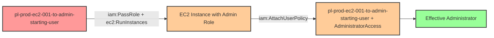

# One-Hop Privilege Escalation: iam:PassRole + ec2:RunInstances

* **Category:** Privilege Escalation
* **Sub-Category:** new-passrole
* **Path Type:** one-hop
* **Target:** to-admin
* **Environments:** prod
* **Cost Estimate:** $0/mo
* **Pathfinding.cloud ID:** ec2-001
* **Technique:** EC2 instance launch with privileged role and user-data backdoor
* **Terraform Variable:** `enable_single_account_privesc_one_hop_to_admin_ec2_001_iam_passrole_ec2_runinstances`
* **Schema Version:** 1.0.0
* **Attack Path:** starting_user → (PassRole + ec2:RunInstances) → EC2 with admin profile → (AttachUserPolicy AdministratorAccess) → admin access
* **Attack Principals:** `arn:aws:iam::{account_id}:user/pl-prod-ec2-001-to-admin-starting-user`; `arn:aws:iam::{account_id}:role/pl-prod-ec2-001-to-admin-target-role`
* **Required Permissions:** `iam:PassRole` on `arn:aws:iam::*:role/pl-prod-ec2-001-to-admin-target-role`; `ec2:RunInstances` on `*`
* **Helpful Permissions:** `iam:ListRoles` (Discover available privileged roles); `ec2:DescribeInstances` (Verify instance launch and get connection details); `iam:ListInstanceProfiles` (Find instance profiles with privileged roles)
* **MITRE Tactics:** TA0004 - Privilege Escalation
* **MITRE Techniques:** T1098.001 - Account Manipulation: Additional Cloud Credentials, T1578 - Modify Cloud Compute Infrastructure

## Attack Overview

This scenario demonstrates a privilege escalation vulnerability where a user has permission to pass IAM roles to EC2 instances (`iam:PassRole`) and launch EC2 instances (`ec2:RunInstances`). The attacker, starting with these permissions, launches an EC2 instance with an administrative instance profile, and uses the instance's user-data script to attach the AdministratorAccess managed policy directly to the starting user. Once the policy is attached, the attacker gains full administrator access.

This technique is particularly dangerous because it combines IAM permissions with compute service actions, allowing an attacker to leverage temporary compute resources to modify persistent IAM configurations. Even though this involves multiple AWS API calls (PassRole, RunInstances, AttachUserPolicy), it's classified as one-hop because there is only one principal traversal: from the starting user to admin privileges via the EC2 instance as an intermediary mechanism.

### MITRE ATT&CK Mapping

- **Tactic**: Privilege Escalation (TA0004)
- **Technique**: T1098.001 - Account Manipulation: Additional Cloud Credentials
- **Technique**: T1578 - Modify Cloud Compute Infrastructure

### Principals in the attack path

- `arn:aws:iam::PROD_ACCOUNT:user/pl-prod-ec2-001-to-admin-starting-user` (Starting user with PassRole + RunInstances permissions)
- `arn:aws:iam::PROD_ACCOUNT:role/pl-prod-ec2-001-to-admin-target-role` (Admin role used by EC2 instance to attach policy)

### Attack Path Diagram



### Attack Steps

1. **Initial Access**: Start as `pl-prod-ec2-001-to-admin-starting-user` with PassRole and RunInstances permissions (credentials provided via Terraform outputs)
2. **Launch EC2 Instance**: Use `ec2:RunInstances` to launch an EC2 instance, passing the admin instance profile via `iam:PassRole`
3. **Policy Attachment**: The instance's user-data script executes with the admin role's credentials and attaches the AdministratorAccess managed policy to the starting user
4. **Verification**: Verify administrator access by listing IAM users (as the starting user with newly attached AdministratorAccess)

### Scenario specific resources created

| ARN | Purpose |
| -- | -- |
| `arn:aws:iam::PROD_ACCOUNT:user/pl-prod-ec2-001-to-admin-starting-user` | Starting user with PassRole and RunInstances permissions (with access keys) |
| `arn:aws:iam::PROD_ACCOUNT:role/pl-prod-ec2-001-to-admin-target-role` | Admin role that EC2 instance uses to attach policy (trusts ec2.amazonaws.com) |
| `arn:aws:iam::PROD_ACCOUNT:instance-profile/pl-prod-ec2-001-to-admin-instance-profile` | Instance profile wrapping the admin role |

## Attack Lab

### Prerequisites

1. Install the `plabs` CLI:
   ```bash
   brew install pathfinding-labs/tap/plabs
   ```
2. Configure your AWS profiles in `~/.plabs/plabs.yaml` (or run `plabs init` if you haven't already)

### Deploy with plabs non-interactive

```bash
plabs enable enable_single_account_privesc_one_hop_to_admin_ec2_001_iam_passrole_ec2_runinstances
plabs apply
```

### Deploy with plabs tui

1. Launch the TUI: `plabs`
2. Navigate to this scenario in the scenarios list
3. Press `space` to enable it
4. Press `d` to deploy

### Executing the automated demo_attack script

The script will:
1. Display a step-by-step walkthrough with color-coded output
2. Show the commands being executed and their results
3. Verify successful privilege escalation
4. Output standardized test results for automation

#### Resources created by attack script

- EC2 instance launched with the admin instance profile via user-data backdoor
- `AdministratorAccess` managed policy attached to `pl-prod-ec2-001-to-admin-starting-user`

#### With plabs non-interactive

```bash
plabs demo --list
plabs demo ec2-001-iam-passrole+ec2-runinstances
```

#### With plabs tui

1. Launch the TUI: `plabs`
2. Navigate to this scenario in the scenarios list
3. Press `r` to run the demo script

### Cleanup

#### With plabs non-interactive

```bash
plabs cleanup --list
plabs cleanup ec2-001-iam-passrole+ec2-runinstances
```

#### With plabs tui

1. Launch the TUI: `plabs`
2. Navigate to this scenario in the scenarios list
3. Press `c` to run the cleanup script

### Teardown with plabs non-interactive

```bash
plabs disable enable_single_account_privesc_one_hop_to_admin_ec2_001_iam_passrole_ec2_runinstances
plabs apply
```

### Teardown with plabs tui

1. Launch the TUI: `plabs`
2. Navigate to this scenario in the scenarios list
3. Press `space` to disable it
4. Press `D` to destroy

## Detecting Misconfiguration (CSPM)

### What CSPM tools should detect

- IAM user has `iam:PassRole` permission scoped to a role with administrative privileges (`pl-prod-ec2-001-to-admin-target-role`)
- IAM user has `ec2:RunInstances` combined with `iam:PassRole`, enabling privilege escalation via compute
- EC2 instance profile wraps a role with `AdministratorAccess` or equivalent admin permissions
- No IAM permission boundary on the starting user to cap the maximum privileges that can be attained

### Prevention recommendations

- Restrict `iam:PassRole` permissions with resource-based conditions to limit which roles can be passed and to which services
- Implement SCPs preventing EC2 instances from being launched with administrative IAM roles
- Monitor CloudTrail for `PassRole` API calls combined with `RunInstances` events targeting privileged roles
- Alert on `AttachUserPolicy` and `PutUserPolicy` API calls, especially when invoked from EC2 instances
- Regularly audit EC2 instances for excessive IAM permissions using IAM Access Analyzer
- Use resource tagging and condition keys to enforce separation of duties between role creation and role assignment
- Implement IAM permission boundaries on users to limit the maximum permissions that can be attached

## Detection Abuse (CloudSIEM)

### CloudTrail events to monitor

- `IAM: PassRole` — Role passed to an EC2 instance; high severity when the target role has administrative permissions
- `EC2: RunInstances` — EC2 instance launched; correlate with `PassRole` events to detect privilege escalation via user-data
- `IAM: AttachUserPolicy` — Managed policy attached to a user; critical when the policy is `AdministratorAccess` and the call originates from an EC2 instance metadata role

### Detonation logs

_Detonation log integration (Stratus Red Team / Grimoire) is planned for a future release._
