# One-Hop Privilege Escalation: ec2-instance-connect:SendSSHPublicKey

* **Category:** Privilege Escalation
* **Sub-Category:** access-resource
* **Path Type:** one-hop
* **Target:** to-admin
* **Environments:** prod
* **Pathfinding.cloud ID:** ec2-003
* **Technique:** SSH into EC2 instance with privileged role and extract credentials via IMDS

## Overview

This scenario demonstrates a privilege escalation vulnerability where a user has permission to push SSH public keys to an EC2 instance via EC2 Instance Connect. When the target EC2 instance has an attached IAM role with administrative permissions, an attacker can SSH into the instance and extract the role's temporary credentials from the Instance Metadata Service (IMDS), gaining full administrator access to the AWS account.

EC2 Instance Connect is a convenient AWS feature that allows administrators to manage SSH access without maintaining long-lived SSH keys. However, when combined with privileged instance profiles, it creates a privilege escalation path. The `ec2-instance-connect:SendSSHPublicKey` permission allows an attacker to push a temporary SSH public key (valid for 60 seconds) to the instance's metadata, establish an SSH connection, and then query IMDSv2 to retrieve the temporary security credentials of the attached IAM role.

This attack is particularly dangerous because it provides direct access to high-privilege credentials without triggering typical IAM credential creation alerts (like `CreateAccessKey` or `CreateLoginProfile`). The credentials are already present in the IMDS—the attacker simply needs access to extract them.

## Understanding the attack scenario

### Principals in the attack path

- `arn:aws:iam::PROD_ACCOUNT:user/pl-prod-ec2-003-to-admin-starting-user` (Scenario-specific starting user)
- `arn:aws:ec2:REGION:PROD_ACCOUNT:instance/i-xxxxxxxxx` (EC2 instance with admin role attached)
- `arn:aws:iam::PROD_ACCOUNT:role/pl-prod-ec2-003-to-admin-ec2-admin-role` (Admin role attached to EC2 instance)

### Attack Path Diagram

```mermaid
graph LR
    A[pl-prod-ec2-003-to-admin-starting-user] -->|ec2-instance-connect:SendSSHPublicKey| B[EC2 Instance]
    B -->|SSH Connection| C[Access Instance Shell]
    C -->|Query IMDSv2| D[Extract Admin Role Credentials]
    D -->|Use Credentials| E[Effective Administrator]

    style A fill:#ff9999,stroke:#333,stroke-width:2px
    style B fill:#ffcc99,stroke:#333,stroke-width:2px
    style C fill:#ffcc99,stroke:#333,stroke-width:2px
    style D fill:#ffcc99,stroke:#333,stroke-width:2px
    style E fill:#99ff99,stroke:#333,stroke-width:2px
```



### Attack Steps

1. **Initial Access**: Start as `pl-prod-ec2-003-to-admin-starting-user` (credentials provided via Terraform outputs)
2. **Generate SSH Key Pair**: Create a temporary SSH key pair for authentication
3. **Push Public Key**: Use `ec2-instance-connect:SendSSHPublicKey` to push the public key to the target EC2 instance
4. **Establish SSH Connection**: Connect to the instance via SSH within the 60-second validity window
5. **Extract Credentials from IMDS**: Query the Instance Metadata Service (IMDSv2) to retrieve temporary security credentials for the attached admin role
6. **Switch Context**: Configure AWS CLI with the extracted credentials
7. **Verification**: Verify administrator access using the extracted credentials

### Scenario specific resources created

| ARN | Purpose |
| -- | -- |
| `arn:aws:iam::PROD_ACCOUNT:user/pl-prod-ec2-003-to-admin-starting-user` | Scenario-specific starting user with access keys |
| `arn:aws:iam::PROD_ACCOUNT:policy/pl-prod-ec2-003-to-admin-policy` | Allows `ec2-instance-connect:SendSSHPublicKey`, `ec2:DescribeInstances`, and read-only IAM discovery |
| `arn:aws:iam::PROD_ACCOUNT:role/pl-prod-ec2-003-to-admin-ec2-admin-role` | Admin role attached to the EC2 instance profile |
| `arn:aws:ec2:REGION:PROD_ACCOUNT:instance/i-xxxxxxxxx` | EC2 instance with the admin role attached via instance profile |
| `arn:aws:ec2:REGION:PROD_ACCOUNT:security-group/sg-xxxxxxxxx` | Security group allowing SSH access (port 22) |

## Executing the attack

### Using the automated demo_attack.sh

To demonstrate the privilege escalation path, run the provided demo script:

```bash
cd modules/scenarios/single-account/privesc-one-hop/to-admin/ec2-003-ec2-instance-connect-sendsshpublickey
./demo_attack.sh
```

The script will:
1. Display a step-by-step walkthrough with color-coded output
2. Show the commands being executed and their results
3. Generate a temporary SSH key pair
4. Push the public key to the EC2 instance using `ec2-instance-connect:SendSSHPublicKey`
5. Establish an SSH connection to the instance
6. Extract role credentials from IMDSv2
7. Verify successful privilege escalation to administrator access
8. Output standardized test results for automation

### Cleaning up the attack artifacts

After demonstrating the attack, clean up the temporary SSH keys and extracted credentials:

```bash
cd modules/scenarios/single-account/privesc-one-hop/to-admin/ec2-003-ec2-instance-connect-sendsshpublickey
./cleanup_attack.sh
```

The cleanup script removes:
- Temporary SSH key pairs created during the demo
- Extracted credential files
- AWS CLI profile configurations created for testing

## Detection and prevention

### What CSPM tools should detect

A properly configured Cloud Security Posture Management (CSPM) tool should identify:

1. **Privilege Escalation Path**: EC2 instances with privileged IAM roles accessible via EC2 Instance Connect
2. **Overly Permissive SendSSHPublicKey**: Users/roles with `ec2-instance-connect:SendSSHPublicKey` permission on instances with admin roles
3. **High-Privilege Instance Profiles**: EC2 instances with administrative or highly privileged IAM roles attached
4. **Unrestricted SSH Access**: Security groups allowing SSH (port 22) from wide CIDR ranges (e.g., 0.0.0.0/0)
5. **IMDSv1 Usage**: Instances still using IMDSv1 (which is more vulnerable to credential theft)
6. **Missing Resource Constraints**: IAM policies allowing `SendSSHPublicKey` without resource-based restrictions

### MITRE ATT&CK Mapping

- **Tactic**: TA0004 - Privilege Escalation, TA0006 - Credential Access
- **Technique**: T1552.005 - Unsecured Credentials: Cloud Instance Metadata API
- **Technique**: T1078.004 - Valid Accounts: Cloud Accounts

## Prevention recommendations

1. **Restrict SendSSHPublicKey Permission**: Use resource-based constraints to limit which instances can receive SSH keys:
   ```json
   {
     "Effect": "Allow",
     "Action": "ec2-instance-connect:SendSSHPublicKey",
     "Resource": "arn:aws:ec2:REGION:ACCOUNT_ID:instance/i-specificinstance",
     "Condition": {
       "StringEquals": {
         "ec2:osuser": "ec2-user"
       }
     }
   }
   ```

2. **Implement Least Privilege for Instance Profiles**: Avoid attaching administrative roles to EC2 instances. Use specific, scoped permissions instead.

3. **Use AWS Systems Manager Session Manager**: Replace SSH access with Session Manager, which provides auditable, credential-free access without requiring open ports:
   - No need for SSH keys or EC2 Instance Connect
   - All sessions logged to CloudTrail and S3
   - Fine-grained access control via IAM policies
   - No inbound security group rules required

4. **Enforce IMDSv2**: Require IMDSv2 (session-oriented) on all EC2 instances to make credential theft more difficult:
   ```bash
   aws ec2 modify-instance-metadata-options \
     --instance-id i-1234567890abcdef0 \
     --http-tokens required \
     --http-put-response-hop-limit 1
   ```

5. **Restrict SSH Access via Security Groups**: Limit SSH access (port 22) to specific, known IP ranges or VPN endpoints. Never use `0.0.0.0/0` for privileged instances.

6. **Monitor CloudTrail for Suspicious Activity**:
   - Alert on `SendSSHPublicKey` API calls, especially to instances with privileged roles
   - Monitor for unusual SSH connections to sensitive instances
   - Track IMDS queries for role credentials (visible in VPC Flow Logs to 169.254.169.254)
   - Alert on `AssumeRole` calls from EC2 instance role credentials used outside of the instance

7. **Implement SCPs for High-Security Environments**: Use Service Control Policies to prevent `ec2-instance-connect:SendSSHPublicKey` in production accounts:
   ```json
   {
     "Effect": "Deny",
     "Action": "ec2-instance-connect:SendSSHPublicKey",
     "Resource": "*",
     "Condition": {
       "StringEquals": {
         "aws:RequestedRegion": ["us-east-1", "us-west-2"]
       }
     }
   }
   ```

8. **Use IAM Access Analyzer**: Regularly scan for privilege escalation paths involving EC2 instances with overly permissive roles.

9. **Consider VPC Endpoints for IMDS**: In highly sensitive environments, use VPC endpoints and network segmentation to restrict IMDS access patterns.

10. **Separate Development and Production**: Use different AWS accounts for development and production. Restrict EC2 Instance Connect to development accounts only.
