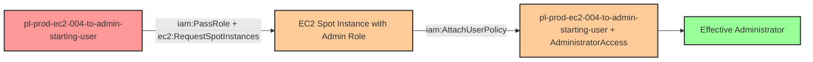

# One-Hop Privilege Escalation: iam:PassRole + ec2:RequestSpotInstances

* **Category:** Privilege Escalation
* **Sub-Category:** new-passrole
* **Path Type:** one-hop
* **Target:** to-admin
* **Environments:** prod
* **Cost Estimate:** $0/mo
* **Pathfinding.cloud ID:** ec2-004
* **Technique:** EC2 Spot Instance launch with privileged role and user-data backdoor
* **Terraform Variable:** `enable_single_account_privesc_one_hop_to_admin_ec2_004_iam_passrole_ec2_requestspotinstances`
* **Schema Version:** 1.0.0
* **Attack Path:** starting_user → (PassRole + RequestSpotInstances) → Spot instance with admin profile → (AttachUserPolicy AdministratorAccess) → admin access
* **Attack Principals:** `arn:aws:iam::{account_id}:user/pl-prod-ec2-004-to-admin-starting-user`; `arn:aws:iam::{account_id}:role/pl-prod-ec2-004-to-admin-target-role`
* **Required Permissions:** `iam:PassRole` on `arn:aws:iam::*:role/pl-prod-ec2-004-to-admin-target-role`; `ec2:RequestSpotInstances` on `*`
* **Helpful Permissions:** `iam:ListRoles` (Discover available privileged roles); `ec2:DescribeInstances` (Verify instance launch and get connection details); `iam:ListInstanceProfiles` (Find instance profiles with privileged roles); `ec2:DescribeSpotInstanceRequests` (Verify spot instance request and get instance details)
* **MITRE Tactics:** TA0004 - Privilege Escalation
* **MITRE Techniques:** T1098.001 - Account Manipulation: Additional Cloud Credentials, T1578 - Modify Cloud Compute Infrastructure

## Attack Overview

This scenario demonstrates a privilege escalation vulnerability where a user has permission to pass IAM roles to EC2 Spot Instances (`iam:PassRole`) and request EC2 Spot Instances (`ec2:RequestSpotInstances`). The attacker, starting with these permissions, launches an EC2 Spot Instance with an administrative instance profile, and uses the instance's user-data script to attach the AdministratorAccess managed policy directly to the starting user. Once the policy is attached, the attacker gains full administrator access.

EC2 Spot Instances are spare compute capacity available at significantly discounted rates (up to 90% off On-Demand prices). While this makes them cost-effective for attackers executing privilege escalation, the underlying security vulnerability is identical to the standard `ec2:RunInstances` technique. Security teams must understand that restricting `ec2:RunInstances` alone is insufficient - they must also restrict `ec2:RequestSpotInstances` to prevent the same attack vector.

This technique is particularly dangerous because it combines IAM permissions with compute service actions, allowing an attacker to leverage temporary, low-cost compute resources to modify persistent IAM configurations. Even though this involves multiple AWS API calls (PassRole, RequestSpotInstances, AttachUserPolicy), it's classified as one-hop because there is only one principal traversal: from the starting user to admin privileges via the Spot Instance as an intermediary mechanism.

### MITRE ATT&CK Mapping

- **Tactic**: Privilege Escalation (TA0004)
- **Technique**: T1098.001 - Account Manipulation: Additional Cloud Credentials
- **Technique**: T1578 - Modify Cloud Compute Infrastructure

### Principals in the attack path

- `arn:aws:iam::PROD_ACCOUNT:user/pl-prod-ec2-004-to-admin-starting-user` (Starting user with PassRole + RequestSpotInstances permissions)
- `arn:aws:iam::PROD_ACCOUNT:role/pl-prod-ec2-004-to-admin-target-role` (Admin role used by EC2 Spot Instance to attach policy)

### Attack Path Diagram



### Attack Steps

1. **Initial Access**: Start as `pl-prod-ec2-004-to-admin-starting-user` with PassRole and RequestSpotInstances permissions (credentials provided via Terraform outputs)
2. **Request Spot Instance**: Use `ec2:RequestSpotInstances` to launch an EC2 Spot Instance, passing the admin instance profile via `iam:PassRole`
3. **Policy Attachment**: The Spot Instance's user-data script executes with the admin role's credentials and attaches the AdministratorAccess managed policy to the starting user
4. **Verification**: Verify administrator access by listing IAM users (as the starting user with newly attached AdministratorAccess)

### Scenario specific resources created

| ARN | Purpose |
| -- | -- |
| `arn:aws:iam::PROD_ACCOUNT:user/pl-prod-ec2-004-to-admin-starting-user` | Starting user with PassRole and RequestSpotInstances permissions (with access keys) |
| `arn:aws:iam::PROD_ACCOUNT:role/pl-prod-ec2-004-to-admin-target-role` | Admin role that EC2 Spot Instance uses to attach policy (trusts ec2.amazonaws.com) |
| `arn:aws:iam::PROD_ACCOUNT:instance-profile/pl-prod-ec2-004-to-admin-instance-profile` | Instance profile wrapping the admin role |

## Attack Lab

### Prerequisites

1. Install the `plabs` CLI:
   ```bash
   brew install pathfinding-labs/tap/plabs
   ```
2. Configure your AWS profiles in `~/.plabs/plabs.yaml` (or run `plabs init` if you haven't already)

### Deploy with plabs non-interactive

```bash
plabs enable enable_single_account_privesc_one_hop_to_admin_ec2_004_iam_passrole_ec2_requestspotinstances
plabs apply
```

### Deploy with plabs tui

1. Launch the TUI: `plabs`
2. Navigate to this scenario in the scenarios list
3. Press `space` to enable it
4. Press `d` to deploy

### Executing the automated demo_attack script

The script will:
1. Display a step-by-step walkthrough with color-coded output
2. Show the commands being executed and their results
3. Verify successful privilege escalation
4. Output standardized test results for automation

#### Resources created by attack script

- AdministratorAccess managed policy attached to the starting user

#### With plabs non-interactive

```bash
plabs demo --list
plabs demo ec2-004-iam-passrole+ec2-requestspotinstances
```

#### With plabs tui

1. Launch the TUI: `plabs`
2. Navigate to this scenario in the scenarios list
3. Press `r` to run the demo script

### Cleanup

After demonstrating the attack, clean up the EC2 Spot Instance request, any launched instances, and the AdministratorAccess policy attached to the starting user.

#### With plabs non-interactive

```bash
plabs cleanup --list
plabs cleanup ec2-004-iam-passrole+ec2-requestspotinstances
```

#### With plabs tui

1. Launch the TUI: `plabs`
2. Navigate to this scenario in the scenarios list
3. Press `c` to run the cleanup script

### Teardown with plabs non-interactive

```bash
plabs disable enable_single_account_privesc_one_hop_to_admin_ec2_004_iam_passrole_ec2_requestspotinstances
plabs apply
```

### Teardown with plabs tui

1. Launch the TUI: `plabs`
2. Navigate to this scenario in the scenarios list
3. Press `space` to disable it
4. Press `D` to destroy

## Detecting Misconfiguration (CSPM)

### What CSPM tools should detect

- IAM user has `iam:PassRole` permission targeting a role with administrative privileges
- IAM user has `ec2:RequestSpotInstances` permission combined with `iam:PassRole` — this combination enables privilege escalation via Spot Instance user-data
- Admin role (`pl-prod-ec2-004-to-admin-target-role`) is passable to EC2 Spot Instances and carries `iam:AttachUserPolicy` on all resources
- Instance profile wrapping an administrative role is accessible to the starting user via `iam:PassRole`

### Prevention recommendations

- Restrict `iam:PassRole` permissions with resource-based conditions to limit which roles can be passed and to which services
- Implement SCPs preventing EC2 Spot Instances from being launched with administrative IAM roles
- Apply the same restrictions to `ec2:RequestSpotInstances` as you would to `ec2:RunInstances` — they provide equivalent privilege escalation paths
- Alert on `IAM: AttachUserPolicy` and `IAM: PutUserPolicy` API calls, especially when invoked from EC2 instances
- Regularly audit EC2 instances (including Spot Instances) for excessive IAM permissions using IAM Access Analyzer
- Implement IAM permission boundaries on users to limit the maximum permissions that can be attached

## Detection Abuse (CloudSIEM)

### CloudTrail events to monitor

- `IAM: PassRole` — Starting user passes the admin role to the EC2 Spot Instance; critical when the target role has elevated permissions
- `EC2: RequestSpotInstances` — Spot Instance request launched with an administrative instance profile; high severity when combined with a preceding `PassRole` event
- `IAM: AttachUserPolicy` — AdministratorAccess managed policy attached to the starting user; critical when invoked from an EC2 instance metadata context

### Detonation logs

_Detonation log integration (Stratus Red Team / Grimoire) is planned for a future release._
