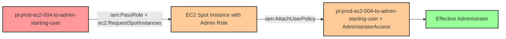

# One-Hop Privilege Escalation: iam:PassRole + ec2:RequestSpotInstances

* **Category:** Privilege Escalation
* **Sub-Category:** service-passrole
* **Path Type:** one-hop
* **Target:** to-admin
* **Environments:** prod
* **Pathfinding.cloud ID:** ec2-004
* **Technique:** EC2 Spot Instance launch with privileged role and user-data backdoor

## Overview

This scenario demonstrates a privilege escalation vulnerability where a user has permission to pass IAM roles to EC2 Spot Instances (`iam:PassRole`) and request EC2 Spot Instances (`ec2:RequestSpotInstances`). The attacker, starting with these permissions, launches an EC2 Spot Instance with an administrative instance profile, and uses the instance's user-data script to attach the AdministratorAccess managed policy directly to the starting user. Once the policy is attached, the attacker gains full administrator access.

EC2 Spot Instances are spare compute capacity available at significantly discounted rates (up to 90% off On-Demand prices). While this makes them cost-effective for attackers executing privilege escalation, the underlying security vulnerability is identical to the standard `ec2:RunInstances` technique. Security teams must understand that restricting `ec2:RunInstances` alone is insufficient - they must also restrict `ec2:RequestSpotInstances` to prevent the same attack vector.

This technique is particularly dangerous because it combines IAM permissions with compute service actions, allowing an attacker to leverage temporary, low-cost compute resources to modify persistent IAM configurations. Even though this involves multiple AWS API calls (PassRole, RequestSpotInstances, AttachUserPolicy), it's classified as one-hop because there is only one principal traversal: from the starting user to admin privileges via the Spot Instance as an intermediary mechanism.

## Understanding the attack scenario

### Principals in the attack path

- `arn:aws:iam::PROD_ACCOUNT:user/pl-prod-ec2-004-to-admin-starting-user` (Starting user with PassRole + RequestSpotInstances permissions)
- `arn:aws:iam::PROD_ACCOUNT:role/pl-prod-ec2-004-to-admin-target-role` (Admin role used by EC2 Spot Instance to attach policy)

### Attack Path Diagram



### Attack Steps

1. **Initial Access**: Start as `pl-prod-ec2-004-to-admin-starting-user` with PassRole and RequestSpotInstances permissions (credentials provided via Terraform outputs)
2. **Request Spot Instance**: Use `ec2:RequestSpotInstances` to launch an EC2 Spot Instance, passing the admin instance profile via `iam:PassRole`
3. **Policy Attachment**: The Spot Instance's user-data script executes with the admin role's credentials and attaches the AdministratorAccess managed policy to the starting user
4. **Verification**: Verify administrator access by listing IAM users (as the starting user with newly attached AdministratorAccess)

### Scenario specific resources created

| ARN | Purpose |
| -- | -- |
| `arn:aws:iam::PROD_ACCOUNT:user/pl-prod-ec2-004-to-admin-starting-user` | Starting user with PassRole and RequestSpotInstances permissions (with access keys) |
| `arn:aws:iam::PROD_ACCOUNT:role/pl-prod-ec2-004-to-admin-target-role` | Admin role that EC2 Spot Instance uses to attach policy (trusts ec2.amazonaws.com) |
| `arn:aws:iam::PROD_ACCOUNT:instance-profile/pl-prod-ec2-004-to-admin-instance-profile` | Instance profile wrapping the admin role |

## Executing the attack

### Using the automated demo_attack.sh

To demonstrate the privilege escalation path, run the provided demo script:

```bash
cd modules/scenarios/single-account/privesc-one-hop/to-admin/ec2-004-iam-passrole+ec2-requestspotinstances
./demo_attack.sh
```

The script will:
1. Display a step-by-step walkthrough with color-coded output
2. Show the commands being executed and their results
3. Verify successful privilege escalation
4. Output standardized test results for automation

### Cleaning up the attack artifacts

After demonstrating the attack, clean up the EC2 Spot Instance request, any launched instances, and detach the AdministratorAccess policy from the starting user:

```bash
cd modules/scenarios/single-account/privesc-one-hop/to-admin/ec2-004-iam-passrole+ec2-requestspotinstances
./cleanup_attack.sh
```

## Detection and prevention


### MITRE ATT&CK Mapping

- **Tactic**: Privilege Escalation (TA0004)
- **Technique**: T1098.001 - Account Manipulation: Additional Cloud Credentials
- **Technique**: T1578 - Modify Cloud Compute Infrastructure


## Prevention recommendations

- Restrict `iam:PassRole` permissions with resource-based conditions to limit which roles can be passed and to which services
- Implement SCPs preventing EC2 Spot Instances from being launched with administrative IAM roles
- Monitor CloudTrail for `PassRole` API calls combined with `RequestSpotInstances` events targeting privileged roles
- Alert on `AttachUserPolicy` and `PutUserPolicy` API calls, especially when invoked from EC2 instances
- Regularly audit EC2 instances (including Spot Instances) for excessive IAM permissions using IAM Access Analyzer
- Use resource tagging and condition keys to enforce separation of duties between role creation and role assignment
- Implement IAM permission boundaries on users to limit the maximum permissions that can be attached
- Apply the same restrictions to `ec2:RequestSpotInstances` as you would to `ec2:RunInstances` - they provide equivalent privilege escalation paths
