# Privilege Escalation via Launch Template Modification

* **Category:** Privilege Escalation
* **Sub-Category:** access-resource
* **Path Type:** one-hop
* **Target:** to-admin
* **Environments:** prod
* **Technique:** Modifying EC2 launch templates to change instance profiles and inject malicious user data for next instance launch

## Overview

This scenario demonstrates a sophisticated privilege escalation technique where an attacker with permissions to modify EC2 launch templates can change an existing administrative role configuration and inject malicious user data that will be executed when the next EC2 instance is launched. The combination of `ec2:CreateLaunchTemplateVersion` and `ec2:ModifyLaunchTemplate` permissions creates a powerful attack path that allows an attacker to "pre-stage" privilege escalation that activates automatically.

EC2 launch templates are commonly used with Auto Scaling Groups (ASGs) to define instance configuration including AMI, instance type, security groups, and crucially - the IAM instance profile and user data script. When an attacker can create a new version of a launch template and set it as the default, they control what configuration will be used for all future instance launches. This is particularly dangerous in environments with auto-scaling policies or scheduled instance launches, where the malicious configuration may activate without any further attacker interaction.

The attack works by creating a new launch template version that references an existing administrative IAM role (already configured in the template) and user data containing a script that grants the attacker's starting user administrative permissions. Notably, this attack does NOT require `iam:PassRole` permissions because the attacker is simply referencing a role that already exists in a previous template version. When the next instance launches (either through manual action, auto-scaling, or scheduled tasks), the instance receives full administrative permissions via its instance profile, and the user data script immediately modifies IAM policies to grant the attacker persistent admin access. This is a one-hop privilege escalation because the attacker goes directly from limited permissions to admin access through the compromised instance's actions.

## Understanding the attack scenario

### Principals in the attack path

- `arn:aws:iam::PROD_ACCOUNT:user/pl-prod-ec2-005-to-admin-starting-user` (Scenario-specific starting user with template modification permissions)
- `arn:aws:iam::PROD_ACCOUNT:role/pl-prod-ec2-005-to-admin-lowpriv-role` (Low-privilege role in original launch template)
- `arn:aws:iam::PROD_ACCOUNT:role/pl-prod-ec2-005-to-admin-target-role` (Administrative role passed to modified launch template)

### Attack Path Diagram

```mermaid
graph LR
    A[pl-prod-ec2-005-to-admin-starting-user] -->|CreateLaunchTemplateVersion| B[New Template Version]
    B -->|Contains target-role + malicious user data| C[Modified Template]
    A -->|ModifyLaunchTemplate| C
    C -->|Next instance launch| D[EC2 Instance with Admin Role]
    D -->|User data executes| E[Grants admin to starting-user]
    E -->|Effective Administrator| F[Starting User with Admin Access]

    style A fill:#ff9999,stroke:#333,stroke-width:2px
    style B fill:#ffcc99,stroke:#333,stroke-width:2px
    style C fill:#ffcc99,stroke:#333,stroke-width:2px
    style D fill:#ffcc99,stroke:#333,stroke-width:2px
    style E fill:#ffcc99,stroke:#333,stroke-width:2px
    style F fill:#99ff99,stroke:#333,stroke-width:2px
```



### Attack Steps

1. **Initial Access**: Start as `pl-prod-ec2-005-to-admin-starting-user` (credentials provided via Terraform outputs)
2. **Enumerate Templates**: Use `ec2:DescribeLaunchTemplates` to discover existing launch templates
3. **Inspect Existing Templates**: Use `ec2:DescribeLaunchTemplateVersions` to identify templates that already have administrative roles configured
4. **Create Malicious Template Version**: Use `ec2:CreateLaunchTemplateVersion` with:
   - IAM instance profile referencing the existing admin role (NO PassRole required - just referencing existing configuration)
   - User data script that attaches AdministratorAccess policy to the starting user
5. **Set as Default**: Use `ec2:ModifyLaunchTemplate` to make the malicious version the default
6. **Trigger Instance Launch**: Launch a new EC2 instance using the modified template (or wait for auto-scaling/scheduled launch)
7. **Automated Escalation**: Instance launches with admin role and executes user data to grant admin to starting user
8. **Verification**: Verify administrator access by listing IAM users or performing other admin-level actions

### Scenario specific resources created

| ARN | Purpose |
| -- | -- |
| `arn:aws:iam::PROD_ACCOUNT:user/pl-prod-ec2-005-to-admin-starting-user` | Scenario-specific starting user with access keys and template modification permissions |
| `arn:aws:iam::PROD_ACCOUNT:role/pl-prod-ec2-005-to-admin-lowpriv-role` | Low-privilege role initially configured in the launch template |
| `arn:aws:iam::PROD_ACCOUNT:role/pl-prod-ec2-005-to-admin-target-role` | Administrative role that will be passed to the modified launch template |
| `arn:aws:ec2:REGION:PROD_ACCOUNT:launch-template/pl-prod-ec2-005-to-admin-template` | EC2 launch template that can be modified to include admin role |

## Executing the attack

### Using the automated demo_attack.sh

To demonstrate the privilege escalation path, run the provided demo script:

```bash
cd modules/scenarios/single-account/privesc-one-hop/to-admin/ec2-005-ec2-createlaunchtemplateversion+ec2-modifylaunchtemplate
./demo_attack.sh
```

The script will:
1. Display a step-by-step walkthrough with color-coded output
2. Show the commands being executed and their results
3. Create a new launch template version with admin role and malicious user data
4. Modify the template to use the new malicious version as default
5. Launch an EC2 instance to demonstrate the privilege escalation
6. Verify successful privilege escalation
7. Output standardized test results for automation

**Cost Warning:** This demo launches a t3.micro spot instance which will incur small charges (~$0.01-0.05/hour). The cleanup script terminates all instances to minimize costs.

### Cleaning up the attack artifacts

After demonstrating the attack, clean up the EC2 instances and restore the launch template:

```bash
cd modules/scenarios/single-account/privesc-one-hop/to-admin/ec2-005-ec2-createlaunchtemplateversion+ec2-modifylaunchtemplate
./cleanup_attack.sh
```

The cleanup script will:
- Terminate all EC2 instances launched during the demo
- Restore the launch template to its original default version
- Remove the malicious launch template version
- Remove any IAM policy attachments made by the user data script
- Preserve the deployed infrastructure for future demonstrations

## Detection and prevention

### What CSPMs Should Detect

A properly configured Cloud Security Posture Management (CSPM) tool should identify this vulnerability by detecting:

- **Launch Template Write Access**: Principal can create new launch template versions or modify existing templates that contain privileged roles
- **Existing Admin Roles in Templates**: Launch templates that reference administrative IAM instance profiles
- **Privilege Escalation Path**: Template modification permissions on templates with privileged roles creates escalation path
- **Dangerous Permission Combination**: `ec2:CreateLaunchTemplateVersion` + `ec2:ModifyLaunchTemplate` on templates with admin roles
- **Template Modification Events**: CloudTrail shows CreateLaunchTemplateVersion or ModifyLaunchTemplate API calls
- **Suspicious User Data**: New template versions containing IAM modification commands in user data
- **Instance Profile Changes**: Launch template modifications that update user data while keeping the same privileged instance profile

### MITRE ATT&CK Mapping

- **Tactic**: TA0004 - Privilege Escalation, TA0003 - Persistence
- **Technique**: T1098.001 - Account Manipulation: Additional Cloud Credentials
- **Technique**: T1578 - Modify Cloud Compute Infrastructure

## Prevention recommendations

- Restrict who can modify launch templates that contain privileged instance profiles using resource-based IAM policies
- Use Service Control Policies (SCPs) to prevent launch template modifications in production environments unless from approved automation roles
- Implement resource tagging and condition keys to restrict which launch templates can be modified: `"Condition": {"StringEquals": {"aws:ResourceTag/Environment": "dev"}}`
- Monitor CloudTrail for `CreateLaunchTemplateVersion` and `ModifyLaunchTemplate` API calls, especially on templates with admin roles
- Use IAM Access Analyzer to identify principals with template modification permissions on templates containing privileged roles
- Enable MFA requirements for sensitive operations like launch template modifications using `aws:MultiFactorAuthPresent` condition
- Implement approval workflows for launch template changes using AWS Service Catalog or custom automation
- Use launch template versioning strategically: pin Auto Scaling Groups to specific versions rather than using `$Latest` or `$Default`
- Monitor EC2 user data for suspicious IAM-related commands using AWS Config rules or custom Lambda functions
- Implement least privilege: Avoid granting wildcard permissions on EC2 resources; scope to specific launch template ARNs
- Consider using EC2 Image Builder with locked-down instance profiles instead of relying on user data for configuration
- Regularly audit existing launch templates to identify those with privileged instance profiles and restrict modification permissions
- Separate permissions: Don't grant template modification permissions to principals who don't need to manage infrastructure
