# One-Hop Privilege Escalation: ec2:ModifyInstanceAttribute + ec2:StopInstances + ec2:StartInstances

**Category:** Privilege Escalation
**Sub-Category:** access-resource
**Path Type:** one-hop
**Target:** to-admin
**Environments:** prod
**Pathfinding.cloud ID:** ec2-002
**Technique:** EC2 userData injection with cloud-init to extract IMDS credentials

## Overview

This scenario demonstrates a sophisticated privilege escalation vulnerability where an attacker with permissions to stop, modify, and start EC2 instances can inject malicious code into an instance's userData to extract IAM role credentials from the Instance Metadata Service (IMDS). Unlike typical user-data scripts that only execute on the first boot, this attack leverages cloud-init's multipart MIME format with the `cloud_final_modules: [scripts-user, always]` directive to ensure the malicious payload executes on subsequent boots.

The attack works by stopping a running EC2 instance, modifying its userData attribute with a malicious cloud-init script, and then restarting the instance. When the instance boots, the injected script executes with the permissions of the instance's attached IAM role, extracts temporary credentials from the IMDS endpoint at 169.254.169.254, and can exfiltrate them or execute privileged actions. This technique is particularly dangerous because it targets existing infrastructure rather than creating new resources, making it less likely to trigger alarms for unexpected resource creation.

This technique was popularized by Bishop Fox's AWS privilege escalation research and represents a critical attack vector where compute permissions can be leveraged to obtain credential access. Organizations often overlook the security implications of allowing principals to modify instance attributes, focusing primarily on permissions to create new resources.

## Understanding the attack scenario

### Principals in the attack path

- `arn:aws:iam::PROD_ACCOUNT:user/pl-prod-mia-to-admin-starting-user` (Scenario-specific starting user with EC2 modification permissions)
- `arn:aws:ec2:REGION:PROD_ACCOUNT:instance/i-xxxxxxxxx` (Target EC2 instance with admin role attached)
- `arn:aws:iam::PROD_ACCOUNT:role/pl-prod-mia-to-admin-target-role` (Admin role attached to the EC2 instance)

### Attack Path Diagram

```mermaid
graph LR
    A[pl-prod-mia-to-admin-starting-user] -->|ec2:StopInstances| B[EC2 Instance Stopped]
    B -->|ec2:ModifyInstanceAttribute| C[Inject Malicious userData]
    C -->|ec2:StartInstances| D[Instance Boots with Payload]
    D -->|cloud-init executes script| E[Extract IMDS Credentials]
    E -->|Use pl-prod-mia-to-admin-target-role| F[Effective Administrator]

    style A fill:#ff9999,stroke:#333,stroke-width:2px
    style B fill:#ffcc99,stroke:#333,stroke-width:2px
    style C fill:#ffcc99,stroke:#333,stroke-width:2px
    style D fill:#ffcc99,stroke:#333,stroke-width:2px
    style E fill:#ffcc99,stroke:#333,stroke-width:2px
    style F fill:#99ff99,stroke:#333,stroke-width:2px
```



### Attack Steps

1. **Initial Access**: Start as `pl-prod-mia-to-admin-starting-user` with EC2 modification permissions (credentials provided via Terraform outputs)
2. **Discover Target Instance**: Use `ec2:DescribeInstances` to identify EC2 instances with privileged IAM roles attached
3. **Stop Instance**: Use `ec2:StopInstances` to stop the target EC2 instance (userData can only be modified when stopped)
4. **Inject Malicious Payload**: Use `ec2:ModifyInstanceAttribute` to inject a cloud-init multipart MIME payload with:
   - `cloud-config` section containing `cloud_final_modules: [scripts-user, always]` to force execution on subsequent boots
   - `x-shellscript` section containing the credential extraction script
5. **Start Instance**: Use `ec2:StartInstances` to boot the instance and trigger payload execution
6. **Payload Execution**: The cloud-init script executes on boot and:
   - Queries IMDS at `http://169.254.169.254/latest/meta-data/iam/security-credentials/`
   - Extracts `AWS_ACCESS_KEY_ID`, `AWS_SECRET_ACCESS_KEY`, and `AWS_SESSION_TOKEN`
   - Exfiltrates credentials or executes commands with admin privileges
7. **Verification**: Use the extracted credentials to verify administrative access

### Understanding the cloud-init Payload

The attack uses a multipart MIME format to combine cloud-config directives with executable scripts:

```
Content-Type: multipart/mixed; boundary="==BOUNDARY=="
MIME-Version: 1.0

--==BOUNDARY==
Content-Type: text/cloud-config; charset="us-ascii"

#cloud-config
cloud_final_modules:
  - scripts-user
  - always

--==BOUNDARY==
Content-Type: text/x-shellscript; charset="us-ascii"

#!/bin/bash
ROLE_NAME=$(curl -s http://169.254.169.254/latest/meta-data/iam/security-credentials/)
CREDENTIALS=$(curl -s http://169.254.169.254/latest/meta-data/iam/security-credentials/$ROLE_NAME)

# Extract and use credentials
AWS_ACCESS_KEY_ID=$(echo $CREDENTIALS | jq -r .AccessKeyId)
AWS_SECRET_ACCESS_KEY=$(echo $CREDENTIALS | jq -r .SecretAccessKey)
AWS_SESSION_TOKEN=$(echo $CREDENTIALS | jq -r .Token)

# Execute privileged actions or exfiltrate credentials
--==BOUNDARY==--
```

**Key Components:**
- **cloud_final_modules: [scripts-user, always]**: Forces script execution on every boot (not just first boot)
- **IMDS queries**: Extracts temporary credentials from 169.254.169.254
- **Automatic execution**: Runs with instance role permissions without user interaction

### Scenario specific resources created

| ARN | Purpose |
| -- | -- |
| `arn:aws:iam::PROD_ACCOUNT:user/pl-prod-mia-to-admin-starting-user` | Scenario-specific starting user with EC2 modification permissions and access keys |
| `arn:aws:iam::PROD_ACCOUNT:role/pl-prod-mia-to-admin-target-role` | Target admin role attached to the EC2 instance |
| `arn:aws:iam::PROD_ACCOUNT:instance-profile/pl-prod-mia-to-admin-target-profile` | Instance profile wrapping the admin role |
| `arn:aws:ec2:REGION:PROD_ACCOUNT:instance/i-xxxxxxxxx` | EC2 instance with admin role that becomes the attack vector |
| `arn:aws:ec2:REGION:PROD_ACCOUNT:vpc/vpc-xxxxxxxxx` | VPC for the EC2 instance |
| `arn:aws:ec2:REGION:PROD_ACCOUNT:subnet/subnet-xxxxxxxxx` | Subnet for the EC2 instance |
| `arn:aws:ec2:REGION:PROD_ACCOUNT:security-group/sg-xxxxxxxxx` | Security group for the EC2 instance |

## Executing the attack

### Using the automated demo_attack.sh

To demonstrate the privilege escalation path, run the provided demo script:

```bash
cd modules/scenarios/single-account/privesc-one-hop/to-admin/ec2-modifyinstanceattribute+stopinstances+startinstances
./demo_attack.sh
```

The script will:
1. Display a step-by-step walkthrough with color-coded output
2. Show the commands being executed and their results
3. Demonstrate stopping the instance, modifying userData, and starting it
4. Show the malicious script execution and credential extraction
5. Verify successful privilege escalation using the extracted credentials
6. Output standardized test results for automation

### Cleaning up the attack artifacts

After demonstrating the attack, clean up the modified userData and restore the instance to its original state:

```bash
cd modules/scenarios/single-account/privesc-one-hop/to-admin/ec2-modifyinstanceattribute+stopinstances+startinstances
./cleanup_attack.sh
```

The cleanup script will:
- Remove the malicious userData from the EC2 instance
- Stop and restart the instance to clear any running malicious processes
- Verify the instance has been restored to a clean state

## Detection and prevention

### What CSPM tools should detect

A properly configured Cloud Security Posture Management (CSPM) tool should identify:

1. **Overly Permissive EC2 Permissions**: Principals with `ec2:ModifyInstanceAttribute` on instances with privileged roles
2. **Privilege Escalation Path**: Path from low-privilege principal → EC2 modification permissions → admin role credentials
3. **High-Risk Permission Combinations**: `ec2:StopInstances` + `ec2:ModifyInstanceAttribute` + `ec2:StartInstances` together
4. **Instance Role Exposure**: EC2 instances with administrative IAM roles that are modifiable by non-admin principals
5. **IMDS Access Risks**: Instances with administrative roles that have IMDS v1 enabled (allowing easier credential extraction)

### MITRE ATT&CK Mapping

- **Tactics**:
  - TA0004 - Privilege Escalation
  - TA0006 - Credential Access
- **Techniques**:
  - T1552.005 - Unsecured Credentials: Cloud Instance Metadata API
  - T1578 - Modify Cloud Compute Infrastructure
- **Sub-techniques**:
  - T1578.005 - Modify Cloud Compute Infrastructure: Modify Cloud Compute Configurations

## Prevention recommendations

1. **Restrict ModifyInstanceAttribute Permission**: Use resource-based conditions to limit which instances can have their attributes modified:
   ```json
   {
     "Effect": "Allow",
     "Action": "ec2:ModifyInstanceAttribute",
     "Resource": "arn:aws:ec2:*:*:instance/*",
     "Condition": {
       "StringEquals": {
         "ec2:ResourceTag/AllowUserDataModification": "true"
       }
     }
   }
   ```

2. **Implement SCPs to Prevent High-Risk Modifications**: Create Service Control Policies that prevent userData modification on instances with privileged roles:
   ```json
   {
     "Effect": "Deny",
     "Action": "ec2:ModifyInstanceAttribute",
     "Resource": "arn:aws:ec2:*:*:instance/*",
     "Condition": {
       "StringEquals": {
         "ec2:Attribute": "userData"
       }
     }
   }
   ```

3. **Require IMDSv2**: Enforce Instance Metadata Service v2, which requires session tokens and mitigates credential extraction:
   ```bash
   aws ec2 modify-instance-metadata-options \
     --instance-id i-xxxxxxxxx \
     --http-tokens required \
     --http-put-response-hop-limit 1
   ```

4. **Monitor CloudTrail for Suspicious Activity**:
   - Alert on `ModifyInstanceAttribute` API calls where `attribute=userData`
   - Alert on sequences of `StopInstances` → `ModifyInstanceAttribute` → `StartInstances` against the same instance
   - Monitor for unusual IMDS access patterns from EC2 instances

5. **Separate EC2 Management from Application Permissions**: Use separate roles for EC2 infrastructure management versus application workloads
   - Never grant `ec2:ModifyInstanceAttribute` to application-level roles
   - Use dedicated admin roles for EC2 modifications

6. **Implement Network Controls**: Use VPC endpoints and security groups to restrict outbound traffic from sensitive instances, preventing credential exfiltration

7. **Use IAM Access Analyzer**: Regularly scan for privilege escalation paths involving EC2 permissions and instance roles

8. **Apply Least Privilege for Instance Roles**: Minimize permissions granted to EC2 instance roles, especially for long-running instances

9. **Enable GuardDuty**: AWS GuardDuty can detect anomalous IMDS credential usage and EC2 instance compromise indicators

## References

- **Bishop Fox AWS Privilege Escalation Research**: This technique was documented as part of Bishop Fox's comprehensive research into AWS privilege escalation methods
- **Cloud-init Documentation**: Understanding multipart MIME userData and boot-time script execution
- **AWS IMDS Security**: Best practices for securing Instance Metadata Service access
- **Pathfinding.cloud**: This scenario is cataloged as path ID **ec2-002**

## Cost Estimate

Running this scenario costs approximately **$8/month** for the EC2 instance (t3.micro in us-east-1 running continuously). Costs may vary based on region and instance uptime.
