# Privilege Escalation via iam:PassRole + ecs:CreateCluster + ecs:RegisterTaskDefinition + ecs:CreateService

* **Category:** Privilege Escalation
* **Sub-Category:** service-passrole
* **Path Type:** one-hop
* **Target:** to-admin
* **Environments:** prod
* **Technique:** Creating ECS cluster and deploying service with privileged role to gain administrative access

## Overview

This scenario demonstrates a sophisticated privilege escalation vulnerability where a user can create AWS ECS (Elastic Container Service) infrastructure and deploy containerized workloads with privileged IAM roles. By combining the permissions `ecs:CreateCluster`, `iam:PassRole`, `ecs:RegisterTaskDefinition`, and `ecs:CreateService`, an attacker can stand up an entire ECS environment and execute code with administrative privileges.

Unlike scenarios where existing ECS infrastructure is leveraged, this attack path allows the attacker to create their own cluster from scratch. The attacker registers a task definition that uses a privileged IAM role, then creates a persistent ECS service on AWS Fargate to execute that task. The containerized workload runs with the permissions of the passed role and can perform any administrative action, such as attaching an AdministratorAccess policy to the starting user's account.

This vulnerability is particularly dangerous because it provides persistence through the ECS service, which will automatically restart the task if it fails. The attack leverages AWS's serverless Fargate launch type, requiring no EC2 instances or complex networking setup. Organizations often grant these ECS permissions to development teams for legitimate container deployments without realizing they can be chained together for privilege escalation. The attack surface is significant because ECS is widely used in modern cloud architectures, and the required permissions appear innocuous when viewed individually.

## Understanding the attack scenario

### Principals in the attack path

- `arn:aws:iam::PROD_ACCOUNT:user/pl-prod-ecs-001-to-admin-starting-user` (Scenario-specific starting user with ECS and PassRole permissions)
- `arn:aws:iam::PROD_ACCOUNT:role/pl-prod-ecs-001-to-admin-target-role` (Target role with administrative permissions that can be passed to ECS tasks)

### Attack Path Diagram

```mermaid
graph LR
    A[pl-prod-ecs-001-to-admin-starting-user] -->|ecs:CreateCluster| B[ECS Cluster Created]
    B -->|ecs:RegisterTaskDefinition<br/>with admin role| C[Task Definition<br/>with Admin Role]
    C -->|ecs:CreateService<br/>on Fargate| D[ECS Service Running]
    D -->|Task executes:<br/>Attach admin policy| E[Starting User<br/>Gains Admin Access]
    E -->|Administrator Access| F[Effective Administrator]

    style A fill:#ff9999,stroke:#333,stroke-width:2px
    style B fill:#ffcc99,stroke:#333,stroke-width:2px
    style C fill:#ffcc99,stroke:#333,stroke-width:2px
    style D fill:#ffcc99,stroke:#333,stroke-width:2px
    style E fill:#ffcc99,stroke:#333,stroke-width:2px
    style F fill:#99ff99,stroke:#333,stroke-width:2px
```



### Attack Steps

1. **Initial Access**: Start as `pl-prod-ecs-001-to-admin-starting-user` (credentials provided via Terraform outputs)
2. **Create ECS Cluster**: Use `ecs:CreateCluster` to create a new ECS cluster for hosting the malicious service
3. **Register Task Definition**: Use `ecs:RegisterTaskDefinition` and `iam:PassRole` to create a task definition that:
   - Uses the privileged `pl-prod-ecs-001-to-admin-target-role` as the task execution role
   - Runs a container with AWS CLI that attaches AdministratorAccess policy to the starting user
4. **Create ECS Service**: Use `ecs:CreateService` with Fargate launch type to deploy a persistent service that runs the malicious task
5. **Wait for Execution**: The ECS service launches the task, which executes the AWS CLI commands with admin privileges
6. **Verification**: Verify administrator access by listing IAM users or performing other admin-level actions with the starting user's credentials

### Scenario specific resources created

| ARN | Purpose |
| -- | -- |
| `arn:aws:iam::PROD_ACCOUNT:user/pl-prod-ecs-001-to-admin-starting-user` | Scenario-specific starting user with access keys and ECS permissions |
| `arn:aws:iam::PROD_ACCOUNT:role/pl-prod-ecs-001-to-admin-target-role` | Target role with AdministratorAccess policy that can be passed to ECS tasks |

## Executing the attack

### Using the automated demo_attack.sh

To demonstrate the privilege escalation path, run the provided demo script:

```bash
cd modules/scenarios/single-account/privesc-one-hop/to-admin/ecs-001-iam-passrole+ecs-createcluster+ecs-registertaskdefinition+ecs-createservice
./demo_attack.sh
```

The script will:
1. Display a step-by-step walkthrough with color-coded output
2. Show the commands being executed and their results
3. Create an ECS cluster and deploy a malicious service
4. Wait for the task to execute and grant administrative access
5. Verify successful privilege escalation
6. Output standardized test results for automation

### Cleaning up the attack artifacts

After demonstrating the attack, clean up the ECS resources and detach the admin policy:

```bash
cd modules/scenarios/single-account/privesc-one-hop/to-admin/iam-passrole+ecs-createcluster+ecs-registertaskdefinition+ecs-createservice
./cleanup_attack.sh
```

The cleanup script will remove the ECS service, cluster, task definition, and detach the AdministratorAccess policy from the starting user, restoring the environment to its original state while preserving the deployed infrastructure.

## Detection and prevention

### What CSPM Tools Should Detect

A properly configured Cloud Security Posture Management (CSPM) tool should identify:

- **Privilege Escalation Path**: User with `iam:PassRole` + `ecs:CreateCluster` + `ecs:RegisterTaskDefinition` + `ecs:CreateService` can escalate to administrative access
- **Overly Permissive PassRole**: IAM user can pass roles with administrative privileges to ECS services
- **Unrestricted ECS Creation**: User can create ECS clusters and services without resource restrictions
- **Service PassRole Risk**: Combination of service creation permissions (ECS) with ability to pass privileged roles
- **Fargate Service Deployment**: User can deploy containerized workloads with privileged execution roles

### MITRE ATT&CK Mapping

- **Tactics**:
  - TA0004 - Privilege Escalation
  - TA0002 - Execution
  - TA0003 - Persistence
- **Techniques**:
  - T1078.004 - Valid Accounts: Cloud Accounts
  - T1610 - Deploy Container

## Prevention recommendations

- Implement strict resource-based conditions on `iam:PassRole` to limit which roles can be passed: `"Condition": {"StringEquals": {"iam:PassedToService": "ecs-tasks.amazonaws.com"}}`
- Add resource constraints to `iam:PassRole` to prevent passing administrative roles: `"Resource": "arn:aws:iam::*:role/AppSpecificRole*"`
- Use Service Control Policies (SCPs) to prevent creation of ECS clusters in unauthorized accounts or regions
- Implement tag-based access control requiring specific tags on roles before they can be passed to ECS services
- Monitor CloudTrail for `CreateCluster`, `RegisterTaskDefinition`, `CreateService`, and `PassRole` API calls in sequence
- Enable MFA requirements for ECS service creation operations using condition keys like `aws:MultiFactorAuthPresent`
- Use IAM Access Analyzer to identify privilege escalation paths involving ECS PassRole permissions
- Implement network restrictions on ECS services to prevent unauthorized outbound connections
- Require approval workflows for ECS service deployments through AWS Service Catalog or custom automation
- Restrict task execution roles to least privilege - avoid attaching AdministratorAccess to roles used by ECS tasks
- Use AWS Organizations tag policies to enforce mandatory tags on ECS resources for tracking and governance
- Implement automated alerting on ECS service creation events that pass privileged roles using EventBridge
