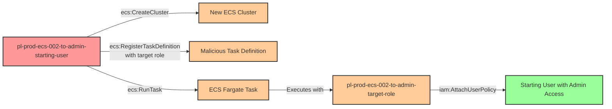

# Privilege Escalation via iam:PassRole + ecs:CreateCluster + ecs:RegisterTaskDefinition + ecs:RunTask

* **Category:** Privilege Escalation
* **Sub-Category:** new-passrole
* **Path Type:** one-hop
* **Target:** to-admin
* **Environments:** prod
* **Cost Estimate:** $0/mo
* **Pathfinding.cloud ID:** ecs-002
* **Technique:** Passing a privileged role to an attacker-controlled ECS task to gain administrative access
* **Terraform Variable:** `enable_single_account_privesc_one_hop_to_admin_ecs_002_iam_passrole_ecs_createcluster_ecs_registertaskdefinition_ecs_runtask`
* **Schema Version:** 1.0.0
* **Attack Path:** starting_user → (ecs:CreateCluster) → (ecs:RegisterTaskDefinition with admin role) → (ecs:RunTask on Fargate) → ECS task attaches admin policy to starting user → admin access
* **Attack Principals:** `arn:aws:iam::{account_id}:user/pl-prod-ecs-002-to-admin-starting-user`; `arn:aws:iam::{account_id}:role/pl-prod-ecs-002-to-admin-target-role`
* **Required Permissions:** `ecs:CreateCluster` on `*`; `iam:PassRole` on `arn:aws:iam::*:role/pl-prod-ecs-002-to-admin-target-role`; `ecs:RegisterTaskDefinition` on `*`; `ecs:RunTask` on `*`
* **Helpful Permissions:** `ec2:DescribeVpcs` (Find default VPC for ECS task network configuration); `ec2:DescribeSubnets` (Find subnet in default VPC for ECS task network configuration); `ecs:DescribeTasks` (Monitor task execution status and verify task completion); `ecs:StopTask` (Stop running tasks during cleanup); `ecs:DeregisterTaskDefinition` (Clean up task definition after demonstration); `ecs:DeleteCluster` (Clean up ECS cluster after demonstration); `iam:ListAttachedUserPolicies` (Verify privilege escalation success by listing attached policies); `iam:DetachUserPolicy` (Remove admin policy from starting user during cleanup)
* **MITRE Tactics:** TA0004 - Privilege Escalation, TA0002 - Execution
* **MITRE Techniques:** T1078.004 - Valid Accounts: Cloud Accounts, T1610 - Deploy Container

## Attack Overview

This scenario demonstrates a sophisticated privilege escalation vulnerability where a user with ECS cluster creation and task execution permissions can escalate to administrative privileges by passing a privileged role to a containerized workload they control. Unlike scenarios where the attacker assumes an existing ECS cluster, this attack requires the attacker to create their own infrastructure from scratch.

The attack chain combines four AWS permissions: `ecs:CreateCluster` to establish container infrastructure, `iam:PassRole` to attach a privileged role, `ecs:RegisterTaskDefinition` to define a malicious container, and `ecs:RunTask` to execute it. The containerized workload then uses the passed administrative role to modify IAM permissions, granting the original attacker permanent administrative access.

This attack pattern is particularly dangerous because it exploits the trust organizations place in containerized workloads. Many organizations grant broad ECS permissions to developers or CI/CD systems, not realizing that combining cluster creation with role passing capabilities creates a complete privilege escalation path. The use of AWS Fargate makes this attack even more accessible, as it requires no EC2 infrastructure or additional networking setup beyond a default VPC.

### MITRE ATT&CK Mapping

- **Tactic**: TA0004 - Privilege Escalation, TA0002 - Execution
- **Technique**: T1078.004 - Valid Accounts: Cloud Accounts
- **Technique**: T1610 - Deploy Container

### Principals in the attack path

- `arn:aws:iam::PROD_ACCOUNT:user/pl-prod-ecs-002-to-admin-starting-user` (Scenario-specific starting user with ECS and PassRole permissions)
- `arn:aws:iam::PROD_ACCOUNT:role/pl-prod-ecs-002-to-admin-target-role` (Privileged role passed to the ECS task)

### Attack Path Diagram



### Attack Steps

1. **Initial Access**: Start as `pl-prod-ecs-002-to-admin-starting-user` (credentials provided via Terraform outputs)
2. **Create ECS Cluster**: Use `ecs:CreateCluster` to establish a new container execution environment
3. **Register Task Definition**: Use `ecs:RegisterTaskDefinition` to define a container that will execute with the privileged target role, specifying `iam:PassRole` to attach the role
4. **Execute Task**: Use `ecs:RunTask` with Fargate launch type to execute the malicious container
5. **Container Escalation**: The running task uses the passed administrative role to attach the AdministratorAccess policy to the starting user
6. **Verification**: Verify administrator access by listing IAM users or performing other admin-level actions

### Scenario specific resources created

| ARN | Purpose |
| -- | -- |
| `arn:aws:iam::PROD_ACCOUNT:user/pl-prod-ecs-002-to-admin-starting-user` | Scenario-specific starting user with access keys, ECS cluster creation, task definition registration, and task execution permissions |
| `arn:aws:iam::PROD_ACCOUNT:role/pl-prod-ecs-002-to-admin-target-role` | Privileged role with administrative permissions that can be passed to ECS tasks |

## Attack Lab

### Prerequisites

1. Install the `plabs` CLI:
   ```bash
   brew install pathfinding-labs/tap/plabs
   ```
2. Configure your AWS profiles in `~/.plabs/plabs.yaml` (or run `plabs init` if you haven't already)

### Deploy with plabs non-interactive

```bash
plabs enable enable_single_account_privesc_one_hop_to_admin_ecs_002_iam_passrole_ecs_createcluster_ecs_registertaskdefinition_ecs_runtask
plabs apply
```

### Deploy with plabs tui

1. Launch the TUI: `plabs`
2. Navigate to this scenario in the scenarios list
3. Press `space` to enable it
4. Press `d` to deploy

### Executing the automated demo_attack script

The script will:
1. Display a step-by-step walkthrough with color-coded output
2. Show the commands being executed and their results
3. Verify successful privilege escalation
4. Output standardized test results for automation

#### Resources created by attack script

- A new ECS cluster created by the starting user
- A malicious ECS task definition referencing the privileged target role
- An ECS Fargate task execution that attaches AdministratorAccess to the starting user

#### With plabs non-interactive

```bash
plabs demo --list
plabs demo ecs-002-iam-passrole+ecs-createcluster+ecs-registertaskdefinition+ecs-runtask
```

#### With plabs tui

1. Launch the TUI: `plabs`
2. Navigate to this scenario in the scenarios list
3. Press `r` to run the demo script

### Cleanup

#### With plabs non-interactive

```bash
plabs cleanup --list
plabs cleanup ecs-002-iam-passrole+ecs-createcluster+ecs-registertaskdefinition+ecs-runtask
```

#### With plabs tui

1. Launch the TUI: `plabs`
2. Navigate to this scenario in the scenarios list
3. Press `c` to run the cleanup script

### Teardown with plabs non-interactive

```bash
plabs disable enable_single_account_privesc_one_hop_to_admin_ecs_002_iam_passrole_ecs_createcluster_ecs_registertaskdefinition_ecs_runtask
plabs apply
```

### Teardown with plabs tui

1. Launch the TUI: `plabs`
2. Navigate to this scenario in the scenarios list
3. Press `space` to disable it
4. Press `D` to destroy

## Detecting Misconfiguration (CSPM)

### What CSPM tools should detect

- IAM principal has both `iam:PassRole` and `ecs:CreateCluster` permissions, enabling creation of attacker-controlled container infrastructure
- IAM principal can pass a role with administrative permissions (`arn:aws:iam::PROD_ACCOUNT:role/pl-prod-ecs-002-to-admin-target-role`) to ECS tasks
- IAM principal has `ecs:RegisterTaskDefinition` and `ecs:RunTask` permissions combined with `iam:PassRole`, forming a complete privilege escalation path
- Privileged role (`pl-prod-ecs-002-to-admin-target-role`) is passable to ECS tasks by a non-admin principal

### Prevention recommendations

- Implement strict separation of duties - never grant both `iam:PassRole` and ECS execution permissions (`ecs:CreateCluster`, `ecs:RunTask`) to the same principal
- Use resource-based conditions on `iam:PassRole` to restrict which roles can be passed: `"Condition": {"StringEquals": {"iam:PassedToService": "ecs-tasks.amazonaws.com"}}`
- Implement Service Control Policies (SCPs) to prevent passing administrative or privileged roles to ECS tasks
- Restrict `ecs:CreateCluster` permissions to infrastructure teams only - most developers should use existing clusters
- Use IAM Access Analyzer to identify roles with administrative permissions that can be passed to compute services
- Implement tag-based access control requiring specific tags on roles before they can be passed to ECS tasks

## Detection Abuse (CloudSIEM)

### CloudTrail events to monitor

- `IAM: PassRole` — Role passed to an ECS task; critical when the passed role has administrative permissions
- `ECS: CreateCluster` — New ECS cluster created; suspicious when created by non-infrastructure principals
- `ECS: RegisterTaskDefinition` — New task definition registered; high severity when combined with a privileged role ARN in task role field
- `ECS: RunTask` — ECS task executed; correlate with prior cluster creation and task definition registration events to identify attack chains

### Detonation logs

_Detonation log integration (Stratus Red Team / Grimoire) is planned for a future release._
