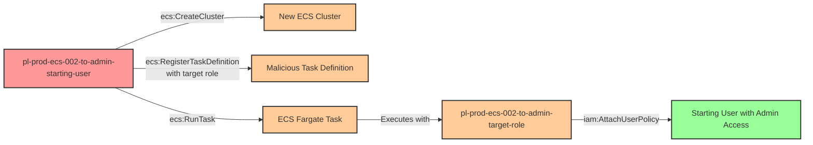

# Privilege Escalation via iam:PassRole + ecs:CreateCluster + ecs:RegisterTaskDefinition + ecs:RunTask

* **Category:** Privilege Escalation
* **Sub-Category:** new-passrole
* **Path Type:** one-hop
* **Target:** to-admin
* **Environments:** prod
* **Technique:** Passing a privileged role to an attacker-controlled ECS task to gain administrative access

## Overview

This scenario demonstrates a sophisticated privilege escalation vulnerability where a user with ECS cluster creation and task execution permissions can escalate to administrative privileges by passing a privileged role to a containerized workload they control. Unlike scenarios where the attacker assumes an existing ECS cluster, this attack requires the attacker to create their own infrastructure from scratch.

The attack chain combines four AWS permissions: `ecs:CreateCluster` to establish container infrastructure, `iam:PassRole` to attach a privileged role, `ecs:RegisterTaskDefinition` to define a malicious container, and `ecs:RunTask` to execute it. The containerized workload then uses the passed administrative role to modify IAM permissions, granting the original attacker permanent administrative access.

This attack pattern is particularly dangerous because it exploits the trust organizations place in containerized workloads. Many organizations grant broad ECS permissions to developers or CI/CD systems, not realizing that combining cluster creation with role passing capabilities creates a complete privilege escalation path. The use of AWS Fargate makes this attack even more accessible, as it requires no EC2 infrastructure or additional networking setup beyond a default VPC.

## Understanding the attack scenario

### Principals in the attack path

- `arn:aws:iam::PROD_ACCOUNT:user/pl-prod-ecs-002-to-admin-starting-user` (Scenario-specific starting user with ECS and PassRole permissions)
- `arn:aws:iam::PROD_ACCOUNT:role/pl-prod-ecs-002-to-admin-target-role` (Privileged role passed to the ECS task)

### Attack Path Diagram



### Attack Steps

1. **Initial Access**: Start as `pl-prod-ecs-002-to-admin-starting-user` (credentials provided via Terraform outputs)
2. **Create ECS Cluster**: Use `ecs:CreateCluster` to establish a new container execution environment
3. **Register Task Definition**: Use `ecs:RegisterTaskDefinition` to define a container that will execute with the privileged target role, specifying `iam:PassRole` to attach the role
4. **Execute Task**: Use `ecs:RunTask` with Fargate launch type to execute the malicious container
5. **Container Escalation**: The running task uses the passed administrative role to attach the AdministratorAccess policy to the starting user
6. **Verification**: Verify administrator access by listing IAM users or performing other admin-level actions

### Scenario specific resources created

| ARN | Purpose |
| -- | -- |
| `arn:aws:iam::PROD_ACCOUNT:user/pl-prod-ecs-002-to-admin-starting-user` | Scenario-specific starting user with access keys, ECS cluster creation, task definition registration, and task execution permissions |
| `arn:aws:iam::PROD_ACCOUNT:role/pl-prod-ecs-002-to-admin-target-role` | Privileged role with administrative permissions that can be passed to ECS tasks |

## Executing the attack

### Using the automated demo_attack.sh

To demonstrate the privilege escalation path, run the provided demo script:

```bash
cd modules/scenarios/single-account/privesc-one-hop/to-admin/ecs-002-iam-passrole+ecs-createcluster+ecs-registertaskdefinition+ecs-runtask
./demo_attack.sh
```

The script will:
1. Display a step-by-step walkthrough with color-coded output
2. Show the commands being executed and their results
3. Verify successful privilege escalation
4. Output standardized test results for automation

### Cleaning up the attack artifacts

After demonstrating the attack, clean up the ECS resources and IAM policy attachments created during the demo:

```bash
cd modules/scenarios/single-account/privesc-one-hop/to-admin/ecs-002-iam-passrole+ecs-createcluster+ecs-registertaskdefinition+ecs-runtask
./cleanup_attack.sh
```

The cleanup script will:
- Detach the AdministratorAccess policy from the starting user
- Stop any running ECS tasks
- Deregister the malicious task definition
- Delete the created ECS cluster

## Detection and prevention

### MITRE ATT&CK Mapping

- **Tactic**: TA0004 - Privilege Escalation, TA0002 - Execution
- **Technique**: T1078.004 - Valid Accounts: Cloud Accounts
- **Technique**: T1610 - Deploy Container

## Prevention recommendations

- Implement strict separation of duties - never grant both `iam:PassRole` and ECS execution permissions (`ecs:CreateCluster`, `ecs:RunTask`) to the same principal
- Use resource-based conditions on `iam:PassRole` to restrict which roles can be passed: `"Condition": {"StringEquals": {"iam:PassedToService": "ecs-tasks.amazonaws.com"}}`
- Implement Service Control Policies (SCPs) to prevent passing administrative or privileged roles to ECS tasks
- Restrict `ecs:CreateCluster` permissions to infrastructure teams only - most developers should use existing clusters
- Monitor CloudTrail for suspicious ECS activity patterns: rapid cluster creation followed by task execution, especially in non-standard regions
- Use IAM Access Analyzer to identify roles with administrative permissions that can be passed to compute services
- Implement tag-based access control requiring specific tags on roles before they can be passed to ECS tasks
- Enable Amazon GuardDuty ECS Runtime Monitoring to detect suspicious container behavior
- Use VPC Flow Logs and container logging to monitor network activity from ECS tasks
- Require approval workflows for IAM roles that grant both PassRole and ECS execution permissions
- Consider using AWS Service Catalog to provide pre-approved ECS deployment patterns instead of raw API access
