# Privilege Escalation via iam:PassRole + ecs:RegisterTaskDefinition + ecs:CreateService

* **Category:** Privilege Escalation
* **Sub-Category:** new-passrole
* **Path Type:** one-hop
* **Target:** to-admin
* **Environments:** prod
* **Cost Estimate:** $0/mo
* **Pathfinding.cloud ID:** ecs-003
* **Technique:** ECS service creation with admin role to grant starting user administrative access through persistent task execution
* **Terraform Variable:** `enable_single_account_privesc_one_hop_to_admin_ecs_003_iam_passrole_ecs_registertaskdefinition_ecs_createservice`
* **Schema Version:** 1.0.0
* **Attack Path:** starting_user → (ecs:RegisterTaskDefinition with admin role) → (ecs:CreateService) → ECS service launches task that attaches admin policy to starting user → admin access
* **Attack Principals:** `arn:aws:iam::{account_id}:user/pl-prod-ecs-003-to-admin-starting-user`; `arn:aws:iam::{account_id}:role/pl-prod-ecs-003-to-admin-target-role`
* **Required Permissions:** `iam:PassRole` on `arn:aws:iam::*:role/pl-prod-ecs-003-to-admin-target-role`; `ecs:RegisterTaskDefinition` on `*`; `ecs:CreateService` on `*`
* **Helpful Permissions:** `ecs:DescribeServices` (Monitor service status and verify service creation); `ecs:DescribeTasks` (Monitor task execution status and verify task completion); `ecs:DeleteService` (Clean up ECS service after demonstration); `ecs:UpdateService` (Scale down service or force new deployment during cleanup); `ecs:DeregisterTaskDefinition` (Clean up task definition after demonstration); `ecs:StopTask` (Stop running tasks during cleanup); `ec2:DescribeVpcs` (Find default VPC for ECS service network configuration); `ec2:DescribeSubnets` (Find subnet in default VPC for ECS service network configuration); `iam:DetachUserPolicy` (Remove admin policy from starting user during cleanup); `iam:ListAttachedUserPolicies` (Verify privilege escalation success by listing attached policies)
* **MITRE Tactics:** TA0004 - Privilege Escalation, TA0002 - Execution, TA0003 - Persistence
* **MITRE Techniques:** T1078.004 - Valid Accounts: Cloud Accounts, T1610 - Deploy Container

## Attack Overview

This scenario demonstrates a privilege escalation vulnerability where a user has permissions to pass IAM roles to ECS tasks (`iam:PassRole`), register ECS task definitions (`ecs:RegisterTaskDefinition`), and create ECS services (`ecs:CreateService`). The attacker can create a malicious ECS task definition that uses an administrative execution role, then deploy it as a long-running service on AWS Fargate to modify IAM permissions and grant themselves administrator access.

ECS services provide persistent, continuously running container workloads where tasks receive temporary credentials based on their task execution role. Unlike one-time task execution with `ecs:RunTask`, services are designed for long-running operations and automatically restart tasks if they fail. By combining `iam:PassRole` with ECS service creation permissions, an attacker can establish persistent privileged access that appears legitimate in production environments where ECS services are expected to run continuously.

The attack works by registering a task definition that specifies an admin role and contains a containerized AWS CLI command to attach the AdministratorAccess policy to the starting user. When deployed as an ECS service on Fargate, the task executes with the admin role's credentials and persistently elevates the attacker's privileges. This technique provides both privilege escalation and persistence, making it particularly dangerous as the service will continue running until explicitly stopped, and can even recover from failures automatically.

### MITRE ATT&CK Mapping

- **Tactic**: TA0004 - Privilege Escalation, TA0002 - Execution, TA0003 - Persistence
- **Technique**: T1078.004 - Valid Accounts: Cloud Accounts
- **Technique**: T1610 - Deploy Container

### Principals in the attack path

- `arn:aws:iam::PROD_ACCOUNT:user/pl-prod-ecs-003-to-admin-starting-user` (Scenario-specific starting user with PassRole and ECS permissions)
- `arn:aws:iam::PROD_ACCOUNT:role/pl-prod-ecs-003-to-admin-target-role` (Admin role passed to ECS service for task execution)

### Attack Path Diagram

```mermaid
graph LR
    A[pl-prod-ecs-003-to-admin-starting-user] -->|ecs:RegisterTaskDefinition with admin role| B[ECS Task Definition]
    B -->|ecs:CreateService| C[ECS Service]
    C -->|Launches persistent task| D[ECS Fargate Task]
    D -->|Executes with| E[pl-prod-ecs-003-to-admin-target-role]
    E -->|iam:AttachUserPolicy| F[pl-prod-ecs-003-to-admin-starting-user + AdministratorAccess]
    F --> G[Effective Administrator]

    style A fill:#ff9999,stroke:#333,stroke-width:2px
    style B fill:#ffcc99,stroke:#333,stroke-width:2px
    style C fill:#ffcc99,stroke:#333,stroke-width:2px
    style D fill:#ffcc99,stroke:#333,stroke-width:2px
    style E fill:#ffcc99,stroke:#333,stroke-width:2px
    style F fill:#ffcc99,stroke:#333,stroke-width:2px
    style G fill:#99ff99,stroke:#333,stroke-width:2px
```



### Attack Steps

1. **Initial Access**: Start as `pl-prod-ecs-003-to-admin-starting-user` (credentials provided via Terraform outputs)
2. **Register Task Definition**: Use `ecs:RegisterTaskDefinition` with `iam:PassRole` to create an ECS task definition that:
   - Uses the admin target role as the task execution role
   - Specifies a container with AWS CLI installed
   - Defines a command to attach AdministratorAccess policy to the starting user
3. **Create Service**: Use `ecs:CreateService` to deploy the task definition as a persistent service on AWS Fargate
4. **Policy Attachment**: The ECS service launches a task that runs with the admin role's credentials and attaches AdministratorAccess to the starting user
5. **Persistence Established**: The service continues running, maintaining the elevated privileges and automatically recovering if the task fails
6. **Verification**: Verify administrator access by listing IAM users with the starting user's credentials

### Scenario specific resources created

| ARN | Purpose |
| -- | -- |
| `arn:aws:iam::PROD_ACCOUNT:user/pl-prod-ecs-003-to-admin-starting-user` | Scenario-specific starting user with access keys and ECS permissions |
| `arn:aws:iam::PROD_ACCOUNT:role/pl-prod-ecs-003-to-admin-target-role` | Admin role that can be passed to ECS services (trusts ecs-tasks.amazonaws.com) |
| `arn:aws:ecs:REGION:PROD_ACCOUNT:cluster/pl-prod-ecs-003-cluster` | ECS cluster for running Fargate services |

## Attack Lab

### Prerequisites

1. Install the `plabs` CLI:
   ```bash
   brew install pathfinding-labs/tap/plabs
   ```
2. Configure your AWS profiles in `~/.plabs/plabs.yaml` (or run `plabs init` if you haven't already)

### Deploy with plabs non-interactive

```bash
plabs enable enable_single_account_privesc_one_hop_to_admin_ecs_003_iam_passrole_ecs_registertaskdefinition_ecs_createservice
plabs apply
```

### Deploy with plabs tui

1. Launch the TUI: `plabs`
2. Navigate to this scenario in the scenarios list
3. Press `space` to enable it
4. Press `d` to deploy

### Executing the automated demo_attack script

The script will:
1. Display a step-by-step walkthrough with color-coded output
2. Show the commands being executed and their results
3. Verify successful privilege escalation
4. Output standardized test results for automation

#### Resources created by attack script

- ECS task definition (`pl-prod-ecs-003-task-def`) registered with the admin target role
- ECS service (`pl-prod-ecs-003-service`) deployed on AWS Fargate
- `AdministratorAccess` policy attached to `pl-prod-ecs-003-to-admin-starting-user`

#### With plabs non-interactive

```bash
plabs demo --list
plabs demo ecs-003-iam-passrole+ecs-registertaskdefinition+ecs-createservice
```

#### With plabs tui

1. Launch the TUI: `plabs`
2. Navigate to this scenario in the scenarios list
3. Press `r` to run the demo script

### Cleanup

After demonstrating the attack, clean up the ECS service, task definition, running tasks, and detach the AdministratorAccess policy from the starting user.

**Note**: The cleanup process requires deleting the ECS service first before deregistering the task definition. The service will stop all running tasks automatically when deleted.

#### With plabs non-interactive

```bash
plabs cleanup --list
plabs cleanup ecs-003-iam-passrole+ecs-registertaskdefinition+ecs-createservice
```

#### With plabs tui

1. Launch the TUI: `plabs`
2. Navigate to this scenario in the scenarios list
3. Press `c` to run the cleanup script

### Teardown with plabs non-interactive

```bash
plabs disable enable_single_account_privesc_one_hop_to_admin_ecs_003_iam_passrole_ecs_registertaskdefinition_ecs_createservice
plabs apply
```

### Teardown with plabs tui

1. Launch the TUI: `plabs`
2. Navigate to this scenario in the scenarios list
3. Press `space` to disable it
4. Press `D` to destroy

## Detecting Misconfiguration (CSPM)

### What CSPM tools should detect

- IAM user (`pl-prod-ecs-003-to-admin-starting-user`) has `iam:PassRole` permission targeting a role with administrative privileges
- IAM user has `ecs:RegisterTaskDefinition` and `ecs:CreateService` permissions, enabling privilege escalation through ECS service deployment
- IAM role (`pl-prod-ecs-003-to-admin-target-role`) can be passed to ECS tasks (`ecs-tasks.amazonaws.com` as trusted principal) and holds administrative permissions
- Combination of `iam:PassRole` + `ecs:RegisterTaskDefinition` + `ecs:CreateService` represents a privilege escalation path to admin
- ECS cluster exists with no guardrails preventing deployment of task definitions with highly privileged roles

### Prevention recommendations

- Restrict `iam:PassRole` permissions using resource-based conditions to limit which roles can be passed and to which AWS services
- Implement condition keys like `iam:PassedToService` with value `ecs-tasks.amazonaws.com` to explicitly control PassRole usage
- Avoid granting broad `ecs:RegisterTaskDefinition` and `ecs:CreateService` permissions; use resource tags or naming patterns to limit service operations
- Implement Service Control Policies (SCPs) that prevent passing roles with administrative permissions to ECS services
- Use IAM Access Analyzer to identify privilege escalation paths involving PassRole combined with ECS operations
- Enable AWS Config rules to detect ECS task definitions and services with overly permissive execution roles
- Implement IAM permission boundaries on users to limit the maximum permissions that can be attached
- Require approval workflows for ECS services that reference privileged IAM roles or run in production environments

## Detection Abuse (CloudSIEM)

### CloudTrail events to monitor

- `IAM: PassRole` — Role passed to ECS task definition; critical when the target role has administrative permissions
- `ECS: RegisterTaskDefinition` — New ECS task definition registered; high severity when the task execution role has elevated privileges
- `ECS: CreateService` — ECS service created; review task definition to confirm it uses expected roles
- `ECS: RunTask` — ECS task launched; correlate with prior RegisterTaskDefinition and CreateService events
- `IAM: AttachUserPolicy` — Policy attached to a user; critical when the source principal is an ECS task role and the policy is AdministratorAccess

### Detonation logs

_Detonation log integration (Stratus Red Team / Grimoire) is planned for a future release._
