# Privilege Escalation via iam:PassRole + ecs:RegisterTaskDefinition + ecs:CreateService

* **Category:** Privilege Escalation
* **Sub-Category:** service-passrole
* **Path Type:** one-hop
* **Target:** to-admin
* **Environments:** prod
* **Technique:** ECS service creation with admin role to grant starting user administrative access through persistent task execution

## Overview

This scenario demonstrates a privilege escalation vulnerability where a user has permissions to pass IAM roles to ECS tasks (`iam:PassRole`), register ECS task definitions (`ecs:RegisterTaskDefinition`), and create ECS services (`ecs:CreateService`). The attacker can create a malicious ECS task definition that uses an administrative execution role, then deploy it as a long-running service on AWS Fargate to modify IAM permissions and grant themselves administrator access.

ECS services provide persistent, continuously running container workloads where tasks receive temporary credentials based on their task execution role. Unlike one-time task execution with `ecs:RunTask`, services are designed for long-running operations and automatically restart tasks if they fail. By combining `iam:PassRole` with ECS service creation permissions, an attacker can establish persistent privileged access that appears legitimate in production environments where ECS services are expected to run continuously.

The attack works by registering a task definition that specifies an admin role and contains a containerized AWS CLI command to attach the AdministratorAccess policy to the starting user. When deployed as an ECS service on Fargate, the task executes with the admin role's credentials and persistently elevates the attacker's privileges. This technique provides both privilege escalation and persistence, making it particularly dangerous as the service will continue running until explicitly stopped, and can even recover from failures automatically.

## Understanding the attack scenario

### Principals in the attack path

- `arn:aws:iam::PROD_ACCOUNT:user/pl-prod-ecs-003-to-admin-starting-user` (Scenario-specific starting user with PassRole and ECS permissions)
- `arn:aws:iam::PROD_ACCOUNT:role/pl-prod-ecs-003-to-admin-target-role` (Admin role passed to ECS service for task execution)

### Attack Path Diagram

```mermaid
graph LR
    A[pl-prod-ecs-003-to-admin-starting-user] -->|ecs:RegisterTaskDefinition with admin role| B[ECS Task Definition]
    B -->|ecs:CreateService| C[ECS Service]
    C -->|Launches persistent task| D[ECS Fargate Task]
    D -->|Executes with| E[pl-prod-ecs-003-to-admin-target-role]
    E -->|iam:AttachUserPolicy| F[pl-prod-ecs-003-to-admin-starting-user + AdministratorAccess]
    F --> G[Effective Administrator]

    style A fill:#ff9999,stroke:#333,stroke-width:2px
    style B fill:#ffcc99,stroke:#333,stroke-width:2px
    style C fill:#ffcc99,stroke:#333,stroke-width:2px
    style D fill:#ffcc99,stroke:#333,stroke-width:2px
    style E fill:#ffcc99,stroke:#333,stroke-width:2px
    style F fill:#ffcc99,stroke:#333,stroke-width:2px
    style G fill:#99ff99,stroke:#333,stroke-width:2px
```



### Attack Steps

1. **Initial Access**: Start as `pl-prod-ecs-003-to-admin-starting-user` (credentials provided via Terraform outputs)
2. **Register Task Definition**: Use `ecs:RegisterTaskDefinition` with `iam:PassRole` to create an ECS task definition that:
   - Uses the admin target role as the task execution role
   - Specifies a container with AWS CLI installed
   - Defines a command to attach AdministratorAccess policy to the starting user
3. **Create Service**: Use `ecs:CreateService` to deploy the task definition as a persistent service on AWS Fargate
4. **Policy Attachment**: The ECS service launches a task that runs with the admin role's credentials and attaches AdministratorAccess to the starting user
5. **Persistence Established**: The service continues running, maintaining the elevated privileges and automatically recovering if the task fails
6. **Verification**: Verify administrator access by listing IAM users with the starting user's credentials

### Scenario specific resources created

| ARN | Purpose |
| -- | -- |
| `arn:aws:iam::PROD_ACCOUNT:user/pl-prod-ecs-003-to-admin-starting-user` | Scenario-specific starting user with access keys and ECS permissions |
| `arn:aws:iam::PROD_ACCOUNT:role/pl-prod-ecs-003-to-admin-target-role` | Admin role that can be passed to ECS services (trusts ecs-tasks.amazonaws.com) |
| `arn:aws:ecs:REGION:PROD_ACCOUNT:cluster/pl-prod-ecs-003-cluster` | ECS cluster for running Fargate services |

## Executing the attack

### Using the automated demo_attack.sh

To demonstrate the privilege escalation path, run the provided demo script:

```bash
cd modules/scenarios/single-account/privesc-one-hop/to-admin/ecs-003-iam-passrole+ecs-registertaskdefinition+ecs-createservice
./demo_attack.sh
```

The script will:
1. Display a step-by-step walkthrough with color-coded output
2. Show the commands being executed and their results
3. Verify successful privilege escalation
4. Output standardized test results for automation

### Cleaning up the attack artifacts

After demonstrating the attack, clean up the ECS service, task definition, running tasks, and detach the AdministratorAccess policy from the starting user:

```bash
cd modules/scenarios/single-account/privesc-one-hop/to-admin/ecs-003-iam-passrole+ecs-registertaskdefinition+ecs-createservice
./cleanup_attack.sh
```

**Note**: The cleanup process requires deleting the ECS service first before deregistering the task definition. The service will stop all running tasks automatically when deleted.

## Detection and prevention


### MITRE ATT&CK Mapping

- **Tactic**: TA0004 - Privilege Escalation, TA0002 - Execution, TA0003 - Persistence
- **Technique**: T1078.004 - Valid Accounts: Cloud Accounts
- **Technique**: T1610 - Deploy Container


## Prevention recommendations

- Restrict `iam:PassRole` permissions using resource-based conditions to limit which roles can be passed and to which AWS services
- Implement condition keys like `iam:PassedToService` with value `ecs-tasks.amazonaws.com` to explicitly control PassRole usage
- Avoid granting broad `ecs:RegisterTaskDefinition` and `ecs:CreateService` permissions; use resource tags or naming patterns to limit service operations
- Monitor CloudTrail for `RegisterTaskDefinition` and `CreateService` events where task roles have administrative privileges
- Implement Service Control Policies (SCPs) that prevent passing roles with administrative permissions to ECS services
- Use IAM Access Analyzer to identify privilege escalation paths involving PassRole combined with ECS operations
- Enable AWS Config rules to detect ECS task definitions and services with overly permissive execution roles
- Alert on `AttachUserPolicy` and `PutUserPolicy` API calls, especially when the principal is an ECS task role
- Implement IAM permission boundaries on users to limit the maximum permissions that can be attached
- Require approval workflows for ECS services that reference privileged IAM roles or run in production environments
- Use VPC Flow Logs and CloudWatch Logs to monitor ECS service network activity and command execution
- Restrict ECS cluster access using resource-based policies and condition keys to enforce least privilege
- Monitor for long-running ECS services that execute brief tasks, as this may indicate persistence mechanisms
- Alert on ECS services with low task restart counts combined with IAM permission modification events
