# Privilege Escalation via iam:PassRole + ecs:RegisterTaskDefinition + ecs:StartTask

* **Category:** Privilege Escalation
* **Sub-Category:** new-passrole
* **Path Type:** one-hop
* **Target:** to-admin
* **Environments:** prod
* **Cost Estimate:** $8/mo
* **Pathfinding.cloud ID:** ecs-005
* **Technique:** ECS EC2 task execution with admin role using ecs:StartTask to grant starting user administrative access
* **Terraform Variable:** `enable_single_account_privesc_one_hop_to_admin_ecs_005_iam_passrole_ecs_registertaskdefinition_ecs_starttask`
* **Schema Version:** 1.0.0
* **Attack Path:** starting_user → (ecs:RegisterTaskDefinition with admin role) → (ecs:StartTask) → ECS task attaches admin policy to starting user → admin access
* **Attack Principals:** `arn:aws:iam::{account_id}:user/pl-prod-ecs-005-to-admin-starting-user`; `arn:aws:iam::{account_id}:role/pl-prod-ecs-005-to-admin-target-role`
* **Required Permissions:** `iam:PassRole` on `arn:aws:iam::*:role/pl-prod-ecs-005-to-admin-target-role`; `ecs:RegisterTaskDefinition` on `*`; `ecs:StartTask` on `*`
* **Helpful Permissions:** `ecs:ListContainerInstances` (Retrieve container instance ARN for StartTask command); `ecs:DescribeTasks` (Monitor task execution status and verify task completion); `ecs:DeregisterTaskDefinition` (Clean up task definition after demonstration); `ecs:StopTask` (Stop running tasks during cleanup); `ec2:DescribeVpcs` (Find default VPC for ECS task network configuration); `ec2:DescribeSubnets` (Find subnet in default VPC for ECS task network configuration); `iam:DetachUserPolicy` (Remove admin policy from starting user during cleanup); `iam:ListAttachedUserPolicies` (Verify privilege escalation success by listing attached policies)
* **MITRE Tactics:** TA0004 - Privilege Escalation, TA0002 - Execution
* **MITRE Techniques:** T1078.004 - Valid Accounts: Cloud Accounts, T1610 - Deploy Container

## Attack Overview

This scenario demonstrates a privilege escalation vulnerability where a user has permissions to pass IAM roles to ECS tasks (`iam:PassRole`), register ECS task definitions (`ecs:RegisterTaskDefinition`), and start ECS tasks (`ecs:StartTask`). The attacker can create a malicious ECS task definition that uses an administrative execution role, then launch it on EC2 container instances to modify IAM permissions and grant themselves administrator access.

**Note:** The `ecs:StartTask` permission specifically requires ECS tasks to be launched on EC2 container instances that you manage, unlike `ecs:RunTask` which can use serverless Fargate. This makes `ecs:StartTask` less flexible but may be overlooked during security reviews.

The key difference between `ecs:StartTask` and the more common `ecs:RunTask` is their intended use case. While `ecs:RunTask` is the standard way to launch tasks and automatically places them within the cluster, `ecs:StartTask` is designed for tasks managed by external schedulers or custom task placement logic. However, both permissions provide the same capability: executing containers with potentially elevated privileges. In practice, `ecs:StartTask` may be overlooked during security reviews because it's less commonly used than `ecs:RunTask`, making it a subtle but effective privilege escalation vector.

ECS tasks running on EC2 container instances receive temporary credentials based on their task execution role. By combining `iam:PassRole` with ECS task definition registration and task start permissions, an attacker can leverage the container platform to run arbitrary code with elevated privileges. ECS tasks are ephemeral, execute quickly, and leave minimal forensic evidence beyond CloudTrail logs.

The attack works by registering a task definition that specifies an admin role and contains a containerized AWS CLI command to attach the AdministratorAccess policy to the starting user. When the task starts on an EC2 container instance, it executes with the admin role's credentials and persistently elevates the attacker's privileges. This technique is particularly stealthy because ECS tasks can complete in seconds and automatically clean up their infrastructure.

### MITRE ATT&CK Mapping

- **Tactic**: TA0004 - Privilege Escalation, TA0002 - Execution
- **Technique**: T1078.004 - Valid Accounts: Cloud Accounts
- **Technique**: T1610 - Deploy Container

### Principals in the attack path

- `arn:aws:iam::PROD_ACCOUNT:user/pl-prod-ecs-005-to-admin-starting-user` (Scenario-specific starting user with PassRole and ECS permissions)
- `arn:aws:iam::PROD_ACCOUNT:role/pl-prod-ecs-005-to-admin-target-role` (Admin role passed to ECS task for execution)

### Attack Path Diagram

```mermaid
graph LR
    A[pl-prod-ecs-005-to-admin-starting-user] -->|ecs:RegisterTaskDefinition with admin role| B[ECS Task Definition]
    B -->|ecs:StartTask| C[ECS Task on EC2]
    C -->|Executes with| D[pl-prod-ecs-005-to-admin-target-role]
    D -->|iam:AttachUserPolicy| E[pl-prod-ecs-005-to-admin-starting-user + AdministratorAccess]
    E --> F[Effective Administrator]

    style A fill:#ff9999,stroke:#333,stroke-width:2px
    style B fill:#ffcc99,stroke:#333,stroke-width:2px
    style C fill:#ffcc99,stroke:#333,stroke-width:2px
    style D fill:#ffcc99,stroke:#333,stroke-width:2px
    style E fill:#ffcc99,stroke:#333,stroke-width:2px
    style F fill:#99ff99,stroke:#333,stroke-width:2px
```



### Attack Steps

1. **Initial Access**: Start as `pl-prod-ecs-005-to-admin-starting-user` (credentials provided via Terraform outputs)
2. **Register Task Definition**: Use `ecs:RegisterTaskDefinition` with `iam:PassRole` to create an ECS task definition that:
   - Uses the admin target role as the task execution role
   - Specifies a container with AWS CLI installed
   - Defines a command to attach AdministratorAccess policy to the starting user
3. **Launch Task**: Use `ecs:StartTask` to execute the task on an EC2 container instance
4. **Policy Attachment**: The ECS task runs with the admin role's credentials and attaches AdministratorAccess to the starting user
5. **Verification**: Verify administrator access by listing IAM users with the starting user's credentials

### Scenario specific resources created

| ARN | Purpose |
| -- | -- |
| `arn:aws:iam::PROD_ACCOUNT:user/pl-prod-ecs-005-to-admin-starting-user` | Scenario-specific starting user with access keys and ECS permissions |
| `arn:aws:iam::PROD_ACCOUNT:role/pl-prod-ecs-005-to-admin-target-role` | Admin role that can be passed to ECS tasks (trusts ecs-tasks.amazonaws.com) |
| `arn:aws:ecs:REGION:PROD_ACCOUNT:cluster/pl-prod-ecs-005-cluster` | ECS cluster for running tasks on EC2 instances |
| `arn:aws:ec2:REGION:PROD_ACCOUNT:instance/INSTANCE_ID` | EC2 container instance registered with the ECS cluster |
| `arn:aws:iam::PROD_ACCOUNT:role/pl-prod-ecs-005-to-admin-instance-role` | IAM role for the EC2 instance (allows ECS agent to function) |

## Attack Lab

### Prerequisites

1. Install the `plabs` CLI:
   ```bash
   brew install pathfinding-labs/tap/plabs
   ```
2. Configure your AWS profiles in `~/.plabs/plabs.yaml` (or run `plabs init` if you haven't already)

### Deploy with plabs non-interactive

```bash
plabs enable enable_single_account_privesc_one_hop_to_admin_ecs_005_iam_passrole_ecs_registertaskdefinition_ecs_starttask
plabs apply
```

### Deploy with plabs tui

1. Launch the TUI: `plabs`
2. Navigate to this scenario in the scenarios list
3. Press `space` to enable it
4. Press `d` to deploy

### Executing the automated demo_attack script

The script will:
1. Display a step-by-step walkthrough with color-coded output
2. Show the commands being executed and their results
3. Verify successful privilege escalation
4. Output standardized test results for automation

#### Resources created by attack script

- ECS task definition referencing the admin target role
- AdministratorAccess policy attached to the starting user

#### With plabs non-interactive

```bash
plabs demo --list
plabs demo ecs-005-iam-passrole+ecs-registertaskdefinition+ecs-starttask
```

#### With plabs tui

1. Launch the TUI: `plabs`
2. Navigate to this scenario in the scenarios list
3. Press `r` to run the demo script

### Cleanup

#### With plabs non-interactive

```bash
plabs cleanup --list
plabs cleanup ecs-005-iam-passrole+ecs-registertaskdefinition+ecs-starttask
```

#### With plabs tui

1. Launch the TUI: `plabs`
2. Navigate to this scenario in the scenarios list
3. Press `c` to run the cleanup script

### Teardown with plabs non-interactive

```bash
plabs disable enable_single_account_privesc_one_hop_to_admin_ecs_005_iam_passrole_ecs_registertaskdefinition_ecs_starttask
plabs apply
```

### Teardown with plabs tui

1. Launch the TUI: `plabs`
2. Navigate to this scenario in the scenarios list
3. Press `space` to disable it
4. Press `D` to destroy

## Detecting Misconfiguration (CSPM)

### What CSPM tools should detect

- IAM user has `iam:PassRole` permission to an admin role trusted by `ecs-tasks.amazonaws.com`
- IAM user has `ecs:RegisterTaskDefinition` and `ecs:StartTask` permissions, enabling container-based privilege escalation
- ECS task execution role has administrative permissions (`AdministratorAccess` or equivalent)
- Privilege escalation path exists: starting user can register an ECS task definition with an admin role and launch it on cluster instances

### Prevention recommendations

- Restrict `iam:PassRole` permissions using resource-based conditions to limit which roles can be passed and to which AWS services
- Implement condition keys like `iam:PassedToService` with value `ecs-tasks.amazonaws.com` to explicitly control PassRole usage
- Avoid granting broad `ecs:RegisterTaskDefinition` and `ecs:StartTask` permissions; use resource tags or naming patterns to limit task operations
- Implement Service Control Policies (SCPs) that prevent passing roles with administrative permissions to ECS tasks
- Use IAM Access Analyzer to identify privilege escalation paths involving PassRole combined with ECS operations
- Enable AWS Config rules to detect ECS task definitions with overly permissive execution roles
- Implement IAM permission boundaries on users to limit the maximum permissions that can be attached
- Pay special attention to `ecs:StartTask` permissions as they are less common than `ecs:RunTask` and may be overlooked in security reviews

## Detection Abuse (CloudSIEM)

### CloudTrail events to monitor

- `IAM: PassRole` — Role passed to ECS task definition; critical when the target role has administrative permissions
- `ECS: RegisterTaskDefinition` — New task definition registered; high severity when the task execution role has elevated permissions
- `ECS: StartTask` — Task launched on EC2 container instance; investigate when combined with a recently registered task definition using a privileged role
- `IAM: AttachUserPolicy` — Policy attached to an IAM user; critical when the source principal is an ECS task role and the policy is AdministratorAccess

### Detonation logs

_Detonation log integration (Stratus Red Team / Grimoire) is planned for a future release._
