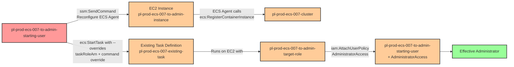

# Privilege Escalation via iam:PassRole + ecs:StartTask + ecs:RegisterContainerInstance

* **Category:** Privilege Escalation
* **Sub-Category:** new-passrole
* **Path Type:** one-hop
* **Target:** to-admin
* **Environments:** prod
* **Cost Estimate:** $8/mo
* **Pathfinding.cloud ID:** ecs-007
* **Technique:** Registering an unregistered EC2 instance to an ECS cluster via SSM, then using ecs:StartTask with --overrides to launch an existing task definition with an admin role and malicious command
* **Terraform Variable:** `enable_single_account_privesc_one_hop_to_admin_ecs_007_iam_passrole_ecs_starttask_ecs_registercontainerinstance`
* **Schema Version:** 1.0.0
* **Attack Path:** instance_role (RCE on EC2) -> ecs:RegisterContainerInstance (direct API call with IMDS identity docs) -> reconfigure ECS agent -> ecs:StartTask with --overrides (iam:PassRole admin role + command override) -> ECS task attaches admin policy to instance role -> admin access
* **Attack Principals:** `arn:aws:iam::{account_id}:role/pl-prod-ecs-007-to-admin-instance-role`; `arn:aws:iam::{account_id}:role/pl-prod-ecs-007-to-admin-target-role`
* **Required Permissions:** `ecs:RegisterContainerInstance` on `*`; `ecs:StartTask` on `*`; `iam:PassRole` on `arn:aws:iam::*:role/pl-prod-ecs-007-to-admin-target-role, arn:aws:iam::*:role/pl-prod-ecs-007-to-admin-execution-role`; `ecs:DeregisterContainerInstance` on `*`
* **Helpful Permissions:** `ecs:ListContainerInstances` (Verify container instance registered and retrieve its ARN); `ecs:ListTaskDefinitions` (Discover existing task definitions to exploit); `ecs:DescribeTasks` (Monitor task execution status and verify task completion)
* **MITRE Tactics:** TA0004 - Privilege Escalation, TA0002 - Execution
* **MITRE Techniques:** T1078.004 - Valid Accounts: Cloud Accounts, T1610 - Deploy Container

## Attack Overview

This scenario demonstrates a privilege escalation vulnerability where a user with `iam:PassRole`, `ecs:StartTask`, and `ssm:SendCommand` permissions can escalate to administrator access by registering an unregistered EC2 instance to an ECS cluster and then launching a task with overridden role and command parameters. The key insight is that an ECS-optimized EC2 instance that is not yet registered to any cluster can be remotely reconfigured via SSM to join a target cluster, after which the attacker can place arbitrary workloads on it with elevated privileges.

This attack path builds on [research by Tom McLean at Reverse Security](https://labs.reversec.com/posts/2025/08/another-ecs-privilege-escalation-path), which identified that the `ecs:StartTask` API accepts a `taskRoleArn` override that allows the caller to substitute a privileged role at runtime. What makes ECS-007 distinct from other ECS privilege escalation scenarios is the requirement to first register a container instance. Unlike ECS-009 (which assumes a container instance is already registered in the cluster), this scenario starts with an empty cluster and an unregistered EC2 instance. The attacker must bridge this gap by using `ssm:SendCommand` to reconfigure the ECS agent on the EC2 instance, causing it to call `ecs:RegisterContainerInstance` and join the target cluster. Unlike ECS-005 (which requires `ecs:RegisterTaskDefinition`), no new task definition is created -- the attacker exploits an existing one using `--overrides`.

This scenario is particularly dangerous in environments where EC2 instances with the ECS agent are provisioned but not immediately assigned to clusters, or where SSM access is broadly granted. Because the attack does not create a new task definition, traditional detection strategies that focus on `RegisterTaskDefinition` events will miss it. The combination of SSM-based instance reconfiguration and ECS task override exploitation represents a realistic and stealthy privilege escalation path that organizations should actively monitor for.

### MITRE ATT&CK Mapping

- **Tactic**: TA0004 - Privilege Escalation, TA0002 - Execution
- **Technique**: T1078.004 - Valid Accounts: Cloud Accounts
- **Technique**: T1610 - Deploy Container

### Principals in the attack path

- `arn:aws:iam::PROD_ACCOUNT:user/pl-prod-ecs-007-to-admin-starting-user` (Scenario-specific starting user with iam:PassRole, ecs:StartTask, and ssm:SendCommand permissions)
- `arn:aws:iam::PROD_ACCOUNT:role/pl-prod-ecs-007-to-admin-target-role` (Admin role with AdministratorAccess, passed to ECS task via --overrides, trusts ecs-tasks.amazonaws.com)

### Attack Path Diagram



### Attack Steps

1. **Initial Access**: Start as `pl-prod-ecs-007-to-admin-starting-user` (credentials provided via Terraform outputs)
2. **Register Container Instance**: Use `ssm:SendCommand` to reconfigure the ECS agent on an unregistered EC2 instance, changing its `ECS_CLUSTER` setting to point to the target cluster `pl-prod-ecs-007-cluster`. The ECS agent restarts and calls `ecs:RegisterContainerInstance`, adding the instance to the cluster.
3. **Reconnaissance**: Discover existing ECS task definitions and verify the container instance registered successfully using `ecs:ListTaskDefinitions`, `ecs:ListContainerInstances`, and `ecs:ListClusters`
4. **Launch Task with Overrides**: Use `ecs:StartTask` with `--overrides` to launch the existing task definition `pl-prod-ecs-007-existing-task` with:
   - `taskRoleArn` overridden to specify the admin role `pl-prod-ecs-007-to-admin-target-role`
   - Container command overridden to execute an AWS CLI command that attaches AdministratorAccess to the starting user
5. **Task Execution**: The ECS task runs on the newly-registered EC2 container instance with the admin role's credentials, executing the privilege escalation command
6. **Verification**: Verify administrator access by listing IAM users or performing other admin-level actions with the starting user's original credentials

### Scenario specific resources created

| ARN | Purpose |
| -- | -- |
| `arn:aws:iam::PROD_ACCOUNT:user/pl-prod-ecs-007-to-admin-starting-user` | Scenario-specific starting user with access keys, iam:PassRole, ecs:StartTask, and ssm:SendCommand permissions |
| `arn:aws:iam::PROD_ACCOUNT:role/pl-prod-ecs-007-to-admin-target-role` | Admin role with AdministratorAccess that can be passed to ECS tasks (trusts ecs-tasks.amazonaws.com) |
| `arn:aws:iam::PROD_ACCOUNT:role/pl-prod-ecs-007-to-admin-execution-role` | Task execution role for pulling container images and writing logs |
| `arn:aws:iam::PROD_ACCOUNT:role/pl-prod-ecs-007-to-admin-instance-role` | EC2 instance role with AmazonEC2ContainerServiceforEC2Role and AmazonSSMManagedInstanceCore policies |
| `arn:aws:ecs:REGION:PROD_ACCOUNT:cluster/pl-prod-ecs-007-cluster` | ECS cluster (starts empty with no registered container instances) |
| `arn:aws:ecs:REGION:PROD_ACCOUNT:task-definition/pl-prod-ecs-007-existing-task` | Pre-existing benign task definition that gets overridden at runtime |
| `arn:aws:ec2:REGION:PROD_ACCOUNT:instance/INSTANCE_ID` | ECS-optimized EC2 instance with ECS agent installed (NOT registered to any cluster until the demo runs) |

## Attack Lab

### Prerequisites

1. Install the `plabs` CLI:
   ```bash
   brew install pathfinding-labs/tap/plabs
   ```
2. Configure your AWS profiles in `~/.plabs/plabs.yaml` (or run `plabs init` if you haven't already)

### Deploy with plabs non-interactive

```bash
plabs enable enable_single_account_privesc_one_hop_to_admin_ecs_007_iam_passrole_ecs_starttask_ecs_registercontainerinstance
plabs apply
```

### Deploy with plabs tui

1. Launch the TUI: `plabs`
2. Navigate to this scenario in the scenarios list
3. Press `space` to enable it
4. Press `d` to deploy

### Executing the automated demo_attack script

The script will:
1. Display a step-by-step walkthrough with color-coded output
2. Show the commands being executed and their results
3. Verify successful privilege escalation
4. Output standardized test results for automation

#### Resources created by attack script

- AdministratorAccess policy attached to `pl-prod-ecs-007-to-admin-starting-user`
- ECS container instance registration for the EC2 instance in `pl-prod-ecs-007-cluster`
- ECS task launched on the container instance via `ecs:StartTask` with overrides

#### With plabs non-interactive

```bash
plabs demo --list
plabs demo ecs-007-iam-passrole+ecs-starttask+ecs-registercontainerinstance
```

#### With plabs tui

1. Launch the TUI: `plabs`
2. Navigate to this scenario in the scenarios list
3. Press `r` to run the demo script

### Cleanup

After demonstrating the attack, clean up the running ECS tasks, detach the AdministratorAccess policy from the starting user, and deregister the container instance from the cluster.

#### With plabs non-interactive

```bash
plabs cleanup --list
plabs cleanup ecs-007-iam-passrole+ecs-starttask+ecs-registercontainerinstance
```

#### With plabs tui

1. Launch the TUI: `plabs`
2. Navigate to this scenario in the scenarios list
3. Press `c` to run the cleanup script

### Teardown with plabs non-interactive

```bash
plabs disable enable_single_account_privesc_one_hop_to_admin_ecs_007_iam_passrole_ecs_starttask_ecs_registercontainerinstance
plabs apply
```

### Teardown with plabs tui

1. Launch the TUI: `plabs`
2. Navigate to this scenario in the scenarios list
3. Press `space` to disable it
4. Press `D` to destroy

## Detecting Misconfiguration (CSPM)

### What CSPM tools should detect

- IAM user or role has `iam:PassRole` permission granting access to a role with administrative privileges (e.g., `AdministratorAccess`), combined with `ecs:StartTask` — forming a privilege escalation path
- IAM principal has `ssm:SendCommand` permission on EC2 instances running the ECS agent, enabling remote reconfiguration of the ECS cluster assignment
- ECS task definition exists with no container-level resource restrictions, making it exploitable via `--overrides` at launch time
- EC2 instances with ECS agent installed are not assigned to any cluster, leaving them in an uncontrolled state susceptible to cluster hijacking via SSM

### Prevention recommendations

- Restrict `iam:PassRole` permissions using resource-based conditions to limit which roles can be passed; never allow PassRole to roles with administrative permissions
- Use the `iam:PassedToService` condition key with value `ecs-tasks.amazonaws.com` to control which services can receive passed roles, and combine it with resource ARN restrictions to limit which specific roles can be passed
- Restrict `ssm:SendCommand` access to specific instances and specific SSM documents using resource ARN conditions; avoid granting broad SendCommand permissions that allow arbitrary command execution on any instance
- Implement Service Control Policies (SCPs) that prevent passing roles with administrative permissions to ECS tasks
- Adopt a Lambda proxy pattern for ECS task launches (as recommended by the [original research](https://labs.reversec.com/posts/2025/08/another-ecs-privilege-escalation-path)) — instead of granting users direct `ecs:StartTask` permissions, route task launches through a Lambda function that validates and restricts overrides
- Use IAM Access Analyzer to identify privilege escalation paths involving PassRole combined with ECS StartTask and SSM SendCommand permissions
- Implement IAM permission boundaries on IAM users to cap the maximum permissions that can be attached, even if an escalation path is exploited

## Detection Abuse (CloudSIEM)

### CloudTrail events to monitor

- `SSM: SendCommand` — SSM command sent to an EC2 instance; suspicious when used to modify ECS agent configuration files or restart the ECS agent service
- `ECS: RegisterContainerInstance` — EC2 instance registered to an ECS cluster; unexpected registrations may indicate an attacker redirecting an unmanaged instance to a target cluster
- `ECS: StartTask` — ECS task started on a specific container instance; high severity when the request includes `overrides` with a `taskRoleArn` that differs from the task definition's default role
- `IAM: AttachUserPolicy` — Policy attached to an IAM user; critical when AdministratorAccess or similarly broad policies are attached during or immediately after ECS task execution

### Detonation logs

_Detonation log integration (Stratus Red Team / Grimoire) is planned for a future release._
