# Privilege Escalation via iam:PassRole + ecs:StartTask + ecs:RegisterContainerInstance (No RegisterTaskDefinition Required)

* **Category:** Privilege Escalation
* **Sub-Category:** new-passrole
* **Path Type:** one-hop
* **Target:** to-admin
* **Environments:** prod
* **Pathfinding.cloud ID:** ecs-007
* **Technique:** Overriding existing ECS task definition commands and task role via ecs:StartTask --overrides to escalate to admin without ecs:RegisterTaskDefinition

## Overview

This scenario demonstrates a privilege escalation vulnerability where a user with `iam:PassRole`, `ecs:StartTask`, and `ecs:RegisterContainerInstance` permissions can escalate to administrator access **without needing `ecs:RegisterTaskDefinition`**. This is a critical distinction from other ECS privilege escalation paths (ECS-001 through ECS-005), which all require the ability to register new task definitions. In this scenario, the attacker exploits the `--overrides` parameter of the `ecs:StartTask` API to hijack an existing task definition, overriding both the container command and the task role.

This attack path is based on [research by Tom McLean at Reverse Security](https://labs.reversec.com/posts/2025/08/another-ecs-privilege-escalation-path), which identified that the `ecs:StartTask` API accepts a `taskRoleArn` override that allows the caller to substitute a privileged role at runtime. Combined with a command override, the attacker can launch an existing benign task definition with completely different behavior and elevated permissions. Because no new task definition is created, traditional detection strategies that focus on `RegisterTaskDefinition` events will miss this attack entirely.

The `ecs:RegisterContainerInstance` permission allows the attacker to register new EC2 instances to an ECS cluster, which could be used to provide compute capacity for the malicious task. In this lab, an EC2 container instance is pre-registered for convenience, but in a real-world attack, the attacker could bring their own instance. The combination of these three permissions -- PassRole, StartTask, and RegisterContainerInstance -- creates a complete privilege escalation path that bypasses the most commonly discussed ECS escalation prerequisites. Security teams that have restricted `ecs:RegisterTaskDefinition` as a mitigation may still be vulnerable to this technique.

## Understanding the attack scenario

### Principals in the attack path

- `arn:aws:iam::PROD_ACCOUNT:user/pl-prod-ecs-007-to-admin-starting-user` (Scenario-specific starting user with PassRole, ECS StartTask, and RegisterContainerInstance permissions)
- `arn:aws:iam::PROD_ACCOUNT:role/pl-prod-ecs-007-to-admin-target-role` (Admin role passed to ECS task via --overrides, trusts ecs-tasks.amazonaws.com)

### Attack Path Diagram

```mermaid
graph LR
    A[pl-prod-ecs-007-to-admin-starting-user] -->|ecs:StartTask with --overrides<br/>taskRoleArn + command override| B[Existing Task Definition<br/>pl-prod-ecs-007-existing-task]
    B -->|Runs on EC2 with| C[pl-prod-ecs-007-to-admin-target-role]
    C -->|iam:AttachUserPolicy<br/>AdministratorAccess| D[pl-prod-ecs-007-to-admin-starting-user<br/>+ AdministratorAccess]
    D --> E[Effective Administrator]

    style A fill:#ff9999,stroke:#333,stroke-width:2px
    style B fill:#ffcc99,stroke:#333,stroke-width:2px
    style C fill:#ffcc99,stroke:#333,stroke-width:2px
    style D fill:#ffcc99,stroke:#333,stroke-width:2px
    style E fill:#99ff99,stroke:#333,stroke-width:2px
```



### Attack Steps

1. **Initial Access**: Start as `pl-prod-ecs-007-to-admin-starting-user` (credentials provided via Terraform outputs)
2. **Reconnaissance**: Discover existing ECS clusters, task definitions, and container instances using `ecs:ListClusters`, `ecs:ListTaskDefinitions`, and `ecs:ListContainerInstances`
3. **Launch Task with Overrides**: Use `ecs:StartTask` with `--overrides` to launch the existing task definition `pl-prod-ecs-007-existing-task` with:
   - `taskRoleArn` overridden to specify the admin role `pl-prod-ecs-007-to-admin-target-role`
   - Container command overridden to execute an AWS CLI command that attaches AdministratorAccess to the starting user
4. **Task Execution**: The ECS task runs on the pre-registered EC2 container instance with the admin role's credentials, executing the privilege escalation command
5. **Verification**: Verify administrator access by listing IAM users or performing other admin-level actions with the starting user's original credentials

### Scenario specific resources created

| ARN | Purpose |
| -- | -- |
| `arn:aws:iam::PROD_ACCOUNT:user/pl-prod-ecs-007-to-admin-starting-user` | Scenario-specific starting user with access keys, iam:PassRole, ecs:StartTask, and ecs:RegisterContainerInstance permissions |
| `arn:aws:iam::PROD_ACCOUNT:role/pl-prod-ecs-007-to-admin-target-role` | Admin role with AdministratorAccess that can be passed to ECS tasks (trusts ecs-tasks.amazonaws.com) |
| `arn:aws:iam::PROD_ACCOUNT:role/pl-prod-ecs-007-to-admin-execution-role` | Task execution role for pulling container images and writing logs |
| `arn:aws:ecs:REGION:PROD_ACCOUNT:cluster/pl-prod-ecs-007-cluster` | ECS cluster for running tasks on EC2 instances |
| `arn:aws:ecs:REGION:PROD_ACCOUNT:task-definition/pl-prod-ecs-007-existing-task` | Pre-existing benign task definition that gets overridden at runtime |
| `arn:aws:ec2:REGION:PROD_ACCOUNT:instance/INSTANCE_ID` | ECS-optimized EC2 container instance pre-registered with the cluster |

## Executing the attack

### Using the automated demo_attack.sh

To demonstrate the privilege escalation path, run the provided demo script:

```bash
cd modules/scenarios/single-account/privesc-one-hop/to-admin/ecs-007-iam-passrole+ecs-starttask+ecs-registercontainerinstance
./demo_attack.sh
```

The script will:
1. Display a step-by-step walkthrough with color-coded output
2. Show the commands being executed and their results
3. Verify successful privilege escalation
4. Output standardized test results for automation

### Cleaning up the attack artifacts

After demonstrating the attack, clean up the running ECS tasks and detach the AdministratorAccess policy from the starting user:

```bash
cd modules/scenarios/single-account/privesc-one-hop/to-admin/ecs-007-iam-passrole+ecs-starttask+ecs-registercontainerinstance
./cleanup_attack.sh
```

## Detection and prevention


### MITRE ATT&CK Mapping

- **Tactic**: TA0004 - Privilege Escalation, TA0002 - Execution
- **Technique**: T1078.004 - Valid Accounts: Cloud Accounts
- **Technique**: T1610 - Deploy Container


## Prevention recommendations

- Restrict `iam:PassRole` permissions using resource-based conditions to limit which roles can be passed; never allow PassRole to roles with administrative permissions
- Use the `iam:PassedToService` condition key with value `ecs-tasks.amazonaws.com` to control which services can receive passed roles, and combine it with resource ARN restrictions to limit which specific roles can be passed
- Monitor CloudTrail for `StartTask` API calls that include `overrides` parameters, particularly those specifying a `taskRoleArn` different from the task definition's default role
- Implement Service Control Policies (SCPs) that prevent passing roles with administrative permissions to ECS tasks
- Adopt a Lambda proxy pattern for ECS task launches (as recommended by the [original research](https://labs.reversec.com/posts/2025/08/another-ecs-privilege-escalation-path)) -- instead of granting users direct `ecs:StartTask` permissions, route task launches through a Lambda function that validates and restricts overrides
- Do not rely solely on restricting `ecs:RegisterTaskDefinition` as a mitigation for ECS privilege escalation; the `--overrides` parameter on `ecs:StartTask` bypasses task definition controls entirely
- Restrict `ecs:RegisterContainerInstance` permissions to prevent attackers from registering their own EC2 instances to existing clusters
- Use IAM Access Analyzer to identify privilege escalation paths involving PassRole combined with ECS StartTask permissions
- Enable AWS Config rules and CloudWatch alerts for `AttachUserPolicy` and `PutUserPolicy` API calls where the principal is an ECS task role
- Implement IAM permission boundaries on IAM users to cap the maximum permissions that can be attached, even if an escalation path is exploited
