# Privilege Escalation via iam:PassRole + ecs:RunTask (Command Override)

* **Category:** Privilege Escalation
* **Sub-Category:** new-passrole
* **Path Type:** one-hop
* **Target:** to-admin
* **Environments:** prod
* **Cost Estimate:** $0/mo
* **Pathfinding.cloud ID:** ecs-008
* **Technique:** Overriding ECS task definition commands and task role at runtime via ecs:RunTask to escalate to admin without ecs:RegisterTaskDefinition
* **Terraform Variable:** `enable_single_account_privesc_one_hop_to_admin_ecs_008_iam_passrole_ecs_runtask`
* **Schema Version:** 1.0.0
* **Attack Path:** starting_user → (ecs:RunTask with command override on existing task definition, passing admin role) → ECS Fargate task attaches admin policy to starting user → admin access
* **Attack Principals:** `arn:aws:iam::{account_id}:user/pl-prod-ecs-008-to-admin-starting-user`; `arn:aws:iam::{account_id}:role/pl-prod-ecs-008-to-admin-target-role`
* **Required Permissions:** `iam:PassRole` on `arn:aws:iam::*:role/pl-prod-ecs-008-to-admin-target-role, arn:aws:iam::*:role/pl-prod-ecs-008-to-admin-execution-role`; `ecs:RunTask` on `*`
* **Helpful Permissions:** `ecs:ListTaskDefinitions` (Discover existing task definitions to exploit); `ecs:DescribeTasks` (Monitor task execution status and verify task completion); `ecs:ListClusters` (Discover available ECS clusters); `ecs:StopTask` (Stop running tasks during cleanup); `ec2:DescribeVpcs` (Find default VPC for Fargate task network configuration); `ec2:DescribeSubnets` (Find subnet in default VPC for Fargate task network configuration); `iam:DetachUserPolicy` (Remove admin policy from starting user during cleanup); `iam:ListAttachedUserPolicies` (Verify privilege escalation success by listing attached policies)
* **MITRE Tactics:** TA0004 - Privilege Escalation, TA0002 - Execution
* **MITRE Techniques:** T1078.004 - Valid Accounts: Cloud Accounts, T1610 - Deploy Container

## Attack Overview

This scenario demonstrates a privilege escalation vulnerability where a user with only `iam:PassRole` and `ecs:RunTask` permissions can escalate to administrator access without needing `ecs:RegisterTaskDefinition`. The key insight, [documented by Tom McLean at Reversec Labs](https://labs.reversec.com/posts/2025/08/another-ecs-privilege-escalation-path), is that the `ecs:RunTask` API accepts an `--overrides` parameter that allows the caller to override both the container command and the `taskRoleArn` of an existing task definition at runtime. This means an attacker does not need to create or register a new task definition -- they can hijack any existing Fargate-compatible task definition in the account.

By passing a privileged admin role via the `taskRoleArn` override and injecting an arbitrary command (such as one that attaches AdministratorAccess to the attacker's own user), the attacker can leverage the ECS Fargate platform to execute code with full administrative credentials. The Fargate task runs ephemerally, executes the malicious command, and terminates -- leaving only CloudTrail logs as evidence. Because no new task definition is registered, organizations that monitor only for `ecs:RegisterTaskDefinition` as the escalation indicator will completely miss this attack.

This is the simplest known ECS-based privilege escalation variant, requiring only two IAM permissions (`iam:PassRole` and `ecs:RunTask`). The reduced permission footprint makes it more likely to appear in real environments where developers or CI/CD pipelines are granted broad ECS task execution permissions alongside PassRole capabilities. It is particularly dangerous because many security tools and IAM policy reviews focus on `ecs:RegisterTaskDefinition` as the prerequisite for ECS-based privilege escalation, overlooking the fact that `ecs:RunTask` alone is sufficient when combined with command and role overrides.

### MITRE ATT&CK Mapping

- **Tactic**: TA0004 - Privilege Escalation, TA0002 - Execution
- **Technique**: T1078.004 - Valid Accounts: Cloud Accounts
- **Technique**: T1610 - Deploy Container

### Principals in the attack path

- `arn:aws:iam::PROD_ACCOUNT:user/pl-prod-ecs-008-to-admin-starting-user` (Scenario-specific starting user with iam:PassRole and ecs:RunTask permissions)
- `arn:aws:iam::PROD_ACCOUNT:role/pl-prod-ecs-008-to-admin-target-role` (Admin role trusted by ecs-tasks.amazonaws.com, passed to ECS task via override)

### Attack Path Diagram

```mermaid
graph LR
    A[pl-prod-ecs-008-to-admin-starting-user] -->|ecs:RunTask with --overrides<br/>passing admin role + malicious command| B[ECS Fargate Task]
    B -->|Executes with| C[pl-prod-ecs-008-to-admin-target-role]
    C -->|iam:AttachUserPolicy<br/>AdministratorAccess| D[pl-prod-ecs-008-to-admin-starting-user + Admin]
    D --> E[Effective Administrator]

    style A fill:#ff9999,stroke:#333,stroke-width:2px
    style B fill:#ffcc99,stroke:#333,stroke-width:2px
    style C fill:#ffcc99,stroke:#333,stroke-width:2px
    style D fill:#ffcc99,stroke:#333,stroke-width:2px
    style E fill:#99ff99,stroke:#333,stroke-width:2px
```



### Attack Steps

1. **Initial Access**: Start as `pl-prod-ecs-008-to-admin-starting-user` (credentials provided via Terraform outputs)
2. **Discover Infrastructure**: Enumerate existing ECS clusters and task definitions using `ecs:ListClusters` and `ecs:ListTaskDefinitions` to find a Fargate-compatible task definition
3. **Discover Networking**: Identify a VPC and subnet for Fargate task placement using `ec2:DescribeVpcs` and `ec2:DescribeSubnets`
4. **Run Task with Overrides**: Call `ecs:RunTask` against the existing task definition `pl-prod-ecs-008-existing-task`, specifying `--overrides` to:
   - Set `taskRoleArn` to the admin role `pl-prod-ecs-008-to-admin-target-role` (requires `iam:PassRole`)
   - Override the container command to run an AWS CLI command that attaches AdministratorAccess to the starting user
5. **Task Execution**: The ECS Fargate task launches, assumes the admin role, and executes the overridden command to attach the AdministratorAccess policy to the starting user
6. **Verification**: Verify administrator access by running privileged operations (e.g., `iam:ListUsers`) with the starting user's original credentials

### Scenario specific resources created

| ARN | Purpose |
| -- | -- |
| `arn:aws:iam::PROD_ACCOUNT:user/pl-prod-ecs-008-to-admin-starting-user` | Scenario-specific starting user with access keys, iam:PassRole, and ecs:RunTask permissions |
| `arn:aws:iam::PROD_ACCOUNT:role/pl-prod-ecs-008-to-admin-target-role` | Admin role with AdministratorAccess, trusted by ecs-tasks.amazonaws.com |
| `arn:aws:iam::PROD_ACCOUNT:role/pl-prod-ecs-008-to-admin-execution-role` | ECS task execution role for pulling container images and writing logs |
| `arn:aws:ecs:REGION:PROD_ACCOUNT:cluster/pl-prod-ecs-008-cluster` | ECS cluster for running Fargate tasks |
| `arn:aws:ecs:REGION:PROD_ACCOUNT:task-definition/pl-prod-ecs-008-existing-task` | Pre-existing Fargate-compatible task definition (benign, used as override target) |

## Attack Lab

### Prerequisites

1. Install the `plabs` CLI:
   ```bash
   brew install pathfinding-labs/tap/plabs
   ```
2. Configure your AWS profiles in `~/.plabs/plabs.yaml` (or run `plabs init` if you haven't already)

### Deploy with plabs non-interactive

```bash
plabs enable enable_single_account_privesc_one_hop_to_admin_ecs_008_iam_passrole_ecs_runtask
plabs apply
```

### Deploy with plabs tui

1. Launch the TUI: `plabs`
2. Navigate to this scenario in the scenarios list
3. Press `space` to enable it
4. Press `d` to deploy

### Executing the automated demo_attack script

The script will:
1. Display a step-by-step walkthrough with color-coded output
2. Show the commands being executed and their results
3. Verify successful privilege escalation
4. Output standardized test results for automation

#### Resources created by attack script

- AdministratorAccess policy attached to `pl-prod-ecs-008-to-admin-starting-user`

#### With plabs non-interactive

```bash
plabs demo --list
plabs demo ecs-008-iam-passrole+ecs-runtask
```

#### With plabs tui

1. Launch the TUI: `plabs`
2. Navigate to this scenario in the scenarios list
3. Press `r` to run the demo script

### Cleanup

After demonstrating the attack, clean up the AdministratorAccess policy attachment on the starting user and any running ECS tasks. The cleanup script will detach the AdministratorAccess policy from the starting user, stop any running tasks, and restore the environment to its original state while preserving the deployed infrastructure.

#### With plabs non-interactive

```bash
plabs cleanup --list
plabs cleanup ecs-008-iam-passrole+ecs-runtask
```

#### With plabs tui

1. Launch the TUI: `plabs`
2. Navigate to this scenario in the scenarios list
3. Press `c` to run the cleanup script

### Teardown with plabs non-interactive

```bash
plabs disable enable_single_account_privesc_one_hop_to_admin_ecs_008_iam_passrole_ecs_runtask
plabs apply
```

### Teardown with plabs tui

1. Launch the TUI: `plabs`
2. Navigate to this scenario in the scenarios list
3. Press `space` to disable it
4. Press `D` to destroy

## Detecting Misconfiguration (CSPM)

### What CSPM tools should detect

- IAM user or role has both `iam:PassRole` and `ecs:RunTask` permissions, enabling runtime role override without `ecs:RegisterTaskDefinition`
- `iam:PassRole` is granted without resource-level restrictions or `iam:PassedToService` conditions, allowing the role to be passed to ECS tasks
- An IAM principal can pass a role that has `AdministratorAccess` or equivalent broad permissions to ECS task workloads
- No permission boundary is in place to cap maximum privileges attainable via ECS task execution

### Prevention recommendations

- Restrict `iam:PassRole` permissions using resource-based conditions to limit which roles can be passed; never allow PassRole to roles with AdministratorAccess
- Use the `iam:PassedToService` condition key with value `ecs-tasks.amazonaws.com` to control which services can receive passed roles, and pair it with resource ARN restrictions to prevent passing admin roles
- Implement Service Control Policies (SCPs) that deny `ecs:RunTask` when the `--overrides` parameter specifies a `taskRoleArn` for privileged roles, or deny PassRole to admin roles entirely
- Consider using a Lambda proxy pattern (as recommended by [the original research](https://labs.reversec.com/posts/2025/08/another-ecs-privilege-escalation-path)) to mediate ECS task launches, preventing direct user access to `ecs:RunTask` and enforcing command and role restrictions
- Use IAM Access Analyzer to identify privilege escalation paths involving `iam:PassRole` combined with `ecs:RunTask`, paying special attention to scenarios that do not require `ecs:RegisterTaskDefinition`
- Implement IAM permission boundaries on users and roles to cap the maximum permissions that can be attached, limiting the blast radius even if escalation succeeds

## Detection Abuse (CloudSIEM)

### CloudTrail events to monitor

- `IAM: PassRole` — PassRole to an ECS task role; critical when the target role has elevated permissions
- `ECS: RunTask` — ECS task launched; high severity when the `overrides.taskRoleArn` field references a privileged role and no preceding `RegisterTaskDefinition` event is present
- `IAM: AttachUserPolicy` — Policy attached to a user; critical when the principal is an ECS task role, indicating runtime privilege escalation from a container workload
- `IAM: PutUserPolicy` — Inline policy added to a user; critical when the source principal is an ECS task role

### Detonation logs

_Detonation log integration (Stratus Red Team / Grimoire) is planned for a future release._
