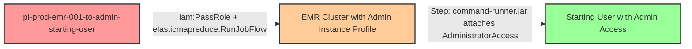

# Privilege Escalation via iam:PassRole + elasticmapreduce:RunJobFlow

* **Category:** Privilege Escalation
* **Sub-Category:** new-passrole
* **Path Type:** one-hop
* **Target:** to-admin
* **Environments:** prod
* **Pathfinding.cloud ID:** emr-001
* **Technique:** Passing an admin instance profile to an EMR cluster and executing a step via command-runner.jar to attach AdministratorAccess to the starting user

## Overview

This scenario demonstrates a privilege escalation path where a user with `iam:PassRole` and `elasticmapreduce:RunJobFlow` permissions can create an Amazon EMR cluster that runs with administrative privileges. The attacker passes an admin-level instance profile to the cluster and uses a bootstrap step with `command-runner.jar` to execute arbitrary AWS CLI commands as the admin role, ultimately granting themselves full administrative access.

EMR clusters require two IAM roles: a service role (trusted by `elasticmapreduce.amazonaws.com`) that manages the cluster infrastructure, and a job flow role / instance profile (trusted by `ec2.amazonaws.com`) that the EC2 instances within the cluster assume. When the job flow role has administrative permissions, any code running on the cluster nodes -- including EMR steps -- executes with those elevated privileges. The AWS CLI is pre-installed on EMR nodes and automatically uses the instance profile credentials via the Instance Metadata Service (IMDS).

The attack leverages EMR's step execution feature with `command-runner.jar` to run a shell command that calls `aws iam attach-user-policy`, attaching the `AdministratorAccess` managed policy to the starting user. The `--auto-terminate` flag ensures the cluster shuts itself down after the step completes, reducing the operational footprint. Note that EMR cluster provisioning takes 5-15 minutes, making this a slower but equally effective escalation path compared to Lambda or Step Functions-based techniques.

## Understanding the attack scenario

### Principals in the attack path

- `arn:aws:iam::PROD_ACCOUNT:user/pl-prod-emr-001-to-admin-starting-user` (Scenario-specific starting user with iam:PassRole and elasticmapreduce:RunJobFlow permissions)
- `arn:aws:iam::PROD_ACCOUNT:role/pl-prod-emr-001-to-admin-admin-role` (Admin role used as the EMR instance profile with AdministratorAccess)
- `arn:aws:iam::PROD_ACCOUNT:role/pl-prod-emr-001-to-admin-service-role` (EMR service role trusted by elasticmapreduce.amazonaws.com)

### Attack Path Diagram



### Attack Steps

1. **Initial Access**: Start as `pl-prod-emr-001-to-admin-starting-user` (credentials provided via Terraform outputs)
2. **Create EMR Cluster**: Use `elasticmapreduce:RunJobFlow` to create an EMR cluster, passing the admin instance profile (`pl-prod-emr-001-to-admin-admin-role`) as the `JobFlowRole` and the service role (`pl-prod-emr-001-to-admin-service-role`) as the `ServiceRole`. Include a step that uses `command-runner.jar` to execute `bash -c "aws iam attach-user-policy --user-name pl-prod-emr-001-to-admin-starting-user --policy-arn arn:aws:iam::aws:policy/AdministratorAccess"`. Set `--auto-terminate` so the cluster shuts down after the step completes.
3. **Wait for Cluster Execution**: The EMR cluster provisions (5-15 minutes), runs the step using the admin instance profile credentials, and terminates automatically.
4. **Verification**: Verify administrator access by performing admin-level actions such as listing IAM users

### Scenario specific resources created

| ARN | Purpose |
| -- | -- |
| `arn:aws:iam::PROD_ACCOUNT:user/pl-prod-emr-001-to-admin-starting-user` | Scenario-specific starting user with iam:PassRole and elasticmapreduce:RunJobFlow permissions |
| `arn:aws:iam::PROD_ACCOUNT:role/pl-prod-emr-001-to-admin-admin-role` | Admin role with AdministratorAccess, used as the EMR instance profile (trusts ec2.amazonaws.com) |
| `arn:aws:iam::PROD_ACCOUNT:instance-profile/pl-prod-emr-001-to-admin-admin-instance-profile` | Instance profile associated with the admin role |
| `arn:aws:iam::PROD_ACCOUNT:role/pl-prod-emr-001-to-admin-service-role` | EMR service role with AmazonEMRServicePolicy_v2 (trusts elasticmapreduce.amazonaws.com) |

## Executing the attack

### Using the automated demo_attack.sh

To demonstrate the privilege escalation path, run the provided demo script:

```bash
cd modules/scenarios/single-account/privesc-one-hop/to-admin/emr-001-iam-passrole+elasticmapreduce-runjobflow
./demo_attack.sh
```

The script will:
1. Display a step-by-step walkthrough with color-coded output
2. Show the commands being executed and their results
3. Verify successful privilege escalation
4. Output standardized test results for automation

### Cleaning up the attack artifacts

After demonstrating the attack, clean up the AdministratorAccess policy attached to the starting user during the demo:

```bash
cd modules/scenarios/single-account/privesc-one-hop/to-admin/emr-001-iam-passrole+elasticmapreduce-runjobflow
./cleanup_attack.sh
```

The cleanup script will detach the `AdministratorAccess` managed policy from the starting user, restoring the environment to its original state while preserving the deployed infrastructure.

## Detection and prevention


### MITRE ATT&CK Mapping

- **Tactic**: TA0004 - Privilege Escalation, TA0002 - Execution
- **Technique**: T1078.004 - Valid Accounts: Cloud Accounts
- **Technique**: T1578 - Modify Cloud Compute Infrastructure


## Prevention recommendations

- Restrict `iam:PassRole` scope to only the specific roles required for legitimate EMR workflows, and never allow passing roles with AdministratorAccess
- Use the `iam:PassedToService` condition key to limit `iam:PassRole` to specific AWS services (e.g., `elasticmapreduce.amazonaws.com`, `ec2.amazonaws.com`) and combine with resource ARN restrictions
- Use EMR runtime roles (available in EMR 5.34+ and 6.9+) to provide per-step IAM credentials instead of relying on the instance profile for all step execution
- Never attach `AdministratorAccess` or other highly privileged policies to instance profiles used by compute services like EMR, EC2, or ECS
- Monitor CloudTrail for `elasticmapreduce:RunJobFlow` API calls from unexpected principals, and alert on steps containing shell commands or `command-runner.jar` invocations with sensitive AWS CLI operations
- Implement Service Control Policies (SCPs) to prevent creation of EMR clusters with overly permissive instance profiles at the organization level
- Use IAM Access Analyzer to identify and remediate privilege escalation paths involving `iam:PassRole` combined with compute service permissions
- Enable EMR managed scaling policies and cluster access controls to limit who can submit steps to running clusters
