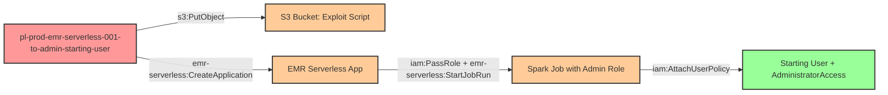

# Privilege Escalation via iam:PassRole + emr-serverless:CreateApplication + emr-serverless:StartJobRun

* **Category:** Privilege Escalation
* **Sub-Category:** new-passrole
* **Path Type:** one-hop
* **Target:** to-admin
* **Environments:** prod
* **Pathfinding.cloud ID:** emr-serverless-001
* **Technique:** Creating an EMR Serverless Spark application and running a job with an admin execution role to grant the starting user administrative access

## Overview

This scenario demonstrates a privilege escalation vulnerability where a user has permissions to pass an IAM role to EMR Serverless, create applications, and start job runs. The attacker creates an EMR Serverless Spark application, uploads a malicious PySpark script to S3, and submits a job run that executes with an administrative execution role. The Spark job uses the admin role's credentials to attach AdministratorAccess to the starting user, achieving persistent privilege escalation.

EMR Serverless is a fully managed compute environment that runs Spark and Hive workloads without requiring cluster or infrastructure management. When a job run is started, EMR Serverless assumes the specified execution role to perform all operations on behalf of the job. By passing an administrative role as the execution role, an attacker can execute arbitrary code with full admin privileges in the AWS account.

This attack is particularly notable because it requires no VPC or network infrastructure -- EMR Serverless handles all compute provisioning internally. The attacker only needs to upload a PySpark script to an S3 bucket and submit a job run. The Spark runtime environment may or may not include boto3 pre-installed, so the exploit script should include a fallback to AWS CLI subprocess calls. Job execution typically takes 2-5 minutes, after which the starting user has persistent admin access via the attached policy.

## Understanding the attack scenario

### Principals in the attack path

- `arn:aws:iam::PROD_ACCOUNT:user/pl-prod-emr-serverless-001-to-admin-starting-user` (Scenario-specific starting user with PassRole and EMR Serverless permissions)
- `arn:aws:iam::PROD_ACCOUNT:role/pl-prod-emr-serverless-001-to-admin-admin-role` (Admin execution role trusted by emr-serverless.amazonaws.com)

### Attack Path Diagram



### Attack Steps

1. **Initial Access**: Start as `pl-prod-emr-serverless-001-to-admin-starting-user` (credentials provided via Terraform outputs)
2. **Upload Exploit Script**: Upload a malicious PySpark script to the scenario's S3 bucket. The script uses boto3 (with a fallback to AWS CLI subprocess) to call `iam:AttachUserPolicy`, attaching AdministratorAccess to the starting user.
3. **Create Application**: Use `emr-serverless:CreateApplication` to create a new Spark application in EMR Serverless
4. **Start Job Run**: Use `iam:PassRole` and `emr-serverless:StartJobRun` to submit the PySpark script as a job run, specifying the admin execution role. The job takes approximately 2-5 minutes to complete.
5. **Verification**: Verify that AdministratorAccess has been attached to the starting user by listing attached policies or performing admin-level actions

### Scenario specific resources created

| ARN | Purpose |
| -- | -- |
| `arn:aws:iam::PROD_ACCOUNT:user/pl-prod-emr-serverless-001-to-admin-starting-user` | Scenario-specific starting user with access keys and permissions for PassRole, EMR Serverless, and S3 |
| `arn:aws:iam::PROD_ACCOUNT:role/pl-prod-emr-serverless-001-to-admin-admin-role` | Admin execution role with AdministratorAccess, trusted by emr-serverless.amazonaws.com |
| S3 bucket for script staging | Bucket used to upload the PySpark exploit script for the EMR Serverless job |
| Policy attached to starting user | Grants `iam:PassRole` on admin role, `emr-serverless:CreateApplication`, `emr-serverless:StartJobRun`, and `s3:PutObject` |

## Executing the attack

### Using the automated demo_attack.sh

To demonstrate the privilege escalation path, run the provided demo script:

```bash
cd modules/scenarios/single-account/privesc-one-hop/to-admin/emr-serverless-001-iam-passrole+emr-serverless-createapplication+emr-serverless-startjobrun
./demo_attack.sh
```

The script will:
1. Display a step-by-step walkthrough with color-coded output
2. Show the commands being executed and their results
3. Verify successful privilege escalation
4. Output standardized test results for automation

**Note:** The EMR Serverless job run takes approximately 2-5 minutes to complete. The demo script will poll the job status until it finishes. Cost per demo run is approximately $0.01-0.05.

### Cleaning up the attack artifacts

After demonstrating the attack, clean up the EMR Serverless application, S3 objects, and the AdministratorAccess policy attached to the starting user:

```bash
cd modules/scenarios/single-account/privesc-one-hop/to-admin/emr-serverless-001-iam-passrole+emr-serverless-createapplication+emr-serverless-startjobrun
./cleanup_attack.sh
```

The cleanup script will stop and delete the EMR Serverless application, remove the uploaded exploit script from S3, and detach the AdministratorAccess policy from the starting user, restoring the environment to its original state while preserving the deployed infrastructure.

## Detection and prevention


### MITRE ATT&CK Mapping

- **Tactic**: TA0004 - Privilege Escalation, TA0002 - Execution
- **Technique**: T1078.004 - Valid Accounts: Cloud Accounts
- **Technique**: T1578 - Modify Cloud Compute Infrastructure


## Prevention recommendations

- Restrict `iam:PassRole` permissions using strict resource conditions to limit which roles can be passed to EMR Serverless
- Implement the `iam:PassedToService` condition key to ensure roles can only be passed to `emr-serverless.amazonaws.com` when explicitly intended
- Avoid granting `emr-serverless:CreateApplication` and `emr-serverless:StartJobRun` together with `iam:PassRole` unless absolutely necessary for the user's job function
- Monitor CloudTrail for `CreateApplication` and `StartJobRun` events in EMR Serverless, especially when the execution role has administrative privileges
- Implement Service Control Policies (SCPs) that prevent passing roles with AdministratorAccess or other high-privilege policies to EMR Serverless
- Use IAM Access Analyzer to identify privilege escalation paths involving PassRole to compute services like EMR Serverless
- Enable AWS Config rules to detect IAM roles with administrative permissions that trust emr-serverless.amazonaws.com
- Restrict which S3 buckets can be used for EMR Serverless job scripts to prevent arbitrary code execution
