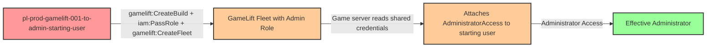

# Privilege Escalation via iam:PassRole + gamelift:CreateBuild + gamelift:CreateFleet

* **Category:** Privilege Escalation
* **Sub-Category:** new-passrole
* **Path Type:** one-hop
* **Target:** to-admin
* **Environments:** prod
* **Pathfinding.cloud ID:** gamelift-001
* **Technique:** Uploading a malicious game server build and creating a GameLift fleet with an admin instance role to execute code with elevated privileges

## Overview

This scenario demonstrates a privilege escalation path where a user with `iam:PassRole`, `gamelift:CreateBuild`, and `gamelift:CreateFleet` permissions can gain administrative access by abusing Amazon GameLift's fleet infrastructure. The attacker uploads a malicious "game server" build (which is simply a bash script), then creates a fleet that runs on EC2 instances with an administrative IAM role attached. When the fleet launches, the attacker's script executes with the admin role's credentials and attaches `AdministratorAccess` to the starting user.

GameLift does not validate that uploaded builds implement any actual game protocol -- any executable will run as the game server process. This means an attacker can upload arbitrary code that will execute on fleet instances. When combined with `iam:PassRole`, the attacker can specify an admin-privileged instance role for the fleet, and by using `--instance-role-credentials-provider SHARED_CREDENTIAL_FILE`, the role's credentials become available at `/local/credentials/credentials` on the instance. The malicious script reads these credentials and uses them to escalate privileges.

This attack is notable for its indirect nature: the privilege escalation happens through a compute service (GameLift fleet EC2 instances) rather than through direct IAM manipulation. The fleet startup process takes 5-15 minutes, which adds latency but also makes the attack harder to correlate in real-time monitoring. Organizations that grant GameLift permissions without restricting `iam:PassRole` to specific roles are vulnerable to this path. The cost impact is minimal at rest ($0/mo) but EC2 charges accrue while the fleet is active during the demonstration.

## Understanding the attack scenario

### Principals in the attack path

- `arn:aws:iam::PROD_ACCOUNT:user/pl-prod-gamelift-001-to-admin-starting-user` (Scenario-specific starting user with PassRole and GameLift permissions)
- `arn:aws:iam::PROD_ACCOUNT:role/pl-prod-gamelift-001-to-admin-admin-role` (Admin role that trusts gamelift.amazonaws.com, passed as the fleet instance role)

### Attack Path Diagram



### Attack Steps

1. **Initial Access**: Start as `pl-prod-gamelift-001-to-admin-starting-user` (credentials provided via Terraform outputs)
2. **Upload Malicious Build**: Use `gamelift:CreateBuild` to upload a bash script disguised as a game server build. The script reads the instance role credentials from `/local/credentials/credentials` and uses them to attach `AdministratorAccess` to the starting user.
3. **Create Fleet**: Use `iam:PassRole` and `gamelift:CreateFleet` to create a new fleet with `t2.micro` ON_DEMAND instances, specifying the admin role as the instance role and `SHARED_CREDENTIAL_FILE` as the credential provider. The malicious build is set as the fleet's game server.
4. **Wait for Fleet Activation**: The fleet takes 5-15 minutes to provision EC2 instances and start the game server process.
5. **Automatic Escalation**: The game server process executes, reads the admin role credentials from the shared credentials file, and attaches `AdministratorAccess` to the starting user.
6. **Verification**: Verify administrator access by listing IAM users or performing other admin-level actions as the starting user.

### Scenario specific resources created

| ARN | Purpose |
| -- | -- |
| `arn:aws:iam::PROD_ACCOUNT:user/pl-prod-gamelift-001-to-admin-starting-user` | Scenario-specific starting user with access keys, iam:PassRole, and GameLift permissions |
| `arn:aws:iam::PROD_ACCOUNT:role/pl-prod-gamelift-001-to-admin-admin-role` | Admin role trusting gamelift.amazonaws.com, used as the fleet instance role |
| Inline policy `pl-prod-gamelift-001-to-admin-starting-user-policy` on `pl-prod-gamelift-001-to-admin-starting-user` | Inline user policy granting iam:PassRole and GameLift permissions to the starting user |

## Executing the attack

### Using the automated demo_attack.sh

To demonstrate the privilege escalation path, run the provided demo script:

```bash
cd modules/scenarios/single-account/privesc-one-hop/to-admin/gamelift-001-iam-passrole+gamelift-createbuild+gamelift-createfleet
./demo_attack.sh
```

The script will:
1. Display a step-by-step walkthrough with color-coded output
2. Show the commands being executed and their results
3. Wait for fleet activation and game server execution (5-15 minutes)
4. Verify successful privilege escalation
5. Output standardized test results for automation

**Note:** This scenario incurs EC2 costs while the GameLift fleet is active. Be sure to clean up promptly after the demonstration.

### Cleaning up the attack artifacts

After demonstrating the attack, clean up the GameLift fleet, build, and attached admin policy:

```bash
cd modules/scenarios/single-account/privesc-one-hop/to-admin/gamelift-001-iam-passrole+gamelift-createbuild+gamelift-createfleet
./cleanup_attack.sh
```

The cleanup script will delete the GameLift fleet and build created during the demonstration, detach the `AdministratorAccess` policy from the starting user, and restore the environment to its original state while preserving the deployed infrastructure.

## Detection and prevention


### MITRE ATT&CK Mapping

- **Tactic**: TA0004 - Privilege Escalation, TA0002 - Execution
- **Technique**: T1078.004 - Valid Accounts: Cloud Accounts
- **Technique**: T1578 - Modify Cloud Compute Infrastructure


## Prevention recommendations

- Restrict `iam:PassRole` with resource conditions to limit which roles can be passed: `"Resource": "arn:aws:iam::*:role/specific-gamelift-role"` rather than allowing all roles
- Implement Service Control Policies (SCPs) to prevent passing administrative roles to GameLift or any compute service
- Monitor CloudTrail for `gamelift:CreateBuild` and `gamelift:CreateFleet` API calls, especially when combined with `iam:PassRole` to high-privilege roles
- Use IAM Access Analyzer to identify principals with `iam:PassRole` permissions on administrative roles
- Apply permission boundaries to GameLift instance roles to cap the maximum privileges available to fleet instances
- Require specific IAM conditions on `iam:PassRole` such as `iam:PassedToService` restricted to `gamelift.amazonaws.com` combined with role name restrictions to prevent passing admin roles
- Enable GuardDuty and configure alerts for unexpected GameLift fleet creation and IAM policy attachment events
- Audit all roles with `gamelift.amazonaws.com` in their trust policy to ensure they follow least privilege principles
