# Privilege Escalation via iam:PassRole + glue:CreateDevEndpoint

* **Category:** Privilege Escalation
* **Sub-Category:** new-passrole
* **Path Type:** one-hop
* **Target:** to-admin
* **Environments:** prod
* **Cost Estimate:** $0/mo
* **Pathfinding.cloud ID:** glue-001
* **Technique:** Pass privileged role to AWS Glue dev endpoint for SSH-based command execution
* **Terraform Variable:** `enable_single_account_privesc_one_hop_to_admin_glue_001_iam_passrole_glue_createdevendpoint`
* **Schema Version:** 1.0.0
* **Attack Path:** starting_user → (iam:PassRole + glue:CreateDevEndpoint) → Glue dev endpoint with admin role → SSH access → (aws iam list-users) → admin access
* **Attack Principals:** `arn:aws:iam::{account_id}:user/pl-prod-glue-001-to-admin-starting-user`; `arn:aws:iam::{account_id}:role/pl-prod-glue-001-to-admin-target-role`
* **Required Permissions:** `iam:PassRole` on `arn:aws:iam::*:role/pl-prod-glue-001-to-admin-target-role`; `glue:CreateDevEndpoint` on `*`
* **Helpful Permissions:** `glue:GetDevEndpoint` (Check endpoint status and retrieve SSH connection details); `iam:ListRoles` (Discover available privileged roles to pass to Glue); `glue:DeleteDevEndpoint` (Clean up created endpoints after demonstration)
* **MITRE Tactics:** TA0004 - Privilege Escalation
* **MITRE Techniques:** T1098.001 - Account Manipulation: Additional Cloud Credentials, T1578 - Modify Cloud Compute Infrastructure

## Attack Overview

This scenario demonstrates a privilege escalation vulnerability where a user with `iam:PassRole` and `glue:CreateDevEndpoint` permissions can create an AWS Glue development endpoint with an administrative role attached. Once the endpoint is provisioned, the attacker can SSH into the endpoint and execute AWS CLI commands with the administrative role's permissions.

AWS Glue development endpoints provide interactive environments for developing and testing ETL scripts. When created, these endpoints can be assigned an IAM role that grants permissions to the underlying compute resources. If an attacker can pass a privileged role to a Glue dev endpoint, they can SSH into the endpoint and leverage the role's permissions to perform administrative actions.

This is a classic "PassRole + Service" privilege escalation pattern, similar to PassRole with Lambda or EC2, but using AWS Glue's development endpoint feature. The attack is particularly powerful because Glue dev endpoints provide direct SSH access, allowing for interactive command execution with the passed role's credentials.

**Important Note:** Glue development endpoints only support Glue versions **0.9** and **1.0** (legacy versions). Newer Glue versions (2.0, 3.0, 4.0) are not supported for dev endpoints. This scenario uses Glue 1.0.

### MITRE ATT&CK Mapping

- **Tactic**: Privilege Escalation (TA0004)
- **Technique**: T1098.001 - Account Manipulation: Additional Cloud Credentials
- **Technique**: T1578 - Modify Cloud Compute Infrastructure
- **Sub-technique**: Creating cloud compute resources with elevated privileges

### Principals in the attack path

- `arn:aws:iam::PROD_ACCOUNT:user/pl-prod-glue-001-to-admin-starting-user` (Scenario-specific starting user)
- `arn:aws:iam::PROD_ACCOUNT:role/pl-prod-glue-001-to-admin-target-role` (Admin role passed to Glue dev endpoint)

### Attack Path Diagram

```mermaid
graph LR
    A[pl-prod-glue-001-to-admin-starting-user] -->|iam:PassRole + glue:CreateDevEndpoint| B[Glue Dev Endpoint]
    B -->|Assigned Role| C[pl-prod-glue-001-to-admin-target-role]
    C -->|SSH Access| D[Execute AWS CLI Commands]
    D -->|Administrator Permissions| E[Effective Administrator]

    style A fill:#ff9999,stroke:#333,stroke-width:2px
    style B fill:#ffcc99,stroke:#333,stroke-width:2px
    style C fill:#ffcc99,stroke:#333,stroke-width:2px
    style D fill:#ffcc99,stroke:#333,stroke-width:2px
    style E fill:#99ff99,stroke:#333,stroke-width:2px
```



### Attack Steps

1. **Initial Access**: Start as `pl-prod-glue-001-to-admin-starting-user` (credentials provided via Terraform outputs)
2. **Create Glue Dev Endpoint**: Use `glue:CreateDevEndpoint` to create a development endpoint, passing the admin role via `iam:PassRole`
3. **Wait for Provisioning**: Wait for the Glue dev endpoint to become available (typically 5-10 minutes)
4. **Retrieve SSH Details**: Use `glue:GetDevEndpoint` to obtain the public SSH key and endpoint address
5. **SSH Access**: Connect to the Glue dev endpoint using SSH with the provided key
6. **Execute Commands**: Run AWS CLI commands from within the endpoint, leveraging the admin role's credentials
7. **Verification**: Verify administrator access by executing privileged operations (e.g., `aws iam list-users`)

### Scenario specific resources created

| ARN | Purpose |
| -- | -- |
| `arn:aws:iam::PROD_ACCOUNT:user/pl-prod-glue-001-to-admin-starting-user` | Scenario-specific starting user with access keys |
| `arn:aws:iam::PROD_ACCOUNT:role/pl-prod-glue-001-to-admin-target-role` | Administrative role passed to Glue dev endpoint |
| `arn:aws:iam::PROD_ACCOUNT:policy/pl-prod-glue-001-to-admin-passrole-policy` | Policy allowing PassRole on target role and glue:CreateDevEndpoint |

## Attack Lab

### Prerequisites

1. Install the `plabs` CLI:
   ```bash
   brew install pathfinding-labs/tap/plabs
   ```
2. Configure your AWS profiles in `~/.plabs/plabs.yaml` (or run `plabs init` if you haven't already)

### Deploy with plabs non-interactive

```bash
plabs enable enable_single_account_privesc_one_hop_to_admin_glue_001_iam_passrole_glue_createdevendpoint
plabs apply
```

### Deploy with plabs tui

1. Launch the TUI: `plabs`
2. Navigate to this scenario in the scenarios list
3. Press `space` to enable it
4. Press `d` to deploy

### ⚠️ COST WARNING ⚠️

**AWS Glue development endpoints cost approximately $2.20 per hour** while running (using minimum 2 node configuration). The demo script will create a Glue dev endpoint that will accrue charges until it is deleted. The cleanup script will remove the endpoint, but be aware of the costs if you leave it running.

**Estimated costs:**
- **Per hour:** ~$2.20
- **24 hours:** ~$52.80
- **30 days:** ~$1,584

Always run the cleanup script immediately after testing to minimize costs.

### Executing the automated demo_attack script

The script will:
1. Display a step-by-step walkthrough with color-coded output
2. Show the commands being executed and their results
3. Create a Glue development endpoint with the admin role
4. Wait for the endpoint to become available (5-10 minutes)
5. Retrieve SSH connection details
6. Verify successful privilege escalation by demonstrating admin access
7. Output standardized test results for automation

**Note:** The demo script demonstrates the attack conceptually but does not actually SSH into the endpoint, as this would require additional SSH key setup. The script shows how an attacker would proceed with SSH access to execute privileged commands.

#### Resources created by attack script

- Glue development endpoint with admin role attached

#### With plabs non-interactive

```bash
plabs demo --list
plabs demo glue-001-iam-passrole+glue-createdevendpoint
```

#### With plabs tui

1. Launch the TUI: `plabs`
2. Navigate to this scenario in the scenarios list
3. Press `r` to run the demo script

### Cleanup

**This cleanup is critical** - the Glue dev endpoint costs ~$2.20/hour while running. The cleanup script will delete the endpoint and any associated resources created during the demo.

#### With plabs non-interactive

```bash
plabs cleanup --list
plabs cleanup glue-001-iam-passrole+glue-createdevendpoint
```

#### With plabs tui

1. Launch the TUI: `plabs`
2. Navigate to this scenario in the scenarios list
3. Press `c` to run the cleanup script

### Teardown with plabs non-interactive

```bash
plabs disable enable_single_account_privesc_one_hop_to_admin_glue_001_iam_passrole_glue_createdevendpoint
plabs apply
```

### Teardown with plabs tui

1. Launch the TUI: `plabs`
2. Navigate to this scenario in the scenarios list
3. Press `space` to disable it
4. Press `D` to destroy

## Detecting Misconfiguration (CSPM)

### What CSPM tools should detect

A properly configured CSPM solution should identify:
- IAM user with `iam:PassRole` permission on privileged roles
- IAM user with `glue:CreateDevEndpoint` permission
- Combination of PassRole and Glue permissions enabling privilege escalation
- IAM role with administrative permissions that can be passed to Glue services
- Glue trust policy allowing the Glue service to assume privileged roles
- Privilege escalation path from user to admin via Glue dev endpoint creation

### Prevention recommendations

- **Restrict PassRole permissions**: Limit `iam:PassRole` to only the specific roles and services needed. Use resource-level restrictions:
  ```json
  {
    "Effect": "Allow",
    "Action": "iam:PassRole",
    "Resource": "arn:aws:iam::*:role/specific-glue-role",
    "Condition": {
      "StringEquals": {
        "iam:PassedToService": "glue.amazonaws.com"
      }
    }
  }
  ```

- **Implement SCPs to prevent privilege escalation**: Use Service Control Policies to deny PassRole on administrative roles:
  ```json
  {
    "Effect": "Deny",
    "Action": "iam:PassRole",
    "Resource": "arn:aws:iam::*:role/*admin*",
    "Condition": {
      "StringEquals": {
        "iam:PassedToService": "glue.amazonaws.com"
      }
    }
  }
  ```

- **Restrict glue:CreateDevEndpoint permissions**: Only grant this permission to users who legitimately need to create Glue development endpoints (data engineers, ETL developers). This is a powerful permission that should be tightly controlled.

- **Use IAM Access Analyzer**: Enable IAM Access Analyzer to automatically detect privilege escalation paths involving PassRole and Glue services. Review findings regularly and remediate identified risks.

- **Implement least privilege for Glue roles**: When creating IAM roles for Glue services, grant only the minimum permissions required for the specific ETL tasks. Avoid using administrative policies like `AdministratorAccess` or `PowerUserAccess` on Glue service roles.

- **Require MFA for sensitive operations**: Implement MFA requirements for operations like `glue:CreateDevEndpoint` and `iam:PassRole` to add an additional layer of security against compromised credentials.

- **Use VPC endpoints for Glue**: Configure Glue dev endpoints to run within private VPCs without public SSH access, reducing the attack surface even if an endpoint is created with elevated privileges.

- **Tag and monitor Glue resources**: Apply mandatory tagging to Glue dev endpoints and monitor for endpoints created without proper tags or by unauthorized users. Use AWS Config rules to enforce tagging policies.

- **Set up billing alerts**: Configure AWS Budgets to alert when Glue costs exceed expected thresholds, helping detect unauthorized dev endpoint creation based on unexpected charges.

## Detection Abuse (CloudSIEM)

### CloudTrail events to monitor

- `IAM: PassRole` — IAM role passed to a Glue service; high severity when the passed role has administrative permissions
- `Glue: CreateDevEndpoint` — Glue development endpoint created; critical when combined with PassRole on a privileged role
- `Glue: GetDevEndpoint` — Attacker retrieves endpoint details (SSH key, endpoint address) for interactive access

### Detonation logs

_Detonation log integration (Stratus Red Team / Grimoire) is planned for a future release._
