# One-Hop Privilege Escalation: glue:UpdateDevEndpoint

* **Category:** Privilege Escalation
* **Sub-Category:** existing-passrole
* **Path Type:** one-hop
* **Target:** to-admin
* **Environments:** prod
* **Cost Estimate:** $634/mo
* **Pathfinding.cloud ID:** glue-002
* **Technique:** Add SSH public key to existing Glue dev endpoint and execute commands with the endpoint's administrative role
* **Terraform Variable:** `enable_single_account_privesc_one_hop_to_admin_glue_002_glue_updatedevendpoint`
* **Schema Version:** 1.0.0
* **Attack Path:** starting_user → (glue:UpdateDevEndpoint) → Add SSH key to existing dev endpoint → SSH access → (aws iam list-users) → admin access
* **Attack Principals:** `arn:aws:iam::{account_id}:user/pl-prod-glue-002-to-admin-starting-user`; `arn:aws:iam::{account_id}:role/pl-prod-glue-002-to-admin-target-role`
* **Required Permissions:** `glue:UpdateDevEndpoint` on `*`
* **Helpful Permissions:** `glue:GetDevEndpoint` (Retrieve endpoint details including address for SSH connection); `glue:GetDevEndpoints` (List existing endpoints to identify targets with privileged roles)
* **MITRE Tactics:** TA0004 - Privilege Escalation
* **MITRE Techniques:** T1098.001 - Account Manipulation: Additional Cloud Credentials, T1021.004 - Remote Services: SSH

## Attack Overview

This scenario demonstrates a privilege escalation vulnerability where a user with `glue:UpdateDevEndpoint` permission can add their SSH public key to a pre-existing AWS Glue development endpoint. Once the SSH key is added, the attacker can SSH into the endpoint and execute AWS CLI commands with the full permissions of the IAM role attached to the endpoint. Unlike `glue:CreateDevEndpoint` (which requires `iam:PassRole`), updating an existing endpoint allows an attacker to gain access to an already-privileged role without needing role attachment permissions.

**IMPORTANT COST WARNING**: AWS Glue development endpoints cost approximately **$2.20/hour** and run continuously while the scenario is deployed. This can result in significant charges if left running. Always destroy the scenario when finished testing.

This scenario is particularly dangerous in environments where:
- Development endpoints are created with administrative or highly privileged roles for data engineering work
- Multiple teams share access to Glue resources without strict RBAC
- Endpoints are left running for extended periods with powerful IAM roles attached

### MITRE ATT&CK Mapping

- **Tactic**: TA0004 - Privilege Escalation
- **Technique**: T1098.001 - Account Manipulation: Additional Cloud Credentials
- **Technique**: T1021.004 - Remote Services: SSH

### Principals in the attack path

- `arn:aws:iam::PROD_ACCOUNT:user/pl-prod-glue-002-to-admin-starting-user` (Scenario-specific starting user)
- `arn:aws:glue:REGION:PROD_ACCOUNT:devEndpoint/pl-prod-glue-002-to-admin-endpoint` (Pre-existing Glue dev endpoint)
- `arn:aws:iam::PROD_ACCOUNT:role/pl-prod-glue-002-to-admin-target-role` (Administrative role attached to the endpoint)

### Attack Path Diagram

```mermaid
graph LR
    A[pl-prod-glue-002-to-admin-starting-user] -->|glue:UpdateDevEndpoint| B[Add SSH Public Key]
    B -->|SSH Connection| C[pl-prod-glue-002-to-admin-endpoint]
    C -->|Execute with role| D[pl-prod-glue-002-to-admin-target-role]
    D -->|Administrator Access| E[Effective Administrator]

    style A fill:#ff9999,stroke:#333,stroke-width:2px
    style B fill:#ffcc99,stroke:#333,stroke-width:2px
    style C fill:#ffcc99,stroke:#333,stroke-width:2px
    style D fill:#ffcc99,stroke:#333,stroke-width:2px
    style E fill:#99ff99,stroke:#333,stroke-width:2px
```



### Attack Steps

1. **Initial Access**: Start as `pl-prod-glue-002-to-admin-starting-user` (credentials provided via Terraform outputs)
2. **Generate SSH Key Pair**: Create a new SSH key pair for authentication
3. **Update Dev Endpoint**: Use `glue:UpdateDevEndpoint` to add the SSH public key to the existing endpoint
4. **Wait for Update**: Wait for the endpoint status to change from UPDATING to READY (typically 5-10 minutes)
5. **Retrieve Endpoint Address**: Use `glue:GetDevEndpoint` to obtain the SSH connection address
6. **SSH Connection**: Connect to the endpoint using the private key
7. **Execute Privileged Commands**: Run AWS CLI commands (e.g., `aws iam list-users`) using the endpoint's administrative role
8. **Verification**: Verify administrator access through successful execution of admin-level API calls

### Scenario specific resources created

| ARN | Purpose |
| -- | -- |
| `arn:aws:iam::PROD_ACCOUNT:user/pl-prod-glue-002-to-admin-starting-user` | Scenario-specific starting user with access keys |
| `arn:aws:iam::PROD_ACCOUNT:policy/pl-prod-glue-002-to-admin-policy` | Allows `glue:UpdateDevEndpoint` and `glue:GetDevEndpoint` permissions |
| `arn:aws:glue:REGION:PROD_ACCOUNT:devEndpoint/pl-prod-glue-002-to-admin-endpoint` | Pre-existing Glue development endpoint with administrative role |
| `arn:aws:iam::PROD_ACCOUNT:role/pl-prod-glue-002-to-admin-target-role` | Administrative role attached to the Glue dev endpoint |
| `arn:aws:iam::PROD_ACCOUNT:role/pl-prod-glue-002-to-admin-endpoint-service-role` | Service role allowing Glue to assume the target role |

## Attack Lab

### Prerequisites

1. Install the `plabs` CLI:
   ```bash
   brew install pathfinding-labs/tap/plabs
   ```
2. Configure your AWS profiles in `~/.plabs/plabs.yaml` (or run `plabs init` if you haven't already)

### Deploy with plabs non-interactive

```bash
plabs enable enable_single_account_privesc_one_hop_to_admin_glue_002_glue_updatedevendpoint
plabs apply
```

### Deploy with plabs tui

1. Launch the TUI: `plabs`
2. Navigate to this scenario in the scenarios list
3. Press `space` to enable it
4. Press `d` to deploy

### Executing the automated demo_attack script

To demonstrate the privilege escalation path, run the provided demo script.

The script will:
1. Display a step-by-step walkthrough with color-coded output
2. Generate an SSH key pair for the attack
3. Update the Glue dev endpoint to add the SSH public key
4. Wait for the endpoint to become ready (this may take 5-10 minutes)
5. Retrieve the endpoint SSH address
6. Connect via SSH and execute AWS CLI commands with administrative privileges
7. Verify successful privilege escalation
8. Output standardized test results for automation

**Note**: The endpoint update process can take several minutes. The script includes automated waiting with status checks.

#### Resources created by attack script

- Temporary SSH key pair generated for the attack
- SSH public key added to the Glue dev endpoint

#### With plabs non-interactive

```bash
plabs demo --list
plabs demo glue-002-glue-updatedevendpoint
```

#### With plabs tui

1. Launch the TUI: `plabs`
2. Navigate to this scenario in the scenarios list
3. Press `r` to run the demo script

### Cleanup

After demonstrating the attack, clean up the SSH public key from the endpoint. This will remove the attacker's SSH public key from the endpoint, reverting it to its original state. The cleanup script uses admin credentials to ensure successful removal of attack artifacts.

#### With plabs non-interactive

```bash
plabs cleanup --list
plabs cleanup glue-002-glue-updatedevendpoint
```

#### With plabs tui

1. Launch the TUI: `plabs`
2. Navigate to this scenario in the scenarios list
3. Press `c` to run the cleanup script

### Teardown with plabs non-interactive

```bash
plabs disable enable_single_account_privesc_one_hop_to_admin_glue_002_glue_updatedevendpoint
plabs apply
```

### Teardown with plabs tui

1. Launch the TUI: `plabs`
2. Navigate to this scenario in the scenarios list
3. Press `space` to disable it
4. Press `D` to destroy

## Detecting Misconfiguration (CSPM)

### What CSPM tools should detect

A properly configured Cloud Security Posture Management (CSPM) tool should identify:

1. **Privilege Escalation Path**: User with `glue:UpdateDevEndpoint` can access roles attached to existing endpoints
2. **Overprivileged Endpoint Roles**: Glue dev endpoints configured with administrative or highly privileged IAM roles
3. **Broad Glue Permissions**: IAM principals with `glue:UpdateDevEndpoint` permissions on all endpoints (`Resource: "*"`)
4. **Long-Running Dev Endpoints**: Glue dev endpoints that remain active for extended periods with privileged roles
5. **Missing Resource Conditions**: Glue permissions without resource-level restrictions or condition keys
6. **SSH Access to Privileged Resources**: Ability to add SSH keys to compute resources with administrative roles

### Prevention recommendations

- **Restrict UpdateDevEndpoint Permissions**: Limit `glue:UpdateDevEndpoint` to specific endpoints using resource ARNs, not wildcard (`*`)
- **Use Least Privilege Roles**: Attach only the minimum necessary IAM permissions to Glue dev endpoint roles, avoiding administrative access
- **Implement Resource Tagging**: Use tags and condition keys to control which principals can update specific endpoints:
  ```json
  {
    "Condition": {
      "StringEquals": {
        "aws:ResourceTag/Team": "${aws:PrincipalTag/Team}"
      }
    }
  }
  ```
- **Monitor Glue API Calls**: Set up CloudTrail alerts for `UpdateDevEndpoint` calls, especially public key additions
- **Use SCPs for Sensitive Roles**: Implement Service Control Policies to prevent Glue endpoints from assuming highly privileged roles:
  ```json
  {
    "Effect": "Deny",
    "Action": "sts:AssumeRole",
    "Resource": "arn:aws:iam::*:role/*Admin*",
    "Condition": {
      "StringEquals": {
        "aws:PrincipalServiceName": "glue.amazonaws.com"
      }
    }
  }
  ```
- **Limit Endpoint Lifespan**: Use automation to terminate idle Glue dev endpoints or those running for extended periods
- **Require MFA for Glue Operations**: Enforce MFA requirements for `glue:UpdateDevEndpoint` calls on production endpoints
- **Separate Development and Production**: Never use Glue dev endpoints with production-level IAM roles; use separate accounts or strict role boundaries
- **Use IAM Access Analyzer**: Regularly scan for privilege escalation paths involving Glue permissions
- **Monitor SSH Key Additions**: Alert on CloudTrail events where `publicKeys` or `addPublicKeys` parameters are used in `UpdateDevEndpoint` calls
- **Disable Unused Endpoints**: Automatically terminate Glue dev endpoints that haven't been accessed in a defined period

## Detection Abuse (CloudSIEM)

### CloudTrail events to monitor

- `Glue: UpdateDevEndpoint` — Glue dev endpoint updated; critical when `addPublicKeys` parameter is present, indicating SSH key injection
- `Glue: GetDevEndpoint` — Dev endpoint details retrieved; may indicate reconnaissance to obtain the SSH address after key injection
- `Glue: GetDevEndpoints` — All dev endpoints listed; may indicate reconnaissance to identify privileged targets

### Detonation logs

_Detonation log integration (Stratus Red Team / Grimoire) is planned for a future release._
