# Privilege Escalation via iam:PassRole + glue:CreateJob + glue:CreateTrigger

* **Category:** Privilege Escalation
* **Sub-Category:** new-passrole
* **Path Type:** one-hop
* **Target:** to-admin
* **Environments:** prod
* **Cost Estimate:** $0/mo
* **Pathfinding.cloud ID:** glue-004
* **Technique:** Pass privileged role to AWS Glue job and create trigger for automated execution with persistence
* **Terraform Variable:** `enable_single_account_privesc_one_hop_to_admin_glue_004_iam_passrole_glue_createjob_glue_createtrigger`
* **Schema Version:** 1.0.0
* **Attack Path:** starting_user → (iam:PassRole + glue:CreateJob) → Create job with admin role → (glue:CreateTrigger with --start-on-creation) → Trigger executes job → Job attaches AdministratorAccess to starting user → admin access
* **Attack Principals:** `arn:aws:iam::{account_id}:user/pl-prod-glue-004-to-admin-starting-user`; `arn:aws:iam::{account_id}:role/pl-prod-glue-004-to-admin-target-role`
* **Required Permissions:** `iam:PassRole` on `*`; `glue:CreateJob` on `*`; `glue:CreateTrigger` on `*`
* **Helpful Permissions:** `glue:GetJob` (Retrieve job details and verify configuration); `glue:GetTrigger` (Monitor trigger state and verify activation); `glue:GetJobRun` (Get details about a specific job run); `glue:GetJobRuns` (List job runs to monitor execution status); `iam:ListUsers` (Verify admin access after privilege escalation)
* **MITRE Tactics:** TA0004 - Privilege Escalation, TA0003 - Persistence
* **MITRE Techniques:** T1078.004 - Valid Accounts: Cloud Accounts, T1053 - Scheduled Task/Job

## Attack Overview

This scenario demonstrates a privilege escalation vulnerability where a user with `iam:PassRole`, `glue:CreateJob`, and `glue:CreateTrigger` permissions can create an AWS Glue job with an administrative role and establish a scheduled trigger that automatically executes the job. Unlike manual execution via `glue:StartJobRun`, this technique creates a persistent attack mechanism through scheduled automation.

AWS Glue jobs are ETL (Extract, Transform, Load) workloads that execute code in a managed Apache Spark or Python shell environment. When a Glue job is created, it can be assigned an IAM role that grants permissions to the job's execution environment. If an attacker can pass a privileged role to a Glue job and create a trigger with the `--start-on-creation` flag, they can establish automated privilege escalation that executes on a schedule (e.g., every minute).

The trigger-based approach is particularly dangerous because it demonstrates a persistence pattern rather than just immediate exploitation. The attacker creates a scheduled job that continuously grants administrative access, making it harder to detect and remediate. This technique shows how AWS service automation features can be abused for persistent privilege escalation.

### MITRE ATT&CK Mapping

- **Tactic**: Privilege Escalation (TA0004), Persistence (TA0003)
- **Technique**: T1078.004 - Valid Accounts: Cloud Accounts
- **Technique**: T1053 - Scheduled Task/Job
- **Sub-technique**: Using cloud service automation (triggers) for persistent privilege escalation

### Principals in the attack path

- `arn:aws:iam::PROD_ACCOUNT:user/pl-prod-glue-004-to-admin-starting-user` (Scenario-specific starting user)
- `arn:aws:iam::PROD_ACCOUNT:role/pl-prod-glue-004-to-admin-target-role` (Admin role passed to Glue job)

### Attack Path Diagram

```mermaid
graph LR
    A[pl-prod-glue-004-to-admin-starting-user] -->|iam:PassRole + glue:CreateJob| B[Glue Job with Admin Role]
    B -->|glue:CreateTrigger with --start-on-creation| C[Scheduled Trigger]
    C -->|Automatic Execution| D[Job Runs with Admin Role]
    D -->|iam:AttachUserPolicy| E[Starting User Gets Admin Access]
    E -->|Persistent Scheduled Execution| F[Continuous Admin Access]

    style A fill:#ff9999,stroke:#333,stroke-width:2px
    style B fill:#ffcc99,stroke:#333,stroke-width:2px
    style C fill:#ffcc99,stroke:#333,stroke-width:2px
    style D fill:#ffcc99,stroke:#333,stroke-width:2px
    style E fill:#99ff99,stroke:#333,stroke-width:2px
    style F fill:#99ff99,stroke:#333,stroke-width:2px
```



### Attack Steps

1. **Initial Access**: Start as `pl-prod-glue-004-to-admin-starting-user` (credentials provided via Terraform outputs)
2. **Create Glue Job**: Use `glue:CreateJob` to create a Python shell job with inline script that attaches AdministratorAccess policy to the starting user
3. **Pass Admin Role**: During job creation, use `iam:PassRole` to assign the admin role as the job's execution role
4. **Create Trigger with Auto-Start**: Use `glue:CreateTrigger` with `--start-on-creation` flag to create a SCHEDULED trigger (cron: every minute) that immediately activates
5. **Automatic Execution**: The trigger automatically starts the job run without requiring `glue:StartJobRun` permission
6. **Policy Attachment**: The job executes with admin role permissions and attaches the AdministratorAccess managed policy to the starting user
7. **Verification**: Verify administrator access by executing privileged operations (e.g., `aws iam list-users`)
8. **Persistence**: The trigger continues to run every minute, re-granting admin access even if remediated

### Scenario specific resources created

| ARN | Purpose |
| -- | -- |
| `arn:aws:iam::PROD_ACCOUNT:user/pl-prod-glue-004-to-admin-starting-user` | Scenario-specific starting user with access keys |
| `arn:aws:iam::PROD_ACCOUNT:role/pl-prod-glue-004-to-admin-target-role` | Administrative role passed to Glue job |
| `arn:aws:iam::PROD_ACCOUNT:policy/pl-prod-glue-004-to-admin-passrole-policy` | Policy allowing PassRole on target role, glue:CreateJob, and glue:CreateTrigger |

## Attack Lab

### Prerequisites

1. Install the `plabs` CLI:
   ```bash
   brew install pathfinding-labs/tap/plabs
   ```
2. Configure your AWS profiles in `~/.plabs/plabs.yaml` (or run `plabs init` if you haven't already)

### Deploy with plabs non-interactive

```bash
plabs enable enable_single_account_privesc_one_hop_to_admin_glue_004_iam_passrole_glue_createjob_glue_createtrigger
plabs apply
```

### Deploy with plabs tui

1. Launch the TUI: `plabs`
2. Navigate to this scenario in the scenarios list
3. Press `space` to enable it
4. Press `d` to deploy

### Executing the automated demo_attack script

The script will:
1. Display a step-by-step walkthrough with color-coded output
2. Show the commands being executed and their results
3. Create a Glue Python shell job with inline credential escalation script
4. Pass the admin role to the Glue job as its execution role
5. Create a SCHEDULED trigger with `--start-on-creation` for automatic execution
6. Wait for the trigger to activate and execute the job (typically 1-2 minutes)
7. Verify successful privilege escalation by testing admin permissions
8. Output standardized test results for automation

**Note on Costs**: AWS Glue Python shell jobs cost approximately $0.44 per DPU-hour. This demo runs briefly (~30 seconds) and costs less than $0.01 per execution. The trigger is scheduled but will be cleaned up immediately after the demo. Total estimated cost: **~$0.10/month** for occasional testing.

#### Resources created by attack script

- A Glue Python shell job with inline script that attaches `AdministratorAccess` to the starting user
- A scheduled Glue trigger (every minute) with `--start-on-creation` that auto-executes the job
- An `AdministratorAccess` policy attachment on the starting user

#### With plabs non-interactive

```bash
plabs demo --list
plabs demo glue-004-iam-passrole+glue-createjob+glue-createtrigger
```

#### With plabs tui

1. Launch the TUI: `plabs`
2. Navigate to this scenario in the scenarios list
3. Press `r` to run the demo script

### Cleanup

After demonstrating the attack, clean up the Glue job, trigger, and attached policy:

#### With plabs non-interactive

```bash
plabs cleanup --list
plabs cleanup glue-004-iam-passrole+glue-createjob+glue-createtrigger
```

#### With plabs tui

1. Launch the TUI: `plabs`
2. Navigate to this scenario in the scenarios list
3. Press `c` to run the cleanup script

### Teardown with plabs non-interactive

```bash
plabs disable enable_single_account_privesc_one_hop_to_admin_glue_004_iam_passrole_glue_createjob_glue_createtrigger
plabs apply
```

### Teardown with plabs tui

1. Launch the TUI: `plabs`
2. Navigate to this scenario in the scenarios list
3. Press `space` to disable it
4. Press `D` to destroy

## Detecting Misconfiguration (CSPM)

### What CSPM tools should detect

A properly configured CSPM solution should identify:
- IAM user with `iam:PassRole` permission on privileged roles
- IAM user with `glue:CreateJob` and `glue:CreateTrigger` permissions
- Combination of PassRole and Glue permissions enabling privilege escalation
- IAM role with administrative permissions that can be passed to Glue services
- Glue trust policy allowing the Glue service to assume privileged roles
- Privilege escalation path from user to admin via Glue job creation and trigger automation
- Scheduled triggers that execute jobs with elevated privileges (persistence indicator)

### Prevention recommendations

- **Restrict PassRole permissions**: Never grant `iam:PassRole` with wildcards. Use resource-based conditions to limit which roles can be passed and to which services:
  ```json
  {
    "Effect": "Allow",
    "Action": "iam:PassRole",
    "Resource": "arn:aws:iam::*:role/specific-glue-etl-role",
    "Condition": {
      "StringEquals": {
        "iam:PassedToService": "glue.amazonaws.com"
      }
    }
  }
  ```

- **Implement SCPs to prevent privilege escalation**: Use Service Control Policies to deny PassRole on administrative roles to Glue services:
  ```json
  {
    "Effect": "Deny",
    "Action": "iam:PassRole",
    "Resource": "arn:aws:iam::*:role/*admin*",
    "Condition": {
      "StringEquals": {
        "iam:PassedToService": "glue.amazonaws.com"
      }
    }
  }
  ```

- **Monitor CloudTrail for Glue job and trigger creation**: Alert on `CreateJob` and `CreateTrigger` API calls, especially when:
  - Combined with PassRole on privileged roles
  - Triggers are created with `StartOnCreation=true`
  - Jobs use inline scripts (Command.ScriptLocation is empty)
  - Execution intervals are suspiciously frequent (every minute)
  - Jobs are created by users who don't typically work with Glue

- **Restrict glue:CreateJob and glue:CreateTrigger permissions**: Only grant these permissions to users who legitimately need to create ETL workflows (data engineers). This is particularly important for trigger creation, which enables persistence.

- **Use IAM Access Analyzer**: Enable IAM Access Analyzer to automatically detect privilege escalation paths involving PassRole and Glue services. Review findings regularly and remediate identified risks.

- **Implement least privilege for Glue roles**: When creating IAM roles for Glue services, grant only the minimum permissions required for the specific ETL tasks. Avoid using administrative policies like `AdministratorAccess` on Glue service roles. Use resource-specific permissions (e.g., S3 bucket access only).

- **Require MFA for sensitive operations**: Implement MFA requirements for operations like `glue:CreateJob`, `glue:CreateTrigger`, and `iam:PassRole` to add an additional layer of security against compromised credentials.

- **Block inline scripts via SCP**: Consider using SCPs to require Glue jobs to use scripts from specific S3 buckets rather than inline scripts, making it harder to inject malicious code:
  ```json
  {
    "Effect": "Deny",
    "Action": "glue:CreateJob",
    "Resource": "*",
    "Condition": {
      "Null": {
        "glue:ScriptLocation": "true"
      }
    }
  }
  ```

- **Monitor IAM policy changes from Glue service principal**: Set up CloudWatch alarms for IAM policy modifications (`AttachUserPolicy`, `AttachRolePolicy`, `PutUserPolicy`, `PutRolePolicy`) where the source is the Glue service principal. This can indicate abuse of Glue jobs for privilege escalation.

- **Limit trigger scheduling frequencies**: Implement organizational policies or SCPs that prevent creation of triggers with very frequent schedules (e.g., every minute), as these are often indicators of abuse rather than legitimate ETL workflows.

- **Tag and monitor Glue resources**: Apply mandatory tagging to Glue jobs and triggers, and monitor for resources created without proper tags or by unauthorized users. Use AWS Config rules to enforce tagging policies and detect anomalous Glue resource creation patterns.

## Detection Abuse (CloudSIEM)

### CloudTrail events to monitor

- `IAM: PassRole` — Role passed to Glue service; critical when the passed role has administrative permissions
- `Glue: CreateJob` — New Glue job created; high severity when combined with a privileged execution role or inline script
- `Glue: CreateTrigger` — Glue trigger created; critical when `StartOnCreation=true` or schedule is very frequent (e.g., every minute)
- `IAM: AttachUserPolicy` — Managed policy attached to IAM user; critical when source is the Glue service principal
- `IAM: AttachRolePolicy` — Managed policy attached to IAM role; critical when originating from Glue service principal

### Detonation logs

_Detonation log integration (Stratus Red Team / Grimoire) is planned for a future release._
