# Privilege Escalation via iam:PassRole + glue:UpdateJob + glue:CreateTrigger

* **Category:** Privilege Escalation
* **Sub-Category:** service-passrole
* **Path Type:** one-hop
* **Target:** to-admin
* **Environments:** prod
* **Pathfinding.cloud ID:** glue-006
* **Technique:** Update existing Glue job to use privileged role and malicious script, then create trigger for automated execution with persistence

## Overview

This scenario demonstrates a stealthy privilege escalation vulnerability where a user with `iam:PassRole`, `glue:UpdateJob`, and `glue:CreateTrigger` permissions can modify an existing AWS Glue job to use an administrative role and execute malicious code. Unlike `glue:CreateJob` which creates new resources that may raise alerts, `glue:UpdateJob` modifies existing infrastructure, making detection significantly more difficult.

AWS Glue jobs are ETL (Extract, Transform, Load) workloads that execute code in a managed Apache Spark or Python shell environment. Organizations commonly have dozens or hundreds of Glue jobs running legitimate data pipelines. When an attacker updates an existing job's execution role and script location, then creates a trigger with the `--start-on-creation` flag, they establish automated privilege escalation that executes on a schedule (e.g., every minute).

The update-based approach is particularly dangerous because it blends into normal operations. Updating existing jobs is a common maintenance activity, whereas creating new jobs with administrative roles is more suspicious. This technique demonstrates how attackers can abuse legitimate change management workflows to achieve persistent privilege escalation while evading detection.

## Understanding the attack scenario

### Principals in the attack path

- `arn:aws:iam::PROD_ACCOUNT:user/pl-prod-glue-006-to-admin-starting-user` (Scenario-specific starting user)
- `arn:aws:glue::PROD_ACCOUNT:job/pl-glue-006-to-admin-job` (Pre-existing Glue job that will be modified)
- `arn:aws:iam::PROD_ACCOUNT:role/pl-prod-glue-006-to-admin-target-role` (Admin role passed to Glue job during update)

### Attack Path Diagram

```mermaid
graph LR
    A[pl-prod-glue-006-to-admin-starting-user] -->|glue:UpdateJob| B[Existing Glue Job]
    B -->|Change role to admin<br/>Change script to malicious| C[Modified Job with Admin Role]
    C -->|glue:CreateTrigger<br/>--start-on-creation| D[Scheduled Trigger]
    D -->|Automatic Execution| E[Job Runs with Admin Role]
    E -->|iam:AttachUserPolicy| F[Starting User Gets Admin Access]
    F -->|Persistent Scheduled Execution| G[Continuous Admin Access]

    style A fill:#ff9999,stroke:#333,stroke-width:2px
    style B fill:#ffcc99,stroke:#333,stroke-width:2px
    style C fill:#ffcc99,stroke:#333,stroke-width:2px
    style D fill:#ffcc99,stroke:#333,stroke-width:2px
    style E fill:#ffcc99,stroke:#333,stroke-width:2px
    style F fill:#99ff99,stroke:#333,stroke-width:2px
    style G fill:#99ff99,stroke:#333,stroke-width:2px
```



### Attack Steps

1. **Initial Access**: Start as `pl-prod-glue-006-to-admin-starting-user` (credentials provided via Terraform outputs)
2. **Identify Existing Job**: Locate the pre-existing Glue job `pl-glue-006-to-admin-job` (created by Terraform with benign configuration)
3. **Update Job Configuration**: Use `glue:UpdateJob` to modify the job's execution role and script location
4. **Pass Admin Role**: During the update, use `iam:PassRole` to assign the admin role as the job's new execution role
5. **Change Script Location**: Update the job to point to a malicious Python script in S3 that attaches AdministratorAccess policy
6. **Create Trigger with Auto-Start**: Use `glue:CreateTrigger` with `--start-on-creation` flag to create a SCHEDULED trigger (cron: every minute) that immediately activates
7. **Automatic Execution**: The trigger automatically starts the job run without requiring `glue:StartJobRun` permission
8. **Policy Attachment**: The job executes with admin role permissions and attaches the AdministratorAccess managed policy to the starting user
9. **Verification**: Verify administrator access by executing privileged operations (e.g., `aws iam list-users`)
10. **Persistence**: The trigger continues to run every minute, re-granting admin access even if remediated

### Scenario specific resources created

| ARN | Purpose |
| -- | -- |
| `arn:aws:iam::PROD_ACCOUNT:user/pl-prod-glue-006-to-admin-starting-user` | Scenario-specific starting user with access keys |
| `arn:aws:iam::PROD_ACCOUNT:role/pl-prod-glue-006-to-admin-initial-role` | Initial non-privileged role that the job starts with |
| `arn:aws:iam::PROD_ACCOUNT:role/pl-prod-glue-006-to-admin-target-role` | Administrative role passed to Glue job during update |
| `arn:aws:iam::PROD_ACCOUNT:policy/pl-prod-glue-006-to-admin-passrole-policy` | Policy allowing PassRole on target role, glue:UpdateJob, and glue:CreateTrigger |
| `arn:aws:glue:REGION:PROD_ACCOUNT:job/pl-glue-006-to-admin-job` | Pre-existing Glue job that will be modified during attack |
| `arn:aws:s3:::pl-glue-scripts-glue-006-PROD_ACCOUNT-SUFFIX` | S3 bucket containing benign and malicious scripts |

## Executing the attack

### Using the automated demo_attack.sh

To demonstrate the privilege escalation path, run the provided demo script:

```bash
cd modules/scenarios/single-account/privesc-one-hop/to-admin/glue-006-iam-passrole+glue-updatejob+glue-createtrigger
./demo_attack.sh
```

The script will:
1. Display a step-by-step walkthrough with color-coded output
2. Show the commands being executed and their results
3. Display the current job configuration (initial benign state)
4. Update the existing Glue job to use the admin role and malicious script
5. Pass the admin role to the Glue job as its new execution role
6. Create a SCHEDULED trigger with `--start-on-creation` for automatic execution
7. Wait for the trigger to activate and execute the job (typically 1-2 minutes)
8. Verify successful privilege escalation by testing admin permissions
9. Output standardized test results for automation

**Note on Costs**: AWS Glue Python shell jobs cost approximately $0.44 per DPU-hour. This demo runs briefly (~30 seconds) and costs less than $0.01 per execution. The trigger is scheduled but will be cleaned up immediately after the demo. Total estimated cost: **~$0.10/month** for occasional testing.

### Cleaning up the attack artifacts

After demonstrating the attack, clean up the Glue trigger, restore the job configuration, and remove the attached policy:

```bash
cd modules/scenarios/single-account/privesc-one-hop/to-admin/glue-006-iam-passrole+glue-updatejob+glue-createtrigger
./cleanup_attack.sh
```

The cleanup script:
- Removes the AdministratorAccess policy attachment from the starting user
- Deletes the Glue trigger (stops scheduled execution)
- Restores the Glue job to its original benign configuration (initial role and script)
- Verifies all cleanup actions completed successfully

**Important**: Always run cleanup after testing to remove the persistent trigger and restore the job to its original state. The Glue job itself is preserved (as part of the infrastructure) but restored to its benign configuration.

## Detection and prevention

### What CSPM tools should detect

A properly configured CSPM solution should identify:
- IAM user with `iam:PassRole` permission on privileged roles
- IAM user with `glue:UpdateJob` and `glue:CreateTrigger` permissions (especially dangerous combination)
- Combination of PassRole and Glue update permissions enabling privilege escalation
- IAM role with administrative permissions that can be passed to Glue services
- Glue trust policy allowing the Glue service to assume privileged roles
- Privilege escalation path from user to admin via Glue job modification and trigger automation
- Pre-existing Glue jobs with write access by non-admin users (modification risk)

### Runtime detection indicators

Security monitoring should alert on:
- `UpdateJob` API calls that change the execution role to a more privileged role in CloudTrail
- `UpdateJob` API calls that change the script location (especially to external or unusual S3 buckets)
- `CreateTrigger` API calls with `StartOnCreation=true` parameter immediately following `UpdateJob`
- Scheduled triggers with very frequent execution intervals (e.g., every minute)
- `AttachUserPolicy` or `AttachRolePolicy` API calls originating from Glue service principals
- Short-lived Glue jobs that perform IAM policy modifications instead of data processing
- Combination of job update, trigger creation, and policy attachment in rapid succession
- Glue jobs updated by users who don't typically manage ETL workflows
- Changes to production Glue jobs outside of normal change management windows

### MITRE ATT&CK Mapping

- **Tactic**: Privilege Escalation (TA0004), Persistence (TA0003)
- **Technique**: T1078.004 - Valid Accounts: Cloud Accounts
- **Technique**: T1053 - Scheduled Task/Job
- **Technique**: T1565.001 - Data Manipulation: Stored Data Manipulation
- **Sub-technique**: Using cloud service automation (triggers) for persistent privilege escalation through resource modification

## Prevention recommendations

- **Restrict PassRole permissions**: Never grant `iam:PassRole` with wildcards. Use resource-based conditions to limit which roles can be passed and to which services:
  ```json
  {
    "Effect": "Allow",
    "Action": "iam:PassRole",
    "Resource": "arn:aws:iam::*:role/specific-glue-etl-role",
    "Condition": {
      "StringEquals": {
        "iam:PassedToService": "glue.amazonaws.com"
      }
    }
  }
  ```

- **Implement SCPs to prevent privilege escalation**: Use Service Control Policies to deny PassRole on administrative roles to Glue services:
  ```json
  {
    "Effect": "Deny",
    "Action": "iam:PassRole",
    "Resource": "arn:aws:iam::*:role/*admin*",
    "Condition": {
      "StringEquals": {
        "iam:PassedToService": "glue.amazonaws.com"
      }
    }
  }
  ```

- **Monitor CloudTrail for Glue job updates and trigger creation**: Alert on `UpdateJob` and `CreateTrigger` API calls, especially when:
  - The execution role is changed to a more privileged role
  - Script location is modified to point to external or suspicious buckets
  - Combined with PassRole on privileged roles
  - Triggers are created with `StartOnCreation=true` immediately after job updates
  - Jobs use inline scripts or scripts from non-standard S3 locations
  - Execution intervals are suspiciously frequent (every minute)
  - Jobs are updated by users who don't typically work with Glue

- **Restrict glue:UpdateJob and glue:CreateTrigger permissions**: Only grant these permissions to users who legitimately need to modify ETL workflows (data engineers, DevOps). Consider these actions more sensitive than read-only Glue permissions:
  ```json
  {
    "Effect": "Deny",
    "Action": ["glue:UpdateJob", "glue:CreateTrigger"],
    "Resource": "*",
    "Condition": {
      "StringNotLike": {
        "aws:PrincipalArn": "arn:aws:iam::*:role/DataEngineeringTeam*"
      }
    }
  }
  ```

- **Use IAM Access Analyzer**: Enable IAM Access Analyzer to automatically detect privilege escalation paths involving PassRole and Glue services. Review findings regularly and remediate identified risks. Access Analyzer can identify when a principal can modify Glue jobs and pass privileged roles.

- **Implement least privilege for Glue roles**: When creating IAM roles for Glue services, grant only the minimum permissions required for the specific ETL tasks. Avoid using administrative policies like `AdministratorAccess` on Glue service roles. Use resource-specific permissions:
  ```json
  {
    "Effect": "Allow",
    "Action": [
      "s3:GetObject",
      "s3:PutObject"
    ],
    "Resource": [
      "arn:aws:s3:::specific-data-bucket/*"
    ]
  }
  ```

- **Require MFA for sensitive operations**: Implement MFA requirements for operations like `glue:UpdateJob`, `glue:CreateTrigger`, and `iam:PassRole` to add an additional layer of security against compromised credentials.

- **Protect script storage locations via S3 bucket policies**: Implement strict S3 bucket policies on buckets containing Glue scripts. Require that script modifications go through a code review process. Use S3 object versioning and CloudTrail data events to track script changes:
  ```json
  {
    "Effect": "Deny",
    "Principal": "*",
    "Action": "s3:PutObject",
    "Resource": "arn:aws:s3:::glue-scripts-bucket/*",
    "Condition": {
      "StringNotLike": {
        "aws:PrincipalArn": "arn:aws:iam::*:role/ApprovedScriptDeployer"
      }
    }
  }
  ```

- **Monitor IAM policy changes from Glue service principal**: Set up CloudWatch alarms for IAM policy modifications (`AttachUserPolicy`, `AttachRolePolicy`, `PutUserPolicy`, `PutRolePolicy`) where the source is the Glue service principal. This can indicate abuse of Glue jobs for privilege escalation:
  ```json
  {
    "filter-pattern": "{ ($.eventName = AttachUserPolicy || $.eventName = AttachRolePolicy) && $.userIdentity.principalId = \"*:AWSGlueServiceRole*\" }"
  }
  ```

- **Implement change control for production Glue jobs**: Require approval workflows or change tickets for updating production Glue jobs. Use resource tags to identify critical jobs and apply stricter controls. Consider using AWS Service Catalog or AWS CloudFormation StackSets to manage Glue job configurations as infrastructure-as-code.

- **Limit trigger scheduling frequencies**: Implement organizational policies or SCPs that prevent creation of triggers with very frequent schedules (e.g., every minute), as these are often indicators of abuse rather than legitimate ETL workflows:
  ```json
  {
    "Effect": "Deny",
    "Action": "glue:CreateTrigger",
    "Resource": "*",
    "Condition": {
      "StringLike": {
        "glue:Schedule": "*cron(* * * * ? *)*"
      }
    }
  }
  ```

- **Tag and monitor Glue resources**: Apply mandatory tagging to Glue jobs and triggers, and monitor for resources modified without proper tags or by unauthorized users. Use AWS Config rules to enforce tagging policies and detect anomalous Glue resource modification patterns.

- **Separate development and production Glue environments**: Use different AWS accounts or strict IAM boundaries to prevent development users from modifying production Glue jobs. This limits the blast radius of compromised credentials.

- **Enable AWS Config to track Glue configuration changes**: Use AWS Config to continuously monitor and record Glue job configurations. Create Config rules to alert when job execution roles are changed or when jobs are modified outside approved maintenance windows.

## Key Differences from glue:CreateJob Scenario

This UpdateJob scenario differs from the CreateJob scenario in several important ways:

**Stealth and Detection Evasion:**
- **UpdateJob**: Modifies existing infrastructure (common maintenance activity)
- **CreateJob**: Creates new resources (more likely to trigger alerts)

**Prerequisites:**
- **UpdateJob**: Requires a pre-existing Glue job to modify
- **CreateJob**: Can be executed in any environment

**CSPM Detection Difficulty:**
- **UpdateJob**: Harder to detect as updates are routine operations
- **CreateJob**: Easier to detect as new administrative jobs are suspicious

**Attack Persistence:**
- Both establish persistence through scheduled triggers
- UpdateJob blends into existing operational patterns
- CreateJob introduces new resources that stand out in inventories

**Operational Context:**
- Organizations with many Glue jobs may not notice role/script changes
- Job creation with admin roles is immediately suspicious
- Update-based attacks leverage operational complexity for concealment

## References

- [AWS Glue UpdateJob API Documentation](https://docs.aws.amazon.com/glue/latest/webapi/API_UpdateJob.html)
- [AWS Glue CreateTrigger API Documentation](https://docs.aws.amazon.com/glue/latest/webapi/API_CreateTrigger.html)
- [IAM PassRole Permission Documentation](https://docs.aws.amazon.com/IAM/latest/UserGuide/id_roles_use_passrole.html)
- [Rhino Security Labs - AWS IAM Privilege Escalation Methods](https://rhinosecuritylabs.com/aws/aws-privilege-escalation-methods-mitigation/)
- [MITRE ATT&CK T1078.004 - Valid Accounts: Cloud Accounts](https://attack.mitre.org/techniques/T1078/004/)
- [MITRE ATT&CK T1053 - Scheduled Task/Job](https://attack.mitre.org/techniques/T1053/)
- [MITRE ATT&CK T1565.001 - Data Manipulation: Stored Data Manipulation](https://attack.mitre.org/techniques/T1565/001/)
