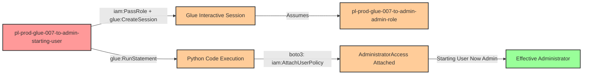

# Privilege Escalation via iam:PassRole + glue:CreateSession + glue:RunStatement

* **Category:** Privilege Escalation
* **Sub-Category:** new-passrole
* **Path Type:** one-hop
* **Target:** to-admin
* **Environments:** prod
* **Cost Estimate:** $0/mo
* **Pathfinding.cloud ID:** glue-007
* **Technique:** Pass privileged role to AWS Glue Interactive Session and run Python code to escalate privileges
* **Terraform Variable:** `enable_single_account_privesc_one_hop_to_admin_glue_007_iam_passrole_glue_createsession_glue_runstatement`
* **Schema Version:** 1.0.0
* **Attack Path:** starting_user → (iam:PassRole + glue:CreateSession) → Glue Interactive Session with admin role → (glue:RunStatement with boto3) → attaches AdministratorAccess to starting_user → admin access
* **Attack Principals:** `arn:aws:iam::{account_id}:user/pl-prod-glue-007-to-admin-starting-user`; `arn:aws:iam::{account_id}:role/pl-prod-glue-007-to-admin-admin-role`
* **Required Permissions:** `iam:PassRole` on `arn:aws:iam::*:role/pl-prod-glue-007-to-admin-admin-role`; `glue:CreateSession` on `*`; `glue:RunStatement` on `*`
* **Helpful Permissions:** `glue:GetSession` (Check session status and wait for it to be ready); `glue:GetStatement` (Check statement execution status and retrieve output); `glue:DeleteSession` (Clean up the Glue Interactive Session after the attack)
* **MITRE Tactics:** TA0004 - Privilege Escalation
* **MITRE Techniques:** T1098 - Account Manipulation

## Attack Overview

This scenario demonstrates a privilege escalation vulnerability where a user with `iam:PassRole`, `glue:CreateSession`, and `glue:RunStatement` permissions can create an AWS Glue Interactive Session with an administrative role and execute Python code that grants themselves administrative access.

AWS Glue Interactive Sessions provide a serverless, on-demand Spark or Python environment for data exploration and development. Unlike traditional Glue Jobs that execute predefined scripts, Interactive Sessions allow users to run arbitrary code statements in real-time through the `glue:RunStatement` API. When creating an Interactive Session, you specify an IAM role that the session assumes during execution. If an attacker can pass a privileged role to a session and then execute code within it, they can leverage the role's permissions to escalate their own privileges.

This attack is particularly dangerous because it provides immediate, interactive access to execute code with administrative permissions. The attacker doesn't need to wait for job completion or extract credentials - they can directly call AWS APIs using boto3 (which is available by default in Glue sessions) to modify IAM permissions in real-time. The escalation path is straightforward: create a session with an admin role, run a Python statement that attaches AdministratorAccess to the starting user, and immediately gain full administrative access to the AWS environment.

### MITRE ATT&CK Mapping

- **Tactic**: TA0004 - Privilege Escalation
- **Technique**: T1098 - Account Manipulation
- **Sub-technique**: Using cloud compute services with elevated privileges to modify account permissions

### Principals in the attack path

- `arn:aws:iam::PROD_ACCOUNT:user/pl-prod-glue-007-to-admin-starting-user` (Scenario-specific starting user with limited permissions)
- `arn:aws:iam::PROD_ACCOUNT:role/pl-prod-glue-007-to-admin-admin-role` (Administrative role passed to Glue Interactive Session)

### Attack Path Diagram



### Attack Steps

1. **Initial Access**: Start as `pl-prod-glue-007-to-admin-starting-user` (credentials provided via Terraform outputs)
2. **Create Interactive Session**: Use `glue:CreateSession` to create a Glue Interactive Session, passing the admin role via `iam:PassRole`. The session is configured with Python as the command type.
3. **Wait for Session Ready**: Monitor session status using `glue:GetSession` until the session reaches the `READY` state (typically 1-3 minutes for session initialization)
4. **Run Malicious Statement**: Use `glue:RunStatement` to execute Python code within the session that attaches AdministratorAccess to the starting user:
   ```python
   import boto3
   iam = boto3.client('iam')
   iam.attach_user_policy(
       UserName='pl-prod-glue-007-to-admin-starting-user',
       PolicyArn='arn:aws:iam::aws:policy/AdministratorAccess'
   )
   ```
5. **Verification**: Verify administrator access by executing privileged operations (e.g., `aws iam list-users`)

### Scenario specific resources created

| ARN | Purpose |
| -- | -- |
| `arn:aws:iam::PROD_ACCOUNT:user/pl-prod-glue-007-to-admin-starting-user` | Scenario-specific starting user with access keys |
| `arn:aws:iam::PROD_ACCOUNT:role/pl-prod-glue-007-to-admin-admin-role` | Administrative role passed to Glue Interactive Session |
| Inline policy: `pl-prod-glue-007-to-admin-starting-user-policy` | Policy granting PassRole, CreateSession, RunStatement, GetSession, GetStatement, and DeleteSession permissions |

## Attack Lab

### Prerequisites

1. Install the `plabs` CLI:
   ```bash
   brew install pathfinding-labs/tap/plabs
   ```
2. Configure your AWS profiles in `~/.plabs/plabs.yaml` (or run `plabs init` if you haven't already)

### Deploy with plabs non-interactive

```bash
plabs enable enable_single_account_privesc_one_hop_to_admin_glue_007_iam_passrole_glue_createsession_glue_runstatement
plabs apply
```

### Deploy with plabs tui

1. Launch the TUI: `plabs`
2. Navigate to this scenario in the scenarios list
3. Press `space` to enable it
4. Press `d` to deploy

### Cost Considerations

AWS Glue Interactive Sessions cost approximately **$0.44 per DPU-hour**. Interactive Sessions use a minimum of **2 DPUs** by default, though this can be reduced. A typical session for this demonstration takes **3-5 minutes** (including startup time), resulting in costs of approximately **$0.10-0.15 per session**.

**Estimated costs:**
- **Per session:** ~$0.10-0.15 (3-5 minutes with 2 DPUs)
- **10 demo runs:** ~$1.00-1.50
- **Monthly (daily testing):** ~$3-5

Sessions should be stopped after the demonstration to avoid ongoing charges, as idle sessions continue to incur costs.

### Executing the automated demo_attack script

The script will:
1. Display a step-by-step walkthrough with color-coded output
2. Show the commands being executed and their results
3. Create a Glue Interactive Session with the admin role
4. Wait for the session to become ready
5. Execute a Python statement that attaches AdministratorAccess to the starting user
6. Verify successful privilege escalation by demonstrating admin access
7. Output standardized test results for automation

#### Resources created by attack script

- Glue Interactive Session with the admin role attached
- `AdministratorAccess` managed policy attached to `pl-prod-glue-007-to-admin-starting-user`

#### With plabs non-interactive

```bash
plabs demo --list
plabs demo glue-007-iam-passrole+glue-createsession+glue-runstatement
```

#### With plabs tui

1. Launch the TUI: `plabs`
2. Navigate to this scenario in the scenarios list
3. Press `r` to run the demo script

### Cleanup

#### With plabs non-interactive

```bash
plabs cleanup --list
plabs cleanup glue-007-iam-passrole+glue-createsession+glue-runstatement
```

#### With plabs tui

1. Launch the TUI: `plabs`
2. Navigate to this scenario in the scenarios list
3. Press `c` to run the cleanup script

### Teardown with plabs non-interactive

```bash
plabs disable enable_single_account_privesc_one_hop_to_admin_glue_007_iam_passrole_glue_createsession_glue_runstatement
plabs apply
```

### Teardown with plabs tui

1. Launch the TUI: `plabs`
2. Navigate to this scenario in the scenarios list
3. Press `space` to disable it
4. Press `D` to destroy

## Detecting Misconfiguration (CSPM)

### What CSPM tools should detect

A properly configured CSPM solution should identify:
- IAM user with `iam:PassRole` permission on privileged roles
- IAM user with `glue:CreateSession` and `glue:RunStatement` permissions
- Combination of PassRole and Glue Interactive Session permissions enabling privilege escalation
- IAM role with administrative permissions that can be passed to Glue services
- Glue trust policy allowing the Glue service to assume privileged roles
- Privilege escalation path from user to admin via Glue Interactive Sessions

### Prevention recommendations

- **Restrict PassRole permissions**: Limit `iam:PassRole` to only the specific roles and services needed. Use resource-level restrictions:
  ```json
  {
    "Effect": "Allow",
    "Action": "iam:PassRole",
    "Resource": "arn:aws:iam::*:role/specific-glue-role",
    "Condition": {
      "StringEquals": {
        "iam:PassedToService": "glue.amazonaws.com"
      }
    }
  }
  ```

- **Implement SCPs to prevent privilege escalation**: Use Service Control Policies to deny PassRole on administrative roles:
  ```json
  {
    "Effect": "Deny",
    "Action": "iam:PassRole",
    "Resource": "arn:aws:iam::*:role/*admin*",
    "Condition": {
      "StringEquals": {
        "iam:PassedToService": "glue.amazonaws.com"
      }
    }
  }
  ```

- **Restrict glue:CreateSession and glue:RunStatement permissions**: Only grant these permissions to users who legitimately need interactive data exploration capabilities. These are powerful permissions that allow arbitrary code execution and should be tightly controlled.

- **Monitor CloudTrail for Interactive Session activity**: Alert on `CreateSession` API calls, especially when combined with PassRole on privileged roles. Monitor `RunStatement` calls for suspicious code patterns, particularly those involving boto3 IAM operations.

- **Use IAM Access Analyzer**: Enable IAM Access Analyzer to automatically detect privilege escalation paths involving PassRole and Glue services. Review findings regularly and remediate identified risks.

- **Implement least privilege for Glue roles**: When creating IAM roles for Glue services, grant only the minimum permissions required for the specific data exploration tasks. Avoid using administrative policies like `AdministratorAccess` or `PowerUserAccess` on Glue service roles. Typical Glue sessions need S3, Glue Data Catalog, and CloudWatch Logs access - not IAM permissions.

- **Require MFA for sensitive operations**: Implement MFA requirements for operations like `glue:CreateSession`, `glue:RunStatement`, and `iam:PassRole` to add an additional layer of security against compromised credentials.

- **Use VPC endpoints and network isolation**: Configure Glue Interactive Sessions to run within private VPCs without public internet access, reducing the attack surface even if a session is created with elevated privileges.

- **Implement session time limits**: Configure automatic session termination after a defined idle period to limit the window of opportunity for exploitation and reduce costs from forgotten sessions.

- **Separate Glue accounts**: Consider running production Glue workloads in dedicated AWS accounts with strict cross-account access controls, limiting the blast radius of compromised Glue permissions.

## Detection Abuse (CloudSIEM)

### CloudTrail events to monitor

- `IAM: PassRole` — Starting user passes the admin role to the Glue service; critical when the target role has elevated permissions
- `Glue: CreateSession` — New Glue Interactive Session created; high severity when the `Role` parameter references an administrative role
- `Glue: RunStatement` — Statement executed within a Glue Interactive Session; monitor for boto3 IAM operations in the statement code
- `IAM: AttachUserPolicy` — Managed policy attached to an IAM user from a Glue session context; critical when the policy is `AdministratorAccess`
- `IAM: PutUserPolicy` — Inline policy added to an IAM user from a Glue session context
- `Glue: DeleteSession` — Session deleted after use; short-lived sessions (created, used briefly, then deleted) indicate potential abuse

### Detonation logs

_Detonation log integration (Stratus Red Team / Grimoire) is planned for a future release._

## References

- [AWS Glue Interactive Sessions Documentation](https://docs.aws.amazon.com/glue/latest/dg/interactive-sessions.html)
- [AWS Glue Interactive Sessions API](https://docs.aws.amazon.com/glue/latest/dg/aws-glue-api-interactive-sessions.html)
- [AWS IAM PassRole Documentation](https://docs.aws.amazon.com/IAM/latest/UserGuide/id_roles_use_passrole.html)
- [Rhino Security Labs - AWS IAM Privilege Escalation Methods](https://rhinosecuritylabs.com/aws/aws-privilege-escalation-methods-mitigation/)
