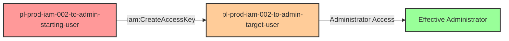

# Privilege Escalation via iam:CreateAccessKey

* **Category:** Privilege Escalation
* **Sub-Category:** credential-access
* **Path Type:** one-hop
* **Target:** to-admin
* **Environments:** prod
* **Cost Estimate:** $0/mo
* **Pathfinding.cloud ID:** iam-002
* **Technique:** Creating access keys for privileged users to gain administrative access
* **Terraform Variable:** `enable_single_account_privesc_one_hop_to_admin_iam_002_iam_createaccesskey`
* **Schema Version:** 1.0.0
* **Attack Path:** starting_user → (iam:CreateAccessKey) → admin_user credentials → admin access
* **Attack Principals:** `arn:aws:iam::{account_id}:user/pl-prod-iam-002-to-admin-starting-user`; `arn:aws:iam::{account_id}:user/pl-prod-iam-002-to-admin-target-user`
* **Required Permissions:** `iam:CreateAccessKey` on `arn:aws:iam::*:user/pl-prod-iam-002-to-admin-target-user`
* **Helpful Permissions:** `iam:ListUsers` (Discover privileged users to target); `iam:GetUser` (View user details and attached policies); `iam:ListAttachedUserPolicies` (Identify users with admin permissions)
* **MITRE Tactics:** TA0004 - Privilege Escalation, TA0003 - Persistence
* **MITRE Techniques:** T1098.001 - Account Manipulation: Additional Cloud Credentials

## Attack Overview

This scenario demonstrates a critical privilege escalation vulnerability where a user has permission to create access keys for other IAM users, including those with administrative privileges. The `iam:CreateAccessKey` permission allows an attacker to generate new programmatic credentials for any user they have permission to target, effectively assuming that user's identity and permissions.

In many environments, IAM users with administrative access are created for emergency access or legacy purposes. If a less privileged user has `iam:CreateAccessKey` permission on these admin accounts, they can bypass all intended access controls by simply creating new credentials and authenticating as the privileged user. This is particularly dangerous because it allows complete identity takeover without requiring the victim's existing credentials.

This attack is straightforward to execute, difficult to prevent through traditional IAM boundaries, and can provide instant administrative access to an entire AWS environment. Organizations often overlook this privilege escalation path because it doesn't modify permissions directly - instead, it exploits the ability to generate new authentication credentials for existing privileged accounts.

### MITRE ATT&CK Mapping

- **Tactic**: TA0004 - Privilege Escalation, TA0003 - Persistence
- **Technique**: T1098.001 - Account Manipulation: Additional Cloud Credentials

### Principals in the attack path

- `arn:aws:iam::PROD_ACCOUNT:user/pl-prod-iam-002-to-admin-starting-user` (Scenario-specific starting user with limited permissions)
- `arn:aws:iam::PROD_ACCOUNT:user/pl-prod-iam-002-to-admin-target-user` (Target admin user with AdministratorAccess policy)

### Attack Path Diagram



### Attack Steps

1. **Initial Access**: Start as `pl-prod-iam-002-to-admin-starting-user` (credentials provided via Terraform outputs)
2. **Create Access Keys**: Use `iam:CreateAccessKey` to create new programmatic credentials for the admin user `pl-prod-iam-002-to-admin-target-user`
3. **Switch Context**: Configure AWS CLI with the newly created access key and secret key
4. **Verification**: Verify administrator access by listing IAM users or performing other admin-level actions

### Scenario specific resources created

| ARN | Purpose |
| -- | -- |
| `arn:aws:iam::PROD_ACCOUNT:user/pl-prod-iam-002-to-admin-starting-user` | Scenario-specific starting user with access keys and iam:CreateAccessKey permission |
| `arn:aws:iam::PROD_ACCOUNT:user/pl-prod-iam-002-to-admin-target-user` | Target admin user with AdministratorAccess managed policy attached |

## Attack Lab

### Prerequisites

1. Install the `plabs` CLI:
   ```bash
   brew install pathfinding-labs/tap/plabs
   ```
2. Configure your AWS profiles in `~/.plabs/plabs.yaml` (or run `plabs init` if you haven't already)

### Deploy with plabs non-interactive

```bash
plabs enable enable_single_account_privesc_one_hop_to_admin_iam_002_iam_createaccesskey
plabs apply
```

### Deploy with plabs tui

1. Launch the TUI: `plabs`
2. Navigate to this scenario in the scenarios list
3. Press `space` to enable it
4. Press `d` to deploy

### Executing the automated demo_attack script

The script will:
1. Display a step-by-step walkthrough with color-coded output
2. Show the commands being executed and their results
3. Verify successful privilege escalation
4. Output standardized test results for automation

#### Resources created by attack script

- Access keys for `pl-prod-iam-002-to-admin-target-user` (permanent IAM access key pair)

#### With plabs non-interactive

```bash
plabs demo --list
plabs demo iam-002-iam-createaccesskey
```

#### With plabs tui

1. Launch the TUI: `plabs`
2. Navigate to this scenario in the scenarios list
3. Press `r` to run the demo script

### Cleanup

#### With plabs non-interactive

```bash
plabs cleanup --list
plabs cleanup iam-002-iam-createaccesskey
```

#### With plabs tui

1. Launch the TUI: `plabs`
2. Navigate to this scenario in the scenarios list
3. Press `c` to run the cleanup script

### Teardown with plabs non-interactive

```bash
plabs disable enable_single_account_privesc_one_hop_to_admin_iam_002_iam_createaccesskey
plabs apply
```

### Teardown with plabs tui

1. Launch the TUI: `plabs`
2. Navigate to this scenario in the scenarios list
3. Press `space` to disable it
4. Press `D` to destroy

## Detecting Misconfiguration (CSPM)

### What CSPM tools should detect

- IAM user (`pl-prod-iam-002-to-admin-starting-user`) has `iam:CreateAccessKey` permission scoped to a privileged IAM user
- IAM user (`pl-prod-iam-002-to-admin-target-user`) with `AdministratorAccess` is targetable for credential creation by a less-privileged principal
- Privilege escalation path exists: non-admin user can generate persistent credentials for an admin user without modifying any policies

### Prevention recommendations

- Implement least privilege principles - avoid granting `iam:CreateAccessKey` permissions unless absolutely necessary
- Use resource-based conditions to restrict which users can have access keys created: `"Condition": {"StringNotEquals": {"aws:username": ["admin-user"]}}`
- Implement Service Control Policies (SCPs) at the organization level to prevent access key creation on privileged accounts
- Monitor CloudTrail for `CreateAccessKey` API calls, especially on users with elevated permissions
- Enable MFA requirements for sensitive IAM operations using condition keys like `aws:MultiFactorAuthPresent`
- Use IAM Access Analyzer to identify and remediate privilege escalation paths involving `iam:CreateAccessKey`
- Consider using IAM roles instead of IAM users for administrative access, as roles cannot have access keys created by other principals
- Implement automated alerting on access key creation events for admin accounts using CloudWatch Events or EventBridge

## Detection Abuse (CloudSIEM)

### CloudTrail events to monitor

- `IAM: CreateAccessKey` — New access keys were created for an IAM user; critical when the target user has elevated permissions

### Detonation logs

_Detonation log integration (Stratus Red Team / Grimoire) is planned for a future release._
