# Privilege Escalation via iam:DeleteAccessKey + iam:CreateAccessKey

* **Category:** Privilege Escalation
* **Sub-Category:** credential-access
* **Path Type:** one-hop
* **Target:** to-admin
* **Environments:** prod
* **Cost Estimate:** $0/mo
* **Pathfinding.cloud ID:** iam-003
* **Technique:** Bypassing AWS's 2-access-key limit by deleting an existing key before creating a new one for an admin user
* **Terraform Variable:** `enable_single_account_privesc_one_hop_to_admin_iam_003_iam_deleteaccesskey_createaccesskey`
* **Schema Version:** 1.0.0
* **Attack Path:** starting_user → (iam:ListAccessKeys) → list existing keys → (iam:DeleteAccessKey) → delete one key → (iam:CreateAccessKey) → create new key for admin_user → admin access
* **Attack Principals:** `arn:aws:iam::{account_id}:user/pl-prod-iam-003-to-admin-starting-user`; `arn:aws:iam::{account_id}:user/pl-prod-iam-003-to-admin-target-user`
* **Required Permissions:** `iam:DeleteAccessKey` on `arn:aws:iam::*:user/pl-prod-iam-003-to-admin-target-user`; `iam:CreateAccessKey` on `arn:aws:iam::*:user/pl-prod-iam-003-to-admin-target-user`
* **Helpful Permissions:** `iam:ListAccessKeys` (List existing access keys to identify which one to delete); `iam:ListUsers` (Discover privileged users to target); `iam:GetUser` (View user details and attached policies); `iam:ListAttachedUserPolicies` (Identify users with admin permissions)
* **MITRE Tactics:** TA0004 - Privilege Escalation, TA0003 - Persistence
* **MITRE Techniques:** T1098.001 - Account Manipulation: Additional Cloud Credentials

## Attack Overview

This scenario demonstrates a sophisticated variation of the `iam:CreateAccessKey` privilege escalation technique. AWS limits each IAM user to a maximum of two access keys. When a target admin user already has two active access keys, a simple `iam:CreateAccessKey` attack would fail. However, if an attacker has both `iam:DeleteAccessKey` and `iam:CreateAccessKey` permissions, they can bypass this limitation by first deleting one of the existing keys, then creating a new one under their control.

This attack is particularly dangerous because it works even when standard `iam:CreateAccessKey` exploitation would be blocked by AWS's built-in safety limits. Organizations that believe they're protected because their admin users maintain two active keys are vulnerable to this bypass technique. The attacker can identify which keys exist, delete one (potentially disrupting legitimate automation or access), and then create a new key they control.

This technique represents a common oversight in IAM security monitoring. While many organizations watch for `CreateAccessKey` API calls on privileged accounts, they may not correlate these events with preceding `DeleteAccessKey` calls. The combination of these two permissions creates a privilege escalation path that's more subtle and harder to detect than the standard access key creation attack, especially if the deleted key wasn't actively monitored.

### MITRE ATT&CK Mapping

- **Tactic**: TA0004 - Privilege Escalation, TA0003 - Persistence
- **Technique**: T1098.001 - Account Manipulation: Additional Cloud Credentials

### Principals in the attack path

- `arn:aws:iam::PROD_ACCOUNT:user/pl-prod-iam-003-to-admin-starting-user` (Scenario-specific starting user with limited permissions)
- `arn:aws:iam::PROD_ACCOUNT:user/pl-prod-iam-003-to-admin-target-user` (Target admin user with AdministratorAccess policy and 2 existing access keys)

### Attack Path Diagram

```mermaid
graph LR
    A[pl-prod-iam-003-to-admin-starting-user] -->|iam:ListAccessKeys| B[Enumerate Keys]
    B -->|iam:DeleteAccessKey| C[Delete Existing Key]
    C -->|iam:CreateAccessKey| D[pl-prod-iam-003-to-admin-target-user]
    D -->|Administrator Access| E[Effective Administrator]

    style A fill:#ff9999,stroke:#333,stroke-width:2px
    style B fill:#ffcc99,stroke:#333,stroke-width:2px
    style C fill:#ffcc99,stroke:#333,stroke-width:2px
    style D fill:#ffcc99,stroke:#333,stroke-width:2px
    style E fill:#99ff99,stroke:#333,stroke-width:2px
```



### Attack Steps

1. **Initial Access**: Start as `pl-prod-iam-003-to-admin-starting-user` (credentials provided via Terraform outputs)
2. **List Access Keys**: Use `iam:ListAccessKeys` to enumerate existing access keys for the target admin user
3. **Delete Access Key**: Use `iam:DeleteAccessKey` to remove one of the two existing access keys, freeing up a slot
4. **Create New Access Key**: Use `iam:CreateAccessKey` to create new programmatic credentials for the admin user under attacker control
5. **Switch Context**: Configure AWS CLI with the newly created access key and secret key
6. **Verification**: Verify administrator access by listing IAM users or performing other admin-level actions

### Scenario specific resources created

| ARN | Purpose |
| -- | -- |
| `arn:aws:iam::PROD_ACCOUNT:user/pl-prod-iam-003-to-admin-starting-user` | Scenario-specific starting user with access keys and permissions to delete and create access keys |
| `arn:aws:iam::PROD_ACCOUNT:user/pl-prod-iam-003-to-admin-target-user` | Target admin user with AdministratorAccess managed policy attached and 2 pre-existing access keys |

## Attack Lab

### Prerequisites

1. Install the `plabs` CLI:
   ```bash
   brew install pathfinding-labs/tap/plabs
   ```
2. Configure your AWS profiles in `~/.plabs/plabs.yaml` (or run `plabs init` if you haven't already)

### Deploy with plabs non-interactive

```bash
plabs enable enable_single_account_privesc_one_hop_to_admin_iam_003_iam_deleteaccesskey_createaccesskey
plabs apply
```

### Deploy with plabs tui

1. Launch the TUI: `plabs`
2. Navigate to this scenario in the scenarios list
3. Press `space` to enable it
4. Press `d` to deploy

### Executing the automated demo_attack script

The script will:
1. Display a step-by-step walkthrough with color-coded output
2. Show the commands being executed and their results
3. Demonstrate bypassing the 2-key limit by deleting an existing key
4. Verify successful privilege escalation
5. Output standardized test results for automation

#### Resources created by attack script

- New IAM access key created for `pl-prod-iam-003-to-admin-target-user`

#### With plabs non-interactive

```bash
plabs demo --list
plabs demo iam-003-iam-deleteaccesskey+createaccesskey
```

#### With plabs tui

1. Launch the TUI: `plabs`
2. Navigate to this scenario in the scenarios list
3. Press `r` to run the demo script

### Cleanup

#### With plabs non-interactive

```bash
plabs cleanup --list
plabs cleanup iam-003-iam-deleteaccesskey+createaccesskey
```

#### With plabs tui

1. Launch the TUI: `plabs`
2. Navigate to this scenario in the scenarios list
3. Press `c` to run the cleanup script

### Teardown with plabs non-interactive

```bash
plabs disable enable_single_account_privesc_one_hop_to_admin_iam_003_iam_deleteaccesskey_createaccesskey
plabs apply
```

### Teardown with plabs tui

1. Launch the TUI: `plabs`
2. Navigate to this scenario in the scenarios list
3. Press `space` to disable it
4. Press `D` to destroy

## Detecting Misconfiguration (CSPM)

### What CSPM tools should detect

- IAM user (`pl-prod-iam-003-to-admin-starting-user`) has `iam:DeleteAccessKey` permission on a privileged user — privilege escalation path via credential manipulation
- IAM user (`pl-prod-iam-003-to-admin-starting-user`) has `iam:CreateAccessKey` permission on a privileged user — allows creation of new credentials for admin account
- Combined `iam:DeleteAccessKey` + `iam:CreateAccessKey` permissions on the same target user creates a bypass for AWS's 2-key limit, enabling credential takeover even when both slots are occupied

### Prevention recommendations

- Implement least privilege principles - avoid granting `iam:DeleteAccessKey` and `iam:CreateAccessKey` permissions unless absolutely necessary
- Use resource-based conditions to restrict which users can have access keys deleted or created: `"Condition": {"StringNotEquals": {"aws:username": ["admin-user"]}}`
- Implement Service Control Policies (SCPs) at the organization level to prevent access key operations on privileged accounts
- Enable MFA requirements for sensitive IAM operations using condition keys like `aws:MultiFactorAuthPresent`
- Use IAM Access Analyzer to identify and remediate privilege escalation paths involving `iam:DeleteAccessKey` and `iam:CreateAccessKey` permissions
- Consider using IAM roles instead of IAM users for administrative access, as roles cannot have access keys created by other principals
- Maintain an inventory of all access keys for privileged accounts and alert on unexpected key lifecycle events (creation, deletion, rotation)

## Detection Abuse (CloudSIEM)

### CloudTrail events to monitor

- `IAM: ListAccessKeys` — Enumeration of existing access keys on a target user; baseline behavior for this attack pattern
- `IAM: DeleteAccessKey` — Access key deleted for an IAM user; critical when the target has elevated permissions and precedes a CreateAccessKey call
- `IAM: CreateAccessKey` — New access keys created for an IAM user; critical when the target has elevated permissions; correlate with preceding DeleteAccessKey on the same user

### Detonation logs

_Detonation log integration (Stratus Red Team / Grimoire) is planned for a future release._
