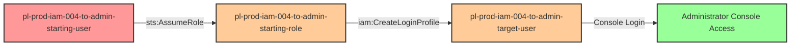

# Privilege Escalation via iam:CreateLoginProfile

* **Category:** Privilege Escalation
* **Sub-Category:** credential-access
* **Path Type:** one-hop
* **Target:** to-admin
* **Environments:** prod
* **Cost Estimate:** $0/mo
* **Pathfinding.cloud ID:** iam-004
* **Technique:** Creating console password for admin user to gain console access
* **Terraform Variable:** `enable_single_account_privesc_one_hop_to_admin_iam_004_iam_createloginprofile`
* **Schema Version:** 1.0.0
* **Attack Path:** starting_user → (AssumeRole) → starting_role → (iam:CreateLoginProfile) → set password for admin_user → console login with admin access
* **Attack Principals:** `arn:aws:iam::{account_id}:user/pl-prod-iam-004-to-admin-starting-user`; `arn:aws:iam::{account_id}:role/pl-prod-iam-004-to-admin-starting-role`; `arn:aws:iam::{account_id}:user/pl-prod-iam-004-to-admin-target-user`
* **Required Permissions:** `iam:CreateLoginProfile` on `arn:aws:iam::*:user/pl-prod-iam-004-to-admin-target-user`
* **Helpful Permissions:** `iam:ListUsers` (Discover users without login profiles); `iam:GetUser` (View user details); `iam:GetLoginProfile` (Check if user already has login profile)
* **MITRE Tactics:** TA0004 - Privilege Escalation, TA0003 - Persistence
* **MITRE Techniques:** T1098.001 - Account Manipulation: Additional Cloud Credentials

## Attack Overview

This scenario demonstrates a privilege escalation vulnerability where a role has permission to create login profiles (console passwords) for an administrator user. An attacker can assume a role with `iam:CreateLoginProfile` permission on an admin user who lacks a console password, create a login profile with a password they control, and then use those credentials to access the AWS Management Console with full administrator privileges.

This attack vector is particularly dangerous because many organizations focus on protecting API access keys while overlooking console access. Admin users created for programmatic access often have the `AdministratorAccess` policy but no login profile, making them ideal targets for this technique. Once a login profile is created, the attacker gains interactive console access, which can bypass monitoring systems focused on API-based actions and provides a user-friendly interface for lateral movement and data exfiltration.

The vulnerability commonly occurs when organizations grant broad IAM management permissions without restricting them to specific operations, or when least privilege principles are not applied to credential management permissions.

### MITRE ATT&CK Mapping

- **Tactic**: TA0004 - Privilege Escalation, TA0003 - Persistence
- **Technique**: T1098.001 - Account Manipulation: Additional Cloud Credentials
- **Sub-technique**: Creating console credentials for privileged accounts

### Principals in the attack path

- `arn:aws:iam::PROD_ACCOUNT:user/pl-prod-iam-004-to-admin-starting-user` (Scenario-specific starting user)
- `arn:aws:iam::PROD_ACCOUNT:role/pl-prod-iam-004-to-admin-starting-role` (Vulnerable role with CreateLoginProfile permission)
- `arn:aws:iam::PROD_ACCOUNT:user/pl-prod-iam-004-to-admin-target-user` (Target admin user)

### Attack Path Diagram



### Attack Steps

1. **Initial Access**: Start as `pl-prod-iam-004-to-admin-starting-user` (credentials provided via Terraform outputs)
2. **Assume Role**: Assume the vulnerable role `pl-prod-iam-004-to-admin-starting-role`
3. **Create Login Profile**: Use `iam:CreateLoginProfile` to set a console password for the admin user `pl-prod-iam-004-to-admin-target-user`
4. **Console Login**: Access the AWS Management Console using the target user's username and newly created password
5. **Verification**: Verify administrator access through the console or by testing admin permissions

### Scenario specific resources created

| ARN | Purpose |
| -- | -- |
| `arn:aws:iam::PROD_ACCOUNT:user/pl-prod-iam-004-to-admin-starting-user` | Scenario-specific starting user with access keys |
| `arn:aws:iam::PROD_ACCOUNT:role/pl-prod-iam-004-to-admin-starting-role` | Vulnerable role with CreateLoginProfile permission on admin user |
| `arn:aws:iam::PROD_ACCOUNT:user/pl-prod-iam-004-to-admin-target-user` | Target admin user with AdministratorAccess policy but no initial login profile |

## Attack Lab

### Prerequisites

1. Install the `plabs` CLI:
   ```bash
   brew install pathfinding-labs/tap/plabs
   ```
2. Configure your AWS profiles in `~/.plabs/plabs.yaml` (or run `plabs init` if you haven't already)

### Deploy with plabs non-interactive

```bash
plabs enable enable_single_account_privesc_one_hop_to_admin_iam_004_iam_createloginprofile
plabs apply
```

### Deploy with plabs tui

1. Launch the TUI: `plabs`
2. Navigate to this scenario in the scenarios list
3. Press `space` to enable it
4. Press `d` to deploy

### Executing the automated demo_attack script

The script will:
1. Display a step-by-step walkthrough with color-coded output
2. Show the commands being executed and their results
3. Verify successful privilege escalation
4. Output standardized test results for automation

#### Resources created by attack script

- Login profile (console password) on `pl-prod-iam-004-to-admin-target-user`

#### With plabs non-interactive

```bash
plabs demo --list
plabs demo iam-004-iam-createloginprofile
```

#### With plabs tui

1. Launch the TUI: `plabs`
2. Navigate to this scenario in the scenarios list
3. Press `r` to run the demo script

### Cleanup

#### With plabs non-interactive

```bash
plabs cleanup --list
plabs cleanup iam-004-iam-createloginprofile
```

#### With plabs tui

1. Launch the TUI: `plabs`
2. Navigate to this scenario in the scenarios list
3. Press `c` to run the cleanup script

### Teardown with plabs non-interactive

```bash
plabs disable enable_single_account_privesc_one_hop_to_admin_iam_004_iam_createloginprofile
plabs apply
```

### Teardown with plabs tui

1. Launch the TUI: `plabs`
2. Navigate to this scenario in the scenarios list
3. Press `space` to disable it
4. Press `D` to destroy

## Detecting Misconfiguration (CSPM)

### What CSPM tools should detect

- IAM role has `iam:CreateLoginProfile` permission on a privileged user (privilege escalation path via console credential creation)
- Admin user (`pl-prod-iam-004-to-admin-target-user`) has `AdministratorAccess` and no login profile — making it a silent target for console access creation
- Role can manipulate credentials of a higher-privileged principal without restriction

### Prevention recommendations

- Avoid granting `iam:CreateLoginProfile` permissions on privileged users - use resource-based conditions to restrict which users can have login profiles created
- Implement Service Control Policies (SCPs) to prevent login profile creation on admin users across the organization
- Monitor CloudTrail for `CreateLoginProfile` API calls, especially on privileged accounts, and alert on suspicious activity
- Enforce MFA requirements for console access using IAM policies with `aws:MultiFactorAuthPresent` conditions
- Use IAM Access Analyzer to identify and remediate privilege escalation paths involving credential manipulation
- Regularly audit users with `AdministratorAccess` or other privileged policies to ensure login profiles exist only where necessary
- Implement conditional policies that require console access to originate from trusted IP ranges or networks
- Configure AWS Organizations to centrally manage console access policies and prevent unauthorized credential creation

## Detection Abuse (CloudSIEM)

### CloudTrail events to monitor

- `IAM: CreateLoginProfile` — Console password created for an IAM user; critical when the target user has elevated permissions such as `AdministratorAccess`
- `STS: AssumeRole` — Role assumption by the starting user to gain the vulnerable role's permissions

### Detonation logs

_Detonation log integration (Stratus Red Team / Grimoire) is planned for a future release._
