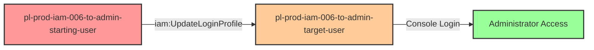

# Privilege Escalation via iam:UpdateLoginProfile

* **Category:** Privilege Escalation
* **Sub-Category:** credential-access
* **Path Type:** one-hop
* **Target:** to-admin
* **Environments:** prod
* **Cost Estimate:** $0/mo
* **Pathfinding.cloud ID:** iam-006
* **Technique:** Password reset for admin user to gain console access
* **Terraform Variable:** `enable_single_account_privesc_one_hop_to_admin_iam_006_iam_updateloginprofile`
* **Schema Version:** 1.0.0
* **Attack Path:** starting_user → (iam:UpdateLoginProfile) → reset admin password → console login with admin access
* **Attack Principals:** `arn:aws:iam::{account_id}:user/pl-prod-iam-006-to-admin-starting-user`; `arn:aws:iam::{account_id}:user/pl-prod-iam-006-to-admin-target-user`
* **Required Permissions:** `iam:UpdateLoginProfile` on `arn:aws:iam::*:user/pl-prod-iam-006-to-admin-target-user`
* **Helpful Permissions:** `iam:ListUsers` (Discover users with login profiles); `iam:GetUser` (View user details); `iam:GetLoginProfile` (Verify user has login profile)
* **MITRE Tactics:** TA0004 - Privilege Escalation, TA0003 - Persistence
* **MITRE Techniques:** T1098.001 - Account Manipulation: Additional Cloud Credentials

## Attack Overview

This scenario demonstrates a privilege escalation vulnerability where a user has permission to update the login profile (console password) of an administrator user. By using the `iam:UpdateLoginProfile` permission, an attacker can reset the console password of an existing admin user and then log into the AWS Console with full administrative privileges.

This attack is particularly dangerous because it provides console access rather than just API access, enabling the attacker to use the AWS web interface with all its capabilities. Unlike creating access keys, which generates audit trails through API calls, console access can be harder to detect and monitor comprehensively. The attack only works against users who already have a console password (login profile) configured, making existing administrator accounts prime targets.

In real-world environments, this vulnerability often occurs when security teams grant broad IAM permissions for user management without properly scoping them to specific resources or implementing condition-based restrictions. Organizations may inadvertently allow help desk staff or junior administrators to reset passwords for any user, including privileged accounts.

### MITRE ATT&CK Mapping

- **Tactic**: Privilege Escalation (TA0004), Persistence (TA0003)
- **Technique**: T1098.001 - Account Manipulation: Additional Cloud Credentials
- **Sub-technique**: Modifying authentication credentials for privileged accounts

### Principals in the attack path

- `arn:aws:iam::PROD_ACCOUNT:user/pl-prod-iam-006-to-admin-starting-user` (Scenario-specific starting user with UpdateLoginProfile permission)
- `arn:aws:iam::PROD_ACCOUNT:user/pl-prod-iam-006-to-admin-target-user` (Target admin user with console access)

### Attack Path Diagram



### Attack Steps

1. **Initial Access**: Start as `pl-prod-iam-006-to-admin-starting-user` (credentials provided via Terraform outputs)
2. **Update Login Profile**: Use `iam:UpdateLoginProfile` to reset the console password for `pl-prod-iam-006-to-admin-target-user`
3. **Console Login**: Log into the AWS Console using the target username and newly set password
4. **Verification**: Verify administrator access through the console or CLI

### Scenario specific resources created

| ARN | Purpose |
| -- | -- |
| `arn:aws:iam::PROD_ACCOUNT:user/pl-prod-iam-006-to-admin-starting-user` | Scenario-specific starting user with access keys and UpdateLoginProfile permission |
| `arn:aws:iam::PROD_ACCOUNT:user/pl-prod-iam-006-to-admin-target-user` | Target admin user with AdministratorAccess and existing login profile |
| `arn:aws:iam::PROD_ACCOUNT:policy/pl-prod-iam-006-to-admin-starting-user-policy` | Inline policy allowing `iam:UpdateLoginProfile` on the target user |

## Attack Lab

### Prerequisites

1. Install the `plabs` CLI:
   ```bash
   brew install pathfinding-labs/tap/plabs
   ```
2. Configure your AWS profiles in `~/.plabs/plabs.yaml` (or run `plabs init` if you haven't already)

### Deploy with plabs non-interactive

```bash
plabs enable enable_single_account_privesc_one_hop_to_admin_iam_006_iam_updateloginprofile
plabs apply
```

### Deploy with plabs tui

1. Launch the TUI: `plabs`
2. Navigate to this scenario in the scenarios list
3. Press `space` to enable it
4. Press `d` to deploy

### Executing the automated demo_attack script

The script will:
1. Display a step-by-step walkthrough with color-coded output
2. Show the commands being executed and their results
3. Verify successful privilege escalation
4. Output standardized test results for automation

#### Resources created by attack script

- Updated console password (login profile) on `pl-prod-iam-006-to-admin-target-user`

#### With plabs non-interactive

```bash
plabs demo --list
plabs demo iam-006-iam-updateloginprofile
```

#### With plabs tui

1. Launch the TUI: `plabs`
2. Navigate to this scenario in the scenarios list
3. Press `r` to run the demo script

### Cleanup

#### With plabs non-interactive

```bash
plabs cleanup --list
plabs cleanup iam-006-iam-updateloginprofile
```

#### With plabs tui

1. Launch the TUI: `plabs`
2. Navigate to this scenario in the scenarios list
3. Press `c` to run the cleanup script

### Teardown with plabs non-interactive

```bash
plabs disable enable_single_account_privesc_one_hop_to_admin_iam_006_iam_updateloginprofile
plabs apply
```

### Teardown with plabs tui

1. Launch the TUI: `plabs`
2. Navigate to this scenario in the scenarios list
3. Press `space` to disable it
4. Press `D` to destroy

## Detecting Misconfiguration (CSPM)

### What CSPM tools should detect

- IAM user `pl-prod-iam-006-to-admin-starting-user` has `iam:UpdateLoginProfile` permission scoped to an administrator user, creating a privilege escalation path
- Privilege escalation path detected: non-privileged user can reset console password of admin user
- IAM policy allows password reset on privileged users without resource-level restrictions

### Prevention recommendations

- Avoid granting `iam:UpdateLoginProfile` permissions on privileged users - use resource-based conditions to restrict which users can have their passwords updated
- Implement Service Control Policies (SCPs) to prevent password updates on administrator accounts
- Require MFA for the `iam:UpdateLoginProfile` action using condition keys like `aws:MultiFactorAuthPresent`
- Monitor CloudTrail for `UpdateLoginProfile` API calls, especially on privileged accounts, and alert on unexpected password changes
- Use IAM Access Analyzer to identify privilege escalation paths involving login profile manipulation
- Implement separate break-glass accounts for emergency access rather than allowing password resets on production admin accounts
- Enable AWS CloudTrail Insights to detect unusual patterns of IAM user credential modifications
- Consider using AWS IAM Identity Center (formerly SSO) for console access instead of long-lived IAM user passwords

## Detection Abuse (CloudSIEM)

### CloudTrail events to monitor

- `IAM: UpdateLoginProfile` — Console password reset on an IAM user; critical when the target account has elevated permissions, as it enables console login as that user

### Detonation logs

_Detonation log integration (Stratus Red Team / Grimoire) is planned for a future release._
