# Privilege Escalation via iam:UpdateAssumeRolePolicy

* **Category:** Privilege Escalation
* **Sub-Category:** principal-access
* **Path Type:** one-hop
* **Target:** to-admin
* **Environments:** prod
* **Cost Estimate:** $0/mo
* **Pathfinding.cloud ID:** iam-012
* **Technique:** Modifying admin role trust policy to grant self-access
* **Terraform Variable:** `enable_single_account_privesc_one_hop_to_admin_iam_012_iam_updateassumerolepolicy`
* **Schema Version:** 1.0.0
* **Attack Path:** starting_user → (iam:UpdateAssumeRolePolicy) → modify admin role trust → (sts:AssumeRole) → admin access
* **Attack Principals:** `arn:aws:iam::{account_id}:user/pl-prod-iam-012-to-admin-starting-user`; `arn:aws:iam::{account_id}:role/pl-prod-iam-012-to-admin-target-role`
* **Required Permissions:** `iam:UpdateAssumeRolePolicy` on `arn:aws:iam::*:role/pl-prod-iam-012-to-admin-target-role`; `sts:AssumeRole` on `arn:aws:iam::*:role/pl-prod-iam-012-to-admin-target-role`
* **Helpful Permissions:** `iam:ListRoles` (Discover privileged roles to target); `iam:GetRole` (View current trust policy before modification)
* **MITRE Tactics:** TA0004 - Privilege Escalation, TA0003 - Persistence
* **MITRE Techniques:** T1098 - Account Manipulation, T1078.004 - Valid Accounts: Cloud Accounts

## Attack Overview

This scenario demonstrates a powerful privilege escalation vulnerability where a user with `iam:UpdateAssumeRolePolicy` permission can modify the trust policy (AssumeRole policy) of a privileged role to grant themselves access. Trust policies control who can assume a role - by modifying this policy, an attacker can inject their own principal as a trusted entity, then immediately assume the role to gain its elevated permissions.

This attack is particularly dangerous because trust policies are often overlooked in security reviews. Organizations may carefully audit identity-based policies attached to roles but forget that trust policies are equally critical for access control. A user with `iam:UpdateAssumeRolePolicy` permission on an admin role can effectively grant themselves admin access in just two API calls.

The scenario creates a user with permission to update the trust policy of an admin role that initially trusts only the EC2 service. The attacker modifies the trust policy to add their own user as a trusted principal, then assumes the role to gain full administrative access.

### MITRE ATT&CK Mapping

- **Tactic**: TA0004 - Privilege Escalation, TA0003 - Persistence
- **Technique**: T1098 - Account Manipulation
- **Technique**: T1078.004 - Valid Accounts: Cloud Accounts

### Principals in the attack path

- `arn:aws:iam::PROD_ACCOUNT:user/pl-prod-iam-012-to-admin-starting-user` (Scenario-specific starting user)
- `arn:aws:iam::PROD_ACCOUNT:role/pl-prod-iam-012-to-admin-target-role` (Admin role with modifiable trust policy)

### Attack Path Diagram

```mermaid
graph LR
    A[pl-prod-iam-012-to-admin-starting-user] -->|iam:UpdateAssumeRolePolicy| B[pl-prod-iam-012-to-admin-target-role]
    B -->|Modify Trust Policy| C[Trust Policy Updated]
    C -->|sts:AssumeRole| D[Assumed Admin Role]
    D -->|Administrator Access| E[Effective Administrator]

    style A fill:#ff9999,stroke:#333,stroke-width:2px
    style B fill:#ffcc99,stroke:#333,stroke-width:2px
    style C fill:#ffcc99,stroke:#333,stroke-width:2px
    style D fill:#ffcc99,stroke:#333,stroke-width:2px
    style E fill:#99ff99,stroke:#333,stroke-width:2px
```



### Attack Steps

1. **Initial Access**: Start as `pl-prod-iam-012-to-admin-starting-user` (credentials provided via Terraform outputs)
2. **Examine Target**: Inspect the current trust policy of the target admin role to understand who can currently assume it
3. **Modify Trust Policy**: Use `iam:UpdateAssumeRolePolicy` to update the role's trust policy, adding the attacker's user ARN as a trusted principal
4. **Wait for Propagation**: Allow 15 seconds for IAM changes to propagate across AWS infrastructure
5. **Assume Admin Role**: Use `sts:AssumeRole` to assume the now-accessible admin role
6. **Verification**: Verify administrator access by listing IAM users or performing other admin actions

### Scenario specific resources created

| ARN | Purpose |
| -- | -- |
| `arn:aws:iam::PROD_ACCOUNT:user/pl-prod-iam-012-to-admin-starting-user` | Scenario-specific starting user with access keys and UpdateAssumeRolePolicy permission |
| `arn:aws:iam::PROD_ACCOUNT:role/pl-prod-iam-012-to-admin-target-role` | Admin role with AdministratorAccess policy, initially trusts only EC2 service |
| `arn:aws:iam::PROD_ACCOUNT:policy/pl-prod-iam-012-to-admin-starting-user-policy` | User policy granting UpdateAssumeRolePolicy and AssumeRole permissions on target role |

## Attack Lab

### Prerequisites

1. Install the `plabs` CLI:
   ```bash
   brew install pathfinding-labs/tap/plabs
   ```
2. Configure your AWS profiles in `~/.plabs/plabs.yaml` (or run `plabs init` if you haven't already)

### Deploy with plabs non-interactive

```bash
plabs enable enable_single_account_privesc_one_hop_to_admin_iam_012_iam_updateassumerolepolicy
plabs apply
```

### Deploy with plabs tui

1. Launch the TUI: `plabs`
2. Navigate to this scenario in the scenarios list
3. Press `space` to enable it
4. Press `d` to deploy

### Executing the automated demo_attack script

The script will:
1. Display a step-by-step walkthrough with color-coded output
2. Show the commands being executed and their results
3. Verify successful privilege escalation
4. Output standardized test results for automation

#### Resources created by attack script

- Modified trust policy on `pl-prod-iam-012-to-admin-target-role` (attacker's user ARN added as trusted principal)
- Temporary STS session credentials from assuming the admin role

#### With plabs non-interactive

```bash
plabs demo --list
plabs demo iam-012-iam-updateassumerolepolicy
```

#### With plabs tui

1. Launch the TUI: `plabs`
2. Navigate to this scenario in the scenarios list
3. Press `r` to run the demo script

### Cleanup

#### With plabs non-interactive

```bash
plabs cleanup --list
plabs cleanup iam-012-iam-updateassumerolepolicy
```

#### With plabs tui

1. Launch the TUI: `plabs`
2. Navigate to this scenario in the scenarios list
3. Press `c` to run the cleanup script

### Teardown with plabs non-interactive

```bash
plabs disable enable_single_account_privesc_one_hop_to_admin_iam_012_iam_updateassumerolepolicy
plabs apply
```

### Teardown with plabs tui

1. Launch the TUI: `plabs`
2. Navigate to this scenario in the scenarios list
3. Press `space` to disable it
4. Press `D` to destroy

## Detecting Misconfiguration (CSPM)

### What CSPM tools should detect

- IAM user has `iam:UpdateAssumeRolePolicy` permission on a privileged/admin role — direct privilege escalation path
- Role trust policy allows modification by non-privileged principals
- Privilege escalation path detected: `pl-prod-iam-012-to-admin-starting-user` can assume `pl-prod-iam-012-to-admin-target-role` via trust policy manipulation
- IAM user has both `iam:UpdateAssumeRolePolicy` and `sts:AssumeRole` on the same admin role resource

### Prevention recommendations

- **Restrict UpdateAssumeRolePolicy permissions**: Avoid granting `iam:UpdateAssumeRolePolicy` permission except to highly trusted automation or security teams
- **Implement resource conditions**: Use IAM condition keys like `aws:RequestedRegion` or `aws:SourceVpc` to limit where trust policy modifications can originate
- **Use SCPs for protection**: Create Service Control Policies (SCPs) that prevent modification of trust policies on critical roles:
  ```json
  {
    "Effect": "Deny",
    "Action": "iam:UpdateAssumeRolePolicy",
    "Resource": "arn:aws:iam::*:role/Admin*",
    "Condition": {
      "StringNotEquals": {
        "aws:PrincipalOrgID": "o-yourorgid"
      }
    }
  }
  ```
- **Require MFA for sensitive operations**: Enforce MFA for any actions that modify role trust relationships using condition keys like `aws:MultiFactorAuthPresent`
- **Use IAM Access Analyzer**: Regularly run IAM Access Analyzer to identify privilege escalation paths involving trust policy modifications
- **Implement least privilege**: Never grant wildcard permissions on `iam:UpdateAssumeRolePolicy` - always specify exact role resources if this permission is needed
- **Audit trust policies regularly**: Include role trust policies in regular security audits, not just identity-based policies

## Detection Abuse (CloudSIEM)

### CloudTrail events to monitor

- `IAM: UpdateAssumeRolePolicy` — Trust policy modified on a role; critical when the target role has elevated permissions, indicates potential privilege escalation setup
- `STS: AssumeRole` — Role assumption event; high severity when preceded by a trust policy modification on the same role within a short time window

### Detonation logs

_Detonation log integration (Stratus Red Team / Grimoire) is planned for a future release._
