# Privilege Escalation via iam:UpdateAssumeRolePolicy

* **Category:** Privilege Escalation
* **Sub-Category:** principal-lateral-movement
* **Path Type:** one-hop
* **Target:** to-admin
* **Environments:** prod
* **Pathfinding.cloud ID:** iam-012
* **Technique:** Modifying admin role trust policy to grant self-access

## Overview

This scenario demonstrates a powerful privilege escalation vulnerability where a user with `iam:UpdateAssumeRolePolicy` permission can modify the trust policy (AssumeRole policy) of a privileged role to grant themselves access. Trust policies control who can assume a role - by modifying this policy, an attacker can inject their own principal as a trusted entity, then immediately assume the role to gain its elevated permissions.

This attack is particularly dangerous because trust policies are often overlooked in security reviews. Organizations may carefully audit identity-based policies attached to roles but forget that trust policies are equally critical for access control. A user with `iam:UpdateAssumeRolePolicy` permission on an admin role can effectively grant themselves admin access in just two API calls.

The scenario creates a user with permission to update the trust policy of an admin role that initially trusts only the EC2 service. The attacker modifies the trust policy to add their own user as a trusted principal, then assumes the role to gain full administrative access.

## Understanding the attack scenario

### Principals in the attack path

- `arn:aws:iam::PROD_ACCOUNT:user/pl-prod-iam-012-to-admin-starting-user` (Scenario-specific starting user)
- `arn:aws:iam::PROD_ACCOUNT:role/pl-prod-iam-012-to-admin-target-role` (Admin role with modifiable trust policy)

### Attack Path Diagram

```mermaid
graph LR
    A[pl-prod-iam-012-to-admin-starting-user] -->|iam:UpdateAssumeRolePolicy| B[pl-prod-iam-012-to-admin-target-role]
    B -->|Modify Trust Policy| C[Trust Policy Updated]
    C -->|sts:AssumeRole| D[Assumed Admin Role]
    D -->|Administrator Access| E[Effective Administrator]

    style A fill:#ff9999,stroke:#333,stroke-width:2px
    style B fill:#ffcc99,stroke:#333,stroke-width:2px
    style C fill:#ffcc99,stroke:#333,stroke-width:2px
    style D fill:#ffcc99,stroke:#333,stroke-width:2px
    style E fill:#99ff99,stroke:#333,stroke-width:2px
```



### Attack Steps

1. **Initial Access**: Start as `pl-prod-iam-012-to-admin-starting-user` (credentials provided via Terraform outputs)
2. **Examine Target**: Inspect the current trust policy of the target admin role to understand who can currently assume it
3. **Modify Trust Policy**: Use `iam:UpdateAssumeRolePolicy` to update the role's trust policy, adding the attacker's user ARN as a trusted principal
4. **Wait for Propagation**: Allow 15 seconds for IAM changes to propagate across AWS infrastructure
5. **Assume Admin Role**: Use `sts:AssumeRole` to assume the now-accessible admin role
6. **Verification**: Verify administrator access by listing IAM users or performing other admin actions

### Scenario specific resources created

| ARN | Purpose |
| -- | -- |
| `arn:aws:iam::PROD_ACCOUNT:user/pl-prod-iam-012-to-admin-starting-user` | Scenario-specific starting user with access keys and UpdateAssumeRolePolicy permission |
| `arn:aws:iam::PROD_ACCOUNT:role/pl-prod-iam-012-to-admin-target-role` | Admin role with AdministratorAccess policy, initially trusts only EC2 service |
| `arn:aws:iam::PROD_ACCOUNT:policy/pl-prod-iam-012-to-admin-starting-user-policy` | User policy granting UpdateAssumeRolePolicy and AssumeRole permissions on target role |

## Executing the attack

### Using the automated demo_attack.sh

To demonstrate the privilege escalation path, run the provided demo script:

```bash
cd modules/scenarios/single-account/privesc-one-hop/to-admin/iam-012-iam-updateassumerolepolicy
./demo_attack.sh
```

The script will:
1. Display a step-by-step walkthrough with color-coded output
2. Show the commands being executed and their results
3. Verify successful privilege escalation
4. Output standardized test results for automation

### Cleaning up the attack artifacts

After demonstrating the attack, clean up the modified trust policy:

```bash
cd modules/scenarios/single-account/privesc-one-hop/to-admin/iam-012-iam-updateassumerolepolicy
./cleanup_attack.sh
```

The cleanup script will restore the original trust policy on the target admin role, removing the attacker's user as a trusted principal.

## Detection and prevention


### MITRE ATT&CK Mapping

- **Tactic**: TA0004 - Privilege Escalation, TA0003 - Persistence
- **Technique**: T1098 - Account Manipulation
- **Technique**: T1078.004 - Valid Accounts: Cloud Accounts


## Prevention recommendations

- **Restrict UpdateAssumeRolePolicy permissions**: Avoid granting `iam:UpdateAssumeRolePolicy` permission except to highly trusted automation or security teams
- **Implement resource conditions**: Use IAM condition keys like `aws:RequestedRegion` or `aws:SourceVpc` to limit where trust policy modifications can originate
- **Use SCPs for protection**: Create Service Control Policies (SCPs) that prevent modification of trust policies on critical roles:
  ```json
  {
    "Effect": "Deny",
    "Action": "iam:UpdateAssumeRolePolicy",
    "Resource": "arn:aws:iam::*:role/Admin*",
    "Condition": {
      "StringNotEquals": {
        "aws:PrincipalOrgID": "o-yourorgid"
      }
    }
  }
  ```
- **Monitor CloudTrail for trust modifications**: Set up CloudWatch alerts for `UpdateAssumeRolePolicy` API calls, especially on privileged roles
- **Require MFA for sensitive operations**: Enforce MFA for any actions that modify role trust relationships using condition keys like `aws:MultiFactorAuthPresent`
- **Use IAM Access Analyzer**: Regularly run IAM Access Analyzer to identify privilege escalation paths involving trust policy modifications
- **Implement least privilege**: Never grant wildcard permissions on `iam:UpdateAssumeRolePolicy` - always specify exact role resources if this permission is needed
- **Audit trust policies regularly**: Include role trust policies in regular security audits, not just identity-based policies
