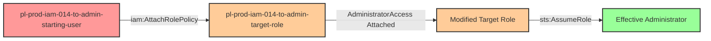

# One-Hop Privilege Escalation: iam:AttachRolePolicy + sts:AssumeRole

* **Category:** Privilege Escalation
* **Sub-Category:** principal-access
* **Path Type:** one-hop
* **Target:** to-admin
* **Environments:** prod
* **Cost Estimate:** $0/mo
* **Pathfinding.cloud ID:** iam-014
* **Technique:** Attaching administrator policy to an assumable role to gain admin access
* **Terraform Variable:** `enable_single_account_privesc_one_hop_to_admin_iam_014_iam_attachrolepolicy_sts_assumerole`
* **Schema Version:** 1.0.0
* **Attack Path:** starting_user → (iam:AttachRolePolicy) → target_role (attach AdministratorAccess) → (sts:AssumeRole) → target_role credentials → admin access
* **Attack Principals:** `arn:aws:iam::{account_id}:user/pl-prod-iam-014-to-admin-starting-user`; `arn:aws:iam::{account_id}:role/pl-prod-iam-014-to-admin-target-role`
* **Required Permissions:** `iam:AttachRolePolicy` on `arn:aws:iam::*:role/pl-prod-iam-014-to-admin-target-role`; `sts:AssumeRole` on `arn:aws:iam::*:role/pl-prod-iam-014-to-admin-target-role`
* **Helpful Permissions:** `iam:ListRoles` (Discover available roles that can be modified); `iam:GetRole` (View role trust policies to identify assumable roles); `iam:ListAttachedRolePolicies` (View current role permissions before and after modification)
* **MITRE Tactics:** TA0004 - Privilege Escalation
* **MITRE Techniques:** T1098 - Account Manipulation

## Attack Overview

This scenario demonstrates a privilege escalation vulnerability where a user has permission to both attach managed policies to a role AND assume that role. Unlike self-escalation scenarios where a role modifies its own permissions, this scenario involves lateral movement - a user modifying a different principal (a role) and then assuming it to gain elevated privileges.

The combination of `iam:AttachRolePolicy` and `sts:AssumeRole` on the same target role creates a complete privilege escalation path. Even if the target role initially has minimal or no privileges, the attacker can attach the AWS-managed `AdministratorAccess` policy to it and then assume the newly-privileged role to gain full administrative access.

This pattern is particularly dangerous because it may appear safe at first glance - the user doesn't directly have admin permissions, and the target role may only have read-only access. However, write access to a role's policy combined with the ability to assume that role is functionally equivalent to having administrative access.

### MITRE ATT&CK Mapping

- **Tactic**: Privilege Escalation (TA0004)
- **Technique**: T1098 - Account Manipulation
- **Sub-technique**: Modifying cloud account permissions to escalate privileges

### Principals in the attack path

- `arn:aws:iam::PROD_ACCOUNT:user/pl-prod-iam-014-to-admin-starting-user` (Scenario-specific starting user)
- `arn:aws:iam::PROD_ACCOUNT:role/pl-prod-iam-014-to-admin-target-role` (Target role that gets modified and assumed)

### Attack Path Diagram



### Attack Steps

1. **Initial Access**: Start as `pl-prod-iam-014-to-admin-starting-user` (credentials provided via Terraform outputs)
2. **Attach Admin Policy**: Use `iam:AttachRolePolicy` to attach the AWS-managed `AdministratorAccess` policy to `pl-prod-iam-014-to-admin-target-role`
3. **Wait for Propagation**: Wait 15 seconds for IAM policy changes to propagate across AWS infrastructure
4. **Assume Modified Role**: Use `sts:AssumeRole` to obtain temporary credentials for the now-privileged target role
5. **Verification**: Verify administrator access using the assumed role credentials

### Scenario specific resources created

| ARN | Purpose |
| -- | -- |
| `arn:aws:iam::PROD_ACCOUNT:user/pl-prod-iam-014-to-admin-starting-user` | Scenario-specific starting user with access keys and inline policy granting iam:AttachRolePolicy and sts:AssumeRole |
| `arn:aws:iam::PROD_ACCOUNT:role/pl-prod-iam-014-to-admin-target-role` | Target role with minimal permissions that can be modified and assumed |

## Attack Lab

### Prerequisites

1. Install the `plabs` CLI:
   ```bash
   brew install pathfinding-labs/tap/plabs
   ```
2. Configure your AWS profiles in `~/.plabs/plabs.yaml` (or run `plabs init` if you haven't already)

### Deploy with plabs non-interactive

```bash
plabs enable enable_single_account_privesc_one_hop_to_admin_iam_014_iam_attachrolepolicy_sts_assumerole
plabs apply
```

### Deploy with plabs tui

1. Launch the TUI: `plabs`
2. Navigate to this scenario in the scenarios list
3. Press `space` to enable it
4. Press `d` to deploy

### Executing the automated demo_attack script

The script will:
1. Display a step-by-step walkthrough with color-coded output
2. Show the commands being executed and their results
3. Verify successful privilege escalation
4. Output standardized test results for automation

#### Resources created by attack script

- Managed policy attachment: `AdministratorAccess` attached to `pl-prod-iam-014-to-admin-target-role`

#### With plabs non-interactive

```bash
plabs demo --list
plabs demo iam-014-iam-attachrolepolicy+sts-assumerole
```

#### With plabs tui

1. Launch the TUI: `plabs`
2. Navigate to this scenario in the scenarios list
3. Press `r` to run the demo script

### Cleanup

#### With plabs non-interactive

```bash
plabs cleanup --list
plabs cleanup iam-014-iam-attachrolepolicy+sts-assumerole
```

#### With plabs tui

1. Launch the TUI: `plabs`
2. Navigate to this scenario in the scenarios list
3. Press `c` to run the cleanup script

### Teardown with plabs non-interactive

```bash
plabs disable enable_single_account_privesc_one_hop_to_admin_iam_014_iam_attachrolepolicy_sts_assumerole
plabs apply
```

### Teardown with plabs tui

1. Launch the TUI: `plabs`
2. Navigate to this scenario in the scenarios list
3. Press `space` to disable it
4. Press `D` to destroy

## Detecting Misconfiguration (CSPM)

### What CSPM tools should detect

- IAM principal (`pl-prod-iam-014-to-admin-starting-user`) has both `iam:AttachRolePolicy` and `sts:AssumeRole` on the same target role, creating a complete privilege escalation path
- The target role (`pl-prod-iam-014-to-admin-target-role`) is assumable by a principal that can also modify its own attached policies
- Privilege escalation path exists: starting user can elevate to admin by attaching `AdministratorAccess` and assuming the target role

### Prevention recommendations

- **Implement SCPs to restrict policy attachment**: Use service control policies to prevent attachment of highly privileged managed policies like `AdministratorAccess` or `PowerUserAccess`
- **Separate attachment and assumption permissions**: Avoid granting both `iam:AttachRolePolicy` and `sts:AssumeRole` to the same principal for the same role
- **Use resource-based conditions on AttachRolePolicy**: Restrict which policies can be attached using the `iam:PolicyARN` condition key to prevent attachment of admin policies
- **Implement permissions boundaries**: Use IAM permissions boundaries to limit the maximum permissions a role can have, even if admin policies are attached
- **Enable MFA for sensitive operations**: Require MFA for both policy attachment operations and role assumption to add an additional security layer
- **Use IAM Access Analyzer**: Regularly scan for privilege escalation paths involving policy modification and role assumption combinations
- **Apply least privilege**: Grant `iam:AttachRolePolicy` only when absolutely necessary, and scope it to specific roles with resource ARN conditions
- **Implement approval workflows**: Require manual approval for attaching managed policies to roles, especially AWS-managed policies with broad permissions

## Detection Abuse (CloudSIEM)

### CloudTrail events to monitor

- `IAM: AttachRolePolicy` — Managed policy attached to a role; critical when the attached policy is `AdministratorAccess` or similarly broad, especially when followed by a role assumption
- `STS: AssumeRole` — Role assumption event; high severity when the assumed role was recently modified via `AttachRolePolicy` within the same session or time window

### Detonation logs

_Detonation log integration (Stratus Red Team / Grimoire) is planned for a future release._
