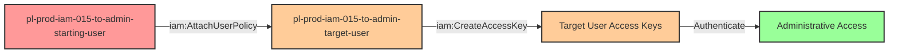

# Privilege Escalation via iam:AttachUserPolicy + iam:CreateAccessKey

* **Category:** Privilege Escalation
* **Sub-Category:** principal-access
* **Path Type:** one-hop
* **Target:** to-admin
* **Environments:** prod
* **Cost Estimate:** $0/mo
* **Pathfinding.cloud ID:** iam-015
* **Technique:** User with AttachUserPolicy and CreateAccessKey on another user can attach AWS-managed AdministratorAccess policy, create access keys, and gain admin access
* **Terraform Variable:** `enable_single_account_privesc_one_hop_to_admin_iam_015_iam_attachuserpolicy_iam_createaccesskey`
* **Schema Version:** 1.0.0
* **Attack Path:** starting_user → (AttachUserPolicy on target_user) → (CreateAccessKey for target_user) → authenticate as target_user → admin access
* **Attack Principals:** `arn:aws:iam::{account_id}:user/pl-prod-iam-015-to-admin-starting-user`; `arn:aws:iam::{account_id}:user/pl-prod-iam-015-to-admin-target-user`
* **Required Permissions:** `iam:AttachUserPolicy` on `arn:aws:iam::*:user/pl-prod-iam-015-to-admin-target-user`; `iam:CreateAccessKey` on `arn:aws:iam::*:user/pl-prod-iam-015-to-admin-target-user`
* **Helpful Permissions:** `iam:ListUsers` (Discover target users to escalate through); `iam:GetUser` (Get target user details and current permissions); `iam:ListAttachedUserPolicies` (List managed policies attached to target user); `iam:ListPolicies` (Discover available AWS-managed policies to attach); `iam:ListAccessKeys` (List existing access keys for target user)
* **MITRE Tactics:** TA0004 - Privilege Escalation, TA0003 - Persistence
* **MITRE Techniques:** T1098.001 - Account Manipulation: Additional Cloud Credentials

## Attack Overview

This scenario demonstrates a privilege escalation vulnerability that combines two powerful IAM permissions: `iam:AttachUserPolicy` and `iam:CreateAccessKey`. When a user has both of these permissions on another IAM user, they can perform lateral movement to gain administrative privileges through that target user.

The attack works by first attaching the AWS-managed `AdministratorAccess` policy to the target user using `iam:AttachUserPolicy`, then creating new access keys for that user with `iam:CreateAccessKey`. The attacker can then authenticate using these new credentials to gain full administrative access to the AWS account.

This is a classic example of a lateral movement privilege escalation path where the attacker doesn't directly escalate their own permissions, but instead leverages their ability to modify and impersonate another user. This scenario differs from the `iam-putuserpolicy+iam-createaccesskey` variant by using AWS-managed policies instead of inline policies, which are often overlooked in security reviews because managed policies are generally considered "safer."

### MITRE ATT&CK Mapping

- **Tactic**: Privilege Escalation (TA0004), Persistence (TA0003)
- **Technique**: T1098.001 - Account Manipulation: Additional Cloud Credentials

### Principals in the attack path

- `arn:aws:iam::PROD_ACCOUNT:user/pl-prod-iam-015-to-admin-starting-user` (Scenario-specific starting user)
- `arn:aws:iam::PROD_ACCOUNT:user/pl-prod-iam-015-to-admin-target-user` (Target user that will be granted admin access)

### Attack Path Diagram



### Attack Steps

1. **Initial Access**: Start as `pl-prod-iam-015-to-admin-starting-user` (credentials provided via Terraform outputs)
2. **Attach Admin Policy**: Use `iam:AttachUserPolicy` to attach the AWS-managed `AdministratorAccess` policy to `pl-prod-iam-015-to-admin-target-user`
3. **Create Access Keys**: Use `iam:CreateAccessKey` to generate new access keys for the target user
4. **Authenticate as Target**: Configure AWS CLI with the newly created access keys
5. **Verification**: Verify administrative access by calling privileged IAM APIs (e.g., `iam:ListUsers`)

### Scenario specific resources created

| ARN | Purpose |
| -- | -- |
| `arn:aws:iam::PROD_ACCOUNT:user/pl-prod-iam-015-to-admin-starting-user` | Scenario-specific starting user with access keys and permissions to attach policies and create keys for target user |
| `arn:aws:iam::PROD_ACCOUNT:user/pl-prod-iam-015-to-admin-target-user` | Target user that will be granted admin access via policy attachment |
| `arn:aws:iam::PROD_ACCOUNT:policy/pl-prod-iam-015-to-admin-starting-user-policy` | IAM policy granting AttachUserPolicy and CreateAccessKey on target user |

## Attack Lab

### Prerequisites

1. Install the `plabs` CLI:
   ```bash
   brew install pathfinding-labs/tap/plabs
   ```
2. Configure your AWS profiles in `~/.plabs/plabs.yaml` (or run `plabs init` if you haven't already)

### Deploy with plabs non-interactive

```bash
plabs enable enable_single_account_privesc_one_hop_to_admin_iam_015_iam_attachuserpolicy_iam_createaccesskey
plabs apply
```

### Deploy with plabs tui

1. Launch the TUI: `plabs`
2. Navigate to this scenario in the scenarios list
3. Press `space` to enable it
4. Press `d` to deploy

### Executing the automated demo_attack script

The script will:
1. Display a step-by-step walkthrough with color-coded output
2. Show the commands being executed and their results
3. Verify successful privilege escalation
4. Output standardized test results for automation

#### Resources created by attack script

- New access keys created for `pl-prod-iam-015-to-admin-target-user`
- `AdministratorAccess` managed policy attached to `pl-prod-iam-015-to-admin-target-user`

#### With plabs non-interactive

```bash
plabs demo --list
plabs demo iam-015-iam-attachuserpolicy+iam-createaccesskey
```

#### With plabs tui

1. Launch the TUI: `plabs`
2. Navigate to this scenario in the scenarios list
3. Press `r` to run the demo script

### Cleanup

#### With plabs non-interactive

```bash
plabs cleanup --list
plabs cleanup iam-015-iam-attachuserpolicy+iam-createaccesskey
```

#### With plabs tui

1. Launch the TUI: `plabs`
2. Navigate to this scenario in the scenarios list
3. Press `c` to run the cleanup script

### Teardown with plabs non-interactive

```bash
plabs disable enable_single_account_privesc_one_hop_to_admin_iam_015_iam_attachuserpolicy_iam_createaccesskey
plabs apply
```

### Teardown with plabs tui

1. Launch the TUI: `plabs`
2. Navigate to this scenario in the scenarios list
3. Press `space` to disable it
4. Press `D` to destroy

## Detecting Misconfiguration (CSPM)

### What CSPM tools should detect

A properly configured Cloud Security Posture Management (CSPM) tool should identify:

1. **IAM user with AttachUserPolicy permission on other users** - This permission allows modification of other users' access
2. **IAM user with CreateAccessKey permission on other users** - This permission allows credential creation for other users
3. **Combination of policy attachment and credential creation** - The toxic combination of these permissions enables complete lateral movement
4. **Privilege escalation path from user to user** - Graph-based analysis should identify this as a privilege escalation vector
5. **Overly permissive cross-user IAM permissions** - Users should not have administrative control over other users' permissions and credentials

### Prevention recommendations

1. **Restrict AttachUserPolicy Permission**: Limit `iam:AttachUserPolicy` to dedicated security/IAM administration teams. Regular users should never have this permission on other users.

2. **Restrict CreateAccessKey Permission**: Prevent users from creating access keys for other users. Use policy conditions to ensure users can only create keys for themselves:
   ```json
   {
     "Effect": "Allow",
     "Action": "iam:CreateAccessKey",
     "Resource": "arn:aws:iam::*:user/${aws:username}"
   }
   ```

3. **Implement Service Control Policies (SCPs)**: Use SCPs to prevent cross-user IAM modifications at the organizational level:
   ```json
   {
     "Effect": "Deny",
     "Action": [
       "iam:AttachUserPolicy",
       "iam:PutUserPolicy",
       "iam:CreateAccessKey"
     ],
     "Resource": "arn:aws:iam::*:user/*",
     "Condition": {
       "StringNotEquals": {
         "aws:PrincipalArn": "arn:aws:iam::*:role/SecurityAdminRole"
       }
     }
   }
   ```

4. **Require MFA for Sensitive IAM Operations**: Add conditions requiring MFA for policy attachment and credential creation:
   ```json
   {
     "Effect": "Deny",
     "Action": [
       "iam:AttachUserPolicy",
       "iam:CreateAccessKey"
     ],
     "Resource": "*",
     "Condition": {
       "BoolIfExists": {
         "aws:MultiFactorAuthPresent": "false"
       }
     }
   }
   ```

5. **Use IAM Access Analyzer**: Enable IAM Access Analyzer to identify users with permissions that allow them to modify other IAM principals. Review findings regularly and remediate overly permissive configurations.

6. **Implement Real-Time Alerting**: Configure CloudWatch Alarms or AWS Security Hub to alert when:
   - `AttachUserPolicy` is called with AdministratorAccess or other high-privilege policies
   - `CreateAccessKey` is called where the username differs from the caller
   - Multiple sensitive IAM actions occur in rapid succession

7. **Principle of Least Privilege**: Grant users only the permissions they need for their job function. Users should manage only their own credentials, not other users' credentials.

8. **Separate Administrative Duties**: Implement role separation where policy management and credential management are handled by different teams/roles, preventing any single principal from executing the complete attack path.

9. **Regular Permission Audits**: Conduct regular audits of IAM permissions to identify users with cross-user administrative capabilities. Use tools like Prowler, ScoutSuite, or CloudSploit to automate these audits.

10. **Monitor Managed Policy Attachments**: While inline policies often receive more scrutiny, managed policy attachments can be equally dangerous. Ensure monitoring covers both policy types, with special attention to AWS-managed policies containing "Administrator" or "FullAccess" in their names.

## Detection Abuse (CloudSIEM)

### CloudTrail events to monitor

- `IAM: AttachUserPolicy` — Especially when attaching high-privilege policies like AdministratorAccess; critical when the target user differs from the caller
- `IAM: CreateAccessKey` — Particularly when the caller is not the user for whom keys are being created; indicates potential lateral movement

Alert on these patterns:
- User A calling `IAM: AttachUserPolicy` for User B followed by `IAM: CreateAccessKey` for User B within a short time window
- `IAM: AttachUserPolicy` events targeting AWS-managed policies with "Admin" or "FullAccess" in their name
- `IAM: CreateAccessKey` where `userName` parameter differs from the authenticated principal

### Detonation logs

_Detonation log integration (Stratus Red Team / Grimoire) is planned for a future release._
