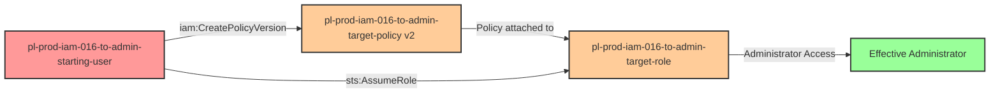

# Privilege Escalation via iam:CreatePolicyVersion + sts:AssumeRole

* **Category:** Privilege Escalation
* **Sub-Category:** principal-lateral-movement
* **Path Type:** one-hop
* **Target:** to-admin
* **Environments:** prod
* **Technique:** Modify customer-managed policy version to grant admin permissions, then assume role

## Overview

This scenario demonstrates a subtle privilege escalation vulnerability where a user has permission to create new versions of a customer-managed IAM policy that is attached to a privileged role. Unlike modifying inline policies or attaching managed policies, this technique exploits AWS's policy versioning feature where new versions automatically become the default.

The attacker starts with `iam:CreatePolicyVersion` permission on a customer-managed policy attached to a target role. By creating a new policy version with administrative permissions, the attacker can effectively grant the role admin access without needing `iam:AttachRolePolicy` or `iam:PutRolePolicy` permissions. Once the policy is modified, the attacker assumes the now-privileged role to gain full administrator access.

This is particularly dangerous because policy version modifications are often overlooked in security monitoring, and many organizations don't realize that `iam:CreatePolicyVersion` can be as dangerous as direct policy attachment permissions. The technique also demonstrates lateral movement from a user principal to a role principal through policy manipulation.

## Understanding the attack scenario

### Principals in the attack path

- `arn:aws:iam::PROD_ACCOUNT:user/pl-prod-iam-016-to-admin-starting-user` (Scenario-specific starting user)
- `arn:aws:iam::PROD_ACCOUNT:policy/pl-prod-iam-016-to-admin-target-policy` (Customer-managed policy that can be versioned)
- `arn:aws:iam::PROD_ACCOUNT:role/pl-prod-iam-016-to-admin-target-role` (Target role with policy attached)

### Attack Path Diagram



### Attack Steps

1. **Initial Access**: Start as `pl-prod-iam-016-to-admin-starting-user` (credentials provided via Terraform outputs)
2. **Policy Reconnaissance**: Discover the customer-managed policy `pl-prod-iam-016-to-admin-target-policy` and verify it's attached to a role
3. **Create Malicious Policy Version**: Use `iam:CreatePolicyVersion` to create a new version (v2) with administrative permissions (`*:*` on `*`)
4. **Wait for Propagation**: Allow 15 seconds for the new default policy version to propagate
5. **Assume Role**: Assume the target role `pl-prod-iam-016-to-admin-target-role` which now has admin permissions via the modified policy
6. **Verification**: Verify administrator access by listing IAM users or performing other admin actions

### Scenario specific resources created

| ARN | Purpose |
| -- | -- |
| `arn:aws:iam::PROD_ACCOUNT:user/pl-prod-iam-016-to-admin-starting-user` | Scenario-specific starting user with access keys |
| `arn:aws:iam::PROD_ACCOUNT:policy/pl-prod-iam-016-to-admin-target-policy` | Customer-managed policy with initial non-privileged permissions |
| `arn:aws:iam::PROD_ACCOUNT:role/pl-prod-iam-016-to-admin-target-role` | Target role with the customer-managed policy attached and trust policy allowing starting user to assume it |

## Executing the attack

### Using the automated demo_attack.sh

To demonstrate the privilege escalation path, run the provided demo script:

```bash
cd modules/scenarios/single-account/privesc-one-hop/to-admin/iam-016-iam-createpolicyversion+sts-assumerole
./demo_attack.sh
```

The script will:
1. Display a step-by-step walkthrough with color-coded output
2. Show the commands being executed and their results
3. Verify successful privilege escalation
4. Output standardized test results for automation

### Cleaning up the attack artifacts

After demonstrating the attack, clean up the modified policy version:

```bash
cd modules/scenarios/single-account/privesc-one-hop/to-admin/iam-016-iam-createpolicyversion+sts-assumerole
./cleanup_attack.sh
```

The cleanup script will delete the malicious policy version (v2) and restore the policy to its original state.

## Detection and prevention

### MITRE ATT&CK Mapping

- **Tactic**: TA0004 - Privilege Escalation, TA0003 - Persistence
- **Technique**: T1098.001 - Account Manipulation: Additional Cloud Credentials
- **Sub-technique**: Modifying policy versions to escalate privileges

## Prevention recommendations

- **Restrict CreatePolicyVersion Permission**: Limit `iam:CreatePolicyVersion` to security administrators and infrastructure teams only. This permission is as dangerous as `iam:AttachRolePolicy` or `iam:PutRolePolicy`.
- **Use Condition Keys**: Apply condition keys to `iam:CreatePolicyVersion` permissions to restrict which policies can be modified (e.g., `aws:RequestedRegion` or custom tags).
- **Prefer AWS-Managed Policies**: For privileged roles, use AWS-managed policies when possible, as they cannot be versioned or modified by customer accounts.
- **Implement SCPs**: Create Service Control Policies that prevent policy version creation on sensitive customer-managed policies:
  ```json
  {
    "Effect": "Deny",
    "Action": "iam:CreatePolicyVersion",
    "Resource": "arn:aws:iam::*:policy/sensitive-*"
  }
  ```
- **Monitor Policy Version Changes**: Set up CloudTrail alerts for `CreatePolicyVersion` API calls, especially on policies attached to privileged roles. Create CloudWatch alarms or EventBridge rules to detect this activity.
- **Regular Policy Audits**: Periodically review customer-managed policies and their versions to detect unauthorized changes. Look for policies with multiple versions where the latest version has significantly more permissions.
- **IAM Access Analyzer**: Use IAM Access Analyzer to continuously monitor for privilege escalation paths involving policy version manipulation.
- **Limit Policy Scope**: When creating customer-managed policies for roles, minimize the permissions granted and avoid granting permissions that allow self-modification.
- **Require MFA**: Implement MFA requirements for sensitive IAM operations including policy version creation through condition keys in SCPs or IAM policies.
