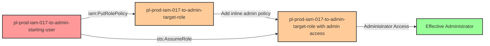

# One-Hop Privilege Escalation: iam:PutRolePolicy + sts:AssumeRole

* **Category:** Privilege Escalation
* **Sub-Category:** principal-access
* **Path Type:** one-hop
* **Target:** to-admin
* **Environments:** prod
* **Cost Estimate:** $0/mo
* **Pathfinding.cloud ID:** iam-017
* **Technique:** Modify another role's inline policy and assume it
* **Terraform Variable:** `enable_single_account_privesc_one_hop_to_admin_iam_017_iam_putrolepolicy_sts_assumerole`
* **Schema Version:** 1.0.0
* **Attack Path:** starting_user → (iam:PutRolePolicy) → target_role (add inline admin policy) → (sts:AssumeRole) → target_role credentials → admin access
* **Attack Principals:** `arn:aws:iam::{account_id}:user/pl-prod-iam-017-to-admin-starting-user`; `arn:aws:iam::{account_id}:role/pl-prod-iam-017-to-admin-target-role`
* **Required Permissions:** `iam:PutRolePolicy` on `arn:aws:iam::*:role/pl-prod-iam-017-to-admin-target-role`; `sts:AssumeRole` on `arn:aws:iam::*:role/pl-prod-iam-017-to-admin-target-role`
* **Helpful Permissions:** `iam:ListRoles` (Discover available roles that can be modified); `iam:GetRole` (View role trust policies to identify assumable roles); `iam:ListRolePolicies` (View current inline role policies); `iam:GetRolePolicy` (View inline policy details before and after modification)
* **MITRE Tactics:** TA0004 - Privilege Escalation
* **MITRE Techniques:** T1098 - Account Manipulation

## Attack Overview

This scenario demonstrates a privilege escalation vulnerability where a user has permission to modify inline policies on a role (`iam:PutRolePolicy`) AND can assume that same role (`sts:AssumeRole`). This combination creates a powerful privilege escalation path because the attacker can add an administrative inline policy to the target role, then assume it to gain full admin access.

Unlike self-escalation scenarios where a role modifies itself, this is a **principal-access** attack where a USER modifies a ROLE and then assumes it. The target role may initially have minimal or no permissions, but the ability to modify its inline policies and then assume it makes it equivalent to having direct admin access.

This scenario specifically uses **inline policies** via `PutRolePolicy`. While similar in outcome to the `iam-attachrolepolicy+sts-assumerole` scenario (which uses managed policies), inline policies are often overlooked in security reviews because they're embedded directly in the role rather than being standalone policy objects.

### MITRE ATT&CK Mapping

- **Tactic**: Privilege Escalation (TA0004)
- **Technique**: T1098 - Account Manipulation
- **Sub-technique**: Modifying cloud account permissions

### Principals in the attack path

- `arn:aws:iam::PROD_ACCOUNT:user/pl-prod-iam-017-to-admin-starting-user` (Scenario-specific starting user)
- `arn:aws:iam::PROD_ACCOUNT:role/pl-prod-iam-017-to-admin-target-role` (Target role that will be modified and assumed)

### Attack Path Diagram



### Attack Steps

1. **Initial Access**: Start as `pl-prod-iam-017-to-admin-starting-user` (credentials provided via Terraform outputs)
2. **Modify Target Role**: Use `iam:PutRolePolicy` to add an inline policy granting administrator access to the target role
3. **Wait for Propagation**: Wait 15 seconds for IAM policy changes to propagate
4. **Assume Privileged Role**: Use `sts:AssumeRole` to assume the now-privileged target role
5. **Verification**: Verify administrator access with the assumed role credentials

### Scenario specific resources created

| ARN | Purpose |
| -- | -- |
| `arn:aws:iam::PROD_ACCOUNT:user/pl-prod-iam-017-to-admin-starting-user` | Scenario-specific starting user with access keys and inline policy |
| `arn:aws:iam::PROD_ACCOUNT:role/pl-prod-iam-017-to-admin-target-role` | Target role that trusts the starting user and can be modified |

## Attack Lab

### Prerequisites

1. Install the `plabs` CLI:
   ```bash
   brew install pathfinding-labs/tap/plabs
   ```
2. Configure your AWS profiles in `~/.plabs/plabs.yaml` (or run `plabs init` if you haven't already)

### Deploy with plabs non-interactive

```bash
plabs enable enable_single_account_privesc_one_hop_to_admin_iam_017_iam_putrolepolicy_sts_assumerole
plabs apply
```

### Deploy with plabs tui

1. Launch the TUI: `plabs`
2. Navigate to this scenario in the scenarios list
3. Press `space` to enable it
4. Press `d` to deploy

### Executing the automated demo_attack script

The script will:
1. Display a step-by-step walkthrough with color-coded output
2. Show the commands being executed and their results
3. Verify successful privilege escalation
4. Output standardized test results for automation

#### Resources created by attack script

- Inline admin policy added to `pl-prod-iam-017-to-admin-target-role`

#### With plabs non-interactive

```bash
plabs demo --list
plabs demo iam-017-iam-putrolepolicy+sts-assumerole
```

#### With plabs tui

1. Launch the TUI: `plabs`
2. Navigate to this scenario in the scenarios list
3. Press `r` to run the demo script

### Cleanup

#### With plabs non-interactive

```bash
plabs cleanup --list
plabs cleanup iam-017-iam-putrolepolicy+sts-assumerole
```

#### With plabs tui

1. Launch the TUI: `plabs`
2. Navigate to this scenario in the scenarios list
3. Press `c` to run the cleanup script

### Teardown with plabs non-interactive

```bash
plabs disable enable_single_account_privesc_one_hop_to_admin_iam_017_iam_putrolepolicy_sts_assumerole
plabs apply
```

### Teardown with plabs tui

1. Launch the TUI: `plabs`
2. Navigate to this scenario in the scenarios list
3. Press `space` to disable it
4. Press `D` to destroy

## Detecting Misconfiguration (CSPM)

### What CSPM tools should detect

- IAM user has `iam:PutRolePolicy` permission on a role it can also assume — this combination is a direct privilege escalation path
- IAM role trust policy allows assumption by a principal that also holds policy-write permissions on that role
- Inline policy write access on a role without restrictions on which principals can modify it

### Prevention recommendations

- Avoid granting `iam:PutRolePolicy` permissions on assumable roles — this combination is functionally equivalent to granting admin access
- Use resource-based conditions to restrict which roles can have inline policies modified: `"Condition": {"StringNotEquals": {"aws:PrincipalArn": "arn:aws:iam::ACCOUNT:role/trusted-admin"}}`
- Implement SCPs to prevent inline policy modification on sensitive roles: `"Effect": "Deny", "Action": "iam:PutRolePolicy", "Resource": "arn:aws:iam::*:role/prod-*"`
- Enable MFA requirements for policy modification operations using IAM policy conditions
- Use IAM Access Analyzer to identify roles with both write policy permissions and assume role capabilities — flag these as high-risk configurations
- Consider using AWS Config rules to detect when roles gain new inline policies, especially those granting administrative permissions
- Prefer managed policies over inline policies for better visibility and centralized management

## Detection Abuse (CloudSIEM)

### CloudTrail events to monitor

- `IAM: PutRolePolicy` — Inline policy added or modified on a role; critical when the target role is assumable and the new policy grants elevated permissions
- `STS: AssumeRole` — Role assumption event; high severity when preceded by a `PutRolePolicy` call on the same role within a short time window

### Detonation logs

_Detonation log integration (Stratus Red Team / Grimoire) is planned for a future release._
