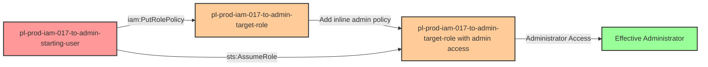

# One-Hop Privilege Escalation: iam:PutRolePolicy + sts:AssumeRole

* **Category:** Privilege Escalation
* **Sub-Category:** principal-lateral-movement
* **Path Type:** one-hop
* **Target:** to-admin
* **Environments:** prod
* **Technique:** Modify another role's inline policy and assume it

## Overview

This scenario demonstrates a privilege escalation vulnerability where a user has permission to modify inline policies on a role (`iam:PutRolePolicy`) AND can assume that same role (`sts:AssumeRole`). This combination creates a powerful privilege escalation path because the attacker can add an administrative inline policy to the target role, then assume it to gain full admin access.

Unlike self-escalation scenarios where a role modifies itself, this is a **principal-lateral-movement** attack where a USER modifies a ROLE and then assumes it. The target role may initially have minimal or no permissions, but the ability to modify its inline policies and then assume it makes it equivalent to having direct admin access.

This scenario specifically uses **inline policies** via `PutRolePolicy`. While similar in outcome to the `iam-attachrolepolicy+sts-assumerole` scenario (which uses managed policies), inline policies are often overlooked in security reviews because they're embedded directly in the role rather than being standalone policy objects.

## Understanding the attack scenario

### Principals in the attack path

- `arn:aws:iam::PROD_ACCOUNT:user/pl-prod-iam-017-to-admin-starting-user` (Scenario-specific starting user)
- `arn:aws:iam::PROD_ACCOUNT:role/pl-prod-iam-017-to-admin-target-role` (Target role that will be modified and assumed)

### Attack Path Diagram



### Attack Steps

1. **Initial Access**: Start as `pl-prod-iam-017-to-admin-starting-user` (credentials provided via Terraform outputs)
2. **Modify Target Role**: Use `iam:PutRolePolicy` to add an inline policy granting administrator access to the target role
3. **Wait for Propagation**: Wait 15 seconds for IAM policy changes to propagate
4. **Assume Privileged Role**: Use `sts:AssumeRole` to assume the now-privileged target role
5. **Verification**: Verify administrator access with the assumed role credentials

### Scenario specific resources created

| ARN | Purpose |
| -- | -- |
| `arn:aws:iam::PROD_ACCOUNT:user/pl-prod-iam-017-to-admin-starting-user` | Scenario-specific starting user with access keys and inline policy |
| `arn:aws:iam::PROD_ACCOUNT:role/pl-prod-iam-017-to-admin-target-role` | Target role that trusts the starting user and can be modified |

## Executing the attack

### Using the automated demo_attack.sh

To demonstrate the privilege escalation path, run the provided demo script:

```bash
cd modules/scenarios/single-account/privesc-one-hop/to-admin/iam-017-iam-putrolepolicy+sts-assumerole
./demo_attack.sh
```

The script will:
1. Display a step-by-step walkthrough with color-coded output
2. Show the commands being executed and their results
3. Verify successful privilege escalation
4. Output standardized test results for automation

### Cleaning up the attack artifacts

After demonstrating the attack, clean up the inline policy added to the target role:

```bash
cd modules/scenarios/single-account/privesc-one-hop/to-admin/iam-putrolepolicy+sts-assumerole
./cleanup_attack.sh
```

## Detection and prevention


### MITRE ATT&CK Mapping

- **Tactic**: Privilege Escalation (TA0004)
- **Technique**: T1098 - Account Manipulation
- **Sub-technique**: Modifying cloud account permissions


## Prevention recommendations

- Avoid granting `iam:PutRolePolicy` permissions on assumable roles - this combination is functionally equivalent to granting admin access
- Use resource-based conditions to restrict which roles can have inline policies modified: `"Condition": {"StringNotEquals": {"aws:PrincipalArn": "arn:aws:iam::ACCOUNT:role/trusted-admin"}}`
- Implement SCPs to prevent inline policy modification on sensitive roles: `"Effect": "Deny", "Action": "iam:PutRolePolicy", "Resource": "arn:aws:iam::*:role/prod-*"`
- Monitor CloudTrail for `PutRolePolicy` API calls followed by `AssumeRole` calls within a short time window - this pattern indicates potential privilege escalation
- Enable MFA requirements for policy modification operations using IAM policy conditions
- Use IAM Access Analyzer to identify roles with both write policy permissions and assume role capabilities - flag these as high-risk configurations
- Consider using AWS Config rules to detect when roles gain new inline policies, especially those granting administrative permissions
- Prefer managed policies over inline policies for better visibility and centralized management
