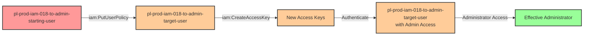

# One-Hop Privilege Escalation: iam:PutUserPolicy + iam:CreateAccessKey

* **Category:** Privilege Escalation
* **Sub-Category:** principal-lateral-movement
* **Path Type:** one-hop
* **Target:** to-admin
* **Environments:** prod
* **Technique:** User-to-user lateral movement via policy modification and credential creation

## Overview

This scenario demonstrates a compound privilege escalation vulnerability where a user has both `iam:PutUserPolicy` and `iam:CreateAccessKey` permissions on a target user. This dangerous combination allows an attacker to modify another user's permissions and then authenticate as that user.

The attack involves two critical steps: first, the attacker adds an inline policy with administrative permissions to the target user using `iam:PutUserPolicy`. Then, they create access keys for that target user using `iam:CreateAccessKey`. With these new credentials, the attacker can authenticate as the target user and gain the administrative permissions they just granted.

This represents a lateral movement privilege escalation path, where the attacker pivots from one user identity to another, more privileged identity. It's particularly dangerous because it combines policy modification with credential creation, creating a complete attack chain from limited access to full administrative control.

## Understanding the attack scenario

### Principals in the attack path

- `arn:aws:iam::PROD_ACCOUNT:user/pl-prod-iam-018-to-admin-starting-user` (Scenario-specific starting user with lateral movement permissions)
- `arn:aws:iam::PROD_ACCOUNT:user/pl-prod-iam-018-to-admin-target-user` (Target user that gains admin access)

### Attack Path Diagram



### Attack Steps

1. **Initial Access**: Start as `pl-prod-iam-018-to-admin-starting-user` (credentials provided via Terraform outputs)
2. **Modify Target User Permissions**: Use `iam:PutUserPolicy` to add an inline policy with `AdministratorAccess` permissions to `pl-prod-iam-018-to-admin-target-user`
3. **Create Access Keys**: Use `iam:CreateAccessKey` to create new access keys for the target user
4. **Switch Context**: Configure AWS CLI with the newly created access keys to authenticate as the target user
5. **Verification**: Verify administrator access with the target user's credentials

### Scenario specific resources created

| ARN | Purpose |
| -- | -- |
| `arn:aws:iam::PROD_ACCOUNT:user/pl-prod-iam-018-to-admin-starting-user` | Scenario-specific starting user with access keys and inline policy for lateral movement permissions |
| `arn:aws:iam::PROD_ACCOUNT:user/pl-prod-iam-018-to-admin-target-user` | Target user that will be granted admin permissions and have credentials created (initially has minimal permissions) |

## Executing the attack

### Using the automated demo_attack.sh

To demonstrate the privilege escalation path, run the provided demo script:

```bash
cd modules/scenarios/single-account/privesc-one-hop/to-admin/iam-putuserpolicy+iam-createaccesskey
./demo_attack.sh
```

The script will:
1. Display a step-by-step walkthrough with color-coded output
2. Show the commands being executed and their results
3. Verify successful privilege escalation
4. Output standardized test results for automation

### Cleaning up the attack artifacts

After demonstrating the attack, clean up the inline policy and access keys created during the demo:

```bash
cd modules/scenarios/single-account/privesc-one-hop/to-admin/iam-putuserpolicy+iam-createaccesskey
./cleanup_attack.sh
```

## Detection and prevention

### MITRE ATT&CK Mapping

- **Tactic**: Privilege Escalation (TA0004), Persistence (TA0003)
- **Technique**: T1098.001 - Account Manipulation: Additional Cloud Credentials
- **Sub-technique**: Creating additional credentials for privileged accounts and modifying account permissions

## Prevention recommendations

- Never grant `iam:PutUserPolicy` permissions that allow modifying other users' policies
- Restrict `iam:CreateAccessKey` to prevent users from creating credentials for other users
- Implement least privilege - users should only manage their own credentials, not those of other users
- Use SCPs to prevent cross-user IAM policy modifications: `Deny iam:PutUserPolicy where aws:userid != ${aws:username}`
- Monitor CloudTrail for `PutUserPolicy` and `CreateAccessKey` API calls targeting other users
- Use IAM Access Analyzer to identify users with permissions on other IAM principals
- Enable MFA requirements for sensitive IAM operations
- Set up alerts for inline policy additions to user accounts, especially those granting administrative permissions
- Use resource-based conditions to restrict which users can be modified: `"Resource": "arn:aws:iam::*:user/${aws:username}"`
- Regularly audit IAM permissions to identify and remediate cross-user management capabilities
