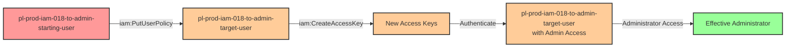

# One-Hop Privilege Escalation: iam:PutUserPolicy + iam:CreateAccessKey

* **Category:** Privilege Escalation
* **Sub-Category:** principal-access
* **Path Type:** one-hop
* **Target:** to-admin
* **Environments:** prod
* **Cost Estimate:** $0/mo
* **Pathfinding.cloud ID:** iam-018
* **Technique:** User-to-user lateral movement via policy modification and credential creation
* **Terraform Variable:** `enable_single_account_privesc_one_hop_to_admin_iam_018_iam_putuserpolicy_iam_createaccesskey`
* **Schema Version:** 1.0.0
* **Attack Path:** starting_user → (PutUserPolicy on target_user) → (CreateAccessKey for target_user) → authenticate as target_user → admin access
* **Attack Principals:** `arn:aws:iam::{account_id}:user/pl-prod-iam-018-to-admin-starting-user`; `arn:aws:iam::{account_id}:user/pl-prod-iam-018-to-admin-target-user`
* **Required Permissions:** `iam:PutUserPolicy` on `arn:aws:iam::*:user/pl-prod-iam-018-to-admin-target-user`; `iam:CreateAccessKey` on `arn:aws:iam::*:user/pl-prod-iam-018-to-admin-target-user`
* **Helpful Permissions:** `iam:ListUsers` (Discover target users to escalate through); `iam:GetUser` (Get target user details and current permissions); `iam:ListUserPolicies` (List inline policies on target user); `iam:GetUserPolicy` (View target user's inline policies); `iam:ListAccessKeys` (List existing access keys for target user)
* **MITRE Tactics:** TA0004 - Privilege Escalation, TA0003 - Persistence
* **MITRE Techniques:** T1098.001 - Account Manipulation: Additional Cloud Credentials

## Attack Overview

This scenario demonstrates a compound privilege escalation vulnerability where a user has both `iam:PutUserPolicy` and `iam:CreateAccessKey` permissions on a target user. This dangerous combination allows an attacker to modify another user's permissions and then authenticate as that user.

The attack involves two critical steps: first, the attacker adds an inline policy with administrative permissions to the target user using `iam:PutUserPolicy`. Then, they create access keys for that target user using `iam:CreateAccessKey`. With these new credentials, the attacker can authenticate as the target user and gain the administrative permissions they just granted.

This represents a lateral movement privilege escalation path, where the attacker pivots from one user identity to another, more privileged identity. It's particularly dangerous because it combines policy modification with credential creation, creating a complete attack chain from limited access to full administrative control.

### MITRE ATT&CK Mapping

- **Tactic**: Privilege Escalation (TA0004), Persistence (TA0003)
- **Technique**: T1098.001 - Account Manipulation: Additional Cloud Credentials
- **Sub-technique**: Creating additional credentials for privileged accounts and modifying account permissions

### Principals in the attack path

- `arn:aws:iam::PROD_ACCOUNT:user/pl-prod-iam-018-to-admin-starting-user` (Scenario-specific starting user with lateral movement permissions)
- `arn:aws:iam::PROD_ACCOUNT:user/pl-prod-iam-018-to-admin-target-user` (Target user that gains admin access)

### Attack Path Diagram



### Attack Steps

1. **Initial Access**: Start as `pl-prod-iam-018-to-admin-starting-user` (credentials provided via Terraform outputs)
2. **Modify Target User Permissions**: Use `iam:PutUserPolicy` to add an inline policy with `AdministratorAccess` permissions to `pl-prod-iam-018-to-admin-target-user`
3. **Create Access Keys**: Use `iam:CreateAccessKey` to create new access keys for the target user
4. **Switch Context**: Configure AWS CLI with the newly created access keys to authenticate as the target user
5. **Verification**: Verify administrator access with the target user's credentials

### Scenario specific resources created

| ARN | Purpose |
| -- | -- |
| `arn:aws:iam::PROD_ACCOUNT:user/pl-prod-iam-018-to-admin-starting-user` | Scenario-specific starting user with access keys and inline policy for lateral movement permissions |
| `arn:aws:iam::PROD_ACCOUNT:user/pl-prod-iam-018-to-admin-target-user` | Target user that will be granted admin permissions and have credentials created (initially has minimal permissions) |

## Attack Lab

### Prerequisites

1. Install the `plabs` CLI:
   ```bash
   brew install pathfinding-labs/tap/plabs
   ```
2. Configure your AWS profiles in `~/.plabs/plabs.yaml` (or run `plabs init` if you haven't already)

### Deploy with plabs non-interactive

```bash
plabs enable enable_single_account_privesc_one_hop_to_admin_iam_018_iam_putuserpolicy_iam_createaccesskey
plabs apply
```

### Deploy with plabs tui

1. Launch the TUI: `plabs`
2. Navigate to this scenario in the scenarios list
3. Press `space` to enable it
4. Press `d` to deploy

### Executing the automated demo_attack script

The script will:
1. Display a step-by-step walkthrough with color-coded output
2. Show the commands being executed and their results
3. Verify successful privilege escalation
4. Output standardized test results for automation

#### Resources created by attack script

- Inline policy added to `pl-prod-iam-018-to-admin-target-user` granting `AdministratorAccess`
- New access keys for `pl-prod-iam-018-to-admin-target-user`

#### With plabs non-interactive

```bash
plabs demo --list
plabs demo iam-018-iam-putuserpolicy+iam-createaccesskey
```

#### With plabs tui

1. Launch the TUI: `plabs`
2. Navigate to this scenario in the scenarios list
3. Press `r` to run the demo script

### Cleanup

#### With plabs non-interactive

```bash
plabs cleanup --list
plabs cleanup iam-018-iam-putuserpolicy+iam-createaccesskey
```

#### With plabs tui

1. Launch the TUI: `plabs`
2. Navigate to this scenario in the scenarios list
3. Press `c` to run the cleanup script

### Teardown with plabs non-interactive

```bash
plabs disable enable_single_account_privesc_one_hop_to_admin_iam_018_iam_putuserpolicy_iam_createaccesskey
plabs apply
```

### Teardown with plabs tui

1. Launch the TUI: `plabs`
2. Navigate to this scenario in the scenarios list
3. Press `space` to disable it
4. Press `D` to destroy

## Detecting Misconfiguration (CSPM)

### What CSPM tools should detect

- IAM user (`pl-prod-iam-018-to-admin-starting-user`) has `iam:PutUserPolicy` permission targeting another IAM user (`pl-prod-iam-018-to-admin-target-user`)
- IAM user has `iam:CreateAccessKey` permission targeting another IAM user — enabling credential theft
- Combined `iam:PutUserPolicy` + `iam:CreateAccessKey` on the same target user constitutes a complete privilege escalation path
- Cross-user IAM management permissions present without resource-level restrictions

### Prevention recommendations

- Never grant `iam:PutUserPolicy` permissions that allow modifying other users' policies
- Restrict `iam:CreateAccessKey` to prevent users from creating credentials for other users; use `Condition: {"StringLike": {"iam:ResourceTag/aws:username": "${aws:username}"}}` to enforce self-only operations
- Use SCPs to prevent cross-user IAM policy modifications: `Deny iam:PutUserPolicy where aws:userId != ${aws:userid}`
- Use IAM Access Analyzer to identify users with permissions on other IAM principals
- Use resource-based conditions to restrict which users can be modified: `"Resource": "arn:aws:iam::*:user/${aws:username}"`
- Regularly audit IAM permissions to identify and remediate cross-user management capabilities

## Detection Abuse (CloudSIEM)

### CloudTrail events to monitor

- `IAM: PutUserPolicy` — Inline policy added to an IAM user; critical when targeting a user other than the caller and when the policy grants elevated permissions
- `IAM: CreateAccessKey` — New access keys created for an IAM user; critical when the caller and the target user differ, indicating cross-user credential creation

### Detonation logs

_Detonation log integration (Stratus Red Team / Grimoire) is planned for a future release._
