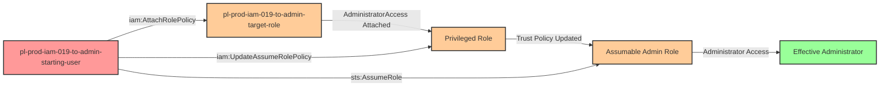

# Privilege Escalation via iam:AttachRolePolicy + iam:UpdateAssumeRolePolicy

* **Category:** Privilege Escalation
* **Sub-Category:** principal-access
* **Path Type:** one-hop
* **Target:** to-admin
* **Environments:** prod
* **Cost Estimate:** $0/mo
* **Pathfinding.cloud ID:** iam-019
* **Technique:** Attaching administrative policies to a role and modifying its trust policy to assume it
* **Terraform Variable:** `enable_single_account_privesc_one_hop_to_admin_iam_019_iam_attachrolepolicy_iam_updateassumerolepolicy`
* **Schema Version:** 1.0.0
* **Attack Path:** starting_user → (iam:AttachRolePolicy) → target_role (attach AdministratorAccess) → (iam:UpdateAssumeRolePolicy) → target_role trust policy (allow starting_user) → (sts:AssumeRole) → admin access
* **Attack Principals:** `arn:aws:iam::{account_id}:user/pl-prod-iam-019-to-admin-starting-user`; `arn:aws:iam::{account_id}:role/pl-prod-iam-019-to-admin-target-role`
* **Required Permissions:** `iam:AttachRolePolicy` on `arn:aws:iam::*:role/pl-prod-iam-019-to-admin-target-role`; `iam:UpdateAssumeRolePolicy` on `arn:aws:iam::*:role/pl-prod-iam-019-to-admin-target-role`
* **Helpful Permissions:** `iam:ListRoles` (Discover available roles that can be modified); `iam:GetRole` (View role trust policies and attached policies); `iam:ListAttachedRolePolicies` (View current role permissions before and after modification); `iam:GetUserPolicy` (Verify starting user does not have sts:AssumeRole permission)
* **MITRE Tactics:** TA0004 - Privilege Escalation
* **MITRE Techniques:** T1098 - Account Manipulation

## Attack Overview

This scenario demonstrates a sophisticated privilege escalation vulnerability that combines two powerful IAM permissions: `iam:AttachRolePolicy` and `iam:UpdateAssumeRolePolicy`. While each permission is dangerous on its own, their combination creates a complete privilege escalation path that allows an attacker to gain full administrative access through role manipulation.

The attack works by first attaching the AdministratorAccess managed policy to a target role using `iam:AttachRolePolicy`, effectively granting that role full administrative permissions. The attacker then uses `iam:UpdateAssumeRolePolicy` to modify the role's trust policy, adding their own user as a trusted principal. Once the trust policy is updated, the attacker can assume the now-privileged role to gain administrative access.

A critical aspect of this attack is that **the starting user does not need `sts:AssumeRole` permissions**. When a principal is explicitly named in a role's trust policy, AWS allows that principal to assume the role regardless of their own IAM permissions. This is a fundamental AWS behavior that many security teams overlook - trust policies grant permission from the role's side, making `sts:AssumeRole` permissions on the assuming principal unnecessary when they are specifically trusted.

This attack path is particularly dangerous because it combines infrastructure modification (attaching policies) with access control manipulation (updating trust relationships), allowing an attacker to both create and exploit administrative privileges. Organizations often fail to recognize the compound risk of granting both permissions together.

### MITRE ATT&CK Mapping

- **Tactic**: TA0004 - Privilege Escalation
- **Technique**: T1098 - Account Manipulation

### Principals in the attack path

- `arn:aws:iam::PROD_ACCOUNT:user/pl-prod-iam-019-to-admin-starting-user` (Scenario-specific starting user with role modification permissions)
- `arn:aws:iam::PROD_ACCOUNT:role/pl-prod-iam-019-to-admin-target-role` (Target role that will be escalated to admin and made assumable)

### Attack Path Diagram



### Attack Steps

1. **Initial Access**: Start as `pl-prod-iam-019-to-admin-starting-user` (credentials provided via Terraform outputs)
2. **Attach Administrative Policy**: Use `iam:AttachRolePolicy` to attach the `AdministratorAccess` managed policy to `pl-prod-iam-019-to-admin-target-role`
3. **Modify Trust Policy**: Use `iam:UpdateAssumeRolePolicy` to update the target role's trust policy, adding the starting user as a trusted principal
4. **Assume Privileged Role**: Use `sts:AssumeRole` to assume the now-privileged and assumable role (no prior `sts:AssumeRole` permission required on the user)
5. **Verification**: Verify administrator access by listing IAM users or performing other admin-level actions

### Scenario specific resources created

| ARN | Purpose |
| -- | -- |
| `arn:aws:iam::PROD_ACCOUNT:user/pl-prod-iam-019-to-admin-starting-user` | Scenario-specific starting user with access keys and role modification permissions |
| `arn:aws:iam::PROD_ACCOUNT:role/pl-prod-iam-019-to-admin-target-role` | Target role with minimal initial permissions that will be escalated |

## Attack Lab

### Prerequisites

1. Install the `plabs` CLI:
   ```bash
   brew install pathfinding-labs/tap/plabs
   ```
2. Configure your AWS profiles in `~/.plabs/plabs.yaml` (or run `plabs init` if you haven't already)

### Deploy with plabs non-interactive

```bash
plabs enable enable_single_account_privesc_one_hop_to_admin_iam_019_iam_attachrolepolicy_iam_updateassumerolepolicy
plabs apply
```

### Deploy with plabs tui

1. Launch the TUI: `plabs`
2. Navigate to this scenario in the scenarios list
3. Press `space` to enable it
4. Press `d` to deploy

### Executing the automated demo_attack script

The script will:
1. Display a step-by-step walkthrough with color-coded output
2. Show the commands being executed and their results
3. Verify successful privilege escalation
4. Output standardized test results for automation

#### Resources created by attack script

- `AdministratorAccess` managed policy attached to `pl-prod-iam-019-to-admin-target-role`
- Modified trust policy on `pl-prod-iam-019-to-admin-target-role` (adds starting user as trusted principal)
- Temporary STS session credentials from assuming the target role

#### With plabs non-interactive

```bash
plabs demo --list
plabs demo iam-019-iam-attachrolepolicy+iam-updateassumerolepolicy
```

#### With plabs tui

1. Launch the TUI: `plabs`
2. Navigate to this scenario in the scenarios list
3. Press `r` to run the demo script

### Cleanup

#### With plabs non-interactive

```bash
plabs cleanup --list
plabs cleanup iam-019-iam-attachrolepolicy+iam-updateassumerolepolicy
```

#### With plabs tui

1. Launch the TUI: `plabs`
2. Navigate to this scenario in the scenarios list
3. Press `c` to run the cleanup script

### Teardown with plabs non-interactive

```bash
plabs disable enable_single_account_privesc_one_hop_to_admin_iam_019_iam_attachrolepolicy_iam_updateassumerolepolicy
plabs apply
```

### Teardown with plabs tui

1. Launch the TUI: `plabs`
2. Navigate to this scenario in the scenarios list
3. Press `space` to disable it
4. Press `D` to destroy

## Detecting Misconfiguration (CSPM)

### What CSPM tools should detect

- `pl-prod-iam-019-to-admin-starting-user` has `iam:AttachRolePolicy` permission scoped to `pl-prod-iam-019-to-admin-target-role`, enabling attachment of administrative managed policies
- `pl-prod-iam-019-to-admin-starting-user` has `iam:UpdateAssumeRolePolicy` permission scoped to `pl-prod-iam-019-to-admin-target-role`, enabling trust policy modification
- The combination of `iam:AttachRolePolicy` and `iam:UpdateAssumeRolePolicy` on the same principal constitutes a complete privilege escalation path to admin
- No permission boundary is applied to `pl-prod-iam-019-to-admin-starting-user` to prevent escalation beyond current privilege level
- `pl-prod-iam-019-to-admin-target-role` lacks a resource tag-based condition preventing modification by lower-privileged principals

### Prevention recommendations

- Implement least privilege principles - avoid granting `iam:AttachRolePolicy` and `iam:UpdateAssumeRolePolicy` together unless absolutely necessary
- Use resource-based conditions to restrict which roles can be modified: `"Condition": {"StringNotLike": {"aws:ResourceTag/Sensitivity": "critical"}}`
- Implement Service Control Policies (SCPs) to prevent attachment of highly privileged managed policies like AdministratorAccess
- Use IAM Access Analyzer to identify roles with overly permissive trust policies or privilege escalation paths
- Enable MFA requirements for sensitive IAM operations using condition keys like `aws:MultiFactorAuthPresent`
- Implement permission boundaries on users to prevent them from attaching policies that exceed their own permissions
- Tag critical roles and use IAM policy conditions to prevent modification of tagged resources
- Regularly audit role trust policies to ensure only expected principals are trusted

## Detection Abuse (CloudSIEM)

### CloudTrail events to monitor

- `IAM: AttachRolePolicy` — Managed policy attached to a role; critical when the attached policy is `AdministratorAccess` or another highly privileged policy
- `IAM: UpdateAssumeRolePolicy` — Role trust policy modified; high severity when the change adds a new trusted principal, especially a user or role not previously trusted
- `STS: AssumeRole` — Role assumption event; correlate with preceding `AttachRolePolicy` and `UpdateAssumeRolePolicy` events to identify the full escalation chain

### Detonation logs

_Detonation log integration (Stratus Red Team / Grimoire) is planned for a future release._
