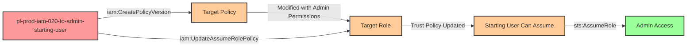

# Privilege Escalation via iam:CreatePolicyVersion + iam:UpdateAssumeRolePolicy

* **Category:** Privilege Escalation
* **Sub-Category:** principal-access
* **Path Type:** one-hop
* **Target:** to-admin
* **Environments:** prod
* **Technique:** Modify customer-managed policy permissions and role trust policy to gain admin access

## Overview

This scenario demonstrates a sophisticated privilege escalation path that combines two powerful IAM permissions: `iam:CreatePolicyVersion` and `iam:UpdateAssumeRolePolicy`. An attacker with these permissions can escalate to administrative access through a two-step process.

First, the attacker uses `iam:CreatePolicyVersion` to modify a customer-managed policy attached to a target role, replacing its limited permissions with full administrative access. Then, they use `iam:UpdateAssumeRolePolicy` to modify the role's trust policy, adding themselves as a trusted principal. Finally, they assume the now-privileged role to gain admin access.

A critical aspect of this attack is that the starting user does NOT need `sts:AssumeRole` permissions initially. When a principal is explicitly named in a role's trust policy (as opposed to the generic `:root` pattern), AWS allows that principal to assume the role without requiring explicit `sts:AssumeRole` permissions in their own policy. This makes the attack particularly dangerous, as defenders might overlook the escalation path if they only check for `sts:AssumeRole` grants.

## Understanding the attack scenario

### Principals in the attack path

- `arn:aws:iam::PROD_ACCOUNT:user/pl-prod-iam-020-to-admin-starting-user` (Scenario-specific starting user with limited permissions)
- `arn:aws:iam::PROD_ACCOUNT:policy/pl-prod-iam-020-to-admin-target-policy` (Customer-managed policy attached to the target role)
- `arn:aws:iam::PROD_ACCOUNT:role/pl-prod-iam-020-to-admin-target-role` (Target role with customer-managed policy attached)

### Attack Path Diagram



### Attack Steps

1. **Initial Access**: Start as `pl-prod-iam-020-to-admin-starting-user` (credentials provided via Terraform outputs)
2. **Modify Policy Permissions**: Use `iam:CreatePolicyVersion` to create a new version of the target customer-managed policy with administrative permissions (`*:*` on `*`)
3. **Modify Trust Policy**: Use `iam:UpdateAssumeRolePolicy` to update the target role's trust policy, adding the starting user as a named trusted principal
4. **Assume Privileged Role**: Assume the target role (no explicit `sts:AssumeRole` permission needed because the user is named in the trust policy)
5. **Verification**: Verify administrative access by calling `iam:ListUsers` or other admin-level APIs

### Scenario specific resources created

| ARN | Purpose |
| -- | -- |
| `arn:aws:iam::PROD_ACCOUNT:user/pl-prod-iam-020-to-admin-starting-user` | Scenario-specific starting user with access keys and limited permissions |
| `arn:aws:iam::PROD_ACCOUNT:policy/pl-prod-iam-020-to-admin-target-policy` | Customer-managed policy attached to the target role (initially has minimal permissions) |
| `arn:aws:iam::PROD_ACCOUNT:role/pl-prod-iam-020-to-admin-target-role` | Target role with the customer-managed policy attached (initially has limited trust policy) |
| `arn:aws:iam::PROD_ACCOUNT:policy/pl-prod-iam-020-to-admin-starting-user-policy` | Policy granting CreatePolicyVersion and UpdateAssumeRolePolicy permissions to the starting user |

## Executing the attack

### Using the automated demo_attack.sh

To demonstrate the privilege escalation path, run the provided demo script:

```bash
cd modules/scenarios/single-account/privesc-one-hop/to-admin/iam-020-iam-createpolicyversion+iam-updateassumerolepolicy
./demo_attack.sh
```

The script will:
1. Display a step-by-step walkthrough with color-coded output
2. Show the commands being executed and their results
3. Demonstrate policy version creation with admin permissions
4. Show trust policy modification to add the starting user
5. Assume the role without needing explicit sts:AssumeRole permissions
6. Verify successful privilege escalation with admin-level API calls
7. Output standardized test results for automation

### Cleaning up the attack artifacts

After demonstrating the attack, clean up the modified policies and created policy version:

```bash
cd modules/scenarios/single-account/privesc-one-hop/to-admin/iam-020-iam-createpolicyversion+iam-updateassumerolepolicy
./cleanup_attack.sh
```

The cleanup script will:
- Delete the new policy version created during the attack
- Restore the original trust policy on the target role
- Remove any temporary AWS CLI profiles created during the demo

## Detection and prevention

### What should CSPM tools detect?

A properly configured Cloud Security Posture Management (CSPM) tool should detect:

1. **Dangerous Permission Combination**: User/role has both `iam:CreatePolicyVersion` and `iam:UpdateAssumeRolePolicy` permissions
2. **Privilege Escalation Path**: Attack graph analysis should identify the escalation path from starting user to admin role via policy modification
3. **Overly Permissive IAM Grants**: Starting user can modify policies attached to roles they cannot initially assume
4. **Customer-Managed Policy Vulnerability**: Roles using customer-managed policies that can be modified by non-admin principals
5. **Trust Policy Modification Risk**: Principals with `iam:UpdateAssumeRolePolicy` can grant themselves access to privileged roles

### MITRE ATT&CK Mapping

- **Tactic**: TA0004 - Privilege Escalation, TA0003 - Persistence
- **Technique**: T1098.001 - Account Manipulation: Additional Cloud Credentials

### Detection opportunities

Monitor CloudTrail for the following event patterns indicating this attack:

1. **CreatePolicyVersion** event where:
   - The new policy version contains significantly elevated permissions compared to previous versions
   - The requestor is not a trusted admin principal
   - The policy document contains `"*:*"` or `"AdministratorAccess"`

2. **UpdateAssumeRolePolicy** event where:
   - The trust policy is modified to add new principals
   - The requestor is the same principal being added to the trust policy
   - The modified role has administrative or sensitive permissions

3. **AssumeRole** event shortly after CreatePolicyVersion and UpdateAssumeRolePolicy by the same principal

4. **Sequential suspicious activity**: CreatePolicyVersion → UpdateAssumeRolePolicy → AssumeRole within a short time window

## Prevention recommendations

- **Restrict CreatePolicyVersion permissions**: Grant `iam:CreatePolicyVersion` only to administrative roles and limit it with resource-based conditions to specific policies
  ```json
  {
    "Effect": "Allow",
    "Action": "iam:CreatePolicyVersion",
    "Resource": "arn:aws:iam::*:policy/approved-policy-prefix-*"
  }
  ```

- **Restrict UpdateAssumeRolePolicy permissions**: Limit `iam:UpdateAssumeRolePolicy` to break glass administrative roles only
  ```json
  {
    "Effect": "Deny",
    "Action": "iam:UpdateAssumeRolePolicy",
    "Resource": "*",
    "Condition": {
      "StringNotEquals": {
        "aws:PrincipalArn": "arn:aws:iam::ACCOUNT_ID:role/BreakGlassAdmin"
      }
    }
  }
  ```

- **Use AWS managed policies where possible**: AWS managed policies cannot be modified with `iam:CreatePolicyVersion`, eliminating this attack vector

- **Implement policy version limits**: AWS allows up to 5 policy versions. Regularly audit and delete old versions to make policy modification more detectable

- **Require MFA for sensitive IAM operations**: Use SCP or IAM conditions to require MFA for `iam:CreatePolicyVersion` and `iam:UpdateAssumeRolePolicy`
  ```json
  {
    "Effect": "Deny",
    "Action": [
      "iam:CreatePolicyVersion",
      "iam:UpdateAssumeRolePolicy"
    ],
    "Resource": "*",
    "Condition": {
      "BoolIfExists": {
        "aws:MultiFactorAuthPresent": "false"
      }
    }
  }
  ```

- **Use AWS IAM Access Analyzer**: Configure policy validation and external access findings to detect when roles can be assumed by unintended principals

- **Implement separation of duties**: Never grant the same principal both `iam:CreatePolicyVersion` and `iam:UpdateAssumeRolePolicy` permissions

- **Monitor with AWS Config**: Create Config rules to alert when customer-managed policies are modified or role trust policies change

- **Use Service Control Policies (SCPs)**: Implement organization-wide restrictions on policy modification capabilities
  ```json
  {
    "Version": "2012-10-17",
    "Statement": [
      {
        "Effect": "Deny",
        "Action": [
          "iam:CreatePolicyVersion",
          "iam:UpdateAssumeRolePolicy"
        ],
        "Resource": "*",
        "Condition": {
          "StringNotLike": {
            "aws:PrincipalArn": "arn:aws:iam::*:role/Admin*"
          }
        }
      }
    ]
  }
  ```
