# Privilege Escalation via iam:PutRolePolicy + iam:UpdateAssumeRolePolicy

* **Category:** Privilege Escalation
* **Sub-Category:** principal-lateral-movement
* **Path Type:** one-hop
* **Target:** to-admin
* **Environments:** prod
* **Technique:** Modifying a role's inline policy to grant admin permissions and updating its trust policy to allow assumption

## Overview

This scenario demonstrates a sophisticated privilege escalation vulnerability where a user possesses both `iam:PutRolePolicy` and `iam:UpdateAssumeRolePolicy` permissions on a target role. This powerful combination allows an attacker to first escalate the role's permissions to administrative level, and then modify the role's trust policy to allow themselves to assume it - all without needing explicit `sts:AssumeRole` permissions.

The attack is particularly insidious because it exploits a commonly misunderstood aspect of AWS IAM: **named principals specified directly in a role's trust policy can assume that role without requiring `sts:AssumeRole` permissions in their own identity policies**. When a principal ARN is explicitly listed in a trust policy, AWS IAM automatically grants that principal the ability to assume the role, bypassing the need for an allow statement in the principal's own policies.

This privilege escalation path is often overlooked by security teams because it requires the combination of two distinct permissions that seem innocuous when evaluated separately. Organizations may grant `iam:PutRolePolicy` for managing role permissions and `iam:UpdateAssumeRolePolicy` for managing trust relationships, not realizing that together they provide a complete path to administrative access. The attack leaves clear audit trails in CloudTrail but can be executed quickly before detection mechanisms trigger alerts.

## Understanding the attack scenario

### Principals in the attack path

- `arn:aws:iam::PROD_ACCOUNT:user/pl-prod-iam-021-to-admin-starting-user` (Scenario-specific starting user with iam:PutRolePolicy and iam:UpdateAssumeRolePolicy permissions)
- `arn:aws:iam::PROD_ACCOUNT:role/pl-prod-iam-021-to-admin-target-role` (Target role with minimal initial permissions)

### Attack Path Diagram

```mermaid
graph LR
    A[pl-prod-iam-021-to-admin-starting-user] -->|iam:PutRolePolicy| B[pl-prod-iam-021-to-admin-target-role]
    B -->|Add admin inline policy| C[Target Role with Admin Policy]
    C -->|iam:UpdateAssumeRolePolicy| D[Update Trust Policy]
    D -->|Add starting user to trust| E[Target Role Trusts Starting User]
    E -->|sts:AssumeRole| F[Effective Administrator]

    style A fill:#ff9999,stroke:#333,stroke-width:2px
    style B fill:#ffcc99,stroke:#333,stroke-width:2px
    style C fill:#ffcc99,stroke:#333,stroke-width:2px
    style D fill:#ffcc99,stroke:#333,stroke-width:2px
    style E fill:#ffcc99,stroke:#333,stroke-width:2px
    style F fill:#99ff99,stroke:#333,stroke-width:2px
```



### Attack Steps

1. **Initial Access**: Start as `pl-prod-iam-021-to-admin-starting-user` (credentials provided via Terraform outputs)
2. **Add Admin Policy**: Use `iam:PutRolePolicy` to attach an inline policy granting `AdministratorAccess` to `pl-prod-iam-021-to-admin-target-role`
3. **Modify Trust Policy**: Use `iam:UpdateAssumeRolePolicy` to update the target role's trust policy, adding the starting user as a trusted principal
4. **Assume Role**: Use `sts:AssumeRole` to assume the now-administrative role (no prior sts:AssumeRole permission required - the trust policy grants this automatically)
5. **Verification**: Verify administrator access by listing IAM users or performing other admin-level actions

### Scenario specific resources created

| ARN | Purpose |
| -- | -- |
| `arn:aws:iam::PROD_ACCOUNT:user/pl-prod-iam-021-to-admin-starting-user` | Scenario-specific starting user with access keys and permissions to modify target role |
| `arn:aws:iam::PROD_ACCOUNT:role/pl-prod-iam-021-to-admin-target-role` | Target role with minimal initial permissions that can be escalated |
| `arn:aws:iam::PROD_ACCOUNT:policy/pl-prod-iam-021-to-admin-starting-user-policy` | Inline policy granting iam:PutRolePolicy and iam:UpdateAssumeRolePolicy on target role |

## Executing the attack

### Using the automated demo_attack.sh

To demonstrate the privilege escalation path, run the provided demo script:

```bash
cd modules/scenarios/single-account/privesc-one-hop/to-admin/iam-putrolepolicy+iam-updateassumerolepolicy
./demo_attack.sh
```

The script will:
1. Display a step-by-step walkthrough with color-coded output
2. Show the commands being executed and their results
3. Demonstrate adding an admin inline policy to the target role
4. Demonstrate updating the trust policy to allow assumption
5. Verify successful privilege escalation by assuming the role and testing admin permissions
6. Output standardized test results for automation

### Cleaning up the attack artifacts

After demonstrating the attack, clean up the inline policy and trust policy modifications:

```bash
cd modules/scenarios/single-account/privesc-one-hop/to-admin/iam-putrolepolicy+iam-updateassumerolepolicy
./cleanup_attack.sh
```

The cleanup script will:
- Remove the admin inline policy added to the target role
- Restore the original trust policy (removing the starting user from trusted principals)
- Preserve the deployed infrastructure for future demonstrations

## Detection and prevention


### MITRE ATT&CK Mapping

- **Tactic**: TA0004 - Privilege Escalation
- **Technique**: T1098 - Account Manipulation


## Prevention recommendations

- Implement least privilege principles - avoid granting `iam:PutRolePolicy` and `iam:UpdateAssumeRolePolicy` together unless absolutely necessary for administrative functions
- Use resource-based conditions to restrict which roles can have their policies modified: `"Condition": {"StringNotLike": {"iam:PolicyArn": ["arn:aws:iam::*:role/admin-*"]}}`
- Implement Service Control Policies (SCPs) at the organization level to prevent modification of critical role trust policies and inline policies
- Monitor CloudTrail for `PutRolePolicy` and `UpdateAssumeRolePolicy` API calls, especially when both occur in sequence on the same role
- Enable MFA requirements for sensitive IAM operations using condition keys like `aws:MultiFactorAuthPresent`
- Use IAM Access Analyzer to identify and remediate privilege escalation paths involving policy modification permissions
- Implement SCPs that deny `iam:PutRolePolicy` and `iam:UpdateAssumeRolePolicy` on roles with administrative permissions or sensitive resource access
- Create CloudWatch Events or EventBridge rules to alert on suspicious policy modification patterns, particularly when trust policies are updated followed by AssumeRole calls
- Consider using permission boundaries on roles to limit the maximum permissions that can be granted via inline policies
- Regularly audit roles with both `iam:PutRolePolicy` and `iam:UpdateAssumeRolePolicy` permissions to ensure they are truly necessary and appropriately scoped
