# Privilege Escalation via iam:PutRolePolicy + iam:UpdateAssumeRolePolicy

* **Category:** Privilege Escalation
* **Sub-Category:** principal-access
* **Path Type:** one-hop
* **Target:** to-admin
* **Environments:** prod
* **Cost Estimate:** $0/mo
* **Pathfinding.cloud ID:** iam-021
* **Technique:** Modifying a role's inline policy to grant admin permissions and updating its trust policy to allow assumption
* **Terraform Variable:** `enable_single_account_privesc_one_hop_to_admin_iam_021_iam_putrolepolicy_iam_updateassumerolepolicy`
* **Schema Version:** 1.0.0
* **Attack Path:** starting_user → (iam:PutRolePolicy) → target_role (add inline admin policy) → (iam:UpdateAssumeRolePolicy) → target_role trust policy (allow starting_user) → (sts:AssumeRole) → admin access
* **Attack Principals:** `arn:aws:iam::{account_id}:user/pl-prod-iam-021-to-admin-starting-user`; `arn:aws:iam::{account_id}:role/pl-prod-iam-021-to-admin-target-role`
* **Required Permissions:** `iam:PutRolePolicy` on `arn:aws:iam::*:role/pl-prod-iam-021-to-admin-target-role`; `iam:UpdateAssumeRolePolicy` on `arn:aws:iam::*:role/pl-prod-iam-021-to-admin-target-role`
* **Helpful Permissions:** `iam:ListRoles` (Discover available roles that can be modified); `iam:GetRole` (View role trust policies and current policies); `iam:ListRolePolicies` (View current inline role policies); `iam:GetRolePolicy` (View inline policy details before and after modification)
* **MITRE Tactics:** TA0004 - Privilege Escalation
* **MITRE Techniques:** T1098 - Account Manipulation

## Attack Overview

This scenario demonstrates a sophisticated privilege escalation vulnerability where a user possesses both `iam:PutRolePolicy` and `iam:UpdateAssumeRolePolicy` permissions on a target role. This powerful combination allows an attacker to first escalate the role's permissions to administrative level, and then modify the role's trust policy to allow themselves to assume it - all without needing explicit `sts:AssumeRole` permissions.

The attack is particularly insidious because it exploits a commonly misunderstood aspect of AWS IAM: **named principals specified directly in a role's trust policy can assume that role without requiring `sts:AssumeRole` permissions in their own identity policies**. When a principal ARN is explicitly listed in a trust policy, AWS IAM automatically grants that principal the ability to assume the role, bypassing the need for an allow statement in the principal's own policies.

This privilege escalation path is often overlooked by security teams because it requires the combination of two distinct permissions that seem innocuous when evaluated separately. Organizations may grant `iam:PutRolePolicy` for managing role permissions and `iam:UpdateAssumeRolePolicy` for managing trust relationships, not realizing that together they provide a complete path to administrative access. The attack leaves clear audit trails in CloudTrail but can be executed quickly before detection mechanisms trigger alerts.

### MITRE ATT&CK Mapping

- **Tactic**: TA0004 - Privilege Escalation
- **Technique**: T1098 - Account Manipulation

### Principals in the attack path

- `arn:aws:iam::PROD_ACCOUNT:user/pl-prod-iam-021-to-admin-starting-user` (Scenario-specific starting user with iam:PutRolePolicy and iam:UpdateAssumeRolePolicy permissions)
- `arn:aws:iam::PROD_ACCOUNT:role/pl-prod-iam-021-to-admin-target-role` (Target role with minimal initial permissions)

### Attack Path Diagram

```mermaid
graph LR
    A[pl-prod-iam-021-to-admin-starting-user] -->|iam:PutRolePolicy| B[pl-prod-iam-021-to-admin-target-role]
    B -->|Add admin inline policy| C[Target Role with Admin Policy]
    C -->|iam:UpdateAssumeRolePolicy| D[Update Trust Policy]
    D -->|Add starting user to trust| E[Target Role Trusts Starting User]
    E -->|sts:AssumeRole| F[Effective Administrator]

    style A fill:#ff9999,stroke:#333,stroke-width:2px
    style B fill:#ffcc99,stroke:#333,stroke-width:2px
    style C fill:#ffcc99,stroke:#333,stroke-width:2px
    style D fill:#ffcc99,stroke:#333,stroke-width:2px
    style E fill:#ffcc99,stroke:#333,stroke-width:2px
    style F fill:#99ff99,stroke:#333,stroke-width:2px
```



### Attack Steps

1. **Initial Access**: Start as `pl-prod-iam-021-to-admin-starting-user` (credentials provided via Terraform outputs)
2. **Add Admin Policy**: Use `iam:PutRolePolicy` to attach an inline policy granting `AdministratorAccess` to `pl-prod-iam-021-to-admin-target-role`
3. **Modify Trust Policy**: Use `iam:UpdateAssumeRolePolicy` to update the target role's trust policy, adding the starting user as a trusted principal
4. **Assume Role**: Use `sts:AssumeRole` to assume the now-administrative role (no prior sts:AssumeRole permission required - the trust policy grants this automatically)
5. **Verification**: Verify administrator access by listing IAM users or performing other admin-level actions

### Scenario specific resources created

| ARN | Purpose |
| -- | -- |
| `arn:aws:iam::PROD_ACCOUNT:user/pl-prod-iam-021-to-admin-starting-user` | Scenario-specific starting user with access keys and permissions to modify target role |
| `arn:aws:iam::PROD_ACCOUNT:role/pl-prod-iam-021-to-admin-target-role` | Target role with minimal initial permissions that can be escalated |
| `arn:aws:iam::PROD_ACCOUNT:policy/pl-prod-iam-021-to-admin-starting-user-policy` | Inline policy granting iam:PutRolePolicy and iam:UpdateAssumeRolePolicy on target role |

## Attack Lab

### Prerequisites

1. Install the `plabs` CLI:
   ```bash
   brew install pathfinding-labs/tap/plabs
   ```
2. Configure your AWS profiles in `~/.plabs/plabs.yaml` (or run `plabs init` if you haven't already)

### Deploy with plabs non-interactive

```bash
plabs enable enable_single_account_privesc_one_hop_to_admin_iam_021_iam_putrolepolicy_iam_updateassumerolepolicy
plabs apply
```

### Deploy with plabs tui

1. Launch the TUI: `plabs`
2. Navigate to this scenario in the scenarios list
3. Press `space` to enable it
4. Press `d` to deploy

### Executing the automated demo_attack script

The script will:
1. Display a step-by-step walkthrough with color-coded output
2. Show the commands being executed and their results
3. Demonstrate adding an admin inline policy to the target role
4. Demonstrate updating the trust policy to allow assumption
5. Verify successful privilege escalation by assuming the role and testing admin permissions
6. Output standardized test results for automation

#### Resources created by attack script

- Inline admin policy added to `pl-prod-iam-021-to-admin-target-role`
- Updated trust policy on `pl-prod-iam-021-to-admin-target-role` adding starting user as trusted principal

#### With plabs non-interactive

```bash
plabs demo --list
plabs demo iam-021-iam-putrolepolicy+iam-updateassumerolepolicy
```

#### With plabs tui

1. Launch the TUI: `plabs`
2. Navigate to this scenario in the scenarios list
3. Press `r` to run the demo script

### Cleanup

#### With plabs non-interactive

```bash
plabs cleanup --list
plabs cleanup iam-021-iam-putrolepolicy+iam-updateassumerolepolicy
```

#### With plabs tui

1. Launch the TUI: `plabs`
2. Navigate to this scenario in the scenarios list
3. Press `c` to run the cleanup script

### Teardown with plabs non-interactive

```bash
plabs disable enable_single_account_privesc_one_hop_to_admin_iam_021_iam_putrolepolicy_iam_updateassumerolepolicy
plabs apply
```

### Teardown with plabs tui

1. Launch the TUI: `plabs`
2. Navigate to this scenario in the scenarios list
3. Press `space` to disable it
4. Press `D` to destroy

## Detecting Misconfiguration (CSPM)

### What CSPM tools should detect

- IAM user `pl-prod-iam-021-to-admin-starting-user` has both `iam:PutRolePolicy` and `iam:UpdateAssumeRolePolicy` on `pl-prod-iam-021-to-admin-target-role`, forming a complete privilege escalation path to admin
- Principal with permission to modify inline policies on roles that have or can acquire administrative permissions
- Principal with permission to update trust policies on roles, enabling unauthorized role assumption

### Prevention recommendations

- Implement least privilege principles - avoid granting `iam:PutRolePolicy` and `iam:UpdateAssumeRolePolicy` together unless absolutely necessary for administrative functions
- Use resource-based conditions to restrict which roles can have their policies modified: `"Condition": {"StringNotLike": {"iam:PolicyArn": ["arn:aws:iam::*:role/admin-*"]}}`
- Implement Service Control Policies (SCPs) at the organization level to prevent modification of critical role trust policies and inline policies
- Enable MFA requirements for sensitive IAM operations using condition keys like `aws:MultiFactorAuthPresent`
- Use IAM Access Analyzer to identify and remediate privilege escalation paths involving policy modification permissions
- Consider using permission boundaries on roles to limit the maximum permissions that can be granted via inline policies
- Regularly audit roles with both `iam:PutRolePolicy` and `iam:UpdateAssumeRolePolicy` permissions to ensure they are truly necessary and appropriately scoped

## Detection Abuse (CloudSIEM)

### CloudTrail events to monitor

- `IAM: PutRolePolicy` — Inline policy added or modified on a role; critical when targeting roles with elevated permissions or when the policy grants broad access
- `IAM: UpdateAssumeRolePolicy` — Trust policy updated on a role; high severity when a new principal is added as trusted, especially after a PutRolePolicy call on the same role
- `STS: AssumeRole` — Role assumption; correlate with preceding PutRolePolicy and UpdateAssumeRolePolicy calls on the same role to identify this attack pattern

### Detonation logs

_Detonation log integration (Stratus Red Team / Grimoire) is planned for a future release._
