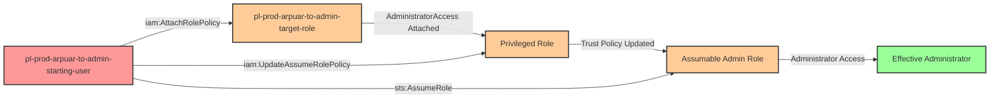

# Privilege Escalation via iam:AttachRolePolicy + iam:UpdateAssumeRolePolicy

* **Category:** Privilege Escalation
* **Sub-Category:** principal-lateral-movement
* **Path Type:** one-hop
* **Target:** to-admin
* **Environments:** prod
* **Technique:** Attaching administrative policies to a role and modifying its trust policy to assume it

## Overview

This scenario demonstrates a sophisticated privilege escalation vulnerability that combines two powerful IAM permissions: `iam:AttachRolePolicy` and `iam:UpdateAssumeRolePolicy`. While each permission is dangerous on its own, their combination creates a complete privilege escalation path that allows an attacker to gain full administrative access through role manipulation.

The attack works by first attaching the AdministratorAccess managed policy to a target role using `iam:AttachRolePolicy`, effectively granting that role full administrative permissions. The attacker then uses `iam:UpdateAssumeRolePolicy` to modify the role's trust policy, adding their own user as a trusted principal. Once the trust policy is updated, the attacker can assume the now-privileged role to gain administrative access.

A critical aspect of this attack is that **the starting user does not need `sts:AssumeRole` permissions**. When a principal is explicitly named in a role's trust policy, AWS allows that principal to assume the role regardless of their own IAM permissions. This is a fundamental AWS behavior that many security teams overlook - trust policies grant permission from the role's side, making `sts:AssumeRole` permissions on the assuming principal unnecessary when they are specifically trusted.

This attack path is particularly dangerous because it combines infrastructure modification (attaching policies) with access control manipulation (updating trust relationships), allowing an attacker to both create and exploit administrative privileges. Organizations often fail to recognize the compound risk of granting both permissions together.

## Understanding the attack scenario

### Principals in the attack path

- `arn:aws:iam::PROD_ACCOUNT:user/pl-prod-arpuar-to-admin-starting-user` (Scenario-specific starting user with role modification permissions)
- `arn:aws:iam::PROD_ACCOUNT:role/pl-prod-arpuar-to-admin-target-role` (Target role that will be escalated to admin and made assumable)

### Attack Path Diagram



### Attack Steps

1. **Initial Access**: Start as `pl-prod-arpuar-to-admin-starting-user` (credentials provided via Terraform outputs)
2. **Attach Administrative Policy**: Use `iam:AttachRolePolicy` to attach the `AdministratorAccess` managed policy to `pl-prod-arpuar-to-admin-target-role`
3. **Modify Trust Policy**: Use `iam:UpdateAssumeRolePolicy` to update the target role's trust policy, adding the starting user as a trusted principal
4. **Assume Privileged Role**: Use `sts:AssumeRole` to assume the now-privileged and assumable role (no prior `sts:AssumeRole` permission required on the user)
5. **Verification**: Verify administrator access by listing IAM users or performing other admin-level actions

### Scenario specific resources created

| ARN | Purpose |
| -- | -- |
| `arn:aws:iam::PROD_ACCOUNT:user/pl-prod-arpuar-to-admin-starting-user` | Scenario-specific starting user with access keys and role modification permissions |
| `arn:aws:iam::PROD_ACCOUNT:role/pl-prod-arpuar-to-admin-target-role` | Target role with minimal initial permissions that will be escalated |

## Executing the attack

### Using the automated demo_attack.sh

To demonstrate the privilege escalation path, run the provided demo script:

```bash
cd modules/scenarios/single-account/privesc-one-hop/to-admin/iam-attachrolepolicy+iam-updateassumerolepolicy
./demo_attack.sh
```

The script will:
1. Display a step-by-step walkthrough with color-coded output
2. Show the commands being executed and their results
3. Verify successful privilege escalation
4. Output standardized test results for automation

### Cleaning up the attack artifacts

After demonstrating the attack, clean up the policy attachments and trust policy modifications:

```bash
cd modules/scenarios/single-account/privesc-one-hop/to-admin/iam-attachrolepolicy+iam-updateassumerolepolicy
./cleanup_attack.sh
```

The cleanup script will detach the AdministratorAccess policy from the target role and restore the original trust policy, returning the environment to its initial state while preserving the deployed infrastructure.

## Detection and prevention


### MITRE ATT&CK Mapping

- **Tactic**: TA0004 - Privilege Escalation
- **Technique**: T1098 - Account Manipulation


## Prevention recommendations

- Implement least privilege principles - avoid granting `iam:AttachRolePolicy` and `iam:UpdateAssumeRolePolicy` together unless absolutely necessary
- Use resource-based conditions to restrict which roles can be modified: `"Condition": {"StringNotLike": {"aws:ResourceTag/Sensitivity": "critical"}}`
- Implement Service Control Policies (SCPs) to prevent attachment of highly privileged managed policies like AdministratorAccess
- Monitor CloudTrail for `AttachRolePolicy` API calls that attach administrative policies, and `UpdateAssumeRolePolicy` calls that modify trust relationships
- Use IAM Access Analyzer to identify roles with overly permissive trust policies or privilege escalation paths
- Enable MFA requirements for sensitive IAM operations using condition keys like `aws:MultiFactorAuthPresent`
- Implement permission boundaries on users to prevent them from attaching policies that exceed their own permissions
- Tag critical roles and use IAM policy conditions to prevent modification of tagged resources
- Set up automated alerting for trust policy changes using CloudWatch Events or EventBridge, especially for roles with elevated permissions
- Consider using AWS Config rules to detect when roles have both administrative policies and overly permissive trust relationships
- Regularly audit role trust policies to ensure only expected principals are trusted
- Implement a policy that requires peer review or approval workflows for role trust policy modifications
